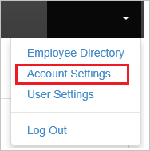
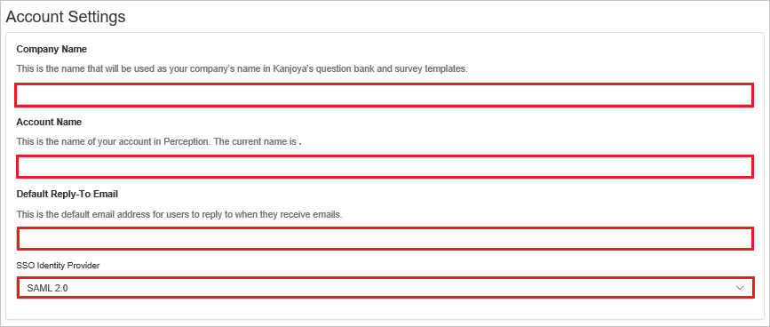
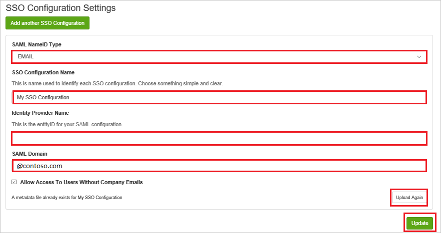

# Tutorial: Azure AD SSO integration with Perception United States (Non-UltiPro)

In this tutorial, you'll learn how to integrate Perception United States (Non-UltiPro) with Azure Active Directory (Azure AD). When you integrate Perception United States (Non-UltiPro) with Azure AD, you can:

* Control in Azure AD who has access to Perception United States (Non-UltiPro).
* Enable your users to be automatically signed-in to Perception United States (Non-UltiPro) with their Azure AD accounts.
* Manage your accounts in one central location - the Azure portal.

## Prerequisites

To get started, you need the following items:

* An Azure AD subscription. If you don't have a subscription, you can get a [free account](https://azure.microsoft.com/free/).
* Perception United States (Non-UltiPro) single sign-on (SSO) enabled subscription.

## Scenario description

In this tutorial, you configure and test Azure AD single sign-on in a test environment.

* Perception United States (Non-UltiPro) supports **IDP** initiated SSO.

> [!NOTE]
> Identifier of this application is a fixed string value so only one instance can be configured in one tenant.

## Add Perception United States (Non-UltiPro) from the gallery

To configure the integration of Perception United States (Non-UltiPro) into Azure AD, you need to add Perception United States (Non-UltiPro) from the gallery to your list of managed SaaS apps.

1. Sign in to the Azure portal using either a work or school account, or a personal Microsoft account.
1. On the left navigation pane, select the **Azure Active Directory** service.
1. Navigate to **Enterprise Applications** and then select **All Applications**.
1. To add new application, select **New application**.
1. In the **Add from the gallery** section, type **Perception United States (Non-UltiPro)** in the search box.
1. Select **Perception United States (Non-UltiPro)** from results panel and then add the app. Wait a few seconds while the app is added to your tenant.

## Configure and test Azure AD SSO for Perception United States (Non-UltiPro)

Configure and test Azure AD SSO with Perception United States (Non-UltiPro) using a test user called **B.Simon**. For SSO to work, you need to establish a link relationship between an Azure AD user and the related user in Perception United States (Non-UltiPro).

To configure and test Azure AD SSO with Perception United States (Non-UltiPro), perform the following steps:

1. **[Configure Azure AD SSO](#configure-azure-ad-sso)** - to enable your users to use this feature.
    1. **[Create an Azure AD test user](#create-an-azure-ad-test-user)** - to test Azure AD single sign-on with B.Simon.
    1. **[Assign the Azure AD test user](#assign-the-azure-ad-test-user)** - to enable B.Simon to use Azure AD single sign-on.
1. **[Configure Perception United States (Non-UltiPro) SSO](#configure-perception-united-states-non-ultipro-sso)** - to configure the single sign-on settings on application side.
    1. **[Create Perception United States (Non-UltiPro) test user](#create-perception-united-states-non-ultipro-test-user)** - to have a counterpart of B.Simon in Perception United States (Non-UltiPro) that is linked to the Azure AD representation of user.
1. **[Test SSO](#test-sso)** - to verify whether the configuration works.

## Configure Azure AD SSO

Follow these steps to enable Azure AD SSO in the Azure portal.

1. In the Azure portal, on the **Perception United States (Non-UltiPro)** application integration page, find the **Manage** section and select **single sign-on**.
1. On the **Select a single sign-on method** page, select **SAML**.
1. On the **Set up single sign-on with SAML** page, click the pencil icon for **Basic SAML Configuration** to edit the settings.

   

4. On the **Basic SAML Configuration** page, perform the following steps:

    a. In the **Identifier** text box, type the URL:
    `https://perception.kanjoya.com/sp`

    b. In the **Reply URL** text box, type a URL using the following pattern:
    `https://perception.kanjoya.com/sso?idp=<entity_id>`

	c. The **Perception United States (Non-UltiPro)** application requires the **Azure AD Identifier** value as <entity_id>, which you will get from the **Set up Perception United States (Non-UltiPro)** section, to be URI-encoded. To get the URI-encoded value, use the following link: **http://www.url-encode-decode.com/**.

	d. After getting the URI-encoded value combine it with the **Reply URL** as mentioned below-

	`https://perception.kanjoya.com/sso?idp=<URI encooded entity_id>`
	
	e. Paste the above value in the **Reply URL** textbox.

5. On the **Set up Single Sign-On with SAML** page, in the **SAML Signing Certificate** section, click **Download** to download the **Federation Metadata XML** from the given options as per your requirement and save it on your computer.

	

6. On the **Set up Perception United States (Non-UltiPro)** section, copy the appropriate URL(s) as per your requirement.

	

### Create an Azure AD test user 

In this section, you'll create a test user in the Azure portal called B.Simon.

1. From the left pane in the Azure portal, select **Azure Active Directory**, select **Users**, and then select **All users**.
1. Select **New user** at the top of the screen.
1. In the **User** properties, follow these steps:
   1. In the **Name** field, enter `B.Simon`.  
   1. In the **User name** field, enter the username@companydomain.extension. For example, `B.Simon@contoso.com`.
   1. Select the **Show password** check box, and then write down the value that's displayed in the **Password** box.
   1. Click **Create**.

### Assign the Azure AD test user

In this section, you'll enable B.Simon to use Azure single sign-on by granting access to Perception United States (Non-UltiPro).

1. In the Azure portal, select **Enterprise Applications**, and then select **All applications**.
1. In the applications list, select **Perception United States (Non-UltiPro)**.
1. In the app's overview page, find the **Manage** section and select **Users and groups**.
1. Select **Add user**, then select **Users and groups** in the **Add Assignment** dialog.
1. In the **Users and groups** dialog, select **B.Simon** from the Users list, then click the **Select** button at the bottom of the screen.
1. If you are expecting a role to be assigned to the users, you can select it from the **Select a role** dropdown. If no role has been set up for this app, you see "Default Access" role selected.
1. In the **Add Assignment** dialog, click the **Assign** button.

## Configure Perception United States (Non-UltiPro) SSO

1. In another browser window, sign on to your Perception United States (Non-UltiPro) company site as an administrator.

2. In the main toolbar, click **Account Settings**.

    

3. On the **Account Settings** page, perform the following steps:

	

	a. In the **Company Name** textbox, type the name of the **Company**.
	
	b. In the **Account Name** textbox, type the name of the **Account**.

	c. In **Default Reply-To Email** text box, type the valid **Email**.

	d. Select **SSO Identity Provider** as **SAML 2.0**.

4. On the **SSO Configuration** page, perform the following steps:

    

	a. Select **SAML NameID Type** as **EMAIL**.

	b. In the **SSO Configuration Name** textbox, type the name of your **Configuration**.
	
	c. In **Identity Provider Name** textbox, paste the value of **Azure AD Identifier**, which you have copied from Azure portal. 

	d. In **SAML Domain textbox**, enter the domain like @contoso.com.

	e. Click on **Upload Again** to upload the **Metadata XML** file.

	f. Click **Update**.

### Create Perception United States (Non-UltiPro) test user

In this section, you create a user called Britta Simon in Perception United States (Non-UltiPro). Work with [Perception United States (Non-UltiPro) support team](https://www.ultimatesoftware.com/Contact/ContactUs) to add the users in the Perception United States (Non-UltiPro) platform.

## Test SSO

In this section, you test your Azure AD single sign-on configuration with following options.

* Click on Test this application in Azure portal and you should be automatically signed in to the Perception United States (Non-UltiPro) for which you set up the SSO.

* You can use Microsoft My Apps. When you click the Perception United States (Non-UltiPro) tile in the My Apps, you should be automatically signed in to the Perception United States (Non-UltiPro) for which you set up the SSO. For more information about the My Apps, see [Introduction to the My Apps](../user-help/my-apps-portal-end-user-access.md).

## Next steps

Once you configure Perception United States (Non-UltiPro) you can enforce session control, which protects exfiltration and infiltration of your organization’s sensitive data in real time. Session control extends from Conditional Access. [Learn how to enforce session control with Microsoft Defender for Cloud Apps](/cloud-app-security/proxy-deployment-aad).
