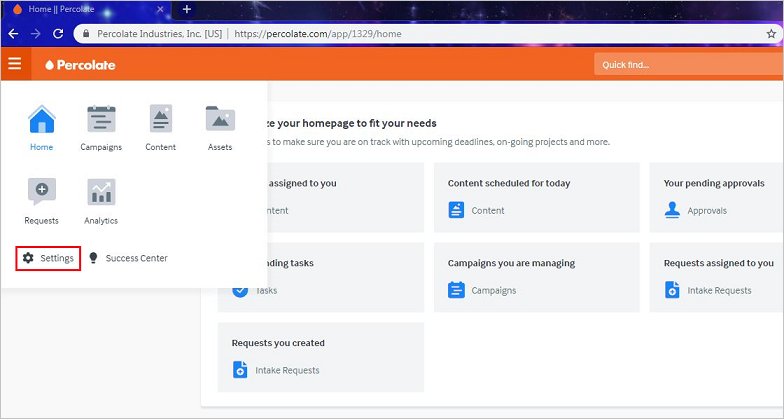
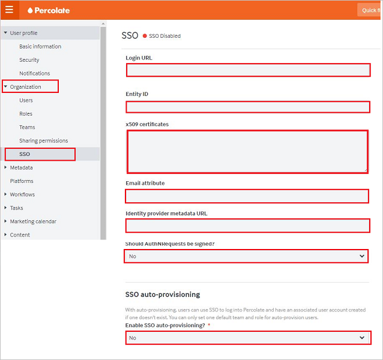
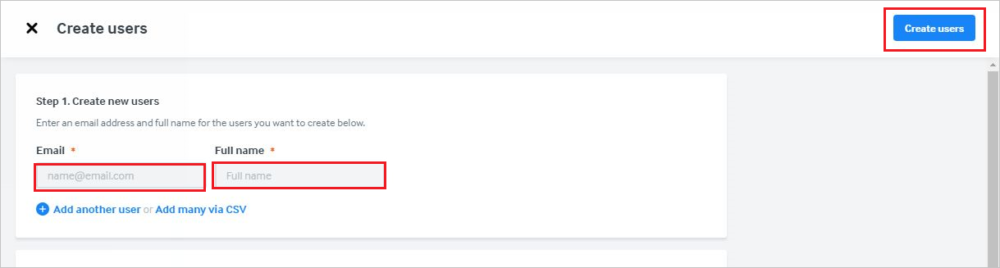

# Tutorial: Azure Active Directory integration with Percolate

In this tutorial, you'll learn how to integrate Percolate with Azure Active Directory (Azure AD).

This integration provides these benefits:

* You can use Azure AD to control who has access to Percolate.
* You can enable your users to be automatically signed in to Percolate (single sign-on) with their Azure AD accounts.
* You can manage your accounts in one central location: the Azure portal.

To learn more about SaaS app integration with Azure AD, see [Single sign-on to applications in Azure Active Directory](https://docs.microsoft.com/azure/active-directory/active-directory-appssoaccess-whatis).

If you don't have an Azure subscription, [create a free account](https://azure.microsoft.com/free/) before you start.

## Prerequisites

To configure Azure AD integration with Percolate, you need to have:

* An Azure AD subscription. If you don't have an Azure AD environment, you can get a [free account](https://azure.microsoft.com/free/).
* A Percolate subscription that has single sign-on enabled.

## Scenario description

In this tutorial, you'll configure and test Azure AD single sign-on in a test environment.

* Percolate supports SP-initiated and IdP-initiated SSO.

## Add Percolate from the gallery

To configure the integration of Percolate into Azure AD, you need to add Percolate from the gallery to your list of managed SaaS apps.

1. In the [Azure portal](https://portal.azure.com), in the left pane, select **Azure Active Directory**:

	

2. Go to **Enterprise applications** > **All applications**:

	

3. To add an application, select **New application** at the top of the window:

	

4. In the search box, enter **Percolate**. Select **Percolate** in the search results and then select **Add**.

	 

## Configure and test Azure AD single sign-on

In this section, you'll configure and test Azure AD single sign-on with Percolate by using a test user named Britta Simon.
To enable single sign-on, you need to establish a relationship between an Azure AD user and the corresponding user in Percolate.

To configure and test Azure AD single sign-on with Percolate, you need to complete these steps:

1. **[Configure Azure AD single sign-on](#configure-azure-ad-single-sign-on)** to enable the feature for your users.
2. **[Configure Percolate single sign-on](#configure-percolate-single-sign-on)** on the application side.
3. **[Create an Azure AD test user](#create-an-azure-ad-test-user)** to test Azure AD single sign-on.
4. **[Assign the Azure AD test user](#assign-the-azure-ad-test-user)** to enable Azure AD single sign-on for the user.
5. **[Create a Percolate test user](#create-a-percolate-test-user)** that's linked to the Azure AD representation of the user.
6. **[Test single sign-on](#test-single-sign-on)** to verify that the configuration works.

### Configure Azure AD single sign-on

In this section, you'll enable Azure AD single sign-on in the Azure portal.

To configure Azure AD single sign-on with Percolate, take these steps:

1. In the [Azure portal](https://portal.azure.com/), on the **Percolate** application integration page, select **Single sign-on**:

    

2. In the **Select a single sign-on method** dialog box, select **SAML/WS-Fed** mode to enable single sign-on:

    

3. On the **Set up Single Sign-On with SAML** page, select the **Edit** icon to open the **Basic SAML Configuration** dialog box:

	

4. In the **Basic SAML Configuration** dialog box, you don't need to take any action to configure the application in IdP-initiated mode. The app is already integrated with Azure.

    

5. If you want to configure the application in SP-initiated mode, select **Set additional URLs** and, in the **Sign on URL** box, enter **https://percolate.com/app/login**:

   
6. On the **Set up Single Sign-On with SAML** page, in the **SAML Signing Certificate** section, select the **Copy** icon to copy the **App Federation Metadata Url**. Save this URL.

	

7. In the **Set up Percolate** section, copy the appropriate URLs, based on your requirements.

	

	1. **Login URL**.

	1. **Azure AD Identifier**.

	1. **Logout URL**.

### Configure Percolate single sign-on

1. In a new web browser window, sign in to Percolate as an admin.

2. On the left side of the home page, select **Settings**:
	
	

3. In the left pane, select **SSO** under **Organization**:

	

	1. In the **Login URL** box, paste the **Login URL** value that you copied from the Azure portal.

	1. In the **Entity ID** box, paste the **Azure AD Identifier** value that you copied from the Azure portal.

	1. In Notepad, open the base-64 encoded certificate that you downloaded from the Azure portal. Copy its content and paste it into the **x509 certificates** box.

	1. In the **Email attribute** box, enter **emailaddress**.

	1. The **Identity provider metadata URL** box is an optional field. If you copied an **App Federation Metadata Url** from the Azure portal, you can paste it into this box.

	1. In the **Should AuthNRequests be signed?** list, select **No**.

	1. In the **Enable SSO auto-provisioning** list, select **No**.

	1. Select **Save**.

### Create an Azure AD test user

In this section, you'll create a test user named Britta Simon in the Azure portal.

1. In the Azure portal, select **Azure Active Directory** in the left pane, select **Users**, and then select **All users**:

    

2. Select **New user** at the top of the screen:

    

3. In the **User** dialog box, take the following steps.

    

    1. In the **Name** box, enter **BrittaSimon**.
  
    1. In the **User name** box, enter **BrittaSimon@\<yourcompanydomain>.\<extension>**. (For example, BrittaSimon@contoso.com.)

    1. Select **Show Password**, and then write down the value that's in the **Password** box.

    1. Select **Create**.

### Assign the Azure AD test user

In this section, you'll enable Britta Simon to use Azure AD single sign-on by granting her access to Percolate.

1. In the Azure portal, select **Enterprise applications**, select **All applications**, and then select **Percolate**.

	

2. In the list of applications, select **Percolate**.

	

3. In the left pane, select **Users and groups**:

    

4. Select **Add user**, and then select **Users and groups** in the **Add Assignment** dialog box.

    

5. In the **Users and groups** dialog box, select **Britta Simon** in the users list, and then click the **Select** button at the bottom of the screen.

6. If you expect a role value in the SAML assertion, in the **Select Role** dialog box, select the appropriate role for the user from the list. Click the **Select** button at the bottom of the screen.

7. In the **Add Assignment** dialog box, select **Assign**.

### Create a Percolate test user

To enable Azure AD users to sign in to Percolate, you need to add them to Percolate. You need to add them manually.

To create a user account, take these steps:

1. Sign in to Percolate as an admin.

2. In the left pane, select **Users** under **Organization**. Select **New users**:

	

3. On the **Create users** page, take the following steps.

	

	1. In the **Email** box, enter the email address of the user. For example, brittasimon@contoso.com.

	1. In the **Full name** box, enter the name of the user. For example, **Brittasimon**.

	1. Select **Create users**.

### Test single sign-on

Now you need to test your Azure AD single sign-on configuration by using the Access Panel.

When you select the Percolate tile in the Access Panel, you should be automatically signed in to the Percolate instance for which you set up SSO. For more information, see [Access and use apps on the My Apps portal](https://docs.microsoft.com/azure/active-directory/active-directory-saas-access-panel-introduction).

## Additional resources

- [Tutorials for integrating SaaS applications with Azure Active Directory](https://docs.microsoft.com/azure/active-directory/active-directory-saas-tutorial-list)

- [What is application access and single sign-on with Azure Active Directory?](https://docs.microsoft.com/azure/active-directory/active-directory-appssoaccess-whatis)

- [What is Conditional Access in Azure Active Directory?](https://docs.microsoft.com/azure/active-directory/conditional-access/overview)