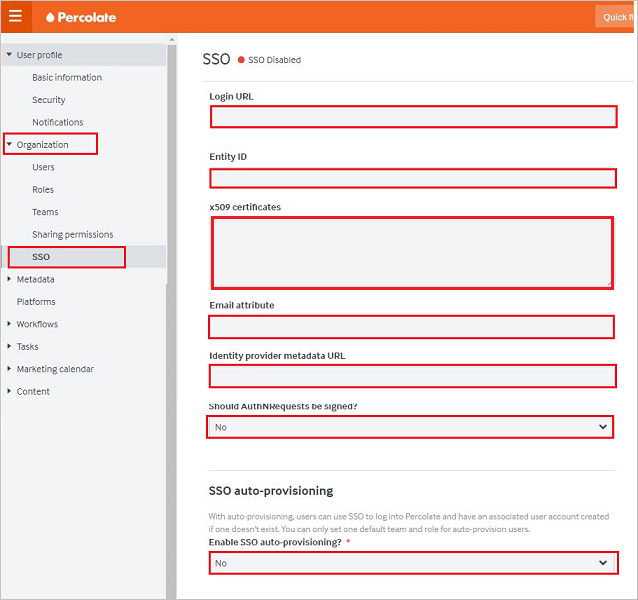
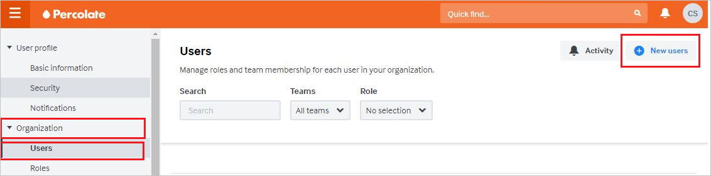

# Tutorial: Azure AD SSO integration with Percolate

In this tutorial, you'll learn how to integrate Percolate with Azure Active Directory (Azure AD). When you integrate Percolate with Azure AD, you can:

* Control in Azure AD who has access to Percolate.
* Enable your users to be automatically signed-in to Percolate with their Azure AD accounts.
* Manage your accounts in one central location - the Azure portal.

## Prerequisites

To configure Azure AD integration with Percolate, you need to have:

* An Azure AD subscription. If you don't have an Azure AD environment, you can get a [free account](https://azure.microsoft.com/free/).
* A Percolate subscription that has single sign-on enabled.

## Scenario description

In this tutorial, you'll configure and test Azure AD single sign-on in a test environment.

* Percolate supports SP-initiated and IdP-initiated SSO.

## Add Percolate from the gallery

To configure the integration of Percolate into Azure AD, you need to add Percolate from the gallery to your list of managed SaaS apps.

1. Sign in to the Azure portal using either a work or school account, or a personal Microsoft account.
1. On the left navigation pane, select the **Azure Active Directory** service.
1. Navigate to **Enterprise Applications** and then select **All Applications**.
1. To add new application, select **New application**.
1. In the **Add from the gallery** section, type **Percolate** in the search box.
1. Select **Percolate** from results panel and then add the app. Wait a few seconds while the app is added to your tenant.

 Alternatively, you can also use the [Enterprise App Configuration Wizard](https://portal.office.com/AdminPortal/home?Q=Docs#/azureadappintegration). In this wizard, you can add an application to your tenant, add users/groups to the app, assign roles, as well as walk through the SSO configuration as well. [Learn more about Microsoft 365 wizards.](/microsoft-365/admin/misc/azure-ad-setup-guides)

## Configure and test Azure AD SSO for Percolate

Configure and test Azure AD SSO with Percolate using a test user called **B.Simon**. For SSO to work, you need to establish a link relationship between an Azure AD user and the related user in Percolate.

To configure and test Azure AD SSO with Percolate, perform the following steps:

1. **[Configure Azure AD SSO](#configure-azure-ad-sso)** - to enable your users to use this feature.
    1. **[Create an Azure AD test user](#create-an-azure-ad-test-user)** - to test Azure AD single sign-on with B.Simon.
    1. **[Assign the Azure AD test user](#assign-the-azure-ad-test-user)** - to enable B.Simon to use Azure AD single sign-on.
1. **[Configure Percolate SSO](#configure-percolate-sso)** - to configure the single sign-on settings on application side.
    1. **[Create Percolate test user](#create-percolate-test-user)** - to have a counterpart of B.Simon in Percolate that is linked to the Azure AD representation of user.
1. **[Test SSO](#test-sso)** - to verify whether the configuration works.

## Configure Azure AD SSO

Follow these steps to enable Azure AD SSO in the Azure portal.

1. In the Azure portal, on the **Percolate** application integration page, find the **Manage** section and select **single sign-on**.
1. On the **Select a single sign-on method** page, select **SAML**.
1. On the **Set up single sign-on with SAML** page, click the pencil icon for **Basic SAML Configuration** to edit the settings.

   

4. In the **Basic SAML Configuration** dialog box, you don't need to take any action to configure the application in IdP-initiated mode. The app is already integrated with Azure.

5. If you want to configure the application in SP-initiated mode, select **Set additional URLs** and, in the **Sign on URL** box, enter **https://percolate.com/app/login**.

6. On the **Set up Single Sign-On with SAML** page, in the **SAML Signing Certificate** section, select the **Copy** icon to copy the **App Federation Metadata Url**. Save this URL.

	

7. In the **Set up Percolate** section, copy the appropriate URLs, based on your requirements.

	

### Create an Azure AD test user

In this section, you'll create a test user in the Azure portal called B.Simon.

1. From the left pane in the Azure portal, select **Azure Active Directory**, select **Users**, and then select **All users**.
1. Select **New user** at the top of the screen.
1. In the **User** properties, follow these steps:
   1. In the **Name** field, enter `B.Simon`.  
   1. In the **User name** field, enter the username@companydomain.extension. For example, `B.Simon@contoso.com`.
   1. Select the **Show password** check box, and then write down the value that's displayed in the **Password** box.
   1. Click **Create**.

### Assign the Azure AD test user

In this section, you'll enable B.Simon to use Azure single sign-on by granting access to Percolate.

1. In the Azure portal, select **Enterprise Applications**, and then select **All applications**.
1. In the applications list, select **Percolate**.
1. In the app's overview page, find the **Manage** section and select **Users and groups**.
1. Select **Add user**, then select **Users and groups** in the **Add Assignment** dialog.
1. In the **Users and groups** dialog, select **B.Simon** from the Users list, then click the **Select** button at the bottom of the screen.
1. If you are expecting a role to be assigned to the users, you can select it from the **Select a role** dropdown. If no role has been set up for this app, you see "Default Access" role selected.
1. In the **Add Assignment** dialog, click the **Assign** button.

## Configure Percolate SSO

1. In a new web browser window, sign in to Percolate as an admin.

2. On the left side of the home page, select **Settings**:
	
	

3. In the left pane, select **SSO** under **Organization**:

	

	1. In the **Login URL** box, paste the **Login URL** value that you copied from the Azure portal.

	1. In the **Entity ID** box, paste the **Azure AD Identifier** value that you copied from the Azure portal.

	1. In Notepad, open the base-64 encoded certificate that you downloaded from the Azure portal. Copy its content and paste it into the **x509 certificates** box.

	1. In the **Email attribute** box, enter **emailaddress**.

	1. The **Identity provider metadata URL** box is an optional field. If you copied an **App Federation Metadata Url** from the Azure portal, you can paste it into this box.

	1. In the **Should AuthNRequests be signed?** list, select **No**.

	1. In the **Enable SSO auto-provisioning** list, select **No**.

	1. Select **Save**.

### Create Percolate test user

To enable Azure AD users to sign in to Percolate, you need to add them to Percolate. You need to add them manually.

To create a user account, take these steps:

1. Sign in to Percolate as an admin.

2. In the left pane, select **Users** under **Organization**. Select **New users**:

	

3. On the **Create users** page, take the following steps.

	

	1. In the **Email** box, enter the email address of the user. For example, brittasimon@contoso.com.

	1. In the **Full name** box, enter the name of the user. For example, **Brittasimon**.

	1. Select **Create users**.

## Test SSO

In this section, you test your Azure AD single sign-on configuration with following options. 

#### SP initiated:

* Click on **Test this application** in Azure portal. This will redirect to Percolate Sign on URL where you can initiate the login flow.  

* Go to Percolate Sign-on URL directly and initiate the login flow from there.

#### IDP initiated:

* Click on **Test this application** in Azure portal and you should be automatically signed in to the Percolate for which you set up the SSO. 

You can also use Microsoft My Apps to test the application in any mode. When you click the Percolate tile in the My Apps, if configured in SP mode you would be redirected to the application sign on page for initiating the login flow and if configured in IDP mode, you should be automatically signed in to the Percolate for which you set up the SSO. For more information about the My Apps, see [Introduction to the My Apps](../user-help/my-apps-portal-end-user-access.md).

## Next steps

Once you configure Percolate you can enforce session control, which protects exfiltration and infiltration of your organization’s sensitive data in real time. Session control extends from Conditional Access. [Learn how to enforce session control with Microsoft Defender for Cloud Apps](/cloud-app-security/proxy-deployment-aad).
