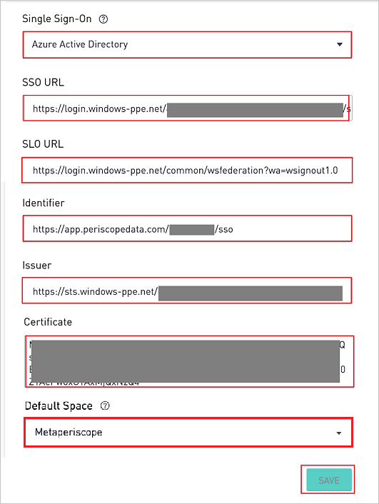
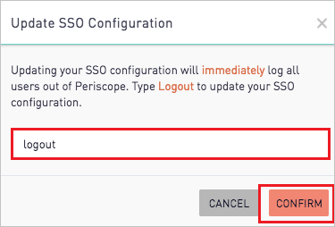
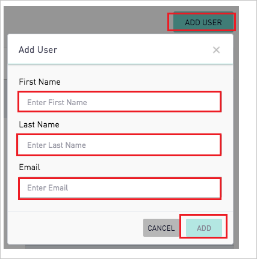

# Tutorial: Azure Active Directory integration with Periscope Data

In this tutorial, you learn how to integrate Periscope Data with Azure Active Directory (Azure AD).
Integrating Periscope Data with Azure AD provides you with the following benefits:

* You can control in Azure AD who has access to Periscope Data.
* You can enable your users to be automatically signed-in to Periscope Data (Single Sign-On) with their Azure AD accounts.
* You can manage your accounts in one central location - the Azure portal.

If you want to know more details about SaaS app integration with Azure AD, see [What is application access and single sign-on with Azure Active Directory](https://docs.microsoft.com/azure/active-directory/active-directory-appssoaccess-whatis).
If you don't have an Azure subscription, [create a free account](https://azure.microsoft.com/free/) before you begin.

## Prerequisites

To configure Azure AD integration with Periscope Data, you need the following items:

* An Azure AD subscription. If you don't have an Azure AD environment, you can get one-month trial [here](https://azure.microsoft.com/pricing/free-trial/)
* Periscope Data single sign-on enabled subscription

## Scenario description

In this tutorial, you configure and test Azure AD single sign-on in a test environment.

* Periscope Data supports **SP** initiated SSO

## Adding Periscope Data from the gallery

To configure the integration of Periscope Data into Azure AD, you need to add Periscope Data from the gallery to your list of managed SaaS apps.

**To add Periscope Data from the gallery, perform the following steps:**

1. In the **[Azure portal](https://portal.azure.com)**, on the left navigation panel, click **Azure Active Directory** icon.

	

2. Navigate to **Enterprise Applications** and then select the **All Applications** option.

	

3. To add new application, click **New application** button on the top of dialog.

	

4. In the search box, type **Periscope Data**, select **Periscope Data** from result panel then click **Add** button to add the application.

	 

## Configure and test Azure AD single sign-on

In this section, you configure and test Azure AD single sign-on with Periscope Data based on a test user called **Britta Simon**.
For single sign-on to work, a link relationship between an Azure AD user and the related user in Periscope Data needs to be established.

To configure and test Azure AD single sign-on with Periscope Data, you need to complete the following building blocks:

1. **[Configure Azure AD Single Sign-On](#configure-azure-ad-single-sign-on)** - to enable your users to use this feature.
2. **[Configure Periscope Data Single Sign-On](#configure-periscope-data-single-sign-on)** - to configure the Single Sign-On settings on application side.
3. **[Create an Azure AD test user](#create-an-azure-ad-test-user)** - to test Azure AD single sign-on with Britta Simon.
4. **[Assign the Azure AD test user](#assign-the-azure-ad-test-user)** - to enable Britta Simon to use Azure AD single sign-on.
5. **[Create Periscope Data test user](#create-periscope-data-test-user)** - to have a counterpart of Britta Simon in Periscope Data that is linked to the Azure AD representation of user.
6. **[Test single sign-on](#test-single-sign-on)** - to verify whether the configuration works.

### Configure Azure AD single sign-on

In this section, you enable Azure AD single sign-on in the Azure portal.

To configure Azure AD single sign-on with Periscope Data, perform the following steps:

1. In the [Azure portal](https://portal.azure.com/), on the **Periscope Data** application integration page, select **Single sign-on**.

    

2. On the **Select a Single sign-on method** dialog, select **SAML/WS-Fed** mode to enable single sign-on.

    

3. On the **Set up Single Sign-On with SAML** page, click **Edit** icon to open **Basic SAML Configuration** dialog.

	

4. On the **Basic SAML Configuration** section, perform the following steps:

    

	a. In the **Sign on URL** text box, type any of the URLs:
    
    ```https
    https://app.periscopedata.com/
    https://app.periscopedata.com/app/<SITENAME>
    ```

    b. In the **Identifier (Entity ID)** text box, type a URL using the following pattern:
    `https://app.periscopedata.com/<SITENAME>/sso`

	> [!NOTE]
	> The Sign on URL value is not real. Update the values with the actual Sign on URL. Contact [Periscope Data Client support team](mailto:support@periscopedata.com) to get this value and the Identifier value you will get from the **Configure Periscope Data Single Sign-On** section which is explained later in the tutorial. You can also refer to the patterns shown in the **Basic SAML Configuration** section in the Azure portal.

5. On the **Set up Single Sign-On with SAML** page, In the **SAML Signing Certificate** section, click copy button to copy **App Federation Metadata Url** and save it on your computer.

	

### Configure Periscope Data Single Sign-On

1. In a different web browser window, sign in to Periscope Data as an Administrator.

2. Open the gear menu in the bottom left and open the **Billing** > **Security** menu and perform the following steps. Only admins have access to these settings.

    

    a. Copy the **App Federation Metadata URL** from step #5 **SAML Signing Certificate** and open it in a browser. This will open up an XML document.

    b. In the **Single Sign-On** textbox, select **Azure Active Directory**.

    c. Find the tag **SingleSignOnService** and paste the **Location** value in the **SSO URL** textbox.

    d. Find the tag **SingleLogoutService** and paste the **Location** value in the **SLO URL** textbox.

    e. Copy the **Identifier** value for your instance and paste it in **Identifier (Entity ID)** textbox of **Basic SAML Configuration** section on Azure portal.

    f. Find the first tag of the XML file, copy the value of **entityID** and paste it in the **Issuer** textbox.

    g. Find the tag **IDPSSODescriptor** with SAML protocol. Within that section, find the tag **KeyDescriptor** with **use=signing**. copy the value of **X509Certificate** and paste it in the **Certificate** textbox.

    h. Sites with multiple spaces can choose the default space from the **Default Space** drop down. This will be the space new users get added to when they log in to Periscope Data for the first time and are provisioned through the Active Directory Single Sign On.

    i. Finally, click **Save** and **confirm** the SSO settings change by typing **Logout**.

    

### Create an Azure AD test user 

The objective of this section is to create a test user in the Azure portal called Britta Simon.

1. In the Azure portal, in the left pane, select **Azure Active Directory**, select **Users**, and then select **All users**.

    

2. Select **New user** at the top of the screen.

    

3. In the User properties, perform the following steps.

    

    a. In the **Name** field enter **BrittaSimon**.
  
    b. In the **User name** field type **brittasimon\@yourcompanydomain.extension**  
    For example, BrittaSimon@contoso.com

    c. Select **Show password** check box, and then write down the value that's displayed in the Password box.

    d. Click **Create**.

### Assign the Azure AD test user

In this section, you enable Britta Simon to use Azure single sign-on by granting access to Periscope Data.

1. In the Azure portal, select **Enterprise Applications**, select **All applications**, then select **Periscope Data**.

	

2. In the applications list, select **Periscope Data**.

	

3. In the menu on the left, select **Users and groups**.

    

4. Click the **Add user** button, then select **Users and groups** in the **Add Assignment** dialog.

    

5. In the **Users and groups** dialog select **Britta Simon** in the Users list, then click the **Select** button at the bottom of the screen.

6. If you are expecting any role value in the SAML assertion then in the **Select Role** dialog select the appropriate role for the user from the list, then click the **Select** button at the bottom of the screen.

7. In the **Add Assignment** dialog click the **Assign** button.

### Create Periscope Data test user

To enable Azure AD users to log in to Periscope Data, they must be provisioned into Periscope Data. In Periscope Data, provisioning is a manual task.

**To provision a user account, perform the following steps:**

1. Log in to Periscope Data as an Administrator.

2. Click on the **Settings** icon on the left bottom of the menu and navigate to **Permissions**.

    

3. Click on the **ADD USER** and perform the following steps:

      

    a. In **First Name** text box, enter the first name of user like **Britta**.

    b. In **Last Name** text box, enter the last name of user like **Simon**.

    c. In **Email** text box, enter the email of user like **brittasimon\@contoso.com**.

    d. Click **ADD**.

### Test single sign-on 

In this section, you test your Azure AD single sign-on configuration using the Access Panel.

When you click the Periscope Data tile in the Access Panel, you should be automatically signed in to the Periscope Data for which you set up SSO. For more information about the Access Panel, see [Introduction to the Access Panel](https://docs.microsoft.com/azure/active-directory/active-directory-saas-access-panel-introduction).

## Additional Resources

- [List of Tutorials on How to Integrate SaaS Apps with Azure Active Directory](https://docs.microsoft.com/azure/active-directory/active-directory-saas-tutorial-list)

- [What is application access and single sign-on with Azure Active Directory?](https://docs.microsoft.com/azure/active-directory/active-directory-appssoaccess-whatis)

- [What is Conditional Access in Azure Active Directory?](https://docs.microsoft.com/azure/active-directory/conditional-access/overview)

