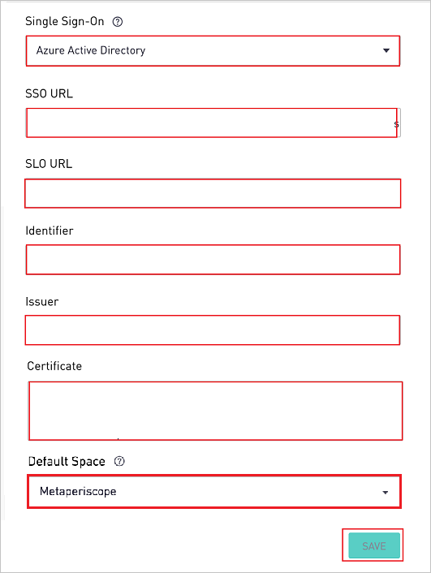
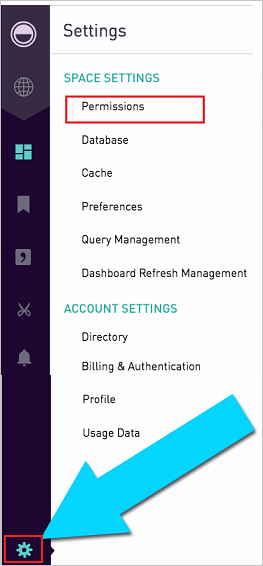

# Tutorial: Microsoft Entra SSO integration with Periscope Data

In this tutorial, you'll learn how to integrate Periscope Data with Microsoft Entra ID. When you integrate Periscope Data with Microsoft Entra ID, you can:

* Control in Microsoft Entra ID who has access to Periscope Data.
* Enable your users to be automatically signed-in to Periscope Data with their Microsoft Entra accounts.
* Manage your accounts in one central location.

## Prerequisites

To get started, you need the following items:

* A Microsoft Entra subscription. If you don't have a subscription, you can get a [free account](https://azure.microsoft.com/free/).
* Periscope Data single sign-on (SSO) enabled subscription.

## Scenario description

In this tutorial, you configure and test Microsoft Entra single sign-on in a test environment.

* Periscope Data supports **SP** initiated SSO.

## Add Periscope Data from the gallery

To configure the integration of Periscope Data into Microsoft Entra ID, you need to add Periscope Data from the gallery to your list of managed SaaS apps.

1. Sign in to the [Microsoft Entra admin center](https://entra.microsoft.com) as at least a [Cloud Application Administrator](../roles/permissions-reference.md#cloud-application-administrator).
1. Browse to **Identity** > **Applications** > **Enterprise applications** > **New application**.
1. In the **Add from the gallery** section, type **Periscope Data** in the search box.
1. Select **Periscope Data** from results panel and then add the app. Wait a few seconds while the app is added to your tenant.

 Alternatively, you can also use the [Enterprise App Configuration Wizard](https://portal.office.com/AdminPortal/home?Q=Docs#/azureadappintegration). In this wizard, you can add an application to your tenant, add users/groups to the app, assign roles, as well as walk through the SSO configuration as well. [Learn more about Microsoft 365 wizards.](/microsoft-365/admin/misc/azure-ad-setup-guides)

## Configure and test Microsoft Entra SSO for Periscope Data

Configure and test Microsoft Entra SSO with Periscope Data using a test user called **B.Simon**. For SSO to work, you need to establish a link relationship between a Microsoft Entra user and the related user in Periscope Data.

To configure and test Microsoft Entra SSO with Periscope Data, perform the following steps:

1. **[Configure Microsoft Entra SSO](#configure-azure-ad-sso)** - to enable your users to use this feature.
    1. **[Create a Microsoft Entra test user](#create-an-azure-ad-test-user)** - to test Microsoft Entra single sign-on with B.Simon.
    1. **[Assign the Microsoft Entra test user](#assign-the-azure-ad-test-user)** - to enable B.Simon to use Microsoft Entra single sign-on.
1. **[Configure Periscope Data SSO](#configure-periscope-data-sso)** - to configure the single sign-on settings on application side.
    1. **[Create Periscope Data test user](#create-periscope-data-test-user)** - to have a counterpart of B.Simon in Periscope Data that is linked to the Microsoft Entra representation of user.
1. **[Test SSO](#test-sso)** - to verify whether the configuration works.

## Configure Microsoft Entra SSO

Follow these steps to enable Microsoft Entra SSO.

1. Sign in to the [Microsoft Entra admin center](https://entra.microsoft.com) as at least a [Cloud Application Administrator](../roles/permissions-reference.md#cloud-application-administrator).
1. Browse to **Identity** > **Applications** > **Enterprise applications** > **Periscope Data** > **Single sign-on**.
1. On the **Select a single sign-on method** page, select **SAML**.
1. On the **Set up single sign-on with SAML** page, click the pencil icon for **Basic SAML Configuration** to edit the settings.

   

1. On the **Basic SAML Configuration** section, perform the following steps:

    a. In the **Identifier (Entity ID)** text box, type a URL using the following pattern:
    `https://app.periscopedata.com/<SITENAME>/sso`

	b. In the **Sign on URL** text box, type a URL using one of the following patterns:
    
    | **Sign on URL** |
    |--------|
    | `https://app.periscopedata.com/` |
    | `https://app.periscopedata.com/app/<SITENAME>` |

	> [!NOTE]
	> The Sign on URL value is not real. Update the values with the actual Sign on URL. Contact [Periscope Data Client support team](mailto:support@periscopedata.com) to get this value and the Identifier value you will get from the **Configure Periscope Data Single Sign-On** section which is explained later in the tutorial. You can also refer to the patterns shown in the **Basic SAML Configuration** section.

1. On the **Set up Single Sign-On with SAML** page, In the **SAML Signing Certificate** section, click copy button to copy **App Federation Metadata Url** and save it on your computer.

	

### Create a Microsoft Entra test user 

In this section, you'll create a test user called B.Simon.

1. Sign in to the [Microsoft Entra admin center](https://entra.microsoft.com) as at least a [User Administrator](../roles/permissions-reference.md#user-administrator).
1. Browse to **Identity** > **Users** > **All users**.
1. Select **New user** > **Create new user**, at the top of the screen.
1. In the **User** properties, follow these steps:
   1. In the **Display name** field, enter `B.Simon`.  
   1. In the **User principal name** field, enter the username@companydomain.extension. For example, `B.Simon@contoso.com`.
   1. Select the **Show password** check box, and then write down the value that's displayed in the **Password** box.
   1. Select **Review + create**.
1. Select **Create**.

### Assign the Microsoft Entra test user

In this section, you'll enable B.Simon to use single sign-on by granting access to Periscope Data.

1. Sign in to the [Microsoft Entra admin center](https://entra.microsoft.com) as at least a [Cloud Application Administrator](../roles/permissions-reference.md#cloud-application-administrator).
1. Browse to **Identity** > **Applications** > **Enterprise applications** > **Periscope Data**.
1. In the app's overview page, select **Users and groups**.
1. Select **Add user/group**, then select **Users and groups** in the **Add Assignment** dialog.
   1. In the **Users and groups** dialog, select **B.Simon** from the Users list, then click the **Select** button at the bottom of the screen.
   1. If you are expecting a role to be assigned to the users, you can select it from the **Select a role** dropdown. If no role has been set up for this app, you see "Default Access" role selected.
   1. In the **Add Assignment** dialog, click the **Assign** button.

## Configure Periscope Data SSO

1. In a different web browser window, sign in to Periscope Data as an Administrator.

2. Open the gear menu in the bottom left and open the **Billing** > **Security** menu and perform the following steps. Only admins have access to these settings.

    

    a. Copy the **App Federation Metadata URL** from step #5 **SAML Signing Certificate** and open it in a browser. This will open up an XML document.

    b. In the **Single Sign-On** textbox, select **Microsoft Entra ID**.

    c. Find the tag **SingleSignOnService** and paste the **Location** value in the **SSO URL** textbox.

    d. Find the tag **SingleLogoutService** and paste the **Location** value in the **SLO URL** textbox.

    e. Copy the **Identifier** value for your instance and paste it in **Identifier (Entity ID)** textbox of **Basic SAML Configuration** section.

    f. Find the first tag of the XML file, copy the value of **entityID** and paste it in the **Issuer** textbox.

    g. Find the tag **IDPSSODescriptor** with SAML protocol. Within that section, find the tag **KeyDescriptor** with **use=signing**. copy the value of **X509Certificate** and paste it in the **Certificate** textbox.

    h. Sites with multiple spaces can choose the default space from the **Default Space** drop down. This will be the space new users get added to when they log in to Periscope Data for the first time and are provisioned through the Active Directory Single Sign On.

    i. Finally, click **Save** and **confirm** the SSO settings change by typing **Logout**.

    

### Create Periscope Data test user

To enable Microsoft Entra users to log in to Periscope Data, they must be provisioned into Periscope Data. In Periscope Data, provisioning is a manual task.

**To provision a user account, perform the following steps:**

1. Log in to Periscope Data as an Administrator.

2. Click on the **Settings** icon on the left bottom of the menu and navigate to **Permissions**.

    

3. Click on the **ADD USER** and perform the following steps:

      

    a. In **First Name** text box, enter the first name of user like **Britta**.

    b. In **Last Name** text box, enter the last name of user like **Simon**.

    c. In **Email** text box, enter the email of user like **brittasimon\@contoso.com**.

    d. Click **ADD**.

## Test SSO 

In this section, you test your Microsoft Entra single sign-on configuration with following options. 

* Click on **Test this application**, this will redirect to Periscope Data Sign-on URL where you can initiate the login flow. 

* Go to Periscope Data Sign-on URL directly and initiate the login flow from there.

* You can use Microsoft My Apps. When you click the Periscope Data tile in the My Apps, this will redirect to Periscope Data Sign-on URL. For more information, see [Microsoft Entra My Apps](/azure/active-directory/manage-apps/end-user-experiences#azure-ad-my-apps).

## Next steps

Once you configure Periscope Data you can enforce session control, which protects exfiltration and infiltration of your organization’s sensitive data in real time. Session control extends from Conditional Access. [Learn how to enforce session control with Microsoft Defender for Cloud Apps](/cloud-app-security/proxy-deployment-aad).
