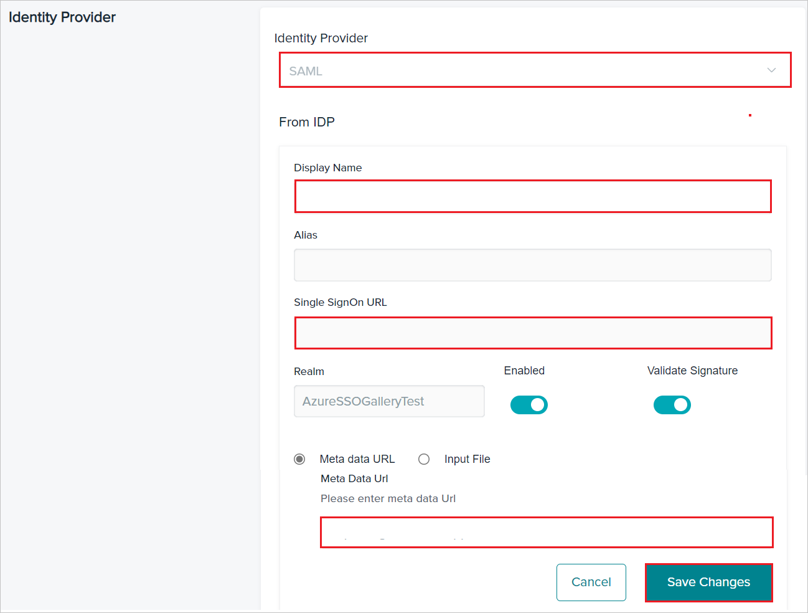
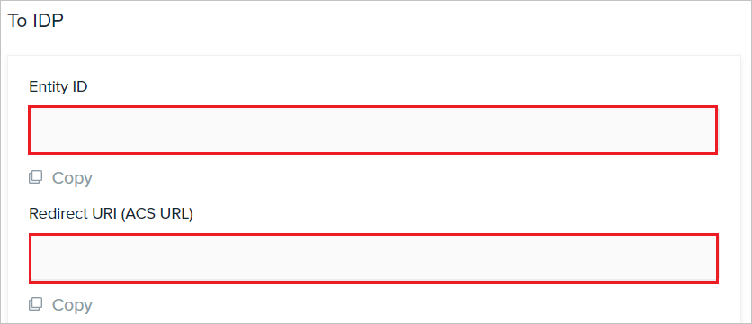
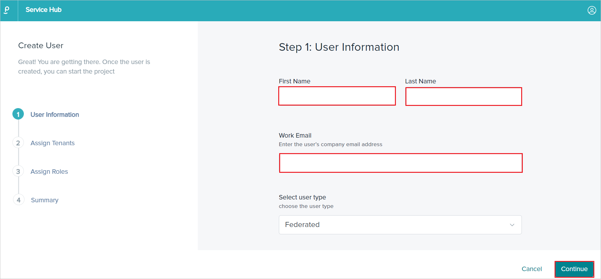
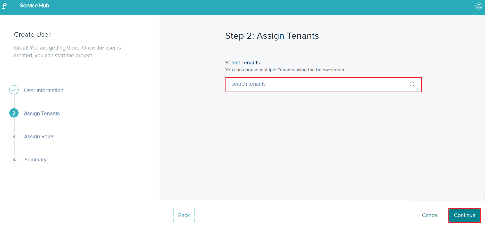
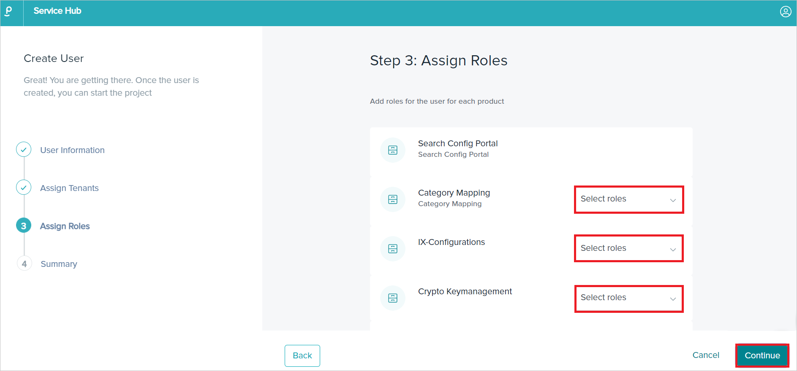
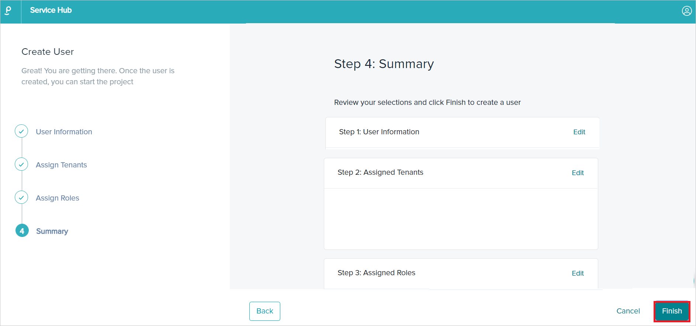

# Tutorial: Microsoft Entra SSO integration with Phenom TXM

In this tutorial, you will learn how to integrate Phenom TXM with Microsoft Entra ID. When you integrate Phenom TXM with Microsoft Entra ID, you can:

* Control in Microsoft Entra ID who has access to Phenom TXM.
* Enable your users to be automatically signed-in to Phenom TXM with their Microsoft Entra accounts.
* Manage your accounts in one central location.

## Prerequisites

To get started, you need the following items:

* A Microsoft Entra subscription. If you don't have a subscription, you can get a [free account](https://azure.microsoft.com/free/).
* Phenom TXM single sign-on (SSO) enabled subscription and a user account with the Client Admin role in Service Hub.
* Along with Cloud Application Administrator, Application Administrator can also add or manage applications in Microsoft Entra ID.
For more information, see [Azure built-in roles](../roles/permissions-reference.md).

## Scenario description

In this tutorial, you configure and test Microsoft Entra SSO in a test environment.

* Phenom TXM supports **SP** and **IDP** initiated SSO.

## Add Phenom TXM from the gallery

To configure the integration of Phenom TXM into Microsoft Entra ID, you need to add Phenom TXM from the gallery to your list of managed SaaS apps.

1. Sign in to the [Microsoft Entra admin center](https://entra.microsoft.com) as at least a [Cloud Application Administrator](../roles/permissions-reference.md#cloud-application-administrator).
1. Browse to **Identity** > **Applications** > **Enterprise applications** > **New application**.
1. In the **Add from the gallery** section, type **Phenom TXM** in the search box.
1. Select **Phenom TXM** from results panel and then add the app. Wait a few seconds while the app is added to your tenant.

Alternatively, you can also use the [Enterprise App Configuration Wizard](https://portal.office.com/AdminPortal/home?Q=Docs#/azureadappintegration). In this wizard, you can add an application to your tenant, add users/groups to the app, assign roles, and walk through the SSO configuration as well. [Learn more about Microsoft 365 wizards.](/microsoft-365/admin/misc/azure-ad-setup-guides)

## Configure and test Microsoft Entra SSO for Phenom TXM

Configure and test Microsoft Entra SSO with Phenom TXM using a test user called **B.Simon**. For SSO to work, you need to establish an assignment relationship between a Microsoft Entra user or group and the related Phenom TXM application, ensuring that Microsoft Entra ID passes the user's email address to Phenom TXM as a user identifier.

To configure and test Microsoft Entra SSO with Phenom TXM, perform the following steps:

1. **[Configure Microsoft Entra SSO](#configure-azure-ad-sso)** - to enable your users to use this feature.
    1. **[Create a Microsoft Entra test user](#create-an-azure-ad-test-user)** - to test Microsoft Entra single sign-on with B.Simon.
    1. **[Assign the Microsoft Entra test user](#assign-the-azure-ad-test-user)** - to enable B.Simon to use Microsoft Entra single sign-on.
1. **[Configure Phenom TXM SSO](#configure-phenom-txm-sso)** - to configure the single sign-on settings on application side.
    1. **[Create Phenom TXM test user](#create-phenom-txm-test-user)** - to have a counterpart of B.Simon in Phenom TXM that is linked to the Microsoft Entra representation of user.
1. **[Test SSO](#test-sso)** - to verify whether the configuration works.

## Configure Microsoft Entra SSO

Follow these steps to enable Microsoft Entra SSO.

1. Sign in to the [Microsoft Entra admin center](https://entra.microsoft.com) as at least a [Cloud Application Administrator](../roles/permissions-reference.md#cloud-application-administrator).
1. Browse to **Identity** > **Applications** > **Enterprise applications** > **Phenom TXM** > **Single sign-on**.
1. On the **Select a single sign-on method** page, select **SAML**.
1. On the **Set up single sign-on with SAML** page, click the pencil icon for **Basic SAML Configuration** to edit the settings.

   

1. On the **Basic SAML Configuration** section, perform the following steps:

    a. In the **Identifier** text box, enter the **ENTITY ID** copied from Service Hub.

    b. In the **Reply URL** text box, enter the **Redirect URI (ACS URL)** copied from Service Hub.

    1. In the first **Reply URL** text box, enter the **Redirect URI (ACS URL)** copied from Service Hub and set the Index value to **0**.

    1. In the second **Reply URL** text box, enter the **Redirect URI (ACS URL) SP Initiated Flow** copied from Service Hub and set the Index value to **1**

    > [!Note] 
    > Ensure that the first **Reply URL** is set as the **Default** using the checkbox.

1. Perform the following step if you wish to configure the application in **SP** initiated mode:
    
    In the **Sign on URL** text box, type one of the following URLs:

     | Environment | Sign on URL |
    |--------------|-------------|
    | Staging | `https://login-stg.phenompro.com` |
    | Production | `https://login.phenom.com` |

1. On the **Set up single sign-on with SAML** page, In the **SAML Signing Certificate** section, click copy button to copy **App Federation Metadata Url** and save it on your computer.

	

### Create a Microsoft Entra test user

In this section, you will create a test user in the Azure portal called B.Simon.

1. Sign in to the [Microsoft Entra admin center](https://entra.microsoft.com) as at least a [User Administrator](../roles/permissions-reference.md#user-administrator).
1. Browse to **Identity** > **Users** > **All users**.
1. Select **New user** > **Create new user**, at the top of the screen.
1. In the **User** properties, follow these steps:
   1. In the **Display name** field, enter `B.Simon`.  
   1. In the **User principal name** field, enter the username@companydomain.extension. For example, `B.Simon@contoso.com`.
   1. Select the **Show password** check box, and then write down the value that's displayed in the **Password** box.
   1. Select **Review + create**.
1. Select **Create**.

### Assign the Microsoft Entra test user

In this section, you will enable B.Simon to use Azure single sign-on by granting access to Phenom TXM.

1. Sign in to the [Microsoft Entra admin center](https://entra.microsoft.com) as at least a [Cloud Application Administrator](../roles/permissions-reference.md#cloud-application-administrator).
1. Browse to **Identity** > **Applications** > **Enterprise applications** > **Phenom TXM**.
1. In the app's overview page, find the **Manage** section and select **Users and groups**.
1. Select **Add user**, then select **Users and groups** in the **Add Assignment** dialog.
1. In the **Users and groups** dialog, select **B.Simon** from the Users list, then click the **Select** button at the bottom of the screen.
1. If you're expecting a role to be assigned to the users, you can select it from the **Select a role** dropdown. If no role has been set up for this app, you see "Default Access" role selected.
1. In the **Add Assignment** dialog, click the **Assign** button.

## Configure Phenom TXM SSO

1. Log in to your Phenom TXM instance Service Hub as a user with the Client Admin role.

1. Go to **Settings** tab > **Identity Provider**.

1. In the **Identity Provider** section, perform the following steps:
    
    

    

    a. Choose **SAML** from the dropdown selector.

    b. Enter a valid name in the **Display Name** textbox.

    c. In the **Single SignOn URL** textbox, paste the **Login URL** value, which you've copied.

    d. In the **Meta data URL** textbox, paste the **App Federation Metadata Url** value, which you've copied.

    e. Copy **Entity ID** value, paste this value into the **Identifier** text box in the **Basic SAML Configuration** section.

    f. Copy **Redirect URI (ACS URL)** value, paste this value into the first **Reply URL** text box in the **Basic SAML Configuration** section.

    g. Copy **Redirect URI (ACS URL) SP Initiated Flow** value, paste this value into the second **Reply URL** text box in the **Basic SAML Configuration** section.

### Create Phenom TXM test user

1. In a different web browser window, log in to your Phenom TXM website as an administrator.

1. Go to **Users** tab and click **Create Users** > **Create single new User**.

1. In the **Create User** page, perform the following steps:

    a. In the **User Information** section, enter a valid **First Name**, **Last Name** and **Work Email** in the textboxes and click **Continue**.

    

    b. In the **Assign Tenants** section, **Select Tenants** and click **Continue**.

    

    c. In the **Assign Roles** section, **Select roles** from the dropdown and click **Continue**.

    

    d. In the **Summary** section, review your selections and click **Finish** to create a user.

    

## Test SSO 

In this section, you test your Microsoft Entra single sign-on configuration with following options. 

#### SP initiated:

* Click on **Test this application**, this will redirect to Phenom TXM Sign-on URL where you can initiate the login flow.  

* Go to Phenom TXM Sign-on URL directly and initiate the login flow from there.

#### IDP initiated:

* Click on **Test this application**, and you should be automatically signed in to the Phenom TXM for which you set up the SSO. 

You can also use Microsoft My Apps to test the application in any mode. When you click the Phenom TXM tile in the My Apps, if configured in SP mode you would be redirected to the application sign-on page for initiating the login flow and if configured in IDP mode, you should be automatically signed in to the Phenom TXM for which you set up the SSO. For more information, see [Microsoft Entra My Apps](/azure/active-directory/manage-apps/end-user-experiences#azure-ad-my-apps).

## Next steps

Once you configure Phenom TXM you can enforce session control, which protects exfiltration and infiltration of your organization’s sensitive data in real time. Session control extends from Conditional Access. [Learn how to enforce session control with Microsoft Defender for Cloud Apps](/cloud-app-security/proxy-deployment-any-app).
