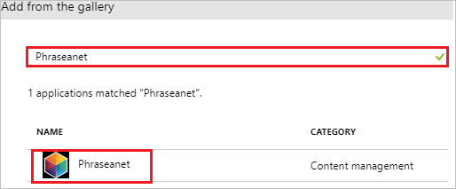
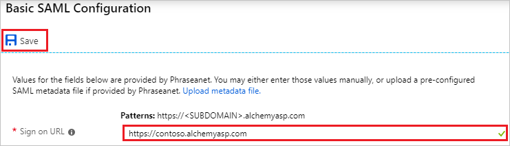
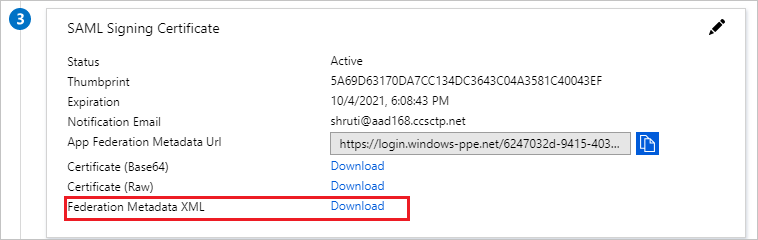
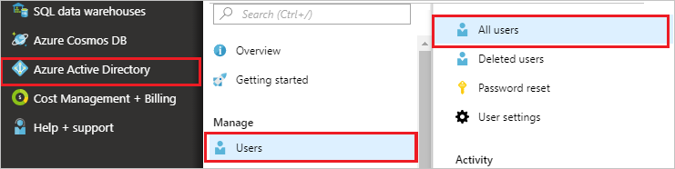
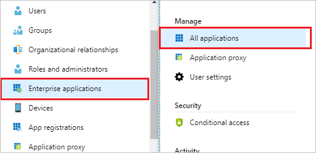
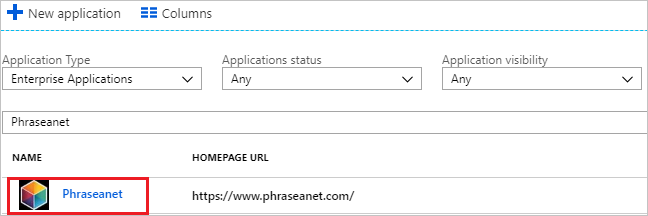

# Tutorial: Azure Active Directory integration with Phraseanet

In this tutorial, you learn how to integrate Phraseanet with Azure Active Directory (Azure AD).

Integrating Phraseanet with Azure AD provides you with the following benefits:

- You can control in Azure AD who has access to Phraseanet.
- You can enable your users to automatically get signed-on to Phraseanet (Single Sign-On) with their Azure AD accounts.
- You can manage your accounts in one central location - the Azure portal.

If you want to know more details about SaaS app integration with Azure AD, see [what is application access and single sign-on with Azure Active Directory](../manage-apps/what-is-single-sign-on.md).

## Prerequisites

To configure Azure AD integration with Phraseanet, you need the following items:

- An Azure AD subscription
- A Phraseanet single sign-on enabled subscription

> [!NOTE]
> To test the steps in this tutorial, we do not recommend using a production environment.

To test the steps in this tutorial, you should follow these recommendations:

- Do not use your production environment, unless it is necessary.
- If you don't have an Azure AD trial environment, you can [get a one-month trial](https://azure.microsoft.com/pricing/free-trial/).

## Scenario description
In this tutorial, you test Azure AD single sign-on in a test environment. 
The scenario outlined in this tutorial consists of two main building blocks:

1. Adding Phraseanet from the gallery
2. Configuring and testing Azure AD single sign-on

## Adding Phraseanet from the gallery
To configure the integration of Phraseanet into Azure AD, you need to add Phraseanet from the gallery to your list of managed SaaS apps.

**To add Phraseanet from the gallery, perform the following steps:**

1. In the **[Azure portal](https://portal.azure.com)**, on the left navigation panel, click **Azure Active Directory** icon. 

	

2. Navigate to **Enterprise applications**. Then go to **All applications**.

	
	
3. To add new application, click **New application** button on the top of dialog.

	

4. In the search box, type **Phraseanet**, select **Phraseanet** from result panel then click **Add** button to add the application.

	 

## Configure and test Azure AD single sign-on

In this section, you configure and test Azure AD single sign-on with Phraseanet based on a test user called "Britta Simon".

For single sign-on to work, Azure AD needs to know what the counterpart user in Phraseanet is to a user in Azure AD. In other words, a link relationship between an Azure AD user and the related user in Phraseanet needs to be established.

To configure and test Azure AD single sign-on with Phraseanet, you need to complete the following building blocks:

1. **[Configure Azure AD Single Sign-On](#configure-azure-ad-single-sign-on)** - to enable your users to use this feature.
2. **[Create an Azure AD test user](#create-an-azure-ad-test-user)** - to test Azure AD single sign-on with Britta Simon.
3. **[Create a Phraseanet test user](#create-a-phraseanet-test-user)** - to have a counterpart of Britta Simon in Phraseanet that is linked to the Azure AD representation of user.
4. **[Assign the Azure AD test user](#assign-the-azure-ad-test-user)** - to enable Britta Simon to use Azure AD single sign-on.
5. **[Test single sign-on](#test-single-sign-on)** - to verify whether the configuration works.

### Configure Azure AD single sign-on

In this section, you enable Azure AD single sign-on in the Azure portal and configure single sign-on in your Phraseanet application.

**To configure Azure AD single sign-on with Phraseanet, perform the following steps:**

1. In the [Azure portal](https://portal.azure.com/), on the **Phraseanet** application integration page, select **Single sign-on**.

    

2. On the **Select a Single sign-on method** dialog, Click **Select** for **SAML** mode to enable single sign-on.

    

3. On the **Set up Single Sign-On with SAML** page, click **Edit** button to open **Basic SAML Configuration** dialog.

	

4. On the **Basic SAML Configuration** section, perform the following steps:

	In the **Sign-on URL** text box, type a URL as:
    `https://<SUBDOMAIN>.alchemyasp.com`

    

    > [!NOTE] 
	> The Sign-on URL value is not real. Update the value with the actual Sign-On URL. Contact [Phraseanet support team](mailto:support@alchemy.fr) to get the value.
 
5. On the **Set up Single Sign-On with SAML** page, in the **SAML Signing Certificate** section, click **Download** to download the **Federation Metadata XML** and save it on your computer.

	 

6. To configure single sign-on on **Phraseanet** side, you need to send the downloaded **Federation Metadata XML** to [Phraseanet support team](mailto:support@alchemy.fr). They set this setting to have the SAML SSO connection set properly on both sides.

### Create an Azure AD test user

The objective of this section is to create a test user in the Azure portal called Britta Simon.

1. In the Azure portal, in the left pane, select **Azure Active Directory**, select **Users**, and then select **All users**.

    

2. Select **New user** at the top of the screen.

    

3. In the User properties, perform the following steps.

    

    a. In the **Name** field enter **BrittaSimon**.
  
    b. In the **User name** field type **brittasimon@yourcompanydomain.extension**  
    For example, BrittaSimon@contoso.com

    c. Select **Properties**, select the **Show password** check box, and then write down the value that's displayed in the Password box.

    d. Select **Create**.
 
### Create a Phraseanet test user

In this section, you create a user called Britta Simon in Phraseanet. Work with [Phraseanet support team](mailto:support@alchemy.fr) to add the users in the Phraseanet platform. Users must be created and activated before you use single sign-on.

### Assign the Azure AD test user

In this section, you enable Britta Simon to use Azure single sign-on by granting access to Phraseanet.

1. In the Azure portal, select **Enterprise Applications**, select **All applications**.

	

2. In the applications list, select **Phraseanet**.

	

3. In the menu on the left, select **Users and groups**.

    

4. Select the **Add** button, then select **Users and groups** in the **Add Assignment** dialog.

    

4. In the **Users and groups** dialog select **Britta Simon** in the Users list, then click the **Select** button at the bottom of the screen.

5. In the **Add Assignment** dialog select the **Assign** button.
	
### Test single sign-on

In this section, you test your Azure AD single sign-on configuration using the Access Panel.

When you click the Phraseanet tile in the Access Panel, you should get automatically signed-on to your Phraseanet application.
For more information about the Access Panel, see [Introduction to the Access Panel](../active-directory-saas-access-panel-introduction.md). 

## Additional resources

* [List of Tutorials on How to Integrate SaaS Apps with Azure Active Directory](tutorial-list.md)
* [What is application access and single sign-on with Azure Active Directory?](../manage-apps/what-is-single-sign-on.md)

