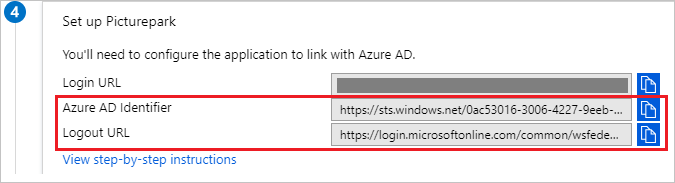
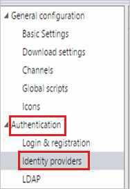
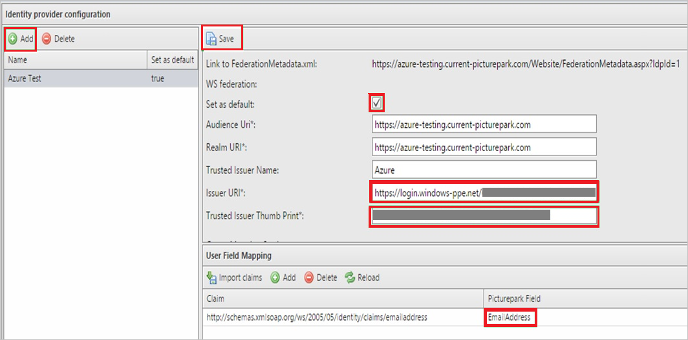
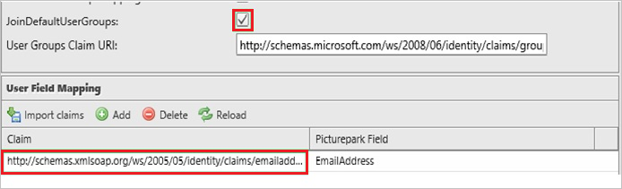
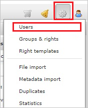

# Tutorial: Azure Active Directory integration with Picturepark

In this tutorial, you learn how to integrate Picturepark with Azure Active Directory (Azure AD).
Integrating Picturepark with Azure AD provides you with the following benefits:

* You can control in Azure AD who has access to Picturepark.
* You can enable your users to be automatically signed-in to Picturepark (Single Sign-On) with their Azure AD accounts.
* You can manage your accounts in one central location - the Azure portal.

If you want to know more details about SaaS app integration with Azure AD, see [What is application access and single sign-on with Azure Active Directory](https://docs.microsoft.com/azure/active-directory/active-directory-appssoaccess-whatis).
If you don't have an Azure subscription, [create a free account](https://azure.microsoft.com/free/) before you begin.

## Prerequisites

To configure Azure AD integration with Picturepark, you need the following items:

* An Azure AD subscription. If you don't have an Azure AD environment, you can get a [free account](https://azure.microsoft.com/free/)
* Picturepark single sign-on enabled subscription

## Scenario description

In this tutorial, you configure and test Azure AD single sign-on in a test environment.

* Picturepark supports **SP** initiated SSO

## Adding Picturepark from the gallery

To configure the integration of Picturepark into Azure AD, you need to add Picturepark from the gallery to your list of managed SaaS apps.

**To add Picturepark from the gallery, perform the following steps:**

1. In the **[Azure portal](https://portal.azure.com)**, on the left navigation panel, click **Azure Active Directory** icon.

	

2. Navigate to **Enterprise Applications** and then select the **All Applications** option.

	

3. To add new application, click **New application** button on the top of dialog.

	

4. In the search box, type **Picturepark**, select **Picturepark** from result panel then click **Add** button to add the application.

	 

## Configure and test Azure AD single sign-on

In this section, you configure and test Azure AD single sign-on with Picturepark based on a test user called **Britta Simon**.
For single sign-on to work, a link relationship between an Azure AD user and the related user in Picturepark needs to be established.

To configure and test Azure AD single sign-on with Picturepark, you need to complete the following building blocks:

1. **[Configure Azure AD Single Sign-On](#configure-azure-ad-single-sign-on)** - to enable your users to use this feature.
2. **[Configure Picturepark Single Sign-On](#configure-picturepark-single-sign-on)** - to configure the Single Sign-On settings on application side.
3. **[Create an Azure AD test user](#create-an-azure-ad-test-user)** - to test Azure AD single sign-on with Britta Simon.
4. **[Assign the Azure AD test user](#assign-the-azure-ad-test-user)** - to enable Britta Simon to use Azure AD single sign-on.
5. **[Create Picturepark test user](#create-picturepark-test-user)** - to have a counterpart of Britta Simon in Picturepark that is linked to the Azure AD representation of user.
6. **[Test single sign-on](#test-single-sign-on)** - to verify whether the configuration works.

### Configure Azure AD single sign-on

In this section, you enable Azure AD single sign-on in the Azure portal.

To configure Azure AD single sign-on with Picturepark, perform the following steps:

1. In the [Azure portal](https://portal.azure.com/), on the **Picturepark** application integration page, select **Single sign-on**.

    

2. On the **Select a Single sign-on method** dialog, select **SAML/WS-Fed** mode to enable single sign-on.

    

3. On the **Set up Single Sign-On with SAML** page, click **Edit** icon to open **Basic SAML Configuration** dialog.

	

4. On the **Basic SAML Configuration** section, perform the following steps:

    

	a. In the **Sign on URL** text box, type a URL using the following pattern: `https://<companyname>.picturepark.com`

    b. In the **Identifier (Entity ID)** text box, type a URL using the following pattern:

	|  |
	|--|
	| `https://<companyname>.current-picturepark.com`|
	| `https://<companyname>.picturepark.com`|
	| `https://<companyname>.next-picturepark.com`|
	| |

	> [!NOTE]
	> These values are not real. Update these values with the actual Sign on URL and Identifier. Contact [Picturepark Client support team](https://picturepark.com/about/contact/) to get these values. You can also refer to the patterns shown in the **Basic SAML Configuration** section in the Azure portal.

5. In the **SAML Signing Certificate** section, click **Edit** button to open **SAML Signing Certificate** dialog.

	

6. In the **SAML Signing Certificate** section, copy the **Thumbprint** and save it on your computer.

    

7. On the **Set up Picturepark** section, copy the appropriate URL(s) as per your requirement. For **Login URL**, use the value with the following pattern: `https://login.microsoftonline.com/_my_directory_id_/wsfed`

    > [!Note]
    > _my_directory_id_ is the tenant id of Azure AD subscription.

	

	a. Azure AD Identifier

	b. Logout URL

### Configure Picturepark Single Sign-On

1. In a different web browser window, sign into your Picturepark company site as an administrator.

2. In the toolbar on the top, click **Administrative tools**, and then click **Management Console**.
   
    

3. Click **Authentication**, and then click **Identity providers**.
   
    

4. In the **Identity provider configuration** section, perform the following steps:
   
    
   
    a. Click **Add**.
  
    b. Type a name for your configuration.
   
    c. Select **Set as default**.
   
    d. In **Issuer URI** textbox, paste the value of **Login URL** which you have copied from Azure portal.
   
    e. In **Trusted Issuer Thumb Print** textbox, paste the value of **Thumbprint** which you have copied from **SAML Signing Certificate** section. 

5. Click **JoinDefaultUsersGroup**.

6. To set the **Emailaddress** attribute in the **Claim** textbox, type `http://schemas.xmlsoap.org/ws/2005/05/identity/claims/emailaddress` and click **Save**.

      

### Create an Azure AD test user 

The objective of this section is to create a test user in the Azure portal called Britta Simon.

1. In the Azure portal, in the left pane, select **Azure Active Directory**, select **Users**, and then select **All users**.

    

2. Select **New user** at the top of the screen.

    

3. In the User properties, perform the following steps.

    

    a. In the **Name** field enter **BrittaSimon**.
  
    b. In the **User name** field type `brittasimon@yourcompanydomain.extension`. For example, BrittaSimon@contoso.com

    c. Select **Show password** check box, and then write down the value that's displayed in the Password box.

    d. Click **Create**.

### Assign the Azure AD test user

In this section, you enable Britta Simon to use Azure single sign-on by granting access to Picturepark.

1. In the Azure portal, select **Enterprise Applications**, select **All applications**, then select **Picturepark**.

	

2. In the applications list, select **Picturepark**.

	

3. In the menu on the left, select **Users and groups**.

    

4. Click the **Add user** button, then select **Users and groups** in the **Add Assignment** dialog.

    

5. In the **Users and groups** dialog select **Britta Simon** in the Users list, then click the **Select** button at the bottom of the screen.

6. If you are expecting any role value in the SAML assertion then in the **Select Role** dialog select the appropriate role for the user from the list, then click the **Select** button at the bottom of the screen.

7. In the **Add Assignment** dialog click the **Assign** button.

### Create Picturepark test user

In order to enable Azure AD users to sign into Picturepark, they must be provisioned into Picturepark. In the case of Picturepark, provisioning is a manual task.

**To provision a user account, perform the following steps:**

1. Sign in to your **Picturepark** tenant.

1. In the toolbar on the top, click **Administrative tools**, and then click **Users**.
   
    

1. In the **Users overview** tab, click **New**.
   
    

1. On the **Create User** dialog, perform the following steps of a valid Azure Active Directory User you want to provision:
   
    
   
    a. In the **Email Address** textbox, type the **email address** of the user `BrittaSimon@contoso.com`.  
   
    b. In the **Password** and **Confirm Password** textboxes, type the **password** of BrittaSimon. 
   
    c. In the **First Name** textbox, type the **First Name** of the user **Britta**. 
   
    d. In the **Last Name** textbox, type the **Last Name** of the user **Simon**.
   
    e. In the **Company** textbox, type the **Company name** of the user. 
   
    f. In the **Country** textbox, select the **Country/Region** of the user.
  
    g. In the **ZIP** textbox, type the **ZIP code** of the city.
   
    h. In the **City** textbox, type the **City name** of the user.

    i. Select a **Language**.
   
    j. Click **Create**.

>[!NOTE]
>You can use any other Picturepark user account creation tools or APIs provided by Picturepark to provision Azure AD user accounts.
>

### Test single sign-on 

In this section, you test your Azure AD single sign-on configuration using the Access Panel.

When you click the Picturepark tile in the Access Panel, you should be automatically signed in to the Picturepark for which you set up SSO. For more information about the Access Panel, see [Introduction to the Access Panel](https://docs.microsoft.com/azure/active-directory/active-directory-saas-access-panel-introduction).

## Additional Resources

- [List of Tutorials on How to Integrate SaaS Apps with Azure Active Directory](https://docs.microsoft.com/azure/active-directory/active-directory-saas-tutorial-list)

- [What is application access and single sign-on with Azure Active Directory?](https://docs.microsoft.com/azure/active-directory/active-directory-appssoaccess-whatis)

- [What is Conditional Access in Azure Active Directory?](https://docs.microsoft.com/azure/active-directory/conditional-access/overview)

