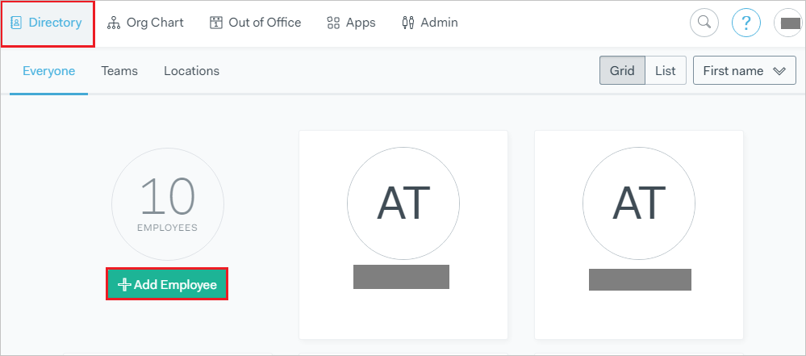

# Tutorial: Azure Active Directory integration with Pingboard

In this tutorial, you learn how to integrate Pingboard with Azure Active Directory (Azure AD).
Integrating Pingboard with Azure AD provides you with the following benefits:

* You can control in Azure AD who has access to Pingboard.
* You can enable your users to be automatically signed-in to Pingboard (Single Sign-On) with their Azure AD accounts.
* You can manage your accounts in one central location - the Azure portal.

If you want to know more details about SaaS app integration with Azure AD, see [What is application access and single sign-on with Azure Active Directory](https://docs.microsoft.com/azure/active-directory/active-directory-appssoaccess-whatis).
If you don't have an Azure subscription, [create a free account](https://azure.microsoft.com/free/) before you begin.

## Prerequisites

To configure Azure AD integration with Pingboard, you need the following items:

* An Azure AD subscription. If you don't have an Azure AD environment, you can get one-month trial [here](https://azure.microsoft.com/pricing/free-trial/)
* Pingboard single sign-on enabled subscription

## Scenario description

In this tutorial, you configure and test Azure AD single sign-on in a test environment.

* Pingboard supports **SP** and **IDP** initiated SSO

* Pingboard supports [Automated user provisioning](https://docs.microsoft.com/azure/active-directory/saas-apps/pingboard-provisioning-tutorial) 

## Adding Pingboard from the gallery

To configure the integration of Pingboard into Azure AD, you need to add Pingboard from the gallery to your list of managed SaaS apps.

**To add Pingboard from the gallery, perform the following steps:**

1. In the **[Azure portal](https://portal.azure.com)**, on the left navigation panel, click **Azure Active Directory** icon.

	

2. Navigate to **Enterprise Applications** and then select the **All Applications** option.

	

3. To add new application, click **New application** button on the top of dialog.

	

4. In the search box, type **Pingboard**, select **Pingboard** from result panel then click **Add** button to add the application.

	 

## Configure and test Azure AD single sign-on

In this section, you configure and test Azure AD single sign-on with Pingboard based on a test user called **Britta Simon**.
For single sign-on to work, a link relationship between an Azure AD user and the related user in Pingboard needs to be established.

To configure and test Azure AD single sign-on with Pingboard, you need to complete the following building blocks:

1. **[Configure Azure AD Single Sign-On](#configure-azure-ad-single-sign-on)** - to enable your users to use this feature.
2. **[Configure Pingboard Single Sign-On](#configure-pingboard-single-sign-on)** - to configure the Single Sign-On settings on application side.
3. **[Create an Azure AD test user](#create-an-azure-ad-test-user)** - to test Azure AD single sign-on with Britta Simon.
4. **[Assign the Azure AD test user](#assign-the-azure-ad-test-user)** - to enable Britta Simon to use Azure AD single sign-on.
5. **[Create Pingboard test user](#create-pingboard-test-user)** - to have a counterpart of Britta Simon in Pingboard that is linked to the Azure AD representation of user.
6. **[Test single sign-on](#test-single-sign-on)** - to verify whether the configuration works.

### Configure Azure AD single sign-on

In this section, you enable Azure AD single sign-on in the Azure portal.

To configure Azure AD single sign-on with Pingboard, perform the following steps:

1. In the [Azure portal](https://portal.azure.com/), on the **Pingboard** application integration page, select **Single sign-on**.

    

2. On the **Select a Single sign-on method** dialog, select **SAML/WS-Fed** mode to enable single sign-on.

    

3. On the **Set up Single Sign-On with SAML** page, click **Edit** icon to open **Basic SAML Configuration** dialog.

	

4. On the **Basic SAML Configuration** section, if you wish to configure the application in **IDP** initiated mode, perform the following steps:

    

    a. In the **Identifier** text box, type a URL:
    `http://app.pingboard.com/sp`

    b. In the **Reply URL** text box, type a URL using the following pattern:
    `https://<entity-id>.pingboard.com/auth/saml/consume`

5. Click **Set additional URLs** and perform the following step if you wish to configure the application in **SP** initiated mode:

    

    In the **Sign-on URL** text box, type a URL using the following pattern:
    `https://<sub-domain>.pingboard.com/sign_in`

	> [!NOTE]
	> These values are not real. Update these values with the actual Reply URL and Sign-on URL. Contact [Pingboard Client support team](https://support.pingboard.com/) to get these values. You can also refer to the patterns shown in the **Basic SAML Configuration** section in the Azure portal.

6. On the **Set up Single Sign-On with SAML** page, in the **SAML Signing Certificate** section, click **Download** to download the **Federation Metadata XML** from the given options as per your requirement and save it on your computer.

	

7. On the **Set up Pingboard** section, copy the appropriate URL(s) as per your requirement.

	

	a. Login URL

	b. Azure AD Identifier

	c. Logout URL

### Configure Pingboard Single Sign-On

1. To configure SSO on Pingboard side, open a new browser window and sign in to your Pingboard Account. You must be a Pingboard admin to set up single sign on.

2. From the top menu,, select **Apps > Integrations**

	

3. On the **Integrations** page, find the **"Azure Active Directory"** tile, and click it.

	

4. In the modal that follows click **"Configure"**

	

5. On the following page, you notice that "Azure SSO Integration is enabled". Open the downloaded Metadata XML file in a notepad and paste the content in **IDP Metadata**.

	

6. The file is validated, and if everything is correct, single sign-on will now be enabled.

### Create an Azure AD test user 

The objective of this section is to create a test user in the Azure portal called Britta Simon.

1. In the Azure portal, in the left pane, select **Azure Active Directory**, select **Users**, and then select **All users**.

    

2. Select **New user** at the top of the screen.

    

3. In the User properties, perform the following steps.

    

    a. In the **Name** field enter **BrittaSimon**.
  
    b. In the **User name** field type brittasimon@yourcompanydomain.extension. For example, BrittaSimon@contoso.com

    c. Select **Show password** check box, and then write down the value that's displayed in the Password box.

    d. Click **Create**.

### Assign the Azure AD test user

In this section, you enable Britta Simon to use Azure single sign-on by granting access to Pingboard.

1. In the Azure portal, select **Enterprise Applications**, select **All applications**, then select **Pingboard**.

	

2. In the applications list, select **Pingboard**.

	

3. In the menu on the left, select **Users and groups**.

    

4. Click the **Add user** button, then select **Users and groups** in the **Add Assignment** dialog.

    

5. In the **Users and groups** dialog select **Britta Simon** in the Users list, then click the **Select** button at the bottom of the screen.

6. If you are expecting any role value in the SAML assertion then in the **Select Role** dialog select the appropriate role for the user from the list, then click the **Select** button at the bottom of the screen.

7. In the **Add Assignment** dialog click the **Assign** button.

### Create Pingboard test user

The objective of this section is to create a user called Britta Simon in Pingboard. Pingboard supports automatic user provisioning, which is by default enabled. You can find more details [here](pingboard-provisioning-tutorial.md) on how to configure automatic user provisioning.

**If you need to create user manually, perform following steps:**

1. Sign in to your Pingboard company site as an administrator.

2. Click **“Add Employee”** button on **Directory** page.

    

3. On the **“Add Employee”** dialog page, perform the following steps:

	

	a. In the **Full Name** textbox, type the full name of user like **Britta Simon**.

	b. In the **Email** textbox, type the email address of user like **brittasimon@contoso.com**.

	c. In the **Job Title** textbox, type the job title of Britta Simon.

	d. In the **Location** dropdown, select the location  of Britta Simon.

	e. Click **Add**.

4. A confirmation screen comes up to confirm the addition of user.

	

	> [!NOTE]
    > The Azure Active Directory account holder receives an email and follows a link to confirm their account before it becomes active.

### Test single sign-on 

In this section, you test your Azure AD single sign-on configuration using the Access Panel.

When you click the Pingboard tile in the Access Panel, you should be automatically signed in to the Pingboard for which you set up SSO. For more information about the Access Panel, see [Introduction to the Access Panel](https://docs.microsoft.com/azure/active-directory/active-directory-saas-access-panel-introduction).

## Additional Resources

- [List of Tutorials on How to Integrate SaaS Apps with Azure Active Directory](https://docs.microsoft.com/azure/active-directory/active-directory-saas-tutorial-list)

- [What is application access and single sign-on with Azure Active Directory?](https://docs.microsoft.com/azure/active-directory/active-directory-appssoaccess-whatis)

- [What is Conditional Access in Azure Active Directory?](https://docs.microsoft.com/azure/active-directory/conditional-access/overview)

- [Configure User Provisioning](https://docs.microsoft.com/azure/active-directory/saas-apps/pingboard-provisioning-tutorial)
