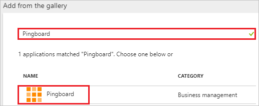
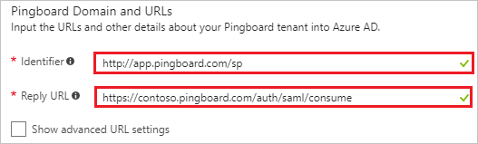
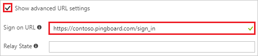
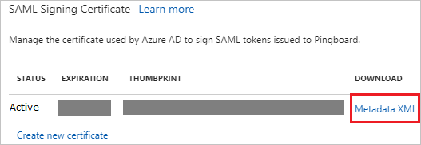
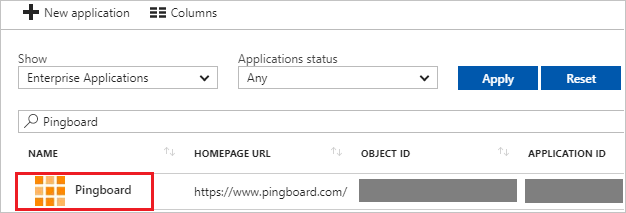

---
title: 'Tutorial: Azure Active Directory integration with Pingboard | Microsoft Docs'
description: Learn how to configure single sign-on between Azure Active Directory and Pingboard.
services: active-directory
documentationCenter: na
author: jeevansd
manager: mtillman
ms.reviewer: joflore

ms.assetid: 28acce3e-22a0-4a37-8b66-6e518d777350
ms.service: active-directory
ms.component: saas-app-tutorial
ms.workload: identity
ms.tgt_pltfrm: na
ms.devlang: na
ms.topic: article
ms.date: 05/15/2018
ms.author: jeedes

---
# Tutorial: Azure Active Directory integration with Pingboard

In this tutorial, you learn how to integrate Pingboard with Azure Active Directory (Azure AD).

Integrating Pingboard with Azure AD provides you with the following benefits:

- You can control in Azure AD who has access to Pingboard
- You can enable your users to automatically get signed-on to Pingboard (Single Sign-On) with their Azure AD accounts
- You can manage your accounts in one central location - the Azure portal

If you want to know more details about SaaS app integration with Azure AD, see [what is application access and single sign-on with Azure Active Directory](../manage-apps/what-is-single-sign-on.md).

## Prerequisites

To configure Azure AD integration with Pingboard, you need the following items:

- An Azure AD subscription
- A Pingboard single sign-on enabled subscription

> [!NOTE]
> To test the steps in this tutorial, we do not recommend using a production environment.

To test the steps in this tutorial, you should follow these recommendations:

- Do not use your production environment, unless it is necessary.
- If you don't have an Azure AD trial environment, you can [get a one-month trial](https://azure.microsoft.com/pricing/free-trial/).

## Scenario description
In this tutorial, you test Azure AD single sign-on in a test environment. 
The scenario outlined in this tutorial consists of two main building blocks:

1. Adding Pingboard from the gallery
1. Configuring and testing Azure AD single sign-on

## Adding Pingboard from the gallery
To configure the integration of Pingboard into Azure AD, you need to add Pingboard from the gallery to your list of managed SaaS apps.

**To add Pingboard from the gallery, perform the following steps:**

1. In the **[Azure portal](https://portal.azure.com)**, on the left navigation panel, click **Azure Active Directory** icon. 

	![The Azure Active Directory button][1]

1. Navigate to **Enterprise applications**. Then go to **All applications**.

	![The Enterprise applications][2]

1. Click **Add** button on the top of the dialog.

	![The New application button][3]

1. In the search box, type **Pingboard**, select **Pingboard** from result panel and then click **Add** button to add the application.

	

## Configure and test Azure AD single sign-on

In this section, you configure and test Azure AD single sign-on with Pingboard based on a test user called "Britta Simon".

For single sign-on to work, Azure AD needs to know what the counterpart user in Pingboard is to a user in Azure AD. In other words, a link relationship between an Azure AD user and the related user in Pingboard needs to be established.

This link relationship is established by assigning the value of the **user name** in Azure AD as the value of the **Username** in Pingboard.

To configure and test Azure AD single sign-on with Pingboard, you need to complete the following building blocks:

1. **[Configure Azure AD Single Sign-On](#configure-azure-ad-single-sign-on)** - to enable your users to use this feature.
1. **[Create an Azure AD test user](#create-an-azure-ad-test-user)** - to test Azure AD single sign-on with Britta Simon.
1. **[Create a Pingboard test user](#create-a-pingboard-test-user)** - to have a counterpart of Britta Simon in Pingboard that is linked to the Azure AD representation of user.
1. **[Assign the Azure AD test user](#assign-the-azure-ad-test-user)** - to enable Britta Simon to use Azure AD single sign-on.
1. **[Test single sign-on](#test-single-sign-on)** - to verify whether the configuration works.

### Configure Azure AD single sign-on

In this section, you enable Azure AD single sign-on in the Azure portal and configure single sign-on in your Pingboard application.

**To configure Azure AD single sign-on with Pingboard, perform the following steps:**

1. In the Azure portal, on the **Pingboard** application integration page, click **Single sign-on**.

	![Configure single sign-on link][4]

1.  On the **Single sign-on** dialog, select **Mode** as **SAML-based Sign-on** to enable single sign-on.

	

1. On the **Pingboard Domain and URLs** section, perform the following steps if you wish to configure the application in **IDP** initiated mode:

	

    a. In the **Identifier** textbox, type the value as: `http://app.pingboard.com/sp`

	b. In the **Reply URL** textbox, type a URL using the following pattern: `https://<entity-id>.pingboard.com/auth/saml/consume`

1. Check **Show advanced URL settings**, if you wish to configure the application in **SP** initiated mode:

	

     In the **Sign-on URL** textbox, type the URL using the following pattern: `https://<sub-domain>.pingboard.com/sign_in`

	> [!NOTE]
	> Please note that these values are not real. Update these values with the actual Reply URL and Sign-On URL. Contact [Pingboard Client support team](https://support.pingboard.com/) to get these values.

1. On the **SAML Signing Certificate** section, click **Metadata XML** and then save the XML file on your computer.

	

1. Click **Save** button.

	

1. To configure SSO on Pingboard side, open a new browser window and log in to your Pingboard Account. You must be a Pingboard admin to set up single sign on.

1. From the top menu,, select **Apps > Integrations**

	

1. On the **Integrations** page, find the **"Azure Active Directory"** tile, and click it.

	

1. In the modal that follows click **"Configure"**

	

1. On the following page, you notice that "Azure SSO Integration is enabled". Open the downloaded Metadata XML file in a notepad and paste the content in **IDP Metadata**.

	

1. The file is validated, and if everything is correct, single sign-on will now be enabled.

### Create an Azure AD test user

The objective of this section is to create a test user in the Azure portal called Britta Simon.

![Create an Azure AD test user][100]

**To create a test user in Azure AD, perform the following steps:**

1. In the **Azure portal**, on the left navigation pane, click **Azure Active Directory** icon.

	 

1. To display the list of users, go to **Users and groups** and click **All users**.

	

1. At the top of the dialog, click **Add** to open the **User** dialog.

	 

1. On the **User** dialog page, perform the following steps:

	

    a. In the **Name** textbox, type **BrittaSimon**.

    b. In the **User name** textbox, type the **email address** of BrittaSimon.

	c. Select **Show Password** and write down the value of the **Password**.

    d. Click **Create**.

### Create a Pingboard test user

The objective of this section is to create a user called Britta Simon in Pingboard. Pingboard supports automatic user provisioning, which is by default enabled. You can find more details [here](pingboard-provisioning-tutorial.md) on how to configure automatic user provisioning.

**If you need to create user manually, perform following steps:**

1. Log in to your Pingboard company site as an administrator.

1. Click **“Add Employee”** button on **Directory** page.

    

1. On the **“Add Employee”** dialog page, perform the following steps:

	

	a. In the **Full Name** textbox, type the full name of user like **Britta Simon**.

	b. In the **Email** textbox, type the email address of user like **brittasimon@contoso.com**.

	c. In the **Job Title** textbox, type the job title of Britta Simon.

	d. In the **Location** dropdown, select the location  of Britta Simon.

	e. Click **Add**.

1. A confirmation screen comes up to confirm the addition of user.

	

	> [!NOTE]
    > The Azure Active Directory account holder receives an email and follows a link to confirm their account before it becomes active.

### Assign the Azure AD test user

In this section, you enable Britta Simon to use Azure single sign-on by granting access to Pingboard.

![Assign User][200] 

**To assign Britta Simon to Pingboard, perform the following steps:**

1. In the Azure portal, open the applications view, and then navigate to the directory view and go to **Enterprise applications** then click **All applications**.

	![Assign User][201] 

1. In the applications list, select **Pingboard**.

	 

1. In the menu on the left, click **Users and groups**.

	![The "Users and groups" link][202] 

1. Click **Add** button. Then select **Users and groups** on **Add Assignment** dialog.

	![The Add Assignment pane][203]

1. On **Users and groups** dialog, select **Britta Simon** in the Users list.

1. Click **Select** button on **Users and groups** dialog.

1. Click **Assign** button on **Add Assignment** dialog.
	
### Test single sign-on

In this section, you test your Azure AD single sign-on configuration using the Access Panel.
For more information about the Access Panel, see [Introduction to the Access Panel](../user-help/active-directory-saas-access-panel-introduction.md).

When you click the Pingboard tile in the Access Panel, you should get automatically signed-on to your Pingboard application.

## Additional resources

* [List of Tutorials on How to Integrate SaaS Apps with Azure Active Directory](tutorial-list.md)
* [What is application access and single sign-on with Azure Active Directory?](../manage-apps/what-is-single-sign-on.md)
* [Configure User Provisioning](pingboard-provisioning-tutorial.md)

<!--Image references-->

[1]: ./media/pingboard-tutorial/tutorial_general_01.png
[2]: ./media/pingboard-tutorial/tutorial_general_02.png
[3]: ./media/pingboard-tutorial/tutorial_general_03.png
[4]: ./media/pingboard-tutorial/tutorial_general_04.png

[100]: ./media/pingboard-tutorial/tutorial_general_100.png

[200]: ./media/pingboard-tutorial/tutorial_general_200.png
[201]: ./media/pingboard-tutorial/tutorial_general_201.png
[202]: ./media/pingboard-tutorial/tutorial_general_202.png
[203]: ./media/pingboard-tutorial/tutorial_general_203.png