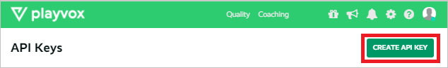
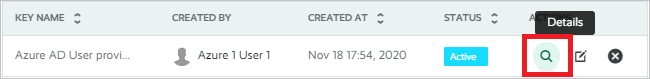
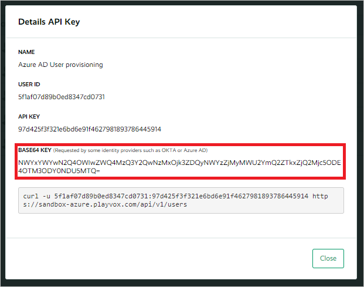

# Tutorial: Configure Playvox for automatic user provisioning

This tutorial describes the steps to follow in both Playvox and Microsoft Entra ID to configure automatic user provisioning. When configured, Microsoft Entra ID automatically provisions and de-provisions users or groups to [Playvox](https://www.playvox.com) by using the Microsoft Entra provisioning service. For important details on what this service does and how it works, and for frequently asked questions, see [Automate user provisioning and deprovisioning to SaaS applications with Microsoft Entra ID](../app-provisioning/user-provisioning.md).

## Capabilities supported
> [!div class="checklist"]
> * Create users in Playvox.
> * Remove users in Playvox when they don't need access anymore.
> * Keep user attributes synchronized between Microsoft Entra ID and Playvox.

## Prerequisites

The scenario in this tutorial assumes that you already have the following prerequisites:

* [A Microsoft Entra tenant](../develop/quickstart-create-new-tenant.md).
* A user account in Microsoft Entra ID with [permission](../roles/permissions-reference.md) to configure provisioning. For example, an account might have the Application Administrator, Cloud Application Administrator, Application Owner, or Global Administrator role.
* A user account in [Playvox](https://www.playvox.com) with Super Admin permissions.

## Step 1: Plan your provisioning deployment

1. Learn [how the provisioning service works](../app-provisioning/user-provisioning.md).

2. Determine who will be [in scope for provisioning](../app-provisioning/define-conditional-rules-for-provisioning-user-accounts.md).

3. Determine what data to [map between Microsoft Entra ID and Playvox](../app-provisioning/customize-application-attributes.md).

## Step 2: Configure Playvox to support provisioning by using Microsoft Entra ID

1. Log in to the Playvox admin console and go to **Settings > API Keys**.

2. Select **Create API Key**.

    

3. Enter a meaningful name for the API key, and then select **Save**. After the API key is generated, select **Close**.

4. On the API key that you created, select the **Details** icon.

    

5. Copy and save the **BASE64 KEY** value. Later, in the Azure portal, you'll enter this value in the **Secret Token** text box in the **Provisioning** tab of your Playvox application.

    

## Step 3: Add Playvox from the Microsoft Entra application gallery

To start to manage provisioning to Playvox, add Playvox to your Microsoft Entra tenant from the application gallery. To learn more, see [Quickstart: Add an application to your Microsoft Entra tenant](../manage-apps/add-application-portal.md).

If you've previously set up Playvox for single sign-on (SSO), you can use the same application. However, we recommend that you create a separate app when testing the integration initially.

## Step 4: Define who will be in scope for provisioning

You use the Microsoft Entra provisioning service to scope who will be provisioned, based either on assignment to the application or on attributes of the user or group. To scope who will be provisioned to your app based on assignment, see [Manage user assignment for an app in Microsoft Entra ID](../manage-apps/assign-user-or-group-access-portal.md) to learn how to assign users or groups to the application. To scope who will be provisioned based solely on attributes of the user or group, use a scoping filter as described in [Attribute-based application provisioning with scoping filters](../app-provisioning/define-conditional-rules-for-provisioning-user-accounts.md).

Remember these points:

* When assigning users to Playvox, you must select a role other than Default Access. Users with the Default Access role are excluded from provisioning and will be marked as not effectively entitled in the provisioning logs. If Default Access is the only role available on the application, you can [update the application manifest](../develop/howto-add-app-roles-in-azure-ad-apps.md) to add other roles.

* Start small. Test with a small set of users or groups before rolling out to everyone. When provisioning scope is based on assigned users or groups, you can control the size of the set by assigning only one or two users or groups to the app. When provisioning scope includes all users and groups, you can specify an [attribute-based scoping filter](../app-provisioning/define-conditional-rules-for-provisioning-user-accounts.md) to limit the size of your test set.

## Step 5: Configure automatic user provisioning to Playvox

This section guides you through the steps to configure the Microsoft Entra provisioning service to create, update, and disable users or groups, based on user or group assignments in Microsoft Entra ID.

To configure automatic user provisioning for Playvox in Microsoft Entra ID:

1. Sign in to the [Microsoft Entra admin center](https://entra.microsoft.com) as at least a [Cloud Application Administrator](../roles/permissions-reference.md#cloud-application-administrator).
1. Browse to **Identity** > **Applications** > **Enterprise applications**.

    

2. In the applications list, search for and select **Playvox**.

    

3. Select the **Provisioning** tab.

    

4. Set the **Provisioning Mode** to **Automatic**.

    

5. In the **Admin Credentials** section, enter your Playvox **Tenant URL** as:

    `https://{tenant}.playvox.com/scim/v1`

    Enter the **Secret Token** that you copied earlier in Step 2. Then, select **Test Connection** to ensure that Microsoft Entra ID can connect to Playvox. If the connection fails, make sure your Playvox account has Admin permissions and try again.

    

6. In the **Notification Email** text box, enter the email address of a person or group who will receive the provisioning error notifications. Then, select the **Send an email notification when a failure occurs** check box.

    

7. Select **Save**.

8. In the **Mappings** section, select **Synchronize Microsoft Entra users to Playvox**.

9. Review the user attributes that are synchronized from Microsoft Entra ID to Playvox in the **Attribute-Mapping** section. The attributes selected as **Matching** properties are used to match the user accounts in Playvox for update operations. If you choose to change the [matching target attribute](../app-provisioning/customize-application-attributes.md), make sure that the Playvox API supports filtering users based on that attribute. Select **Save** to commit any changes.

   |Attribute|Type|Supported for filtering|
   |---|---|---|
   |userName|String|&check;|
   |active|Boolean|
   |displayName|String|
   |emails[type eq "work"].value|String|
   |name.givenName|String|
   |name.familyName|String|
   |name.formatted|String|
   |externalId|String|

10. To configure scoping filters, see the instructions in the [Scoping filter tutorial](../app-provisioning/define-conditional-rules-for-provisioning-user-accounts.md).

11. To enable the Microsoft Entra provisioning service for Playvox, change the **Provisioning Status** to **On** in the **Settings** section.

    

12. Still in **Settings**, define the users or groups to provision to Playvox by choosing the values you want in **Scope**.

    

13. When you're ready to provision, select **Save**.

    

This operation starts the initial synchronization cycle of all users and groups defined in **Scope** in the **Settings** section. The initial cycle takes longer than later cycles. Later cycles occur approximately every 40 minutes, provided that the Microsoft Entra provisioning service is running.

## Step 6: Monitor your deployment

After you've configured provisioning, use the following resources to monitor your deployment:

* Use the [provisioning logs](../reports-monitoring/concept-provisioning-logs.md) to determine which users have been provisioned successfully or unsuccessfully.
* Check the [progress bar](../app-provisioning/application-provisioning-when-will-provisioning-finish-specific-user.md) to see the status of the provisioning cycle and how close it is to completion.
* If the provisioning configuration seems to be in an unhealthy state, the application will go into quarantine. To learn more about quarantine states, see [Application provisioning in quarantine status](../app-provisioning/application-provisioning-quarantine-status.md).

## Additional resources

* [Managing user account provisioning for enterprise apps](../app-provisioning/configure-automatic-user-provisioning-portal.md)
* [What is application access and single sign-on with Microsoft Entra ID?](../manage-apps/what-is-single-sign-on.md)

## Next steps

* [Learn how to review logs and get reports on provisioning activity](../app-provisioning/check-status-user-account-provisioning.md)
