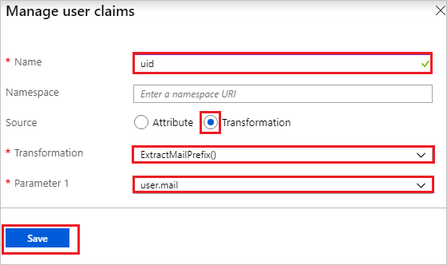
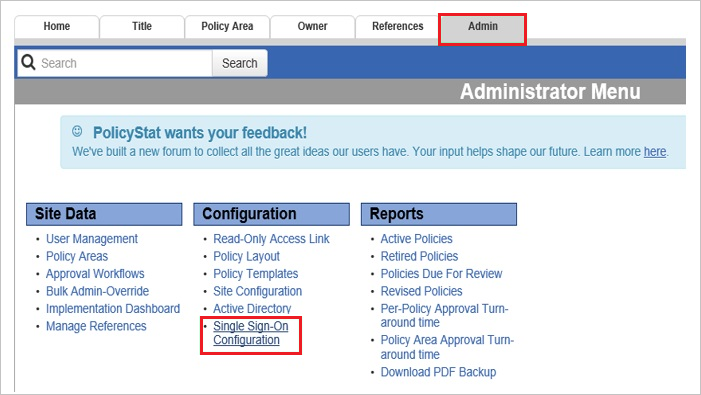

# Tutorial: Azure Active Directory integration with PolicyStat

In this tutorial, you learn how to integrate PolicyStat with Azure Active Directory (Azure AD).
Integrating PolicyStat with Azure AD provides you with the following benefits:

* You can control in Azure AD who has access to PolicyStat.
* You can enable your users to be automatically signed-in to PolicyStat (Single Sign-On) with their Azure AD accounts.
* You can manage your accounts in one central location - the Azure portal.

If you want to know more details about SaaS app integration with Azure AD, see [What is application access and single sign-on with Azure Active Directory](../manage-apps/what-is-single-sign-on.md).
If you don't have an Azure subscription, [create a free account](https://azure.microsoft.com/free/) before you begin.

## Prerequisites

To configure Azure AD integration with PolicyStat, you need the following items:

* An Azure AD subscription. If you don't have an Azure AD environment, you can get one-month trial [here](https://azure.microsoft.com/pricing/free-trial/)
* PolicyStat single sign-on enabled subscription

> [!NOTE]
> This integration is also available to use from Azure AD US Government Cloud environment. You can find this application in the Azure AD US Government Cloud Application Gallery and configure it in the same way as you do from public cloud.

## Scenario description

In this tutorial, you configure and test Azure AD single sign-on in a test environment.

* PolicyStat supports **SP** initiated SSO

* PolicyStat supports **Just In Time** user provisioning

## Adding PolicyStat from the gallery

To configure the integration of PolicyStat into Azure AD, you need to add PolicyStat from the gallery to your list of managed SaaS apps.

**To add PolicyStat from the gallery, perform the following steps:**

1. In the **[Azure portal](https://portal.azure.com)**, on the left navigation panel, click **Azure Active Directory** icon.

	

2. Navigate to **Enterprise Applications** and then select the **All Applications** option.

	

3. To add new application, click **New application** button on the top of dialog.

	

4. In the search box, type **PolicyStat**, select **PolicyStat** from result panel then click **Add** button to add the application.

	 

## Configure and test Azure AD single sign-on

In this section, you configure and test Azure AD single sign-on with PolicyStat based on a test user called **Britta Simon**.
For single sign-on to work, a link relationship between an Azure AD user and the related user in PolicyStat needs to be established.

To configure and test Azure AD single sign-on with PolicyStat, you need to complete the following building blocks:

1. **[Configure Azure AD Single Sign-On](#configure-azure-ad-single-sign-on)** - to enable your users to use this feature.
2. **[Configure PolicyStat Single Sign-On](#configure-policystat-single-sign-on)** - to configure the Single Sign-On settings on application side.
3. **[Assign the Azure AD test user](#assign-the-azure-ad-test-user)** - to enable Britta Simon to use Azure AD single sign-on.
4. **[Create PolicyStat test user](#create-policystat-test-user)** - to have a counterpart of Britta Simon in PolicyStat that is linked to the Azure AD representation of user.
5. **[Test single sign-on](#test-single-sign-on)** - to verify whether the configuration works.

### Configure Azure AD single sign-on

In this section, you enable Azure AD single sign-on in the Azure portal.

To configure Azure AD single sign-on with PolicyStat, perform the following steps:

1. In the [Azure portal](https://portal.azure.com/), on the **PolicyStat** application integration page, select **Single sign-on**.

    

2. On the **Select a Single sign-on method** dialog, select **SAML/WS-Fed** mode to enable single sign-on.

    

3. On the **Set up Single Sign-On with SAML** page, click **Edit** icon to open **Basic SAML Configuration** dialog.

	

4. On the **Basic SAML Configuration** section, perform the following steps:

    

	a. In the **Sign on URL** text box, type a URL using the following pattern:
    `https://<companyname>.policystat.com`

    b. In the **Identifier (Entity ID)** text box, type a URL using the following pattern:
    `https://<companyname>.policystat.com/saml2/metadata/`

	> [!NOTE]
	> These values are not real. Update these values with the actual Sign on URL and Identifier. Contact [PolicyStat Client support team](https://rldatix.com/services-support/support) to get these values. You can also refer to the patterns shown in the **Basic SAML Configuration** section in the Azure portal.

4. On the **Set up Single Sign-On with SAML** page, in the **SAML Signing Certificate** section, click **Download** to download the **Federation Metadata XML** from the given options as per your requirement and save it on your computer.

	

5. Your PolicyStat application expects the SAML assertions in a specific format, which requires you to add custom attribute mappings to your SAML token attributes configuration. The following screenshot shows the list of default attributes. Click **Edit** icon to open **User Attributes** dialog.

	

6. In addition to above, PolicyStat application expects few more attributes to be passed back in SAML response. In the **User Claims** section on the **User Attributes** dialog, perform the following steps to add SAML token attribute as shown in the below table:

	| Name | Source Attribute |
	|------------------- | -------------------- |
	| uid | ExtractMailPrefix([mail]) |

	a. Click **Add new claim** to open the **Manage user claims** dialog.
	
	

	

	b. In the **Name** textbox, type the attribute name shown for that row.

	c. Leave the **Namespace** blank.

	d. Select Source as **Transformation**.

	e. From the **Transformation** list, type the attribute value shown for that row.
	
	f. From the **Parameter 1** list, type the attribute value shown for that row.

	g. Click **Save**.

7. On the **Set up PolicyStat** section, copy the appropriate URL(s) as per your requirement.

	

	a. Login URL

	b. Azure AD Identifier

	c. Logout URL

### Configure PolicyStat Single Sign-On

1. In a different web browser window, log into your PolicyStat company site as an administrator.

2. Click the **Admin** tab, and then click **Single Sign-On Configuration** in left navigation pane.
   
    

3. Click **Your IDP Metadata**, and then, in the **Your IDP Metadata** section, perform the following steps:
   
    
   
    a. Open your downloaded metadata file, copy the content, and  then paste it into the **Your Identity Provider Metadata** textbox.

    b. Click **Save Changes**.

4. Click **Configure Attributes**, and then, in the **Configure Attributes** section, perform the following steps:
   
    a. In the **Username Attribute** textbox, type **uid**.

    b. In the **First Name Attribute** textbox, type your First Name Attribute claim name from Azure **`http://schemas.xmlsoap.org/ws/2005/05/identity/claims/givenname`**.

    c. In the **Last Name Attribute** textbox, type your Last Name Attribute claim name from Azure **`http://schemas.xmlsoap.org/ws/2005/05/identity/claims/surname`**.

    d. In the **Email Attribute** textbox, type your Email Attribute claim name from Azure **`http://schemas.xmlsoap.org/ws/2005/05/identity/claims/emailaddress`**.

    e. Click **Save Changes**.

5. In the **Setup** section, select **Enable Single Sign-on Integration**.
   
    

### Assign the Azure AD test user

In this section, you enable your own account to use Azure single sign-on by granting access to PolicyStat.

1. In the Azure portal, select **Enterprise Applications**, select **All applications**, then select **PolicyStat**.

	

2. In the applications list, select **PolicyStat**.

	

3. In the menu on the left, select **Users and groups**.

    

4. Click the **Add user** button, then select **Users and groups** in the **Add Assignment** dialog.

    

5. In the **Users and groups** dialog select your account in the Users list, then click the **Select** button at the bottom of the screen.

6. If you are expecting any role value in the SAML assertion then in the **Select Role** dialog select the appropriate role for the user from the list, then click the **Select** button at the bottom of the screen.

7. In the **Add Assignment** dialog click the **Assign** button.

### Create PolicyStat test user

In this section, a user called Britta Simon is created in PolicyStat. PolicyStat supports just-in-time user provisioning, which is enabled by default. There is no action item for you in this section. If a user doesn't already exist in PolicyStat, a new one is created after authentication.

>[!NOTE]
>You can use any other PolicyStat user account creation tools or APIs provided by PolicyStat to provision Azure AD user accounts.

### Test single sign-on 

In this section, you test your Azure AD single sign-on configuration using the Access Panel.

When you click the PolicyStat tile in the Access Panel, you should be automatically signed in to the PolicyStat for which you set up SSO. For more information about the Access Panel, see [Introduction to the Access Panel](../user-help/my-apps-portal-end-user-access.md).

## Additional Resources

- [List of Tutorials on How to Integrate SaaS Apps with Azure Active Directory](./tutorial-list.md)

- [What is application access and single sign-on with Azure Active Directory?](../manage-apps/what-is-single-sign-on.md)

- [What is Conditional Access in Azure Active Directory?](../conditional-access/overview.md)
