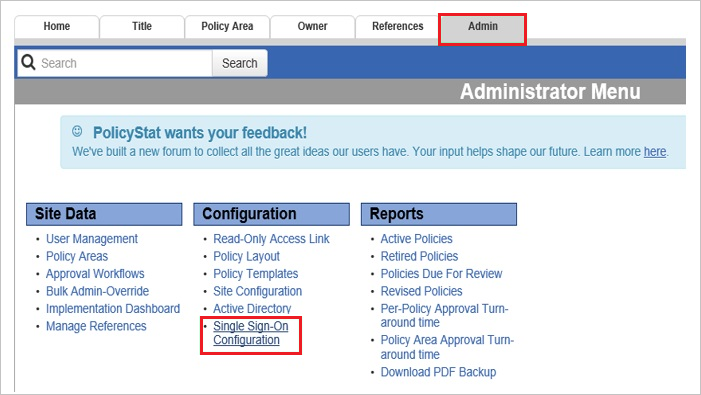
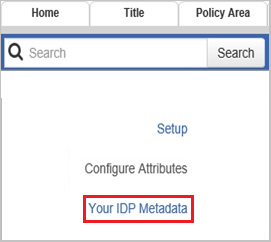
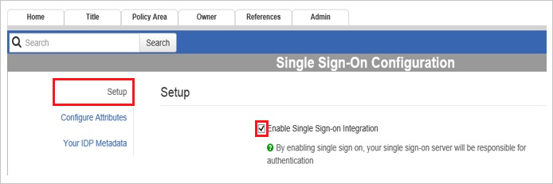

# Tutorial: Azure AD SSO integration with PolicyStat

In this tutorial, you'll learn how to integrate PolicyStat with Azure Active Directory (Azure AD). When you integrate PolicyStat with Azure AD, you can:

* Control in Azure AD who has access to PolicyStat.
* Enable your users to be automatically signed-in to PolicyStat with their Azure AD accounts.
* Manage your accounts in one central location - the Azure portal.

## Prerequisites

To get started, you need the following items:

* An Azure AD subscription. If you don't have a subscription, you can get a [free account](https://azure.microsoft.com/free/).
* PolicyStat single sign-on (SSO) enabled subscription.

> [!NOTE]
> This integration is also available to use from Azure AD US Government Cloud environment. You can find this application in the Azure AD US Government Cloud Application Gallery and configure it in the same way as you do from public cloud.

## Scenario description

In this tutorial, you configure and test Azure AD single sign-on in a test environment.

* PolicyStat supports **SP** initiated SSO.

* PolicyStat supports **Just In Time** user provisioning.

## Add PolicyStat from the gallery

To configure the integration of PolicyStat into Azure AD, you need to add PolicyStat from the gallery to your list of managed SaaS apps.

1. Sign in to the Azure portal using either a work or school account, or a personal Microsoft account.
1. On the left navigation pane, select the **Azure Active Directory** service.
1. Navigate to **Enterprise Applications** and then select **All Applications**.
1. To add new application, select **New application**.
1. In the **Add from the gallery** section, type **PolicyStat** in the search box.
1. Select **PolicyStat** from results panel and then add the app. Wait a few seconds while the app is added to your tenant.

 Alternatively, you can also use the [Enterprise App Configuration Wizard](https://portal.office.com/AdminPortal/home?Q=Docs#/azureadappintegration). In this wizard, you can add an application to your tenant, add users/groups to the app, assign roles, as well as walk through the SSO configuration as well. [Learn more about Microsoft 365 wizards.](/microsoft-365/admin/misc/azure-ad-setup-guides)

## Configure and test Azure AD SSO for PolicyStat

Configure and test Azure AD SSO with PolicyStat using a test user called **B.Simon**. For SSO to work, you need to establish a link relationship between an Azure AD user and the related user in PolicyStat.

To configure and test Azure AD SSO with PolicyStat, perform the following steps:

1. **[Configure Azure AD SSO](#configure-azure-ad-sso)** - to enable your users to use this feature.
    1. **[Create an Azure AD test user](#create-an-azure-ad-test-user)** - to test Azure AD single sign-on with B.Simon.
    1. **[Assign the Azure AD test user](#assign-the-azure-ad-test-user)** - to enable B.Simon to use Azure AD single sign-on.
1. **[Configure PolicyStat SSO](#configure-policystat-sso)** - to configure the single sign-on settings on application side.
    1. **[Create PolicyStat test user](#create-policystat-test-user)** - to have a counterpart of B.Simon in PolicyStat that is linked to the Azure AD representation of user.
1. **[Test SSO](#test-sso)** - to verify whether the configuration works.

## Configure Azure AD SSO

Follow these steps to enable Azure AD SSO in the Azure portal.

1. In the Azure portal, on the **PolicyStat** application integration page, find the **Manage** section and select **single sign-on**.
1. On the **Select a single sign-on method** page, select **SAML**.
1. On the **Set up single sign-on with SAML** page, click the pencil icon for **Basic SAML Configuration** to edit the settings.

   

1. On the **Basic SAML Configuration** section, perform the following steps:

    1. In the **Identifier (Entity ID)** text box, type a URL using the following pattern: `https://<companyname>.policystat.com/saml2/metadata/`

    1. In the **Sign on URL** text box, type a URL using the following pattern: `https://<companyname>.policystat.com`

        >[!NOTE]
        >These values aren't real. Update these values with the actual Identifier and Sign on URL. Contact [PolicyStat Client support team](https://rldatix.com/en-apac/customer-success/community/) to get these values. You can also refer to the patterns shown in the **Basic SAML Configuration** section in the Azure portal.

1. On the **Set up Single Sign-On with SAML** page, in the **SAML Signing Certificate** section, click **Download** to download the **Federation Metadata XML** from the given options as per your requirement and save it on your computer.

    

1. Your PolicyStat application expects the SAML assertions in a specific format, which requires you to add custom attribute mappings to your SAML token attributes configuration. The following screenshot shows the list of default attributes. Click **Edit** icon to open **User Attributes** dialog.

    

1. In addition to above, PolicyStat application expects few more attributes to be passed back in SAML response. In the **User Claims** section on the **User Attributes** dialog, perform the following steps to add SAML token attribute as shown in the below table:

    | Name | Source Attribute |
    |------------------- | -------------------- |
    | uid | ExtractMailPrefix([mail]) |

    1. Click **Add new claim** to open the **Manage user claims** dialog.
	
        

        

    1. In the **Name** textbox, type the attribute name shown for that row.

    1. Leave the **Namespace** blank.

    1. Select Source as **Transformation**.

    1. From the **Transformation** list, type the attribute value shown for that row.

    1. From the **Parameter 1** list, type the attribute value shown for that row.

    1. Select **Save**.

1. On the **Set up PolicyStat** section, copy the appropriate URL(s) as per your requirement.

    

### Create an Azure AD test user

In this section, you'll create a test user in the Azure portal called B.Simon.

1. From the left pane in the Azure portal, select **Azure Active Directory**, select **Users**, and then select **All users**.
1. Select **New user** at the top of the screen.
1. In the **User** properties, follow these steps:
   1. In the **Name** field, enter `B.Simon`.  
   1. In the **User name** field, enter the username@companydomain.extension. For example, `B.Simon@contoso.com`.
   1. Select the **Show password** check box, and then write down the value that's displayed in the **Password** box.
   1. Click **Create**.

### Assign the Azure AD test user

In this section, you'll enable B.Simon to use Azure single sign-on by granting access to PolicyStat.

1. In the Azure portal, select **Enterprise Applications**, and then select **All applications**.
1. In the applications list, select **PolicyStat**.
1. In the app's overview page, find the **Manage** section and select **Users and groups**.
1. Select **Add user**, then select **Users and groups** in the **Add Assignment** dialog.
1. In the **Users and groups** dialog, select **B.Simon** from the Users list, then click the **Select** button at the bottom of the screen.
1. If you are expecting a role to be assigned to the users, you can select it from the **Select a role** dropdown. If no role has been set up for this app, you see "Default Access" role selected.
1. In the **Add Assignment** dialog, click the **Assign** button.

## Configure PolicyStat SSO

1. In a different web browser window, log into your PolicyStat company site as an administrator.

1. Click the **Admin** tab, and then click **Single Sign-On Configuration** in left navigation pane.
   
    

1. Click **Your IDP Metadata**, and then, in the **Your IDP Metadata** section, perform the following steps:
   
    
   
    1. Open your downloaded metadata file, copy the content, and  then paste it into the **Your Identity Provider Metadata** textbox.

    1. Select **Save Changes**.

1. Click **Configure Attributes**, and then, in the **Configure Attributes** section, perform the following steps using the **CLAIM NAMES** found in your Azure configuration:
   
    1. In the **Username Attribute** textbox, type the username claim value you are passing over as the key username attribute. The default value in Azure is UPN, but if you already have accounts in PolicyStat, you will need to match those username values to avoid duplicate accounts or update the existing accounts in PolicyStat to the UPN value. Default value to enter to pass the UPN **`http://schemas.xmlsoap.org/ws/2005/05/identity/claims/name`** .

    1. In the **First Name Attribute** textbox, type the First Name Attribute claim name from Azure **`http://schemas.xmlsoap.org/ws/2005/05/identity/claims/givenname`**.

    1. In the **Last Name Attribute** textbox, type the Last Name Attribute claim name from Azure **`http://schemas.xmlsoap.org/ws/2005/05/identity/claims/surname`**.

    1. In the **Email Attribute** textbox, type the Email Attribute claim name from Azure **`http://schemas.xmlsoap.org/ws/2005/05/identity/claims/emailaddress`**.

    1. Click **Save Changes**.

1. In the **Setup** section, select **Enable Single Sign-on Integration**.
   
    

### Create PolicyStat test user

In this section, a user called Britta Simon is created in PolicyStat. PolicyStat supports just-in-time user provisioning, which is enabled by default. There is no action item for you in this section. If a user doesn't already exist in PolicyStat, a new one is created after authentication.

>[!NOTE]
>You can use any other PolicyStat user account creation tools or APIs provided by PolicyStat to provision Azure AD user accounts.

## Test SSO

In this section, you test your Azure AD single sign-on configuration with following options. 

* Click on **Test this application** in Azure portal. This will redirect to PolicyStat Sign-on URL where you can initiate the login flow. 

* Go to PolicyStat Sign-on URL directly and initiate the login flow from there.

* You can use Microsoft My Apps. When you click the PolicyStat tile in the My Apps, this will redirect to PolicyStat Sign-on URL. For more information about the My Apps, see [Introduction to the My Apps](../user-help/my-apps-portal-end-user-access.md).

## Next steps

Once you configure PolicyStat you can enforce session control, which protects exfiltration and infiltration of your organization’s sensitive data in real time. Session control extends from Conditional Access. [Learn how to enforce session control with Microsoft Cloud App Security](/cloud-app-security/proxy-deployment-aad).
