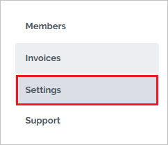
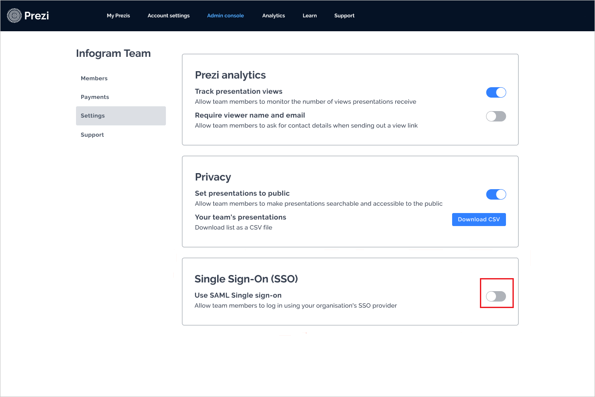
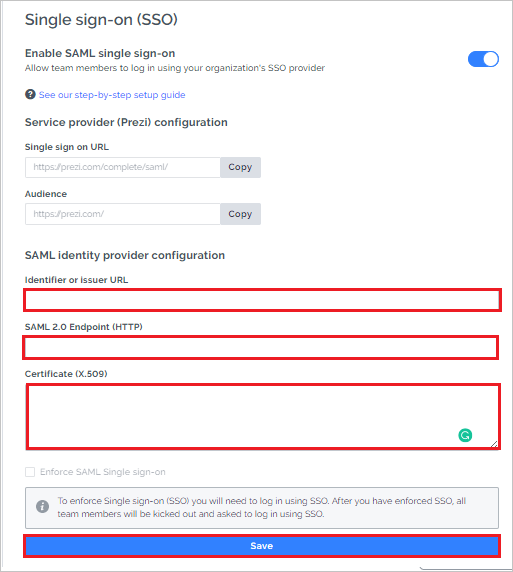

# Tutorial: Azure Active Directory single sign-on integration with Prezi

In this tutorial, you learn how to integrate Prezi with Azure Active Directory (Azure AD). When you integrate Prezi with Azure AD, you can:

* Control who has access to Prezi in Azure AD.
* Enable your users to be automatically signed in to Prezi with their Azure AD accounts.
* Manage your accounts in the Azure portal.

To learn more about software as a service (SaaS) app integration with Azure AD, see [What is application access and single sign-on with Azure Active Directory?](https://docs.microsoft.com/azure/active-directory/manage-apps/what-is-single-sign-on).

## Prerequisites

To get started, you need the following items:

* An Azure AD subscription. If you don't have a subscription, you can get a [free account](https://azure.microsoft.com/free/).
* A Prezi subscription enabled with single sign-on (SSO).

## Scenario description

In this tutorial, you configure and test Azure AD SSO in a test environment.

* Prezi supports SP- and IDP-initiated SSO.
* Prezi supports just-in-time user provisioning.
* After you configure Prezi, you can enforce session control, which protects exfiltration and infiltration of your organization’s sensitive data in real time. Session control extends from Conditional Access. For more information, see [Learn how to enforce session control with Microsoft Cloud App Security](https://docs.microsoft.com/cloud-app-security/proxy-deployment-any-app).

## Add Prezi from the gallery

To configure the integration of Prezi into Azure AD, you need to add Prezi from the gallery to your list of managed SaaS apps.

1. Sign in to the [Azure portal](https://portal.azure.com) by using either a work or school account or a personal Microsoft account.
1. On the leftmost pane, select **Azure Active Directory**.
1. Go to **Enterprise applications**, and then select **All applications**.
1. To add a new application, select **New application**.
1. In the **Add from the gallery** section, enter **Prezi** in the search box.
1. Select **Prezi** from the results panel, and then add the app. Wait a few seconds while the app is added to your tenant.

## Configure and test Azure AD SSO for Prezi

Configure and test Azure AD SSO with Prezi by using a test user called B.Simon. For SSO to work, you establish a link relationship between an Azure AD user and the related user in Prezi.

To configure and test Azure AD SSO with Prezi, complete these building blocks:

1. [Configure Azure AD SSO](#configure-azure-ad-sso) to enable your users to use this feature.
    1. [Create an Azure AD test user](#create-an-azure-ad-test-user) to test Azure AD SSO with B.Simon.
    1. [Assign the Azure AD test user](#assign-the-azure-ad-test-user) to enable B.Simon to use Azure AD SSO.
1. [Configure Prezi SSO](#configure-prezi-sso) to configure the SSO settings on the application side.
    1. [Create a Prezi test user](#create-a-prezi-test-user) to have a counterpart of B.Simon in Prezi that's linked to the Azure AD representation of the user.
1. [Test SSO](#test-sso) to verify whether the configuration works.

## Configure Azure AD SSO

To enable Azure AD SSO in the Azure portal:

1. In the [Azure portal](https://portal.azure.com/), on the **Prezi** application integration page, find the **Manage** section and select **Single sign-on**.
1. On the **Select a single sign-on method** page, select **SAML**.
1. On the **Set up Single Sign-On with SAML** page, select the **Edit** icon to edit the settings on **Basic SAML Configuration**.

   

1. In the **Basic SAML Configuration** section, the user doesn't have to do any step because the app is already preintegrated with Azure.

1. Select **Set additional URLs**, and do the following step if you want to configure the application in **SP**-initiated mode:

    In the **Sign-on URL** box, enter the URL `https://prezi.com/login/sso/`.

1. Select **Save**.

1. The Prezi application expects the SAML assertions in a specific format, which requires you to add custom attribute mappings to your SAML token attributes configuration. The following screenshot shows the list of default attributes.

	

1. The Prezi application also expects a few more attributes to be passed back in SAML response, as shown here. These attributes are also prepopulated, but you can review them based on your requirements.
	
	| Name | Source attribute|
	| ---------------| --------------- |
	| given_name | user.givenname |
	| family_name | user.surname |

1. On the **Set up Single Sign-On with SAML** page, in the **SAML Signing Certificate** section, find **Certificate (Base64)**. Select **Download** to download the certificate and save it on your computer.

	

1. In the **Set up Prezi** section, copy the appropriate URLs based on your requirements.

	

### Create an Azure AD test user

In this section, you'll create a test user in the Azure portal called B.Simon.

1. In the Azure portal, on the leftmost pane, select **Azure Active Directory**. Go to **Users**, and then select **All users**.
1. Select **New user** at the top of the screen.
1. In the user properties, follow these steps:
   1. In the **Name** box, enter **B.Simon**.
   1. In the **User name** box, enter `username@companydomain.extension`, for example, `B.Simon@contoso.com`.
   1. Select the **Show password** check box. Write down the value that appears in the **Password** box.
   1. Select **Create**.

### Assign the Azure AD test user

In this section, you enable B.Simon to use Azure SSO by granting access to Prezi.

1. In the Azure portal, select **Enterprise applications** > **All applications**.
1. In the applications list, select **Prezi**.
1. In the app's overview page, find the **Manage** section and select **Users and groups**.

   

1. Select **Add user**, and then select **Users and groups** in the **Add Assignment** dialog box.

	

1. In the **Users and groups** dialog box, select **B.Simon** from the users list, and click **Select** at the bottom of the screen.
1. If you're expecting any role value in the SAML assertion, in the **Select Role** dialog box, select the appropriate role for the user from the list and then click **Select** at the bottom of the screen.
1. In the **Add Assignment** dialog box, select **Assign**.

## Configure Prezi SSO

1. In a different web browser window, sign in to Prezi with your team account and go to the [Admin Console](https://prezi.com/organizations/manage).

1. From the **Admin Console**, select the **Settings** tab.

    

1. Go to the **Single Sign-On (SSO)** section, and turn on the toggle to enable SSO.
    
    

1. In the **Single sign-on (SSO)** section, follow these steps:

    

    1. In the **Identifier or Issuer URL** box, paste the **Azure Ad Identifier** value, which you copied from the Azure portal.

    1. In the **SAML 2.0 Endpoint (HTTP)** box, paste the **Login URL** value, which you copied from the Azure portal.

    1. Open the downloaded **Certificate (Base64)** from the Azure portal into Notepad. Copy the contents of the certificate, and paste the contents into the **Certificate (X.509)** box.

    1. Select **Save**.

### Create a Prezi test user

In this section, a user called Britta Simon is created in Prezi. Prezi supports just-in-time user provisioning, which is enabled by default. There's no action item for you in this section. If a user doesn't already exist in Prezi, a new one is created after authentication.

## Test SSO 

In this section, you test your Azure AD SSO configuration by using the Access Panel.

When you select the Prezi tile in the Access Panel, you should be automatically signed in to the Prezi account for which you set up SSO. For more information about the Access Panel, see [Introduction to the Access Panel](https://docs.microsoft.com/azure/active-directory/active-directory-saas-access-panel-introduction).

## Additional resources

- [List of tutorials on how to integrate SaaS apps with Azure Active Directory](https://docs.microsoft.com/azure/active-directory/active-directory-saas-tutorial-list)
- [What is application access and single sign-on with Azure Active Directory?](https://docs.microsoft.com/azure/active-directory/active-directory-appssoaccess-whatis)
- [What is conditional access in Azure Active Directory?](https://docs.microsoft.com/azure/active-directory/conditional-access/overview)
- [Try Prezi with Azure AD](https://aad.portal.azure.com/)
- [What is session control in Microsoft Cloud App Security?](https://docs.microsoft.com/cloud-app-security/proxy-intro-aad)
- [How to protect Prezi with advanced visibility and controls](https://docs.microsoft.com/cloud-app-security/proxy-intro-aad)

