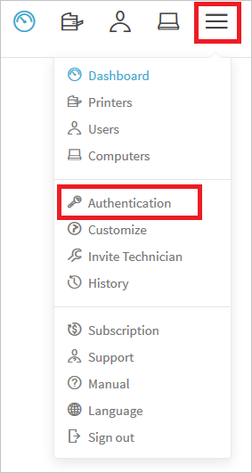
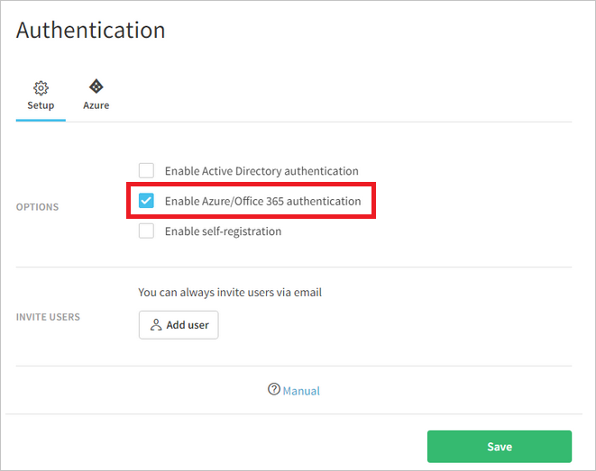
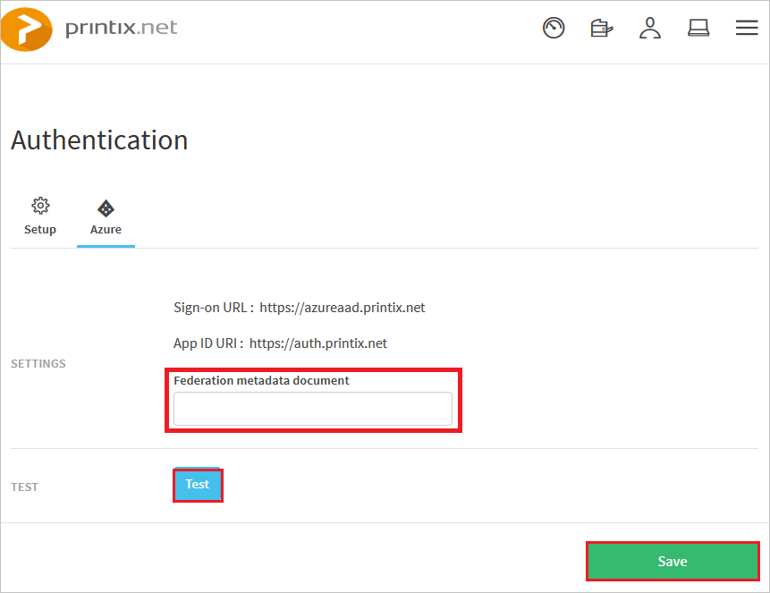

# Tutorial: Azure AD SSO integration with Printix

In this tutorial, you'll learn how to integrate Printix with Azure Active Directory (Azure AD). When you integrate Printix with Azure AD, you can:

* Control in Azure AD who has access to Printix.
* Enable your users to be automatically signed-in to Printix with their Azure AD accounts.
* Manage your accounts in one central location - the Azure portal.

## Prerequisites

To get started, you need the following items:

* An Azure AD subscription. If you don't have a subscription, you can get a [free account](https://azure.microsoft.com/free/).
* Printix single sign-on (SSO) enabled subscription.
* Along with Cloud Application Administrator, Application Administrator can also add or manage applications in Azure AD.
For more information, see [Azure built-in roles](../roles/permissions-reference.md).

> [!NOTE]
> To test the steps in this tutorial, we do not recommend using a production environment.

## Scenario description

In this tutorial, you configure and test Azure AD SSO in a test environment.

* Rootly supports **SP** initiated SSO.
* Rootly supports **Just In Time** user provisioning.

> [!NOTE]
> Identifier of this application is a fixed string value so only one instance can be configured in one tenant.

## Add Printix from the gallery

To configure the integration of Printix into Azure AD, you need to add Printix from the gallery to your list of managed SaaS apps.

1. Sign in to the Azure portal using either a work or school account, or a personal Microsoft account.
1. On the left navigation pane, select the **Azure Active Directory** service.
1. Navigate to **Enterprise Applications** and then select **All Applications**.
1. To add new application, select **New application**.
1. In the **Add from the gallery** section, type **Printix** in the search box.
1. Select **Printix** from results panel and then add the app. Wait a few seconds while the app is added to your tenant.

 Alternatively, you can also use the [Enterprise App Configuration Wizard](https://portal.office.com/AdminPortal/home?Q=Docs#/azureadappintegration). In this wizard, you can add an application to your tenant, add users/groups to the app, assign roles, as well as walk through the SSO configuration as well. [Learn more about Microsoft 365 wizards.](/microsoft-365/admin/misc/azure-ad-setup-guides)

##  Configuring and testing Azure AD SSO for Printix

In this section, you configure and test Azure AD single sign-on with Printix based on a test user called "Britta Simon".

For single sign-on to work, Azure AD needs to know what the counterpart user in Printix is to a user in Azure AD. In other words, a link relationship between an Azure AD user and the related user in Printix needs to be established.

In Printix, assign the value of the **user name** in Azure AD as the value of the **Username** to establish the link relationship.

To configure and test Azure AD single sign-on with Printix, you need to perform the following steps:

1. **[Configuring Azure AD SSO](#configuring-azure-ad-sso)** - to enable your users to use this feature.
	1. **[Creating an Azure AD test user](#creating-an-azure-ad-test-user)** - to test Azure AD single sign-on with Britta Simon.
	1. **[Assigning the Azure AD test user](#assigning-the-azure-ad-test-user)** - to enable Britta Simon to use Azure AD single sign-on.

1. **[Creating a Printix test user](#creating-a-printix-test-user)** - to have a counterpart of Britta Simon in Printix that is linked to the Azure AD representation of user.

1. **[Testing SSO](#testing-sso)** - to verify whether the configuration works.

## Configuring Azure AD SSO

Follow these steps to enable Azure AD SSO in the Azure portal.

1. In the Azure portal, on the **Printix** application integration page, find the **Manage** section and select **single sign-on**.
1. On the **Select a single sign-on method** page, select **SAML**.
1. On the **Set up single sign-on with SAML** page, click the pencil icon for **Basic SAML Configuration** to edit the settings.

    

1. On the **Printix Domain and URLs** section, perform the following step:

    In the **Sign-on URL** textbox, type a URL using the following pattern: `https://<subdomain>.printix.net`

	> [!NOTE] 
	> The value is not real. Update the value with the actual Sign-On URL. Contact [Printix Client support team](mailto:support@printix.net) to get the value. 
 
1. On the **Set-up single sign-on with SAML** page, in the **SAML Signing Certificate** section,  find **Federation Metadata XML** and select **Download** to download the certificate and save it on your computer.

     

1. Click **Save** button.

1. Sign on to your Printix tenant as an administrator.

1. In the menu on the top, click the icon at the upper right corner and select "**Authentication**".
   
    

1. On the **Setup** tab, select **Enable Azure/Office 365 authentication**
   
    

1. On the **Azure** tab, input federation metadata URL to the textbox of "**Federation metadata document**". 

    Attach the metadata xml file, which you downloaded from Azure AD to [Printix support team](mailto:support@printix.net). Then they upload the xml file and provide a federation metadata URL.
   
    
   
1. Click the "**Test**" button and click "**OK**" button if the test was successful.
   
    Azure active directory page will show after clicking the **test** button. "The test was successful" here means after entering the credentials of your Azure test account it will pop up a message "Settings tested OK".Then click the **OK** button.
   
    

1. Click the **Save** button on "**Authentication**" page.

> [!TIP]
> You can now read a concise version of these instructions inside the [Azure portal](https://portal.azure.com), while you are setting up the app!  After adding this app from the **Active Directory > Enterprise Applications** section, simply click the **Single Sign-On** tab and access the embedded documentation through the **Configuration** section at the bottom. You can read more about the embedded documentation feature here: [Azure AD embedded documentation]( https://go.microsoft.com/fwlink/?linkid=845985)
> 

### Creating an Azure AD test user

In this section, you'll create a test user in the Azure portal called B.Simon.

1. From the left pane in the Azure portal, select **Azure Active Directory**, select **Users**, and then select **All users**.
1. Select **New user** at the top of the screen.
1. In the **User** properties, follow these steps:
   1. In the **Name** field, enter `B.Simon`.  
   1. In the **User name** field, enter the username@companydomain.extension. For example, `B.Simon@contoso.com`.
   1. Select the **Show password** check box, and then write down the value that's displayed in the **Password** box.
   1. Click **Create**.

### Assigning the Azure AD test user

In this section, you'll enable B.Simon to use Azure single sign-on by granting access to Printix.

1. In the Azure portal, select **Enterprise Applications**, and then select **All applications**.
1. In the applications list, select **Printix**.
1. In the app's overview page, find the **Manage** section and select **Users and groups**.
1. Select **Add user**, then select **Users and groups** in the **Add Assignment** dialog.
1. In the **Users and groups** dialog, select **B.Simon** from the Users list, then click the **Select** button at the bottom of the screen.
1. If you are expecting a role to be assigned to the users, you can select it from the **Select a role** dropdown. If no role has been set up for this app, you see "Default Access" role selected.
1. In the **Add Assignment** dialog, click the **Assign** button.
	
## Creating a Printix test user

The objective of this section is to create a user called Britta Simon in Printix. Printix supports just-in-time provisioning, which is by default enabled.

There is no action item for you in this section. A new user is created during an attempt to access Printix if it doesn't exist yet. 

> [!NOTE]
> If you need to create a user manually, you need to contact the [Printix support team](mailto:support@printix.net).
> 

## Testing SSO

In this section, you test your Azure AD single sign-on configuration with following options. 

* Click on **Test this application** in Azure portal. This will redirect to Printix Sign-on URL where you can initiate the login flow. 

* Go to Printix Sign-on URL directly and initiate the login flow from there.

* You can use Microsoft My Apps. When you click the Printix tile in the My Apps, this will redirect to Printix Sign-on URL. For more information about the My Apps, see [Introduction to the My Apps](../user-help/my-apps-portal-end-user-access.md).

## Next steps

Once you configure Printix you can enforce session control, which protects exfiltration and infiltration of your organization’s sensitive data in real time. Session control extends from Conditional Access. [Learn how to enforce session control with Microsoft Cloud App Security](/cloud-app-security/proxy-deployment-aad).