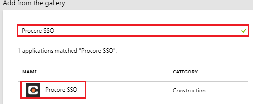
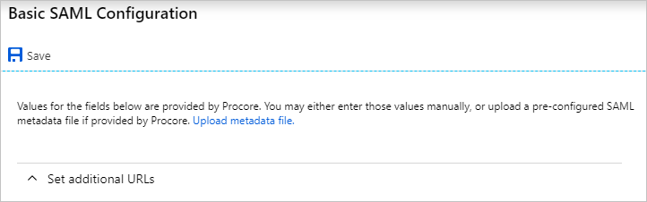
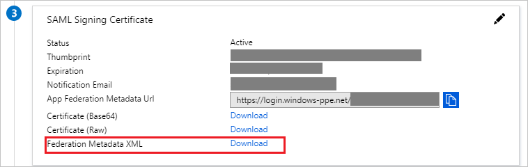
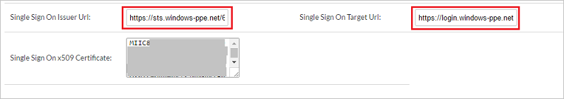

---
title: 'Tutorial: Azure Active Directory integration with Procore SSO | Microsoft Docs'
description: Learn how to configure single sign-on between Azure Active Directory and Procore SSO.
services: active-directory
documentationCenter: na
author: jeevansd
manager: mtillman

ms.assetid: 9818edd3-48c0-411d-b05a-3ec805eafb2e
ms.service: active-directory
ms.component: saas-app-tutorial
ms.workload: identity
ms.tgt_pltfrm: na
ms.devlang: na
ms.topic: article
ms.date: 04/07/2017
ms.author: jeedes

---
# Tutorial: Azure Active Directory integration with Procore SSO

In this tutorial, you learn how to integrate Procore SSO with Azure Active Directory (Azure AD).

Integrating Procore SSO with Azure AD provides you with the following benefits:

- You can control in Azure AD who has access to Procore SSO
- You can enable your users to automatically get signed-on to Procore SSO (Single Sign-On) with their Azure AD accounts
- You can manage your accounts in one central location - the Azure Management portal

If you want to know more details about SaaS app integration with Azure AD, see [What is application access and single sign-on with Azure Active Directory](../manage-apps/what-is-single-sign-on.md).

## Prerequisites

To configure Azure AD integration with Procore SSO, you need the following items:

- An Azure AD subscription
- A Procore SSO single-sign on enabled subscription

> [!NOTE]
> To test the steps in this tutorial, we do not recommend using a production environment.

To test the steps in this tutorial, you should follow these recommendations:

- You should not use your production environment, unless this is necessary.
- If you don't have an Azure AD trial environment, you can get a one-month trial [here](https://azure.microsoft.com/pricing/free-trial/).

## Scenario description
In this tutorial, you test Azure AD single sign-on in a test environment. 
The scenario outlined in this tutorial consists of two main building blocks:

1. Adding Procore SSO from the gallery
1. Configuring and testing Azure AD single sign-on

## Adding Procore SSO from the gallery
To configure the integration of Procore SSO into Azure AD, you need to add Procore SSO from the gallery to your list of managed SaaS apps.

**To add Procore SSO from the gallery, perform the following steps:**

1. In the **[Azure Management Portal](https://portal.azure.com)**, on the left navigation panel, click **Azure Active Directory** icon. 

	![Active Directory][1]

1. Navigate to **Enterprise applications**. Then go to **All applications**.

	![Applications][2]
	
1. Click **Add** button on the top of the dialog.

	![Applications][3]

1. In the search box, type **Procore SSO**.

	

1. In the results panel, select **Procore SSO**, and then click **Add** button to add the application.

	

##  Configuring and testing Azure AD single sign-on
In this section, you configure and test Azure AD single sign-on with Procore SSO based on a test user called "Britta Simon".

For single sign-on to work, Azure AD needs to know what the counterpart user in Procore SSO is to a user in Azure AD. In other words, a link relationship between an Azure AD user and the related user in Procore SSO needs to be established.

This link relationship is established by assigning the value of the **user name** in Azure AD as the value of the **Username** in Procore SSO.

To configure and test Azure AD single sign-on with Procore SSO, you need to complete the following building blocks:

1. **[Configuring Azure AD Single Sign-On](#configuring-azure-ad-single-sign-on)** - to enable your users to use this feature.
1. **[Creating an Azure AD test user](#creating-an-azure-ad-test-user)** - to test Azure AD single sign-on with Britta Simon.
1. **[Creating a Procore SSO test user](#creating-a-procore-sso-test-user)** - to have a counterpart of Britta Simon in Procore SSO that is linked to the Azure AD representation of her.
1. **[Assigning the Azure AD test user](#assigning-the-azure-ad-test-user)** - to enable Britta Simon to use Azure AD single sign-on.
1. **[Testing Single Sign-On](#testing-single-sign-on)** - to verify whether the configuration works.

### Configuring Azure AD single sign-on

In this section, you enable Azure AD single sign-on in the Azure Management portal and configure single sign-on in your Procore SSO application.

**To configure Azure AD single sign-on with Procore SSO, perform the following steps:**

1. In the Azure Management portal, on the **Procore SSO** application integration page, click **Single sign-on**.

	![Configure Single Sign-On][4]

1. On the **Single sign-on** dialog, select **Mode** as **SAML-based Sign-on** to enable single sign on.
 
	

1. On the **Procore SSO Domain and URLs** section, the user does not have to perform any steps as the app is already pre-integrated with Azure.

	

1. On the **SAML Signing Certificate** section, click **Metadata XML** and then save the XML file on your computer.

	 

1. Click **Save** button.

	

1. On the **Procore SSO Configuration** section, click **Configure Procore SSO** to open **Configure sign-on** window. Copy the **SAML Entity ID and SAML Single Sign-On Service URL** from the **Quick Reference section.**

	 

1. To configure single sign-on on **Procore SSO** side, login to your procore company site as an administrator.

1. From the toolbox drop down, click on **Admin** to open the SSO settings page.

	

1. Paste the values in the boxes as described below-

		

	a. In the **Single Sign On Issuer URL** box, paste the SAML Entity ID copied from the Azure portal.

	b. In the **SAML Sign On Target URL** box, paste the SAML Single Sign-On Service URL copied from the Azure portal.

	c. Now open the **Metadata XML** downloaded above from the Azure portal and copy the certficate in the tag named **X509Certificate**. Paste the copied value into the **Single Sign On x509 Certificate** box.

1. Click on **Save Changes**.

1. After these settings, you needs to send the **domain name** (e.g **contoso.com**) through which you are logging into Procore to the [Procore Support team](https://support.procore.com/) and they will activate federated SSO for that domain.

<!--### Next steps

To ensure users can sign-in to Procore SSO after it has been configured to use Azure Active Directory, review the following tasks and topics:

- User accounts must be pre-provisioned into Procore SSO prior to sign-in. To set this up, see Provisioning.
 
- Users must be assigned access to Procore SSO in Azure AD to sign-in. To assign users, see Users.
 
- To configure access polices for Procore SSO users, see Access Policies.
 
- For additional information on deploying single sign-on to users, see [this article](https://docs.microsoft.com/azure/active-directory/active-directory-appssoaccess-whatis#deploying-azure-ad-integrated-applications-to-users).-->

### Creating an Azure AD test user
The objective of this section is to create a test user in the Azure Management portal called Britta Simon.

![Create Azure AD User][100]

**To create a test user in Azure AD, perform the following steps:**

1. In the **Azure Management portal**, on the left navigation pane, click **Azure Active Directory** icon.

	 

1. Go to **Users and groups** and click **All users** to display the list of users.
	
	 

1. At the top of the dialog click **Add** to open the **User** dialog.
 
	 

1. On the **User** dialog page, perform the following steps:
 
	 

    a. In the **Name** textbox, type **BrittaSimon**.

    b. In the **User name** textbox, type the **email address** of BrittaSimon.

	c. Select **Show Password** and write down the value of the **Password**.

    d. Click **Create**.
 
### Creating a Procore SSO test user

Please follow the below steps to create a Procore test user on their side.

1. Login to your procore company site as an administrator.	

1. From the toolbox drop down, click on **Directory** to open the company directory page.

	

1. Click on **Add a Person** option to open the form and enter perform following options -

	

    a. In the **First Name** textbox, type user's first name like **Britta**.

    b. In the **Last name** textbox, type user's last name like **Simon**.

	c. In the **Email Address** textbox, type user's email address like **BrittaSimon@contoso.com**.

    d. Select **Permission Template** as **Apply Permission Template Later**.

    e. Click **Create**.

1. Check and update the details for the newly added contact.

	

1. Click on **Save and Send Invitiation** (if an invite through mail is required) or **Save** (Save directly) to complete the user registration.
	
		

### Assigning the Azure AD test user

In this section, you enable Britta Simon to use Azure single sign-on by granting her access to Procore SSO.

![Assign User][200] 

**To assign Britta Simon to Procore SSO, perform the following steps:**

1. In the Azure Management portal, open the applications view, and then navigate to the directory view and go to **Enterprise applications** then click **All applications**.

	![Assign User][201] 

1. In the applications list, select **Procore SSO**.

	 

1. In the menu on the left, click **Users and groups**.

	![Assign User][202] 

1. Click **Add** button. Then select **Users and groups** on **Add Assignment** dialog.

	![Assign User][203]

1. On **Users and groups** dialog, select **Britta Simon** in the Users list.

1. Click **Select** button on **Users and groups** dialog.

1. Click **Assign** button on **Add Assignment** dialog.
	
### Testing single sign-on

In this section, you test your Azure AD single sign-on configuration using the Access Panel.

If you want to test your single sign-on settings, open the Access Panel. For more details about the Access Panel, see [Introduction to the Access Panel](../user-help/active-directory-saas-access-panel-introduction.md). When you click the Procore SSO tile in the Access Panel, you should get automatically signed-on to your Procore SSO application.

## Additional resources

* [List of Tutorials on How to Integrate SaaS Apps with Azure Active Directory](tutorial-list.md)
* [What is application access and single sign-on with Azure Active Directory?](../manage-apps/what-is-single-sign-on.md)

<!--Image references-->

[1]: ./media/procoresso-tutorial/tutorial_general_01.png
[2]: ./media/procoresso-tutorial/tutorial_general_02.png
[3]: ./media/procoresso-tutorial/tutorial_general_03.png
[4]: ./media/procoresso-tutorial/tutorial_general_04.png

[100]: ./media/procoresso-tutorial/tutorial_general_100.png

[200]: ./media/procoresso-tutorial/tutorial_general_200.png
[201]: ./media/procoresso-tutorial/tutorial_general_201.png
[202]: ./media/procoresso-tutorial/tutorial_general_202.png
[203]: ./media/procoresso-tutorial/tutorial_general_203.png

