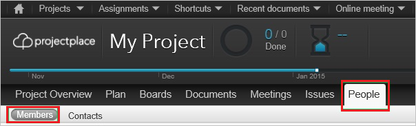
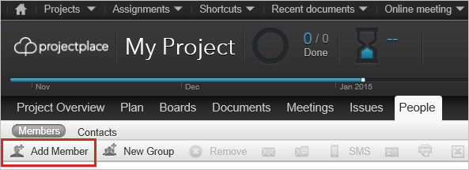

# Tutorial: Microsoft Entra SSO integration with ProjectPlace

In this tutorial, you'll learn how to integrate ProjectPlace with Microsoft Entra ID. When you integrate ProjectPlace with Microsoft Entra ID, you can:

* Control in Microsoft Entra ID who has access to ProjectPlace.
* Enable your users to be automatically signed-in to ProjectPlace with their Microsoft Entra accounts.
* Manage your accounts in one central location.
* Users can be provisioned in ProjectPlace automatically.

## Prerequisites

To get started, you need the following items:

* A Microsoft Entra subscription. If you don't have a subscription, you can get a [free account](https://azure.microsoft.com/free/).
* ProjectPlace single sign-on (SSO) enabled subscription.

## Scenario description

In this tutorial, you configure and test Microsoft Entra SSO in a test environment.

* ProjectPlace supports **SP and IDP** initiated SSO and supports **Just In Time** user provisioning.

## Add ProjectPlace from the gallery

To configure the integration of ProjectPlace into Microsoft Entra ID, you need to add ProjectPlace from the gallery to your list of managed SaaS apps.

1. Sign in to the [Microsoft Entra admin center](https://entra.microsoft.com) as at least a [Cloud Application Administrator](../roles/permissions-reference.md#cloud-application-administrator).
1. Browse to **Identity** > **Applications** > **Enterprise applications** > **New application**.
1. In the **Add from the gallery** section, type **ProjectPlace** in the search box.
1. Select **ProjectPlace** from results panel and then add the app. Wait a few seconds while the app is added to your tenant.

 Alternatively, you can also use the [Enterprise App Configuration Wizard](https://portal.office.com/AdminPortal/home?Q=Docs#/azureadappintegration). In this wizard, you can add an application to your tenant, add users/groups to the app, assign roles, as well as walk through the SSO configuration as well. [Learn more about Microsoft 365 wizards.](/microsoft-365/admin/misc/azure-ad-setup-guides)

## Configure and test Microsoft Entra SSO for ProjectPlace

Configure and test Microsoft Entra SSO with ProjectPlace using a test user called **B.Simon**. For SSO to work, you need to establish a link relationship between a Microsoft Entra user and the related user in ProjectPlace.

To configure and test Microsoft Entra SSO with ProjectPlace, perform the following steps:

1. **[Configure Microsoft Entra SSO](#configure-azure-ad-sso)** - to enable your users to use this feature.
   1. **[Create a Microsoft Entra test user](#create-an-azure-ad-test-user)** - to test Microsoft Entra single sign-on with B.Simon.
   1. **[Assign the Microsoft Entra test user](#assign-the-azure-ad-test-user)** - to enable B.Simon to use Microsoft Entra single sign-on.
1. **[Configure ProjectPlace SSO](#configure-projectplace-sso)** - to configure the single sign-on settings on application side.
   1. **[Create ProjectPlace test user](#create-projectplace-test-user)** - to have a counterpart of B.Simon in ProjectPlace that is linked to the Microsoft Entra representation of user.
1. **[Test SSO](#test-sso)** - to verify whether the configuration works.

## Configure Microsoft Entra SSO

Follow these steps to enable Microsoft Entra SSO.

1. Sign in to the [Microsoft Entra admin center](https://entra.microsoft.com) as at least a [Cloud Application Administrator](../roles/permissions-reference.md#cloud-application-administrator).
1. Browse to **Identity** > **Applications** > **Enterprise applications** > **ProjectPlace** application integration page, find the **Manage** section and select **Single sign-on**.
1. On the **Select a Single sign-on method** page, select **SAML**.
1. On the **Set up Single Sign-On with SAML** page, click the pencil icon for **Basic SAML Configuration** to edit the settings.

   

1. On the **Basic SAML Configuration** section, if you wish to configure the application in **IDP** initiated mode, the application is pre-configured and the necessary URLs are already pre-populated with Azure. The user needs to save the configuration by clicking the **Save** button.

1. If you wish to configure the application in **SP** initiated mode:

    In the **Sign on URL (Optional)** text box, type the URL:
    `https://service.projectplace.com`

1. On the **Set up Single Sign-On with SAML** page, in the **SAML Signing Certificate** section, click copy **icon** to copy the **App Federation Metadata Url**, as per your requirement and save it in Notepad.

   

1. On the **Set up ProjectPlace** section, copy the appropriate URL(s) based on your requirement.

   

### Create a Microsoft Entra test user

In this section, you'll create a test user called B. Simon.

1. Sign in to the [Microsoft Entra admin center](https://entra.microsoft.com) as at least a [User Administrator](../roles/permissions-reference.md#user-administrator).
1. Browse to **Identity** > **Users** > **All users**.
1. Select **New user** > **Create new user**, at the top of the screen.
1. In the **User** properties, follow these steps:
   1. In the **Display name** field, enter `B.Simon`.  
   1. In the **User principal name** field, enter the username@companydomain.extension. For example, `B.Simon@contoso.com`.
   1. Select the **Show password** check box, and then write down the value that's displayed in the **Password** box.
   1. Select **Review + create**.
1. Select **Create**.

### Assign the Microsoft Entra test user

In this section, you'll enable B. Simon to use Azure single sign-on by granting access to ProjectPlace.

1. Sign in to the [Microsoft Entra admin center](https://entra.microsoft.com) as at least a [Cloud Application Administrator](../roles/permissions-reference.md#cloud-application-administrator).
1. Browse to **Identity** > **Applications** > **Enterprise applications** > **ProjectPlace**.
1. In the app's overview page, find the **Manage** section and select **Users and groups**.
1. Select **Add user**, then select **Users and groups** in the **Add Assignment** dialog.
1. In the **Users and groups** dialog, select **B. Simon** from the Users list, then click the **Select** button at the bottom of the screen.
1. If you're expecting any role value in the SAML assertion, in the **Select Role** dialog, select the appropriate role for the user from the list and then click the **Select** button at the bottom of the screen.
1. In the **Add Assignment** dialog, click the **Assign** button.

## Configure ProjectPlace SSO

To configure single sign-on on the **ProjectPlace** side, you need to send the copied **App Federation Metadata Url** to the [ProjectPlace support team](https://success.planview.com/Projectplace/Support). This team ensures the SAML SSO connection is set properly on both sides.

>[!NOTE]
>The single sign-on configuration has to be performed by the [ProjectPlace support team](https://success.planview.com/Projectplace/Support). You'll get a notification as soon as the configuration is complete. 

### Create ProjectPlace test user

>[!NOTE]
>You can skip this step if you have provisioning enabled in ProjectPlace. You can ask the [ProjectPlace support team](https://success.planview.com/Projectplace/Support) to enable provisoning, once done users will be created in ProjectPlace during the first login.

To enable Microsoft Entra users to sign in to ProjectPlace, you need to add them to ProjectPlace. You need to add them manually.

**To create a user account, take these steps:**

1. Sign in to your **ProjectPlace** company site as an admin.

2. Go to **People**, and then select **Members**:
   
    

3. Select **Add Member**:
   
    

4. In the **Add Member** section, take the following steps.
   
    
   
    1. In the **New Members** box, enter the email address of a valid Microsoft Entra account that you want to add.
   
    1. Select **Send**.

   An email containing a link to confirm the account before it becomes active is sent to the Microsoft Entra account holder.

>[!NOTE]
>You can also use any other user-account creation tool or API provided by ProjectPlace to add Microsoft Entra user accounts.

## Test SSO

In this section, you test your Microsoft Entra single sign-on configuration with following options. 

#### SP initiated:

* Click on **Test this application**, this will redirect to ProjectPlace Sign on URL where you can initiate the login flow.  

* Go to ProjectPlace Sign-on URL directly and initiate the login flow from there.

#### IDP initiated:

* Click on **Test this application**, and you should be automatically signed in to the ProjectPlace for which you set up the SSO. 

You can also use Microsoft My Apps to test the application in any mode. When you click the ProjectPlace tile in the My Apps, if configured in SP mode you would be redirected to the application sign on page for initiating the login flow and if configured in IDP mode, you should be automatically signed in to the ProjectPlace for which you set up the SSO. For more information, see [Microsoft Entra My Apps](/azure/active-directory/manage-apps/end-user-experiences#azure-ad-my-apps).

## Next steps

Once you configure ProjectPlace you can enforce session control, which protects exfiltration and infiltration of your organization’s sensitive data in real time. Session control extends from Conditional Access. [Learn how to enforce session control with Microsoft Defender for Cloud Apps](/cloud-app-security/proxy-deployment-aad).
