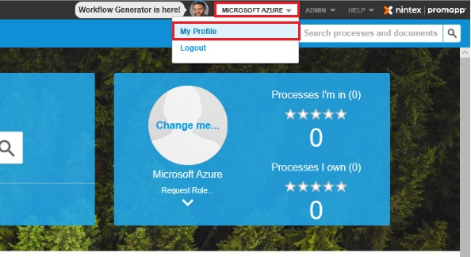
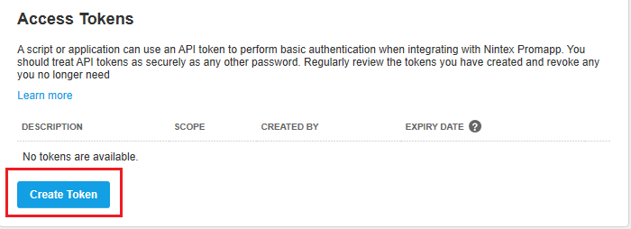
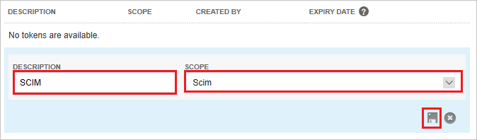
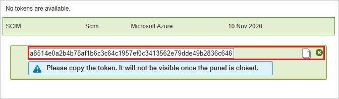
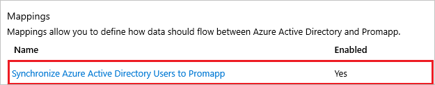
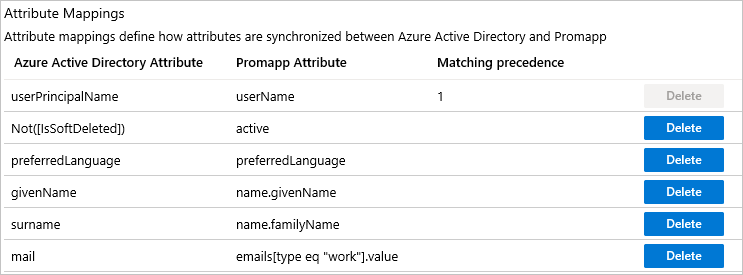

# Tutorial: Configure Nintex Promapp for automatic user provisioning

The objective of this tutorial is to demonstrate the steps to be performed in Nintex Promapp and Azure Active Directory (Azure AD) to configure Azure AD to automatically provision and de-provision users to Nintex Promapp.

> [!NOTE]
> This tutorial describes a connector built on top of the Azure AD User Provisioning Service. For important details on what this service does, how it works, and frequently asked questions, see [Automate user provisioning and deprovisioning to SaaS applications with Azure Active Directory](../manage-apps/user-provisioning.md).
>
> This connector is currently in Public Preview. For more information on the general Microsoft Azure terms of use for Preview features, see [Supplemental Terms of Use for Microsoft Azure Previews](https://azure.microsoft.com/support/legal/preview-supplemental-terms/).

## Prerequisites

The scenario outlined in this tutorial assumes that you already have the following prerequisites:

* An Azure AD tenant
* [A Nintex Promapp tenant](https://www.nintex.com/workflow-automation/process-mapping/)
* A user account in Nintex Promapp with Admin permissions.

## Assigning users to Nintex Promapp

Azure Active Directory uses a concept called *assignments* to determine which users should receive access to selected apps. In the context of automatic user provisioning, only the users and that have been assigned to an application in Azure AD are synchronized.

Before configuring and enabling automatic user provisioning, you should decide which users in Azure AD need access to Nintex Promapp. Once decided, you can assign these users and/or groups to Nintex Promapp by following the instructions here:
* [Assign a user or group to an enterprise app](../manage-apps/assign-user-or-group-access-portal.md)

## Important tips for assigning users to Nintex Promapp

* It is recommended that a single Azure AD user is assigned to Nintex Promapp to test the automatic user provisioning configuration. Additional users may be assigned later.

* When assigning a user to Nintex Promapp, you must select any valid application-specific role (if available) in the assignment dialog. Users with the **Default Access** role are excluded from provisioning.

## Setup Nintex Promapp for provisioning

1. Sign in to your [Nintex Promapp Admin Console](https://www.nintex.com/trial/#promapp). Under the user name navigate to **My Profile**.

	

2.	Under **Access Tokens** click on the **Create Token** button.

	

3.	Provide any name in the **Description** field and select **Scim** from the **Scope** dropdown menu. Click on the save icon.

	

4.	Copy the access token and save it as this will be the only time you can view it. This value will be entered in the Secret Token field in the Provisioning tab of your Nintex Promapp application in the Azure portal. 

	

## Add Nintex Promapp from the gallery

Before configuring Nintex Promapp for automatic user provisioning with Azure AD, you need to add Nintex Promapp from the Azure AD application gallery to your list of managed SaaS applications.

**To add Nintex Promapp from the Azure AD application gallery, perform the following steps:**

1. In the **[Azure portal](https://portal.azure.com)**, in the left navigation panel, select **Azure Active Directory**.

	

2. Go to **Enterprise applications**, and then select **All applications**.

	

3. To add a new application, select the **New application** button at the top of the pane.

	

4. In the search box, enter **Promapp**, select **Promapp** in the results panel, and then click the **Add** button to add the application.

	

## Configuring automatic user provisioning to Nintex Promapp 

This section guides you through the steps to configure the Azure AD provisioning service to create, update, and disable users and/or groups in Promapp based on user and/or group assignments in Azure AD.

> [!TIP]
> You may also choose to enable SAML-based single sign-on for Nintex Promapp by following the instructions provided in the [Nintex Promapp Single sign-on tutorial](https://docs.microsoft.com/azure/active-directory/saas-apps/promapp-tutorial). Single sign-on can be configured independently of automatic user provisioning, although these two features complement each other.

### To configure automatic user provisioning for Nintex Promapp in Azure AD:

1. Sign in to the [Azure portal](https://portal.azure.com). Select **Enterprise Applications**, then select **All applications**.

	

2. In the applications list, select **Promapp**.

	

3. Select the **Provisioning** tab.

	

4. Set the **Provisioning Mode** to **Automatic**.

	

5. Under the **Admin Credentials** section, input `https://api.promapp.com/api/scim` in **Tenant URL**. Input the **SCIM Access Token** value retrieved earlier in **Secret Token**. Click **Test Connection** to ensure Azure AD can connect to Nintex Promapp. If the connection fails, ensure your Nintex Promapp account has Admin permissions and try again.

	

6. In the **Notification Email** field, enter the email address of a person or group who should receive the provisioning error notifications and check the checkbox - **Send an email notification when a failure occurs**.

	

7. Click **Save**.

8. Under the **Mappings** section, select **Synchronize Azure Active Directory Users to Promapp**.

	

9. Review the user attributes that are synchronized from Azure AD to Nintex Promapp in the **Attribute Mappings** section. The attributes selected as **Matching** properties are used to match the user accounts in Nintex Promapp for update operations. Select the **Save** button to commit any changes.

	

11. To configure scoping filters, refer to the following instructions provided in the [Scoping filter tutorial](../manage-apps/define-conditional-rules-for-provisioning-user-accounts.md).

12. To enable the Azure AD provisioning service for Nintex Promapp, change the **Provisioning Status** to **On** in the **Settings** section.

	

13. Define the users and/or groups that you would like to provision to Nintex Promapp by choosing the desired values in **Scope** in the **Settings** section.

	

14. When you are ready to provision, click **Save**.

	

This operation starts the initial synchronization of all users and/or groups defined in **Scope** in the **Settings** section. The initial sync takes longer to perform than subsequent syncs, which occur approximately every 40 minutes as long as the Azure AD provisioning service is running. You can use the **Current Status and Statistics to Date** sections to monitor progress and follow links to provisioning activity report, which describes all actions performed by the Azure AD provisioning service on Nintex Promapp.

For more information on how to read the Azure AD provisioning logs, see [Reporting on automatic user account provisioning](../manage-apps/check-status-user-account-provisioning.md).

## Additional resources

* [Managing user account provisioning for Enterprise Apps](../manage-apps/configure-automatic-user-provisioning-portal.md)
* [What is application access and single sign-on with Azure Active Directory?](../manage-apps/what-is-single-sign-on.md)

## Next steps

* [Learn how to review logs and get reports on provisioning activity](../manage-apps/check-status-user-account-provisioning.md)
