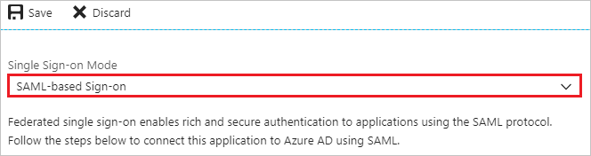
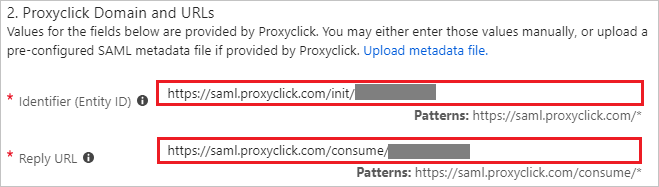
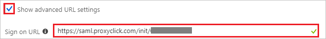
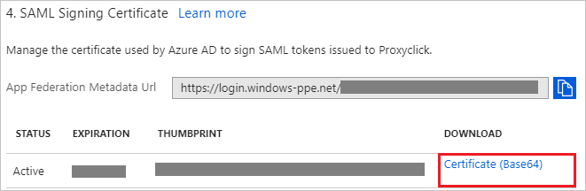
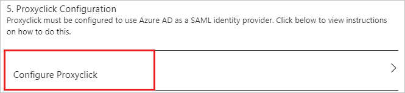
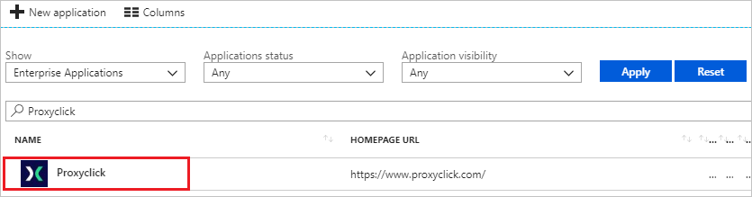

---
title: 'Tutorial: Azure Active Directory integration with Proxyclick | Microsoft Docs'
description: Learn how to configure single sign-on between Azure Active Directory and Proxyclick.
services: active-directory
documentationCenter: na
author: jeevansd
manager: femila
ms.reviewer: joflore

ms.assetid: 5c58a859-71c2-4542-ae92-e5f16a8e7f18
ms.service: active-directory
ms.component: saas-app-tutorial
ms.workload: identity
ms.tgt_pltfrm: na
ms.devlang: na
ms.topic: article
ms.date: 05/21/2018
ms.author: jeedes

---
# Tutorial: Azure Active Directory integration with Proxyclick

In this tutorial, you learn how to integrate Proxyclick with Azure Active Directory (Azure AD).

Integrating Proxyclick with Azure AD provides you with the following benefits:

- You can control in Azure AD who has access to Proxyclick.
- You can enable your users to automatically get signed-on to Proxyclick (Single Sign-On) with their Azure AD accounts.
- You can manage your accounts in one central location - the Azure portal.

If you want to know more details about SaaS app integration with Azure AD, see [what is application access and single sign-on with Azure Active Directory](../manage-apps/what-is-single-sign-on.md).

## Prerequisites

To configure Azure AD integration with Proxyclick, you need the following items:

- An Azure AD subscription
- A Proxyclick single sign-on enabled subscription

> [!NOTE]
> To test the steps in this tutorial, we do not recommend using a production environment.

To test the steps in this tutorial, you should follow these recommendations:

- Do not use your production environment, unless it is necessary.
- If you don't have an Azure AD trial environment, you can [get a one-month trial](https://azure.microsoft.com/pricing/free-trial/).

## Scenario description
In this tutorial, you test Azure AD single sign-on in a test environment. 
The scenario outlined in this tutorial consists of two main building blocks:

1. Adding Proxyclick from the gallery
1. Configuring and testing Azure AD single sign-on

## Adding Proxyclick from the gallery
To configure the integration of Proxyclick into Azure AD, you need to add Proxyclick from the gallery to your list of managed SaaS apps.

**To add Proxyclick from the gallery, perform the following steps:**

1. In the **[Azure portal](https://portal.azure.com)**, on the left navigation panel, click **Azure Active Directory** icon. 

	![The Azure Active Directory button][1]

1. Navigate to **Enterprise applications**. Then go to **All applications**.

	![The Enterprise applications blade][2]
	
1. To add new application, click **New application** button on the top of dialog.

	![The New application button][3]

1. In the search box, type **Proxyclick**, select **Proxyclick** from result panel then click **Add** button to add the application.

	

## Configure and test Azure AD single sign-on

In this section, you configure and test Azure AD single sign-on with Proxyclick based on a test user called "Britta Simon".

For single sign-on to work, Azure AD needs to know what the counterpart user in Proxyclick is to a user in Azure AD. In other words, a link relationship between an Azure AD user and the related user in Proxyclick needs to be established.

To configure and test Azure AD single sign-on with Proxyclick, you need to complete the following building blocks:

1. **[Configure Azure AD Single Sign-On](#configure-azure-ad-single-sign-on)** - to enable your users to use this feature.
1. **[Create an Azure AD test user](#create-an-azure-ad-test-user)** - to test Azure AD single sign-on with Britta Simon.
1. **[Create a Proxyclick test user](#create-a-proxyclick-test-user)** - to have a counterpart of Britta Simon in Proxyclick that is linked to the Azure AD representation of user.
1. **[Assign the Azure AD test user](#assign-the-azure-ad-test-user)** - to enable Britta Simon to use Azure AD single sign-on.
1. **[Test single sign-on](#test-single-sign-on)** - to verify whether the configuration works.

### Configure Azure AD single sign-on

In this section, you enable Azure AD single sign-on in the Azure portal and configure single sign-on in your Proxyclick application.

**To configure Azure AD single sign-on with Proxyclick, perform the following steps:**

1. In the Azure portal, on the **Proxyclick** application integration page, click **Single sign-on**.

	![Configure single sign-on link][4]

1. On the **Single sign-on** dialog, select **Mode** as **SAML-based Sign-on** to enable single sign-on.

	

1. On the **Proxyclick Domain and URLs** section, perform the following steps if you wish to configure the application in **IDP** initiated mode:

	

    a. In the **Identifier** textbox, type a URL using the following pattern: `https://saml.proxyclick.com/init/<companyId>`

	b. In the **Reply URL** textbox, type a URL using the following pattern: `https://saml.proxyclick.com/consume/<companyId>`

1. Check **Show advanced URL settings** and perform the following step if you wish to configure the application in **SP** initiated mode:

	

    In the **Sign-on URL** textbox, type a URL using the following pattern: `https://saml.proxyclick.com/init/<companyId>`

	> [!NOTE]
	> These values are not real. You will update these values with the actual Identifier, Reply URL, and Sign-On URL, which is explained later in the tutorial.

1. On the **SAML Signing Certificate** section, click **Certificate(Base64)** and then save the certificate file on your computer.

	 

1. Click **Save** button.

	

1. On the **Proxyclick Configuration** section, click **Configure Proxyclick** to open **Configure sign-on** window. Copy the **SAML Entity ID and SAML Single Sign-On Service URL** from the **Quick Reference section.**

	

1. In a different web browser window, log in to your Proxyclick company site as an administrator.

1. Select **Account & Settings**.

	

1. Scroll down to the **INTEGRATIONS** and select **SAML**.

	

1. In the **SAML** section, perform the following steps:

	

	a. Copy **SAML Consumer URL** value and paste it into **Reply URL** textbox in **Proxyclick Domain and URLs** section on Azure portal.

	b. Copy **SAML SSO Redirect URL** value and paste it into **Sign on URL** and **Identifier** textboxes in **Proxyclick Domain and URLs** section on Azure portal.

	c. Select **SAML Request Method** as **HTTP Redirect**.

	d. In the **Issuer** textbox, paste the value of **SAML Entity ID** value, which you have copied from Azure portal.

	e. In the **SAML 2.0 Endpoint URL** textbox, paste the value of **SAML Single Sign-On Service URL** copied from Azure portal.

	f. Open your downloaded certificate file from Azure portal in Notepad and then paste it into the **Certificate** textbox.

	g. Click **Save Changes**.

### Create an Azure AD test user

The objective of this section is to create a test user in the Azure portal called Britta Simon.

   ![Create an Azure AD test user][100]

**To create a test user in Azure AD, perform the following steps:**

1. In the Azure portal, in the left pane, click the **Azure Active Directory** button.

    

1. To display the list of users, go to **Users and groups**, and then click **All users**.

    

1. To open the **User** dialog box, click **Add** at the top of the **All Users** dialog box.

    

1. In the **User** dialog box, perform the following steps:

    

    a. In the **Name** box, type **BrittaSimon**.

    b. In the **User name** box, type the email address of user Britta Simon.

    c. Select the **Show Password** check box, and then write down the value that's displayed in the **Password** box.

    d. Click **Create**.

### Create a Proxyclick test user

To enable Azure AD users to log in to Proxyclick, they must be provisioned into Proxyclick. In the case of Proxyclick, provisioning is a manual task.

**To provision a user account, perform the following steps:**

1. Log in to your Proxyclick company site as an administrator.

1. Click **Colleagues** from the top navigation bar.

    

1. Click **Add Colleague**

	

1. In the **Add a colleague** section, perform the following steps:

	

	a. In the **Email** textbox, type the email address of user like **brittasimon@contoso.com**.

	b. In the **First Name** textbox, type the first name of user like Britta.

	c. In the **Last Name** textbox, type the last name of user like Simon.

	d. Click **Add User**.

### Assign the Azure AD test user

In this section, you enable Britta Simon to use Azure single sign-on by granting access to Proxyclick.

![Assign the user role][200]

**To assign Britta Simon to Proxyclick, perform the following steps:**

1. In the Azure portal, open the applications view, and then navigate to the directory view and go to **Enterprise applications** then click **All applications**.

	![Assign User][201] 

1. In the applications list, select **Proxyclick**.

	  

1. In the menu on the left, click **Users and groups**.

	![The "Users and groups" link][202]

1. Click **Add** button. Then select **Users and groups** on **Add Assignment** dialog.

	![The Add Assignment pane][203]

1. On **Users and groups** dialog, select **Britta Simon** in the Users list.

1. Click **Select** button on **Users and groups** dialog.

1. Click **Assign** button on **Add Assignment** dialog.
	
### Test single sign-on

In this section, you test your Azure AD single sign-on configuration using the Access Panel.

When you click the Proxyclick tile in the Access Panel, you should get automatically signed-on to your Proxyclick application.
For more information about the Access Panel, see [Introduction to the Access Panel](../user-help/active-directory-saas-access-panel-introduction.md). 

## Additional resources

* [List of Tutorials on How to Integrate SaaS Apps with Azure Active Directory](tutorial-list.md)
* [What is application access and single sign-on with Azure Active Directory?](../manage-apps/what-is-single-sign-on.md)

<!--Image references-->

[1]: ./media/proxyclick-tutorial/tutorial_general_01.png
[2]: ./media/proxyclick-tutorial/tutorial_general_02.png
[3]: ./media/proxyclick-tutorial/tutorial_general_03.png
[4]: ./media/proxyclick-tutorial/tutorial_general_04.png

[100]: ./media/proxyclick-tutorial/tutorial_general_100.png

[200]: ./media/proxyclick-tutorial/tutorial_general_200.png
[201]: ./media/proxyclick-tutorial/tutorial_general_201.png
[202]: ./media/proxyclick-tutorial/tutorial_general_202.png
[203]: ./media/proxyclick-tutorial/tutorial_general_203.png

