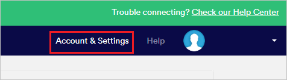
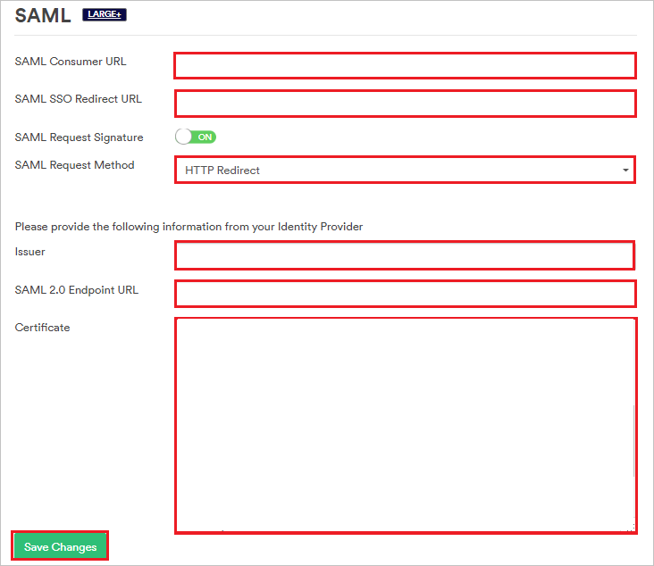

# Tutorial: Azure Active Directory integration with Proxyclick

In this tutorial, you'll learn how to integrate Proxyclick with Azure Active Directory (Azure AD). When you integrate Proxyclick with Azure AD, you can:

* Control in Azure AD who has access to Proxyclick.
* Enable your users to be automatically signed-in to Proxyclick with their Azure AD accounts.
* Manage your accounts in one central location - the Azure portal.

## Prerequisites

To get started, you need the following items:

* An Azure AD subscription. If you don't have a subscription, you can get a [free account](https://azure.microsoft.com/free/).
* Proxyclick single sign-on (SSO) enabled subscription.

## Scenario description

In this tutorial, you'll configure and test Azure AD single sign-on in a test environment.

* Proxyclick supports SP-initiated and IdP-initiated SSO.

* Proxyclick supports [Automated user provisioning](proxyclick-provisioning-tutorial.md).

## Add Proxyclick from the gallery

To configure the integration of Proxyclick into Azure AD, you need to add Proxyclick from the gallery to your list of managed SaaS apps.

1. Sign in to the Azure portal using either a work or school account, or a personal Microsoft account.
1. On the left navigation pane, select the **Azure Active Directory** service.
1. Navigate to **Enterprise Applications** and then select **All Applications**.
1. To add new application, select **New application**.
1. In the **Add from the gallery** section, type **Proxyclick** in the search box.
1. Select **Proxyclick** from results panel and then add the app. Wait a few seconds while the app is added to your tenant.

 Alternatively, you can also use the [Enterprise App Configuration Wizard](https://portal.office.com/AdminPortal/home?Q=Docs#/azureadappintegration). In this wizard, you can add an application to your tenant, add users/groups to the app, assign roles, as well as walk through the SSO configuration as well. [Learn more about Microsoft 365 wizards.](/microsoft-365/admin/misc/azure-ad-setup-guides)

## Configure and test Azure AD SSO for Proxyclick

Configure and test Azure AD SSO with Proxyclick using a test user called **B.Simon**. For SSO to work, you need to establish a link relationship between an Azure AD user and the related user in Proxyclick.

To configure and test Azure AD SSO with Proxyclick, perform the following steps:

1. **[Configure Azure AD SSO](#configure-azure-ad-sso)** - to enable your users to use this feature.
    1. **[Create an Azure AD test user](#create-an-azure-ad-test-user)** - to test Azure AD single sign-on with B.Simon.
    1. **[Assign the Azure AD test user](#assign-the-azure-ad-test-user)** - to enable B.Simon to use Azure AD single sign-on.
1. **[Configure Proxyclick SSO](#configure-proxyclick-sso)** - to configure the single sign-on settings on application side.
    1. **[Create Proxyclick test user](#create-proxyclick-test-user)** - to have a counterpart of B.Simon in Proxyclick that is linked to the Azure AD representation of user.
1. **[Test SSO](#test-sso)** - to verify whether the configuration works.

## Configure Azure AD SSO

Follow these steps to enable Azure AD SSO in the Azure portal.

1. In the Azure portal, on the **Proxyclick** application integration page, find the **Manage** section and select **single sign-on**.
1. On the **Select a single sign-on method** page, select **SAML**.
1. On the **Set up single sign-on with SAML** page, click the pencil icon for **Basic SAML Configuration** to edit the settings.

   

4. In the **Basic SAML Configuration** dialog box, if you want to configure the application in IdP-initiated mode, perform the following steps.
	
	a. In the **Identifier** box, type a URL using the following pattern:
    `https://saml.proxyclick.com/init/<COMPANY_ID>`

    b. In the **Reply URL** box, type a URL using the following pattern:
    `https://saml.proxyclick.com/consume/<COMPANY_ID>`

5. If you want to configure the application in SP-initiated mode, select **Set additional URLs**. In the **Sign on URL** textbox, type a URL using the following pattern:
   
   `https://saml.proxyclick.com/init/<COMPANY_ID>`

	> [!NOTE]
	> These values are placeholders. You need to use the actual Identifier,Reply URL and Sign on URL. Steps for getting these values are described later in this tutorial.

6. On the **Set up Single Sign-On with SAML** page, in the **SAML Signing Certificate** section, select the **Download** link next to **Certificate (Base64)**, per your requirements, and save the certificate on your computer:

	

7. In the **Set up Proxyclick** section, copy the appropriate URLs, based on your requirements:

	

### Create an Azure AD test user

In this section, you'll create a test user in the Azure portal called B.Simon.

1. From the left pane in the Azure portal, select **Azure Active Directory**, select **Users**, and then select **All users**.
1. Select **New user** at the top of the screen.
1. In the **User** properties, follow these steps:
   1. In the **Name** field, enter `B.Simon`.  
   1. In the **User name** field, enter the username@companydomain.extension. For example, `B.Simon@contoso.com`.
   1. Select the **Show password** check box, and then write down the value that's displayed in the **Password** box.
   1. Click **Create**.

### Assign the Azure AD test user

In this section, you'll enable B.Simon to use Azure single sign-on by granting access to Proxyclick.

1. In the Azure portal, select **Enterprise Applications**, and then select **All applications**.
1. In the applications list, select **Proxyclick**.
1. In the app's overview page, find the **Manage** section and select **Users and groups**.
1. Select **Add user**, then select **Users and groups** in the **Add Assignment** dialog.
1. In the **Users and groups** dialog, select **B.Simon** from the Users list, then click the **Select** button at the bottom of the screen.
1. If you are expecting a role to be assigned to the users, you can select it from the **Select a role** dropdown. If no role has been set up for this app, you see "Default Access" role selected.
1. In the **Add Assignment** dialog, click the **Assign** button.

## Configure Proxyclick SSO

1. In a new web browser window, sign in to your Proxyclick company site as an admin.

2. Select **Account & Settings**.

	

3. Scroll down to the **Integrations** section and select **SAML**.

	

4. In the **SAML** section, take the following steps.

	

	1. Copy the **SAML Consumer URL** value and paste it into the **Reply URL** box in the **Basic SAML Configuration** dialog box in the Azure portal.

	1. Copy the **SAML SSO Redirect URL** value and paste it into the **Sign on URL** and **Identifier** boxes in the **Basic SAML Configuration** dialog box in the Azure portal.

	1. In the **SAML Request Method** list, select **HTTP Redirect**.

	1. In the **Issuer** box, paste the **Azure AD Identifier** value that you copied from the Azure portal.

	1. In the **SAML 2.0 Endpoint URL** box, paste the **Login URL** value that you copied from the Azure portal.

	1. In Notepad, open the certificate file that you downloaded from the Azure portal. Paste the contents of this file into the **Certificate** box.

	1. Select **Save Changes**.

### Create Proxyclick test user

To enable Azure AD users to sign in to Proxyclick, you need to add them to Proxyclick. You need to add them manually.

To create a user account, take these steps:

1. Sign in to your Proxyclick company site as an admin.

1. Select **Colleagues** at the top of the window.

    

1. Select **Add Colleague**.

	

1. In the **Add a colleague** section, take the following steps.

	

	1. In the **Email** box, enter the email address of the user. In this case, **brittasimon\@contoso.com**.

	1. In the **First Name** box, enter the first name of the user. In this case, **Britta**.

	1. In the **Last Name** box, enter the last name of the user. In this case, **Simon**.

	1. Select **Add User**.

> [!NOTE]
> Proxyclick also supports automatic user provisioning, you can find more details [here](./proxyclick-provisioning-tutorial.md) on how to configure automatic user provisioning.

## Test SSO

In this section, you test your Azure AD single sign-on configuration with following options. 

#### SP initiated:

* Click on **Test this application** in Azure portal. This will redirect to Proxyclick Sign on URL where you can initiate the login flow.  

* Go to Proxyclick Sign-on URL directly and initiate the login flow from there.

#### IDP initiated:

* Click on **Test this application** in Azure portal and you should be automatically signed in to the Proxyclick for which you set up the SSO. 

You can also use Microsoft My Apps to test the application in any mode. When you click the Proxyclick tile in the My Apps, if configured in SP mode you would be redirected to the application sign on page for initiating the login flow and if configured in IDP mode, you should be automatically signed in to the Proxyclick for which you set up the SSO. For more information about the My Apps, see [Introduction to the My Apps](https://support.microsoft.com/account-billing/sign-in-and-start-apps-from-the-my-apps-portal-2f3b1bae-0e5a-4a86-a33e-876fbd2a4510).

## Next steps

Once you configure Proxyclick you can enforce session control, which protects exfiltration and infiltration of your organization’s sensitive data in real time. Session control extends from Conditional Access. [Learn how to enforce session control with Microsoft Defender for Cloud Apps](/cloud-app-security/proxy-deployment-aad).
