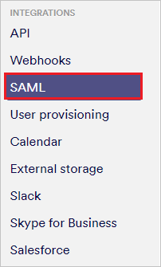
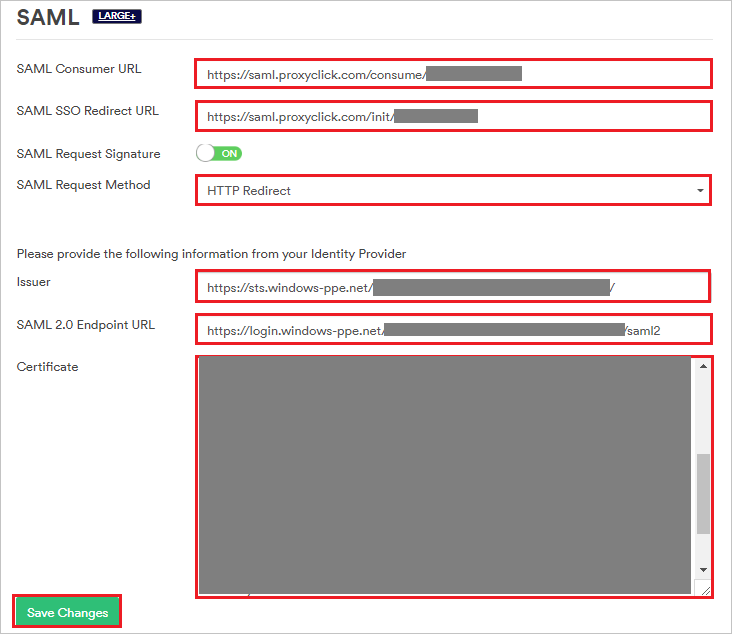
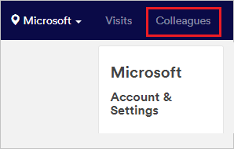
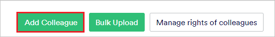
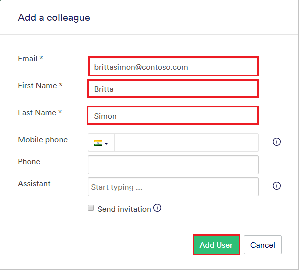

# Tutorial: Azure Active Directory integration with Proxyclick

In this tutorial, you'll learn how to integrate Proxyclick with Azure Active Directory (Azure AD).
This integration provides these benefits:

* You can use Azure AD to control who has access to Proxyclick.
* You can enable your users to be automatically signed in to Proxyclick (single sign-on) with their Azure AD accounts.
* You can manage your accounts in one central location: the Azure portal.

To learn more about SaaS app integration with Azure AD, see [Single sign-on to applications in Azure Active Directory](https://docs.microsoft.com/azure/active-directory/active-directory-appssoaccess-whatis).

If you don't have an Azure subscription, [create a free account](https://azure.microsoft.com/free/) before you begin.

## Prerequisites

To configure Azure AD integration with Proxyclick, you need to have:

* An Azure AD subscription. If you don't have an Azure AD environment, you can sign up for a [one-month trial](https://azure.microsoft.com/pricing/free-trial/).
* A Proxyclick subscription that has single sign-on enabled.

## Scenario description

In this tutorial, you'll configure and test Azure AD single sign-on in a test environment.

* Proxyclick supports SP-initiated and IdP-initiated SSO.

## Add Proxyclick from the gallery

To set up the integration of Proxyclick into Azure AD, you need to add Proxyclick from the gallery to your list of managed SaaS apps.

1. In the [Azure portal](https://portal.azure.com), in the left pane, select **Azure Active Directory**:

	

2. Go to **Enterprise applications** > **All applications**:

	

3. To add an application, select **New application** at the top of the window:

	

4. In the search box, enter **Proxyclick**. Select **Proxyclick** in the search results and then select **Add**.

	 

## Configure and test Azure AD single sign-on

In this section, you'll configure and test Azure AD single sign-on with Proxyclick by using a test user named Britta Simon.
To enable single sign-on, you need to establish a relationship between an Azure AD user and the corresponding user in Proxyclick.

To configure and test Azure AD single sign-on with Proxyclick, you need to complete these steps:

1. **[Configure Azure AD single sign-on](#configure-azure-ad-single-sign-on)** to enable the feature for your users.
2. **[Configure Proxyclick single sign-on](#configure-proxyclick-single-sign-on)** on the application side.
3. **[Create an Azure AD test user](#create-an-azure-ad-test-user)** to test Azure AD single sign-on.
4. **[Assign the Azure AD test user](#assign-the-azure-ad-test-user)** to enable Azure AD single sign-on for the user.
5. **[Create a Proxyclick test user](#create-a-proxyclick-test-user)** that's linked to the Azure AD representation of the user.
6. **[Test single sign-on](#test-single-sign-on)** to verify that the configuration works.

### Configure Azure AD single sign-on

In this section, you'll enable Azure AD single sign-on in the Azure portal.

To configure Azure AD single sign-on with Proxyclick, take these steps:

1. In the [Azure portal](https://portal.azure.com/), on the Proxyclick application integration page, select **Single sign-on**:

    

2. In the **Select a single sign-on method** dialog box, select **SAML/WS-Fed** mode to enable single sign-on:

    

3. On the **Set up Single Sign-On with SAML** page, select the **Edit** icon to open the **Basic SAML Configuration** dialog box:

	

4. In the **Basic SAML Configuration** dialog box, if you want to configure the application in IdP-initiated mode, take the following steps.

    

    1. In the **Identifier** box, enter a URL in this pattern:
   
       `https://saml.proxyclick.com/init/<companyId>`

    1. In the **Reply URL** box, enter a URL in this pattern:

       `https://saml.proxyclick.com/consume/<companyId>`

5. If you want to configure the application in SP-initiated mode, select **Set additional URLs**. In the **Sign on URL** box, enter a URL in this pattern:
   
   `https://saml.proxyclick.com/init/<companyId>`

    

    

	> [!NOTE]
	> These values are placeholders. You need to use the actual identifier, reply URL, and sign-on URL. Steps for getting these values are described later in this tutorial.

6. On the **Set up Single Sign-On with SAML** page, in the **SAML Signing Certificate** section, select the **Download** link next to **Certificate (Base64)**, per your requirements, and save the certificate on your computer:

	

7. In the **Set up Proxyclick** section, copy the appropriate URLs, based on your requirements:

	

	1. **Login URL**.

	1. **Azure AD Identifier**.

	1. **Logout URL**.

### Configure Proxyclick single sign-on

1. In a new web browser window, sign in to your Proxyclick company site as an admin.

2. Select **Account & Settings**:

	

3. Scroll down to the **Integrations** section and select **SAML**:

	

4. In the **SAML** section, take the following steps.

	

	1. Copy the **SAML Consumer URL** value and paste it into the **Reply URL** box in the **Basic SAML Configuration** dialog box in the Azure portal.

	1. Copy the **SAML SSO Redirect URL** value and paste it into the **Sign on URL** and **Identifier** boxes in the **Basic SAML Configuration** dialog box in the Azure portal.

	1. In the **SAML Request Method** list, select **HTTP Redirect**.

	1. In the **Issuer** box, paste the **Azure AD Identifier** value that you copied from the Azure portal.

	1. In the **SAML 2.0 Endpoint URL** box, paste the **Login URL** value that you copied from the Azure portal.

	1. In Notepad, open the certificate file that you downloaded from the Azure portal. Paste the contents of this file into the **Certificate** box.

	1. Select **Save Changes**.

### Create an Azure AD test user

In this section, you'll create a test user named Britta Simon in the Azure portal.

1. In the Azure portal, select **Azure Active Directory** in the left pane, select **Users**, and then select **All users**:

    

2. Select **New user** at the top of the screen:

    

3. In the **User** dialog box, take the following steps.

    

    1. In the **Name** box, enter **BrittaSimon**.
  
    1. In the **User name** box, enter **BrittaSimon@\<yourcompanydomain>.\<extension>**. (For example, BrittaSimon@contoso.com.)

    1. Select **Show Password**, and then write down the value that's in the **Password** box.

    1. Select **Create**.

### Assign the Azure AD test user

In this section, you'll enable Britta Simon to use Azure single sign-on by granting her access to Proxyclick.

1. In the Azure portal, select **Enterprise applications**, select **All applications**, and then select **Proxyclick**.

	

2. In the list of applications, select **Proxyclick**.

	

3. In the left pane, select **Users and groups**:

    

4. Select **Add user**, and then select **Users and groups** in the **Add Assignment** dialog box.

    

5. In the **Users and groups** dialog box, select **Britta Simon** in the users list, and then click the **Select** button at the bottom of the window.

6. If you expect a role value in the SAML assertion, in the **Select Role** dialog box, select the appropriate role for the user from the list. Click the **Select** button at the bottom of the window.

7. In the **Add Assignment** dialog box, select **Assign**.

### Create a Proxyclick test user

To enable Azure AD users to sign in to Proxyclick, you need to add them to Proxyclick. You need to add them manually.

To create a user account, take these steps:

1. Sign in to your Proxyclick company site as an admin.

1. Select **Colleagues** at the top of the window:

    

1. Select **Add Colleague**:

	

1. In the **Add a colleague** section, take the following steps.

	

	1. In the **Email** box, enter the email address of the user. In this case, **brittasimon\@contoso.com**.

	1. In the **First Name** box, enter the first name of the user. In this case, **Britta**.

	1. In the **Last Name** box, enter the last name of the user. In this case, **Simon**.

	1. Select **Add User**.

### Test single sign-on

Now you need to test your Azure AD single sign-on configuration by using the Access Panel.

When you select the Proxyclick tile in the Access Panel, you should be automatically signed in to the Proxyclick instance for which you set up SSO. For more information about the Access Panel, see [Access and use apps on the My Apps portal](https://docs.microsoft.com/azure/active-directory/active-directory-saas-access-panel-introduction).

## Additional resources

- [Tutorials for integrating SaaS applications with Azure Active Directory](https://docs.microsoft.com/azure/active-directory/active-directory-saas-tutorial-list)

- [What is application access and single sign-on with Azure Active Directory?](https://docs.microsoft.com/azure/active-directory/active-directory-appssoaccess-whatis)

- [What is Conditional Access in Azure Active Directory?](https://docs.microsoft.com/azure/active-directory/conditional-access/overview)

