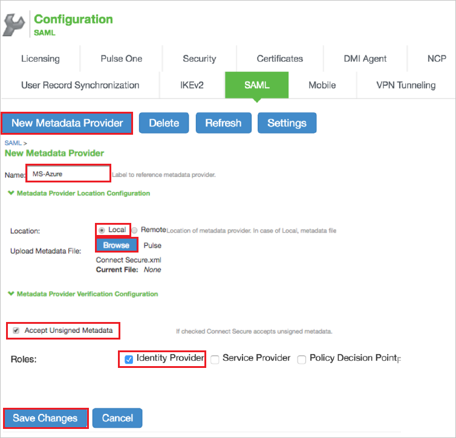
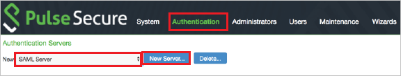
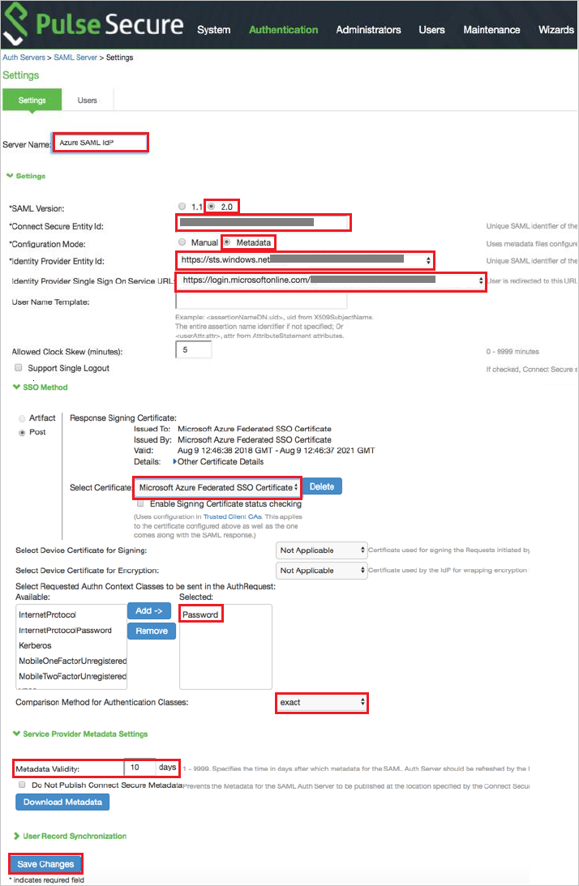

# Tutorial: Microsoft Entra single sign-on (SSO) integration with Pulse Secure PCS

In this tutorial, you'll learn how to integrate Pulse Secure PCS with Microsoft Entra ID. When you integrate Pulse Secure PCS with Microsoft Entra ID, you can:

* Control in Microsoft Entra ID who has access to Pulse Secure PCS.
* Enable your users to be automatically signed-in to Pulse Secure PCS with their Microsoft Entra accounts.
* Manage your accounts in one central location.

## Prerequisites

To get started, you need the following items:

* A Microsoft Entra subscription. If you don't have a subscription, you can get a [free account](https://azure.microsoft.com/free/).
* Pulse Secure PCS single sign-on (SSO) enabled subscription.

## Scenario description

In this tutorial, you configure and test Microsoft Entra SSO in a test environment.

* Pulse Secure PCS supports **SP** initiated SSO

## Adding Pulse Secure PCS from the gallery

To configure the integration of Pulse Secure PCS into Microsoft Entra ID, you need to add Pulse Secure PCS from the gallery to your list of managed SaaS apps.

1. Sign in to the [Microsoft Entra admin center](https://entra.microsoft.com) as at least a [Cloud Application Administrator](../roles/permissions-reference.md#cloud-application-administrator).
1. Browse to **Identity** > **Applications** > **Enterprise applications** > **New application**.
1. In the **Add from the gallery** section, type **Pulse Secure PCS** in the search box.
1. Select **Pulse Secure PCS** from results panel and then add the app. Wait a few seconds while the app is added to your tenant.

 Alternatively, you can also use the [Enterprise App Configuration Wizard](https://portal.office.com/AdminPortal/home?Q=Docs#/azureadappintegration). In this wizard, you can add an application to your tenant, add users/groups to the app, assign roles, as well as walk through the SSO configuration as well. [Learn more about Microsoft 365 wizards.](/microsoft-365/admin/misc/azure-ad-setup-guides)

## Configure and test Microsoft Entra SSO for Pulse Secure PCS

Configure and test Microsoft Entra SSO with Pulse Secure PCS using a test user called **B.Simon**. For SSO to work, you need to establish a link relationship between a Microsoft Entra user and the related user in Pulse Secure PCS.

To configure and test Microsoft Entra SSO with Pulse Secure PCS, perform the following steps:

1. **[Configure Microsoft Entra SSO](#configure-azure-ad-sso)** - to enable your users to use this feature.
    1. **[Create a Microsoft Entra test user](#create-an-azure-ad-test-user)** - to test Microsoft Entra single sign-on with B.Simon.
    1. **[Assign the Microsoft Entra test user](#assign-the-azure-ad-test-user)** - to enable B.Simon to use Microsoft Entra single sign-on.
1. **[Configure Pulse Secure PCS SSO](#configure-pulse-secure-pcs-sso)** - to configure the single sign-on settings on application side.
    1. **[Create Pulse Secure PCS test user](#create-pulse-secure-pcs-test-user)** - to have a counterpart of B.Simon in Pulse Secure PCS that is linked to the Microsoft Entra representation of user.
1. **[Test SSO](#test-sso)** - to verify whether the configuration works.

## Configure Microsoft Entra SSO

Follow these steps to enable Microsoft Entra SSO.

1. Sign in to the [Microsoft Entra admin center](https://entra.microsoft.com) as at least a [Cloud Application Administrator](../roles/permissions-reference.md#cloud-application-administrator).
1. Browse to **Identity** > **Applications** > **Enterprise applications** > **Pulse Secure PCS** > **Single sign-on**.
1. On the **Select a single sign-on method** page, select **SAML**.
1. On the **Set up single sign-on with SAML** page, click the edit/pen icon for **Basic SAML Configuration** to edit the settings.

   

1. On the **Basic SAML Configuration** section, enter the values for the following fields:

	a. In the **Sign on URL** text box, type a URL using the following pattern:
    `https://<FQDN of PCS>/dana-na/auth/saml-consumer.cgi`

    b. In the **Identifier (Entity ID)** text box, type a URL using the following pattern:
    `https://<FQDN of PCS>/dana-na/auth/saml-endpoint.cgi?p=sp1`

    c. In the **Reply URL** text box, type a URL using the following pattern:
    `https://[FQDN of PCS]/dana-na/auth/saml-consumer.cgi`

	> [!NOTE]
	> These values are not real. Update these values with the actual Sign on URL,Reply URL and Identifier. Contact [Pulse Secure PCS Client support team](mailto:support@pulsesecure.net) to get these values. You can also refer to the patterns shown in the **Basic SAML Configuration** section.

1. On the **Set up single sign-on with SAML** page, in the **SAML Signing Certificate** section,  find **Certificate (Base64)** and select **Download** to download the certificate and save it on your computer.

	

1. On the **Set up Pulse Secure PCS** section, copy the appropriate URL(s) based on your requirement.

	

### Create a Microsoft Entra test user

In this section, you'll create a test user called B.Simon.

1. Sign in to the [Microsoft Entra admin center](https://entra.microsoft.com) as at least a [User Administrator](../roles/permissions-reference.md#user-administrator).
1. Browse to **Identity** > **Users** > **All users**.
1. Select **New user** > **Create new user**, at the top of the screen.
1. In the **User** properties, follow these steps:
   1. In the **Display name** field, enter `B.Simon`.  
   1. In the **User principal name** field, enter the username@companydomain.extension. For example, `B.Simon@contoso.com`.
   1. Select the **Show password** check box, and then write down the value that's displayed in the **Password** box.
   1. Select **Review + create**.
1. Select **Create**.

### Assign the Microsoft Entra test user

In this section, you'll enable B.Simon to use single sign-on by granting access to Pulse Secure PCS.

1. Sign in to the [Microsoft Entra admin center](https://entra.microsoft.com) as at least a [Cloud Application Administrator](../roles/permissions-reference.md#cloud-application-administrator).
1. Browse to **Identity** > **Applications** > **Enterprise applications** > **Pulse Secure PCS**.
1. In the app's overview page, select **Users and groups**.
1. Select **Add user/group**, then select **Users and groups** in the **Add Assignment** dialog.
   1. In the **Users and groups** dialog, select **B.Simon** from the Users list, then click the **Select** button at the bottom of the screen.
   1. If you are expecting a role to be assigned to the users, you can select it from the **Select a role** dropdown. If no role has been set up for this app, you see "Default Access" role selected.
   1. In the **Add Assignment** dialog, click the **Assign** button.

## Configure Pulse Secure PCS SSO

This section covers the SAML configurations required to configure PCS as SAML SP. The other basic
configurations like creating Realms and Roles are not covered.

**Pulse Connect Secure configurations include:**

* Configuring Microsoft Entra ID as SAML Metadata Provider
* Configuring SAML Auth Server
* Assigning to respective Realms and Roles

#### Configuring Microsoft Entra ID as SAML Metadata Provider

Perform the following steps in the following page:

1. Log into the Pulse Connect Secure admin console
1. Navigate to **System -> Configuration -> SAML**
1. Click on **New Metadata Provider**
1. Provide the valid Name in the **Name** textbox
1. Upload the downloaded metadata XML file from Azure portal  into the **Microsoft Entra metadata file**.
1. Select **Accept Unsigned Metadata**
1. Select Roles as **Identity Provider**
1. Click on **Save changes**.

#### Steps to create a SAML Auth Server:

1. Navigate to **Authentication -> Auth Servers**
1. Select **New: SAML Server** and click **New Server**

    

1. Perform the following steps in the settings page:

    

    a. Provide **Server Name** in the textbox.

    b. Select **SAML Version 2.0** and **Configuration Mode** as **Metadata**.

    c. Copy the **Connect Secure Entity Id** value and paste it into the **Identifier URL** box in the **Basic SAML Configuration** dialog box.

    d. Select Microsoft Entra Entity Id value from the **Identity Provider Entity Id drop down list**.

    e. Select Microsoft Entra Login URL value from the **Identity Provider Single Sign-On Service URL drop down list**.

    f. **Single Logout** is an optional setting. If this option is selected, it prompts for a new authentication after logout. If this option is not selected and you have not closed the browser, you can reconnect without authentication.

    g. Select the **Requested Authn Context Class** as **Password** and the **Comparison Method** as **exact**.

    h. Set the **Metadata Validity** in terms of number of days.
    
    i. Click **Save Changes**

### Create Pulse Secure PCS test user

In this section, you create a user called Britta Simon in Pulse Secure PCS. Work with [Pulse Secure PCS support team](mailto:support@pulsesecure.net) to add the users in the Pulse Secure PCS platform. Users must be created and activated before you use single sign-on.

## Test SSO 

In this section, you test your Microsoft Entra single sign-on configuration with following options. 

1. Click on **Test this application**, this will redirect to Pulse Secure PCS Sign-on URL where you can initiate the login flow. 

2. Go to Pulse Secure PCS Sign-on URL directly and initiate the login flow from there.

3. You can use Microsoft Access Panel. When you click the Pulse Secure PCS tile in the Access Panel, this will redirect to Pulse Secure PCS Sign-on URL. For more information about the Access Panel, see [Introduction to the Access Panel](https://support.microsoft.com/account-billing/sign-in-and-start-apps-from-the-my-apps-portal-2f3b1bae-0e5a-4a86-a33e-876fbd2a4510).

## Next steps

Once you configure Pulse Secure PCS you can enforce session control, which protects exfiltration and infiltration of your organization’s sensitive data in real time. Session control extends from Conditional Access. [Learn how to enforce session control with Microsoft Defender for Cloud Apps](/cloud-app-security/proxy-deployment-any-app).
