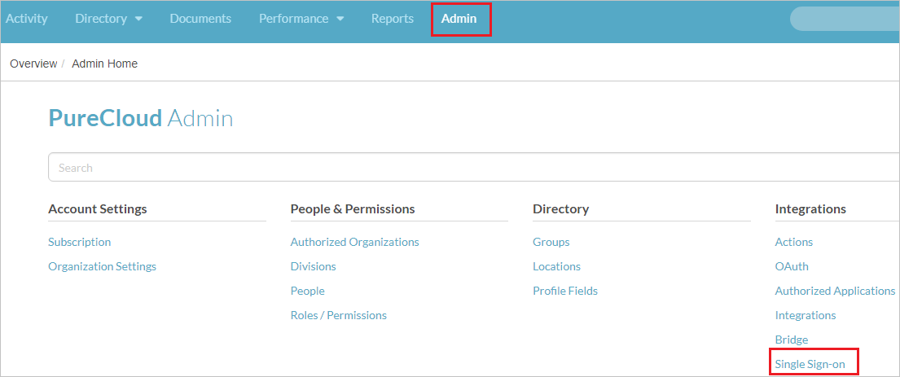
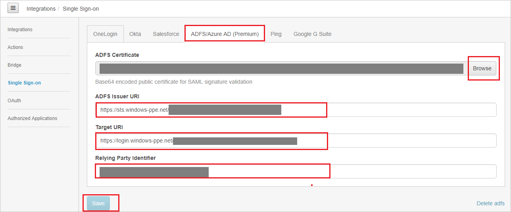
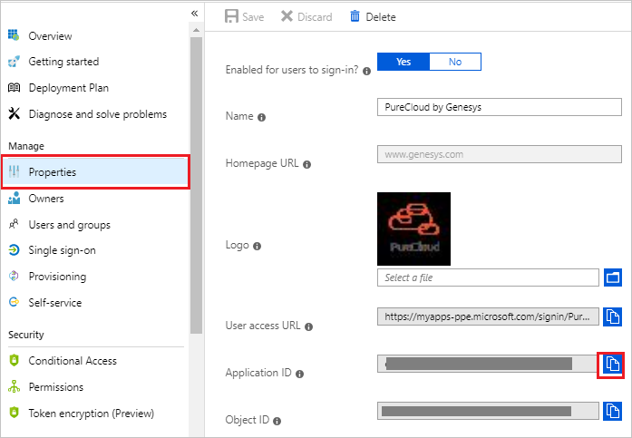
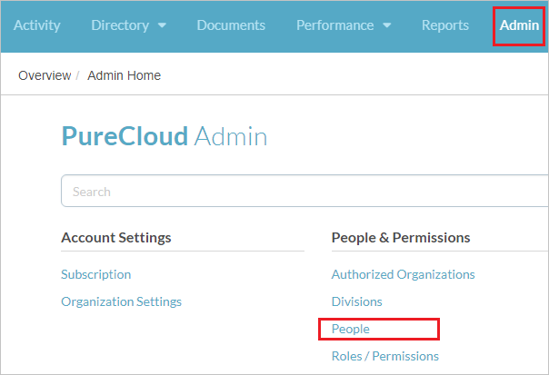
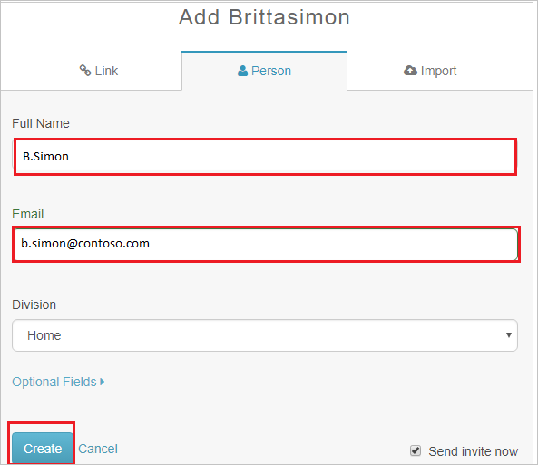

# Tutorial: Azure Active Directory integration with PureCloud by Genesys

In this tutorial, you learn how to integrate PureCloud by Genesys with Azure Active Directory (Azure AD).
Integrating PureCloud by Genesys with Azure AD provides you with the following benefits:

* You can control in Azure AD who has access to PureCloud by Genesys.
* You can enable your users to be automatically signed-in to PureCloud by Genesys (Single Sign-On) with their Azure AD accounts.
* You can manage your accounts in one central location - the Azure portal.

If you want to know more details about SaaS app integration with Azure AD, see [What is application access and single sign-on with Azure Active Directory](https://docs.microsoft.com/azure/active-directory/active-directory-appssoaccess-whatis).
If you don't have an Azure subscription, [create a free account](https://azure.microsoft.com/free/) before you begin.

## Prerequisites

To configure Azure AD integration with PureCloud by Genesys, you need the following items:

* An Azure AD subscription. If you don't have an Azure AD environment, you can get one-month trial [here](https://azure.microsoft.com/pricing/free-trial/)
* PureCloud by Genesys single sign-on enabled subscription

## Scenario description

In this tutorial, you configure and test Azure AD single sign-on in a test environment.

* PureCloud by Genesys supports **SP and IDP** initiated SSO

## Adding PureCloud by Genesys from the gallery

To configure the integration of PureCloud by Genesys into Azure AD, you need to add PureCloud by Genesys from the gallery to your list of managed SaaS apps.

**To add PureCloud by Genesys from the gallery, perform the following steps:**

1. In the **[Azure portal](https://portal.azure.com)**, on the left navigation panel, click **Azure Active Directory** icon.

	

2. Navigate to **Enterprise Applications** and then select the **All Applications** option.

	

3. To add new application, click **New application** button on the top of dialog.

	

4. In the search box, type **PureCloud by Genesys**, select **PureCloud by Genesys** from result panel then click **Add** button to add the application.

	 

## Configure and test Azure AD single sign-on

In this section, you configure and test Azure AD single sign-on with PureCloud by Genesys based on a test user called **Britta Simon**.
For single sign-on to work, a link relationship between an Azure AD user and the related user in PureCloud by Genesys needs to be established.

To configure and test Azure AD single sign-on with PureCloud by Genesys, you need to complete the following building blocks:

1. **[Configure Azure AD Single Sign-On](#configure-azure-ad-single-sign-on)** - to enable your users to use this feature.
2. **[Configure PureCloud by Genesys Single Sign-On](#configure-purecloud-by-genesys-single-sign-on)** - to configure the Single Sign-On settings on application side.
3. **[Create an Azure AD test user](#create-an-azure-ad-test-user)** - to test Azure AD single sign-on with Britta Simon.
4. **[Assign the Azure AD test user](#assign-the-azure-ad-test-user)** - to enable Britta Simon to use Azure AD single sign-on.
5. **[Create PureCloud by Genesys test user](#create-purecloud-by-genesys-test-user)** - to have a counterpart of Britta Simon in PureCloud by Genesys that is linked to the Azure AD representation of user.
6. **[Test single sign-on](#test-single-sign-on)** - to verify whether the configuration works.

### Configure Azure AD single sign-on

In this section, you enable Azure AD single sign-on in the Azure portal.

To configure Azure AD single sign-on with PureCloud by Genesys, perform the following steps:

1. In the [Azure portal](https://portal.azure.com/), on the **PureCloud by Genesys** application integration page, select **Single sign-on**.

    

2. On the **Select a Single sign-on method** dialog, select **SAML/WS-Fed** mode to enable single sign-on.

    

3. On the **Set up Single Sign-On with SAML** page, click **Edit** icon to open **Basic SAML Configuration** dialog.

	

4. On the **Basic SAML Configuration** section, If you wish to configure the application in **IDP** initiated mode, perform the following steps:

    

    a. In the **Identifier** text box, type a URL as per your region:

	| |
	|--|
	| `https://login.mypurecloud.com/saml` |
	| `https://login.mypurecloud.de/saml` |
	| `https://login.mypurecloud.jp/saml` |
	| `https://login.mypurecloud.ie/saml` |
	| `https://login.mypurecloud.au/saml` |

    b. In the **Reply URL** text box, type a URL as per your region:

	| |
	|--|
    | `https://login.mypurecloud.com/saml` |
	| `https://login.mypurecloud.de/saml` |
	| `https://login.mypurecloud.jp/saml` |
	| `https://login.mypurecloud.ie/saml` |
	| `https://login.mypurecloud.com.au/saml` |

5. Click **Set additional URLs** and perform the following step if you wish to configure the application in **SP** initiated mode:

    

    In the **Sign-on URL** text box, type a URL as per your region:
	
	| |
	|--|
	| `https://login.mypurecloud.com` |
	| `https://login.mypurecloud.de` |
	| `https://login.mypurecloud.jp` |
	| `https://login.mypurecloud.ie` |
	| `https://login.mypurecloud.com.au` |

6. PureCloud by Genesys application expects the SAML assertions in a specific format, which requires you to add custom attribute mappings to your SAML token attributes configuration. The following screenshot shows the list of default attributes. Click **Edit** icon to open **User Attributes** dialog.

	

7. In addition to above, PureCloud by Genesys application expects few more attributes to be passed back in SAML response. In the **User Claims** section on the **User Attributes** dialog, perform the following steps to add SAML token attribute as shown in the below table:

	| Name | Source Attribute|
	| ---------------| --------------- |
	| Email | user.userprinicipalname |
	| OrganizationName | `Your organization name` |

	a. Click **Add new claim** to open the **Manage user claims** dialog.

	

	

	b. In the **Name** textbox, type the attribute name shown for that row.

	c. Leave the **Namespace** blank.

	d. Select Source as **Attribute**.

	e. From the **Source attribute** list, type the attribute value shown for that row.

	f. Click **Ok**

	g. Click **Save**.

8. On the **Set up Single Sign-On with SAML** page, in the **SAML Signing Certificate** section, click **Download** to download the **Certificate (Base64)** from the given options as per your requirement and save it on your computer.

	

9. On the **Set up PureCloud by Genesys** section, copy the appropriate URL(s) as per your requirement.

	

	a. Login URL

	b. Azure AD Identifier

	c. Logout URL

### Configure PureCloud by Genesys Single Sign-On

1. In a different web browser window, login to PureCloud by Genesys as an Administrator.

2. Click on **Admin** on the top and navigate to **Single Sign-on** under **Integrations**.

	

3. Switch to **ADFS/Azure AD(Premium)** tab, and perform the following steps:

	

	a. Click **Browse** to upload the base-64 encoded certificate that you have downloaded from the Azure portal, into the **ADFS Certificate**.

	b. In the **ADFS Issuer URI** textbox, paste the value of **Azure AD Identifier** which you have copied from the Azure portal.

	c. In the **Target URI** textbox, paste the value of **Login URL** which you have copied from the Azure portal.

	d. For **Relying Party Identifier** value, you need to go to the Azure portal, on the **PureCloud by Genesys** application integration page, click on **Properties** tab and copy the **Application ID** value. Paste it in the **Relying Party Identifier** textbox. 

	

	e. Click **Save**	

### Create an Azure AD test user 

The objective of this section is to create a test user in the Azure portal called Britta Simon.

1. In the Azure portal, in the left pane, select **Azure Active Directory**, select **Users**, and then select **All users**.

    

2. Select **New user** at the top of the screen.

    

3. In the User properties, perform the following steps.

    

    a. In the **Name** field enter **BrittaSimon**.
  
    b. In the **User name** field type **brittasimon\@yourcompanydomain.extension**  
    For example, BrittaSimon@contoso.com

    c. Select **Show password** check box, and then write down the value that's displayed in the Password box.

    d. Click **Create**.

### Assign the Azure AD test user

In this section, you enable Britta Simon to use Azure single sign-on by granting access to PureCloud by Genesys.

1. In the Azure portal, select **Enterprise Applications**, select **All applications**, then select **PureCloud by Genesys**.

	

2. In the applications list, select **PureCloud by Genesys**.

	

3. In the menu on the left, select **Users and groups**.

    

4. Click the **Add user** button, then select **Users and groups** in the **Add Assignment** dialog.

    

5. In the **Users and groups** dialog select **Britta Simon** in the Users list, then click the **Select** button at the bottom of the screen.

6. If you are expecting any role value in the SAML assertion then in the **Select Role** dialog select the appropriate role for the user from the list, then click the **Select** button at the bottom of the screen.

7. In the **Add Assignment** dialog click the **Assign** button.

### Create PureCloud by Genesys test user

To enable Azure AD users to log in to PureCloud by Genesys, they must be provisioned into PureCloud by Genesys. In PureCloud by Genesys, provisioning is a manual task.

**To provision a user account, perform the following steps:**

1. Log in to PureCloud by Genesys as an Administrator.

2. Click on **Admin** on the top and navigate to **People** under **People & Permissions**.

	

3. On the People page, click on **Add Person**.

	

4. On the **Add People to the Organization** pop-up, perform the following steps:

	

	a. In **Full Name** text box, enter the name of user like **Brittasimon**.

	b. In **Email** text box, enter the email of user like **brittasimon\@contoso.com**.
	
	c. Click **Create**.

### Test single sign-on 

In this section, you test your Azure AD single sign-on configuration using the Access Panel.

When you click the PureCloud by Genesys tile in the Access Panel, you should be automatically signed in to the PureCloud by Genesys for which you set up SSO. For more information about the Access Panel, see [Introduction to the Access Panel](https://docs.microsoft.com/azure/active-directory/active-directory-saas-access-panel-introduction).

## Additional Resources

- [List of Tutorials on How to Integrate SaaS Apps with Azure Active Directory](https://docs.microsoft.com/azure/active-directory/active-directory-saas-tutorial-list)

- [What is application access and single sign-on with Azure Active Directory?](https://docs.microsoft.com/azure/active-directory/active-directory-appssoaccess-whatis)

- [What is Conditional Access in Azure Active Directory?](https://docs.microsoft.com/azure/active-directory/conditional-access/overview)

