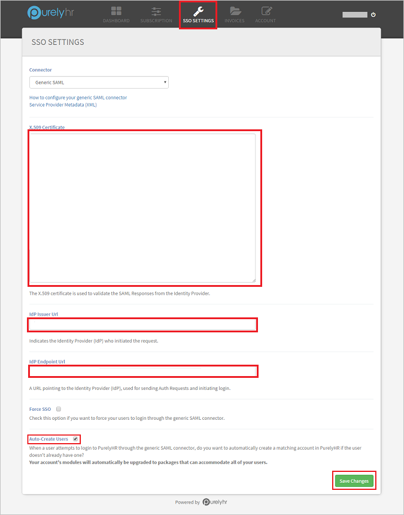
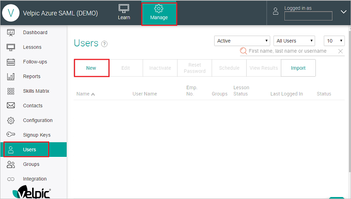

# Tutorial: Azure Active Directory single sign-on (SSO) integration with PurelyHR

In this tutorial, you'll learn how to integrate PurelyHR with Azure Active Directory (Azure AD). When you integrate PurelyHR with Azure AD, you can:

* Control in Azure AD who has access to PurelyHR.
* Enable your users to be automatically signed-in to PurelyHR with their Azure AD accounts.
* Manage your accounts in one central location - the Azure portal.

## Prerequisites

To get started, you need the following items:

* An Azure AD subscription. If you don't have a subscription, you can get a [free account](https://azure.microsoft.com/free/).
* PurelyHR single sign-on (SSO) enabled subscription.

## Scenario description

In this tutorial, you configure and test Azure AD SSO in a test environment.

* PurelyHR supports **SP and IDP** initiated SSO.
* PurelyHR supports **Just In Time** user provisioning.

> [!NOTE]
> Identifier of this application is a fixed string value so only one instance can be configured in one tenant.

## Add PurelyHR from the gallery

To configure the integration of PurelyHR into Azure AD, you need to add PurelyHR from the gallery to your list of managed SaaS apps.

1. Sign in to the Azure portal using either a work or school account, or a personal Microsoft account.
1. On the left navigation pane, select the **Azure Active Directory** service.
1. Navigate to **Enterprise Applications** and then select **All Applications**.
1. To add new application, select **New application**.
1. In the **Add from the gallery** section, type **PurelyHR** in the search box.
1. Select **PurelyHR** from results panel and then add the app. Wait a few seconds while the app is added to your tenant.

 Alternatively, you can also use the [Enterprise App Configuration Wizard](https://portal.office.com/AdminPortal/home?Q=Docs#/azureadappintegration). In this wizard, you can add an application to your tenant, add users/groups to the app, assign roles, as well as walk through the SSO configuration as well. [Learn more about Microsoft 365 wizards.](/microsoft-365/admin/misc/azure-ad-setup-guides)

## Configure and test Azure AD SSO for PurelyHR

Configure and test Azure AD SSO with PurelyHR using a test user called **B.Simon**. For SSO to work, you need to establish a link relationship between an Azure AD user and the related user in PurelyHR.

To configure and test Azure AD SSO with PurelyHR, perform the following steps:

1. **[Configure Azure AD SSO](#configure-azure-ad-sso)** - to enable your users to use this feature.
    1. **[Create an Azure AD test user](#create-an-azure-ad-test-user)** - to test Azure AD single sign-on with B.Simon.
    1. **[Assign the Azure AD test user](#assign-the-azure-ad-test-user)** - to enable B.Simon to use Azure AD single sign-on.
1. **[Configure PurelyHR SSO](#configure-purelyhr-sso)** - to configure the single sign-on settings on application side.
    1. **[Create PurelyHR test user](#create-purelyhr-test-user)** - to have a counterpart of B.Simon in PurelyHR that is linked to the Azure AD representation of user.
1. **[Test SSO](#test-sso)** - to verify whether the configuration works.

## Configure Azure AD SSO

Follow these steps to enable Azure AD SSO in the Azure portal.

1. In the Azure portal, on the **PurelyHR** application integration page, find the **Manage** section and select **single sign-on**.
1. On the **Select a single sign-on method** page, select **SAML**.
1. On the **Set up single sign-on with SAML** page, click the pencil icon for **Basic SAML Configuration** to edit the settings.

   

1. On the **Basic SAML Configuration** section, if you wish to configure the application in **IDP** initiated mode, perform the following step:

    In the **Reply URL** text box, type a URL using the following pattern:
    `https://<COMPANY_ID>.purelyhr.com/sso-consume`

1. Click **Set additional URLs** and perform the following step if you wish to configure the application in **SP** initiated mode:

    In the **Sign-on URL** text box, type a URL using the following pattern:
    `https://<COMPANY_ID>.purelyhr.com/sso-initiate`

	> [!NOTE]
	> These values are not real. Update these values with the actual Reply URL and Sign-On URL. Contact [PurelyHR Client support team](https://support.purelyhr.com/) to get these values. You can also refer to the patterns shown in the **Basic SAML Configuration** section in the Azure portal.

1. On the **Set up single sign-on with SAML** page, in the **SAML Signing Certificate** section,  find **Certificate (Base64)** and select **Download** to download the certificate and save it on your computer.

	

1. On the **Set up PurelyHR** section, copy the appropriate URL(s) based on your requirement.

	

### Create an Azure AD test user

In this section, you'll create a test user in the Azure portal called B.Simon.

1. From the left pane in the Azure portal, select **Azure Active Directory**, select **Users**, and then select **All users**.
1. Select **New user** at the top of the screen.
1. In the **User** properties, follow these steps:
   1. In the **Name** field, enter `B.Simon`.  
   1. In the **User name** field, enter the username@companydomain.extension. For example, `B.Simon@contoso.com`.
   1. Select the **Show password** check box, and then write down the value that's displayed in the **Password** box.
   1. Click **Create**.

### Assign the Azure AD test user

In this section, you'll enable B.Simon to use Azure single sign-on by granting access to PurelyHR.

1. In the Azure portal, select **Enterprise Applications**, and then select **All applications**.
1. In the applications list, select **PurelyHR**.
1. In the app's overview page, find the **Manage** section and select **Users and groups**.
1. Select **Add user**, then select **Users and groups** in the **Add Assignment** dialog.
1. In the **Users and groups** dialog, select **B.Simon** from the Users list, then click the **Select** button at the bottom of the screen.
1. If you are expecting a role to be assigned to the users, you can select it from the **Select a role** dropdown. If no role has been set up for this app, you see "Default Access" role selected.
1. In the **Add Assignment** dialog, click the **Assign** button.

## Configure PurelyHR SSO

1. To automate the configuration within PurelyHR, you need to install **My Apps Secure Sign-in browser extension** by clicking **Install the extension**.

	

1. After adding extension to the browser, click on **Set up PurelyHR** will direct you to the PurelyHR application. From there, provide the admin credentials to sign into PurelyHR. The browser extension will automatically configure the application for you and automate steps 3-5.

	

1. If you want to set up PurelyHR manually, open a new web browser window and sign in to your PurelyHR company site as an administrator and perform the following steps:

1. Open the **Dashboard** from the options in the toolbar and click **SSO Settings**.

1. Paste the values in the boxes as described below-

		

	a. Open the **Certificate(Bas64)** downloaded from the Azure portal in notepad and copy the certificate value. Paste the copied value into the **X.509 Certificate** box.

	b. In the **Idp Issuer URL** box, paste the **Azure AD Identifier** copied from the Azure portal.

	c. In the **Idp Endpoint URL** box, paste the **Login URL** copied from the Azure portal. 

	d. Check the **Auto-Create Users** checkbox to enable automatic user provisioning in PurelyHR.

	e. Click **Save Changes** to save the settings.

### Create PurelyHR test user

This step is usually not required as the application supports just in time user provisioning. If the automatic user provisioning is not enabled then manual user creation can be done as described below.

Sign into your Velpic SAML company site as an administrator and perform following steps:

1. Click on Manage tab and go to Users section, then click on New button to add users.

	

2. On the **“Create New User”** dialog page, perform the following steps.

	

	a. In the **First Name** textbox, type the first name of B.

	b. In the **Last Name** textbox, type the last name of Simon.

	c. In the **User Name** textbox, type the user name of B.Simon.

	d. In the **Email** textbox, type the email address of B.Simon@contoso.com account.

	e. Rest of the information is optional, you can fill it if needed.

	f. Click **SAVE**.

## Test SSO 

In this section, you test your Azure AD single sign-on configuration with following options. 

#### SP initiated:

* Click on **Test this application** in Azure portal. This will redirect to PurelyHR Sign on URL where you can initiate the login flow.  

* Go to PurelyHR Sign-on URL directly and initiate the login flow from there.

#### IDP initiated:

* Click on **Test this application** in Azure portal and you should be automatically signed in to the PurelyHR for which you set up the SSO. 

You can also use Microsoft My Apps to test the application in any mode. When you click the PurelyHR tile in the My Apps, if configured in SP mode you would be redirected to the application sign on page for initiating the login flow and if configured in IDP mode, you should be automatically signed in to the PurelyHR for which you set up the SSO. For more information about the My Apps, see [Introduction to the My Apps](https://support.microsoft.com/account-billing/sign-in-and-start-apps-from-the-my-apps-portal-2f3b1bae-0e5a-4a86-a33e-876fbd2a4510).

## Next steps

Once you configure PurelyHR you can enforce session control, which protects exfiltration and infiltration of your organization’s sensitive data in real time. Session control extends from Conditional Access. [Learn how to enforce session control with Microsoft Defender for Cloud Apps](/cloud-app-security/proxy-deployment-aad).
