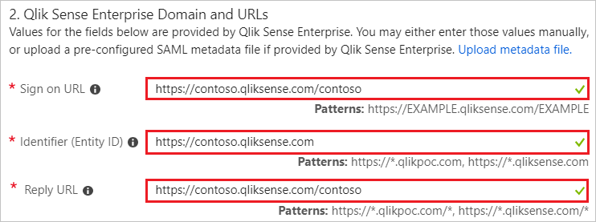
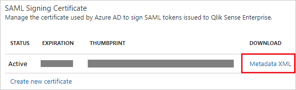

# Tutorial: Azure Active Directory integration with Qlik Sense Enterprise

In this tutorial, you learn how to integrate Qlik Sense Enterprise with Azure Active Directory (Azure AD).

Integrating Qlik Sense Enterprise with Azure AD provides you with the following benefits:

- You can control in Azure AD who has access to Qlik Sense Enterprise.
- You can enable your users to automatically get signed-on to Qlik Sense Enterprise (Single Sign-On) with their Azure AD accounts.
- You can manage your accounts in one central location - the Azure portal.

If you want to know more details about SaaS app integration with Azure AD, see [what is application access and single sign-on with Azure Active Directory](../manage-apps/what-is-single-sign-on.md).

## Prerequisites

To configure Azure AD integration with Qlik Sense Enterprise, you need the following items:

- An Azure AD subscription
- A Qlik Sense Enterprise single sign-on enabled subscription

> [!NOTE]
> To test the steps in this tutorial, we do not recommend using a production environment.

To test the steps in this tutorial, you should follow these recommendations:

- Do not use your production environment, unless it is necessary.
- If you don't have an Azure AD trial environment, you can get a one-month trial here: [Trial offer](https://azure.microsoft.com/pricing/free-trial/).

## Scenario description
In this tutorial, you test Azure AD single sign-on in a test environment. 
The scenario outlined in this tutorial consists of two main building blocks:

1. Adding Qlik Sense Enterprise from the gallery
2. Configuring and testing Azure AD single sign-on

## Adding Qlik Sense Enterprise from the gallery
To configure the integration of Qlik Sense Enterprise into Azure AD, you need to add Qlik Sense Enterprise from the gallery to your list of managed SaaS apps.

**To add Qlik Sense Enterprise from the gallery, perform the following steps:**

1. In the **[Azure portal](https://portal.azure.com)**, on the left navigation panel, click **Azure Active Directory** icon.

	![The Azure Active Directory button][1]

2. Navigate to **Enterprise applications**. Then go to **All applications**.

	![The Enterprise applications blade][2]

3. To add new application, click **New application** button on the top of dialog.

	![The New application button][3]

4. In the search box, type **Qlik Sense Enterprise**, select **Qlik Sense Enterprise** from result panel then click **Add** button to add the application.

    

## Configure and test Azure AD single sign-on

In this section, you configure and test Azure AD single sign-on with Qlik Sense Enterprise based on a test user called "Britta Simon".

For single sign-on to work, Azure AD needs to know what the counterpart user in Qlik Sense Enterprise is to a user in Azure AD. In other words, a link relationship between an Azure AD user and the related user in Qlik Sense Enterprise needs to be established.

In Qlik Sense Enterprise, assign the value of the **user name** in Azure AD as the value of the **Username** to establish the link relationship.

To configure and test Azure AD single sign-on with Qlik Sense Enterprise, you need to complete the following building blocks:

1. **[Configure Azure AD Single Sign-On](#configure-azure-ad-single-sign-on)** - to enable your users to use this feature.
2. **[Create an Azure AD test user](#create-an-azure-ad-test-user)** - to test Azure AD single sign-on with Britta Simon.
3. **[Create a Qlik Sense Enterprise test user](#create-a-qlik-sense-enterprise-test-user)** - to have a counterpart of Britta Simon in Qlik Sense Enterprise that is linked to the Azure AD representation of user.
4. **[Assign the Azure AD test user](#assign-the-azure-ad-test-user)** - to enable Britta Simon to use Azure AD single sign-on.
5. **[Test single sign-on](#test-single-sign-on)** - to verify whether the configuration works.

### Configure Azure AD single sign-on

In this section, you enable Azure AD single sign-on in the Azure portal and configure single sign-on in your Qlik Sense Enterprise application.

**To configure Azure AD single sign-on with Qlik Sense Enterprise, perform the following steps:**

1. In the Azure portal, on the **Qlik Sense Enterprise** application integration page, click **Single sign-on**.

	![Configure single sign-on link][4]

2. On the **Single sign-on** dialog, select **Mode** as **SAML-based Sign-on** to enable single sign-on.

	

3. On the **Qlik Sense Enterprise Domain and URLs** section, perform the following steps:

	

    a. In the **Sign-on URL** textbox, type a URL using the following pattern: `https://<Qlik Sense Fully Qualifed Hostname>:4443/azure/hub`

    b. In the **Identifier** textbox, type a URL using the following pattern:
    | |
    |--|
    | `https://<Qlik Sense Fully Qualifed Hostname>.qlikpoc.com`|
    | `https://<Qlik Sense Fully Qualifed Hostname>.qliksense.com`|
    | |

    c. In the **Reply URL** textbox, type a URL using the following pattern:

    `https://<Qlik Sense Fully Qualifed Hostname>:4443/samlauthn/`

	> [!NOTE]
	> These values are not real. Update these values with the actual Sign-On URL, Identifier, and Reply URL, Which are explained later in this tutorial or contact [Qlik Sense Enterprise Client support team](https://www.qlik.com/us/services/support) to get these values.

4. On the **SAML Signing Certificate** section, click **Metadata XML** and then save the metadata file on your computer.

	

5. Click **Save** button.

	

6. Prepare the Federation Metadata XML file so that you can upload that to Qlik Sense server.

    > [!NOTE]
    > Before uploading the IdP metadata to the Qlik Sense server, the file needs to be edited to remove information to ensure proper operation between Azure AD and Qlik Sense server.

    ![QlikSense][qs24]

    a. Open the FederationMetaData.xml file, which you have downloaded from Azure portal in a text editor.

    b. Search for the value **RoleDescriptor**.  There are four entries (two pairs of opening and closing element tags).

    c. Delete the RoleDescriptor tags and all information in between from the file.

    d. Save the file and keep it nearby for use later in this document.

7. Navigate to the Qlik Sense Qlik Management Console (QMC) as a user who can create virtual proxy configurations.

8. In the QMC, click on the **Virtual Proxies** menu item.

    ![QlikSense][qs6]

9. At the bottom of the screen, click the **Create new** button.

    ![QlikSense][qs7]

10. The Virtual proxy edit screen appears.  On the right side of the screen is a menu for making configuration options visible.

    ![QlikSense][qs9]

11. With the Identification menu option checked, enter the identifying information for the Azure virtual proxy configuration.

    ![QlikSense][qs8]  

    a. The **Description** field is a friendly name for the virtual proxy configuration.  Enter a value for a description.

    b. The **Prefix** field identifies the virtual proxy endpoint for connecting to Qlik Sense with Azure AD Single Sign-On.  Enter a unique prefix name for this virtual proxy.

    c. **Session inactivity timeout (minutes)** is the timeout for connections through this virtual proxy.

    d. The **Session cookie header name** is the cookie name storing the session identifier for the Qlik Sense session a user receives after successful authentication.  This name must be unique.

12. Click on the Authentication menu option to make it visible.  The Authentication screen appears.

    ![QlikSense][qs10]

    a. The **Anonymous access mode** drop down determines if anonymous users may access Qlik Sense through the virtual proxy.  The default option is No anonymous user.

    b. The **Authentication method** drop-down determines the authentication scheme the virtual proxy will use.  Select SAML from the drop-down list.  More options appear as a result.

    c. In the **SAML host URI field**, input the hostname users enter to access Qlik Sense through this SAML virtual proxy.  The hostname is the uri of the Qlik Sense server.

    d. In the **SAML entity ID**, enter the same value entered for the SAML host URI field.

    e. The **SAML IdP metadata** is the file edited earlier in the **Edit Federation Metadata from Azure AD Configuration** section.  **Before uploading the IdP metadata, the file needs to be edited** to remove information to ensure proper operation between Azure AD and Qlik Sense server.  **Please refer to the instructions above if the file has yet to be edited.**  If the file has been edited click on the Browse button and select the edited metadata file to upload it to the virtual proxy configuration.

    f. Enter the attribute name or schema reference for the SAML attribute representing the **UserID** Azure AD sends to the Qlik Sense server.  Schema reference information is available in the Azure app screens post configuration.  To use the name attribute, enter `http://schemas.xmlsoap.org/ws/2005/05/identity/claims/name`.

    g. Enter the value for the **user directory** that will be attached to users when they authenticate to Qlik Sense server through Azure AD.  Hardcoded values must be surrounded by **square brackets []**.  To use an attribute sent in the Azure AD SAML assertion, enter the name of the attribute in this text box **without** square brackets.

    h. The **SAML signing algorithm** sets the service provider (in this case Qlik Sense server) certificate signing for the virtual proxy configuration.  If Qlik Sense server uses a trusted certificate generated using Microsoft Enhanced RSA and AES Cryptographic Provider, change the SAML signing algorithm to **SHA-256**.

    i. The SAML attribute mapping section allows for additional attributes like groups to be sent to Qlik Sense for use in security rules.

13. Click on the **LOAD BALANCING** menu option to make it visible.  The Load Balancing screen appears.

    ![QlikSense][qs11]

14. Click on the **Add new server node** button, select engine node or nodes Qlik Sense will send sessions to for load balancing purposes, and click the **Add** button.

    ![QlikSense][qs12]

15. Click on the Advanced menu option to make it visible. The Advanced screen appears.

    ![QlikSense][qs13]

    The Host white list identifies hostnames that are accepted when connecting to the Qlik Sense server.  **Enter the hostname users will specify when connecting to Qlik Sense server.** The hostname is the same value as the SAML host uri without the https://.

16. Click the **Apply** button.

    ![QlikSense][qs14]

17. Click OK to accept the warning message that states proxies linked to the virtual proxy will be restarted.

    ![QlikSense][qs15]

18. On the right side of the screen, the Associated items menu appears.  Click on the **Proxies** menu option.

    ![QlikSense][qs16]

19. The proxy screen appears.  Click the **Link** button at the bottom to link a proxy to the virtual proxy.

    ![QlikSense][qs17]

20. Select the proxy node that will support this virtual proxy connection and click the **Link** button.  After linking, the proxy will be listed under associated proxies.

    ![QlikSense][qs18]
  
    ![QlikSense][qs19]

21. After about five to ten seconds, the Refresh QMC message will appear.  Click the **Refresh QMC** button.

    ![QlikSense][qs20]

22. When the QMC refreshes, click on the **Virtual proxies** menu item. The new SAML virtual proxy entry is listed in the table on the screen.  Single click on the virtual proxy entry.

    ![QlikSense][qs51]

23. At the bottom of the screen, the Download SP metadata button will activate.  Click the **Download SP metadata** button to save the metadata to a file.

    ![QlikSense][qs52]

24. Open the sp metadata file.  Observe the **entityID** entry and the **AssertionConsumerService** entry.  These values are equivalent to the **Identifier**, **Sign on URL** and the **Reply URL** in the Azure AD application configuration. Paste these values in the **Qlik Sense Enterprise Domain and URLs** section in the Azure AD application configuration if they are not matching, then you should replace them in the Azure AD App configuration wizard.

    ![QlikSense][qs53]

### Create an Azure AD test user

The objective of this section is to create a test user in the Azure portal called Britta Simon.

![Create an Azure AD test user][100]

**To create a test user in Azure AD, perform the following steps:**

1. In the Azure portal, in the left pane, click the **Azure Active Directory** button.

   

2. To display the list of users, go to **Users and groups**, and then click **All users**.

   

3. To open the **User** dialog box, click **Add** at the top of the **All Users** dialog box.

   

4. In the **User** dialog box, perform the following steps:

   

   a. In the **Name** box, type **BrittaSimon**.

   b. In the **User name** box, type the email address of user Britta Simon.

   c. Select the **Show Password** check box, and then write down the value that's displayed in the **Password** box.

   d. Click **Create**.

### Create a Qlik Sense Enterprise test user

In this section, you create a user called Britta Simon in Qlik Sense Enterprise. Work with [Qlik Sense Enterprise Client support team](https://www.qlik.com/us/services/support) to add the users in the Qlik Sense Enterprise platform. Users must be created and activated before you use single sign-on.

### Assign the Azure AD test user

In this section, you enable Britta Simon to use Azure single sign-on by granting access to Qlik Sense Enterprise.

![Assign the user role][200]

**To assign Britta Simon to Qlik Sense Enterprise, perform the following steps:**

1. In the Azure portal, open the applications view, and then navigate to the directory view and go to **Enterprise applications** then click **All applications**.

	![Assign User][201]

2. In the applications list, select **Qlik Sense Enterprise**.

	  

3. In the menu on the left, click **Users and groups**.

	![The "Users and groups" link][202]

4. Click **Add** button. Then select **Users and groups** on **Add Assignment** dialog.

	![The Add Assignment pane][203]

5. On **Users and groups** dialog, select **Britta Simon** in the Users list.

6. Click **Select** button on **Users and groups** dialog.

7. Click **Assign** button on **Add Assignment** dialog.

### Test single sign-on

In this section, you test your Azure AD single sign-on configuration using the Access Panel.

When you click the Qlik Sense Enterprise tile in the Access Panel, you should get automatically signed-on to your Qlik Sense Enterprise application.

## Additional resources

* [List of Tutorials on How to Integrate SaaS Apps with Azure Active Directory](tutorial-list.md)
* [What is application access and single sign-on with Azure Active Directory?](../manage-apps/what-is-single-sign-on.md)

<!--Image references-->

[1]: ./media/qliksense-enterprise-tutorial/tutorial_general_01.png
[2]: ./media/qliksense-enterprise-tutorial/tutorial_general_02.png
[3]: ./media/qliksense-enterprise-tutorial/tutorial_general_03.png
[4]: ./media/qliksense-enterprise-tutorial/tutorial_general_04.png

[100]: ./media/qliksense-enterprise-tutorial/tutorial_general_100.png

[200]: ./media/qliksense-enterprise-tutorial/tutorial_general_200.png
[201]: ./media/qliksense-enterprise-tutorial/tutorial_general_201.png
[202]: ./media/qliksense-enterprise-tutorial/tutorial_general_202.png
[203]: ./media/qliksense-enterprise-tutorial/tutorial_general_203.png

[qs6]: ./media/qliksense-enterprise-tutorial/tutorial_qliksenseenterprise_06.png
[qs7]: ./media/qliksense-enterprise-tutorial/tutorial_qliksenseenterprise_07.png
[qs8]: ./media/qliksense-enterprise-tutorial/tutorial_qliksenseenterprise_08.png
[qs9]: ./media/qliksense-enterprise-tutorial/tutorial_qliksenseenterprise_09.png
[qs10]: ./media/qliksense-enterprise-tutorial/tutorial_qliksenseenterprise_10.png
[qs11]: ./media/qliksense-enterprise-tutorial/tutorial_qliksenseenterprise_11.png
[qs12]: ./media/qliksense-enterprise-tutorial/tutorial_qliksenseenterprise_12.png
[qs13]: ./media/qliksense-enterprise-tutorial/tutorial_qliksenseenterprise_13.png
[qs14]: ./media/qliksense-enterprise-tutorial/tutorial_qliksenseenterprise_14.png
[qs15]: ./media/qliksense-enterprise-tutorial/tutorial_qliksenseenterprise_15.png
[qs16]: ./media/qliksense-enterprise-tutorial/tutorial_qliksenseenterprise_16.png
[qs17]: ./media/qliksense-enterprise-tutorial/tutorial_qliksenseenterprise_17.png
[qs18]: ./media/qliksense-enterprise-tutorial/tutorial_qliksenseenterprise_18.png
[qs19]: ./media/qliksense-enterprise-tutorial/tutorial_qliksenseenterprise_19.png
[qs20]: ./media/qliksense-enterprise-tutorial/tutorial_qliksenseenterprise_20.png
[qs24]: ./media/qliksense-enterprise-tutorial/tutorial_qliksenseenterprise_24.png
[qs51]: ./media/qliksense-enterprise-tutorial/tutorial_qliksenseenterprise_51.png
[qs52]: ./media/qliksense-enterprise-tutorial/tutorial_qliksenseenterprise_52.png
[qs53]: ./media/qliksense-enterprise-tutorial/tutorial_qliksenseenterprise_53.png