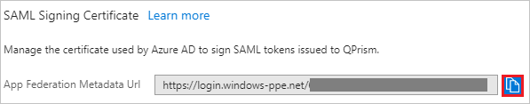
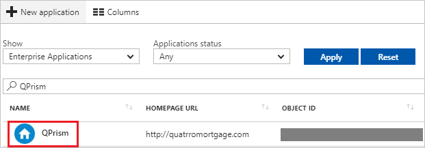

---
title: 'Tutorial: Azure Active Directory integration with QPrism | Microsoft Docs'
description: Learn how to configure single sign-on between Azure Active Directory and QPrism.
services: active-directory
documentationCenter: na
author: jeevansd
manager: mtillman
ms.reviewer: joflore

ms.assetid: 72ab75ba-132b-4f83-a34b-d28b81b6d7bc
ms.service: active-directory
ms.component: saas-app-tutorial
ms.workload: identity
ms.tgt_pltfrm: na
ms.devlang: na
ms.topic: article
ms.date: 04/23/2018
ms.author: jeedes

---
# Tutorial: Azure Active Directory integration with QPrism

In this tutorial, you learn how to integrate QPrism with Azure Active Directory (Azure AD).

Integrating QPrism with Azure AD provides you with the following benefits:

- You can control in Azure AD who has access to QPrism.
- You can enable your users to automatically get signed on to QPrism (single sign-on) with their Azure AD accounts.
- You can manage your accounts in one central location: the Azure portal.

For more details about SaaS app integration with Azure AD, see [What is application access and single sign-on with Azure Active Directory?](../manage-apps/what-is-single-sign-on.md).

## Prerequisites

To configure Azure AD integration with QPrism, you need the following items:

- An Azure AD subscription
- A QPrism single sign-on enabled subscription

To test the steps in this tutorial, follow these recommendations:

- Don't use your production environment, unless it is necessary.
- If you don't have an Azure AD trial environment, you can [get a one-month trial](https://azure.microsoft.com/pricing/free-trial/).

## Scenario description
In this tutorial, you test Azure AD single sign-on in a test environment. 
The scenario outlined in this tutorial consists of two main building blocks:

1. Adding QPrism from the gallery
1. Configuring and testing Azure AD single sign-on

## Add QPrism from the gallery
To configure the integration of QPrism into Azure AD, you need to add QPrism from the gallery to your list of managed SaaS apps.

**To add QPrism from the gallery:**

1. In the [Azure portal](https://portal.azure.com), in the left pane, select **Azure Active Directory**. 

	![The Azure Active Directory button][1]

1. Navigate to **Enterprise applications** > **All applications**.

	![The Enterprise applications blade][2]
	
1. To add a new application, at the top of the dialog box, select **New application**.

	![The New application button][3]

1. In the search box, type **QPrism**, and select **QPrism** from result panel. Then click **Add** to add the application.

	

## Configure and test Azure AD single sign-on

In this section, you configure and test Azure AD single sign-on with QPrism, based on a test user called "Britta Simon."

For single sign-on to work, Azure AD needs to know who the counterpart user in QPrism is to a user in Azure AD. In other words, there must be a linked relationship between an Azure AD user and the related user in QPrism.

To establish this relationship, in QPrism, assign the value of the **user name** in Azure AD as the value of the **Username**.

To configure and test Azure AD single sign-on with QPrism, complete the following building blocks:

1. [Configure Azure AD single sign-on](#configure-azure-ad-single-sign-on) to enable your users to use this feature.
1. [Create an Azure AD test user](#create-an-azure-ad-test-user) to test Azure AD single sign-on with Britta Simon.
1. [Create a QPrism test user](#create-a-qprism-test-user) to have a counterpart of Britta Simon in QPrism who is linked to the Azure AD representation of user.
1. [Assign the Azure AD test user](#assign-the-azure-ad-test-user) to enable Britta Simon to use Azure AD single sign-on.
1. [Test single sign-on](#test-single-sign-on) to verify whether the configuration works.

### Configure Azure AD single sign-on

In this section, you enable Azure AD single sign-on in the Azure portal, and configure single sign-on in your QPrism application.

1. In the Azure portal, on the **QPrism** application integration page, select **Single sign-on**.

	![Configure single sign-on link][4]

1. On the **Single sign-on** dialog box, select **Mode** as	**SAML-based Sign-on** to enable single sign-on.
 
	

1. In the **QPrism Domain and URLs** section, do the following:

	

    a. In the **Sign-on URL** text box, type a URL that uses the following pattern: `https://<customer domain>.qmyzone.com/login`

    b. In the **Identifier** text box, type a URL that uses the following pattern: `https://<customer domain>.qmyzone.com/metadata.php`
    	 
	> [!NOTE] 
	> These values are not real. Update these values with the actual identifier and sign-on URL. Contact [QPrism Client support team](mailto:qsupport-ce@quatrro.com) to get these values. 

1. On the **SAML Signing Certificate** section, click the copy button to copy **App Federation Metadata Url** and paste it into notepad.

     

1. Select **Save**.

	
	
1. To configure single sign-on on **QPrism** side, you need to send the **App Federation Metadata Url** to [QPrism support team](mailto:qsupport-ce@quatrro.com). They set this setting to have the SAML SSO connection set properly on both sides.

### Create an Azure AD test user

The objective of this section is to create a test user in the Azure portal called Britta Simon.

   ![Create an Azure AD test user][100]

**To create a test user in Azure AD:**

1. In the Azure portal, in the left pane, select **Azure Active Directory**.

    

1. To display the list of users, go to **Users and groups**, and then click **All users**.

    

1. To open the **User** dialog box, at the top of the **All Users** dialog box, select **Add**.

    

1. In the **User** dialog box, do the following:

    

    a. In the **Name** box, type **BrittaSimon**.

    b. In the **User name** box, type the email address of user Britta Simon.

    c. Select the **Show Password** check box, and then write down the value that's displayed in the **Password** box.

    d. Select **Create**.
 
### Create a QPrism test user

In this section, you create a user called Britta Simon in QPrism. Work with the [QPrism support team](mailto:qsupport-ce@quatrro.com) to add users in the QPrism platform. Users must be created and activated before you use single sign-on. 

### Assign the Azure AD test user

In this section, you enable Britta Simon to use Azure single sign-on by granting access to QPrism.

![Assign the user role][200] 

**To assign Britta Simon to QPrism:**

1. In the Azure portal, open the applications view, and then navigate to the directory view. Go to **Enterprise applications**, and select **All applications**.

	![Assign User][201] 

1. In the applications list, select **QPrism**.

	  

1. In the menu on the left, select **Users and groups**.

	![The "Users and groups" link][202]

1. Select **Add**. Then, under **Add Assignment**, select **Users and groups**.

	![The Add Assignment pane][203]

1. On the **Users and groups** dialog box, select **Britta Simon** in the **Users** list.

1. On the **Users and groups** dialog box, select **Select**.

1. Under **Add Assignment**, select **Assign**.
	
### Test single sign-on

In this section, you test your Azure AD single sign-on configuration by using the Access Panel.

In the Access Panel, when you select the QPrism tile, you should get automatically signed on to your QPrism application.
For more information about the Access Panel, see [Introduction to the Access Panel](../user-help/active-directory-saas-access-panel-introduction.md). 

## Additional resources

* [List of tutorials on how to integrate SaaS apps with Azure Active Directory](tutorial-list.md)
* [What is application access and single sign-on with Azure Active Directory?](../manage-apps/what-is-single-sign-on.md)

<!--Image references-->

[1]: ./media/qprism-tutorial/tutorial_general_01.png
[2]: ./media/qprism-tutorial/tutorial_general_02.png
[3]: ./media/qprism-tutorial/tutorial_general_03.png
[4]: ./media/qprism-tutorial/tutorial_general_04.png

[100]: ./media/qprism-tutorial/tutorial_general_100.png

[200]: ./media/qprism-tutorial/tutorial_general_200.png
[201]: ./media/qprism-tutorial/tutorial_general_201.png
[202]: ./media/qprism-tutorial/tutorial_general_202.png
[203]: ./media/qprism-tutorial/tutorial_general_203.png

