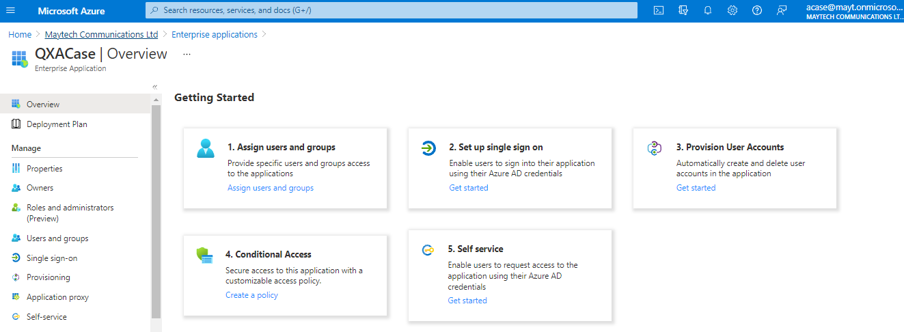
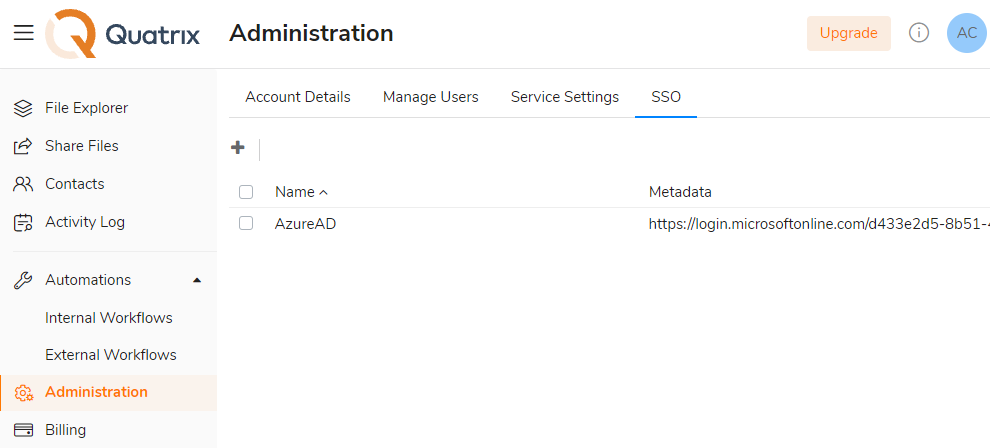
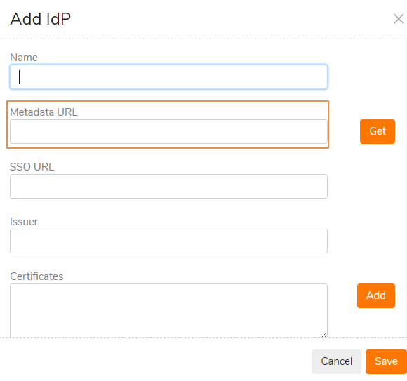
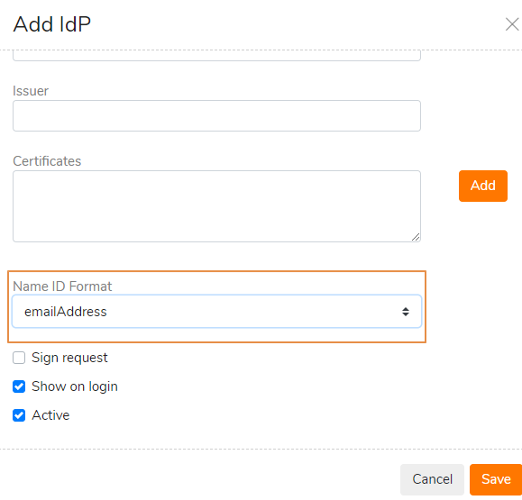
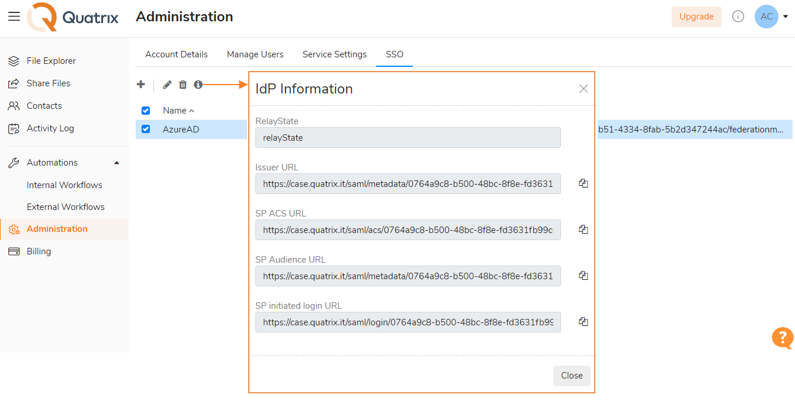
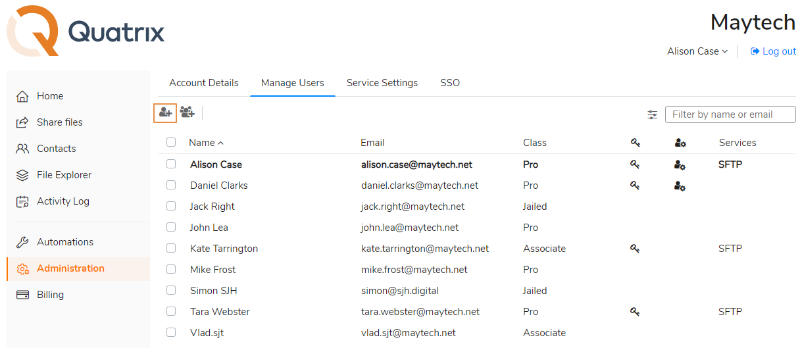
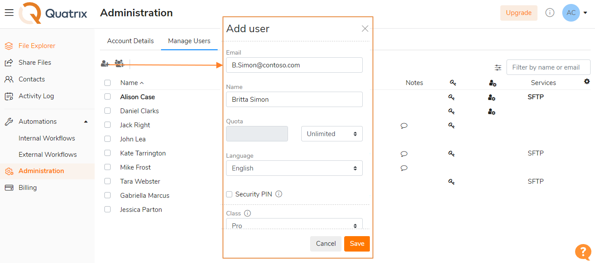

# Tutorial: Azure Active Directory integration with Quatrix

In this tutorial, you\'ll learn how to integrate Quatrix with Azure Active Directory (Azure AD). When you integrate [Quatrix](https://www.maytech.net/products/quatrix-business) with Azure AD, you can:

* Control in Azure AD who has access to Quatrix.

* Enable your users to be automatically signed in to Quatrix with their Azure AD accounts.

* Manage your accounts in one central location - the Azure portal.

## Prerequisites

To get started, you need the following items:

* A valid subscription to Azure AD. Being your IdP, Azure handles the login process and provides credentials of your users to Quatrix. If you don\'t have an Azure AD environment, you can get one-month trial [here](https://azure.microsoft.com/pricing/free-trial/).

* Quatrix single sign-on (SSO) enabled subscription. Go to our [website](https://www.maytech.net/products/quatrix-business) to create a Quatrix account.

## Scenario description

In this tutorial, you configure and test Azure AD single sign-on in a test environment.

* Quatrix supports **SP and IdP** initiated SSO.

## Adding Quatrix to your Azure AD tenant

To configure the integration of Quatrix into Azure AD, you need to add your Quatrix application to the Azure AD tenant.

1. Sign in to the [Azure portal](https://portal.azure.com/#home) using a work account, or a personal Microsoft account.

2. On the left navigation pane, select the **Azure Active Directory** service.

3. Navigate to **Enterprise Applications** and then select **New Application**.

4. Go to **Create your own application** and specify your name.

5. Then under **What are you looking to do with your application?** choose **Integrate any other application you don\'t find in the gallery** and click **Create.**

6. A getting started page appears with the options for configuring the application for your organization. In the form, you can edit the name of the application to match the needs of your organization. 

    

You\'ve finished adding an application. Follow the steps below to perform required configurations in the Azure AD and Quatrix.

## Configure and test Azure AD SSO for Quatrix

Configure and test Azure AD SSO with Quatrix using a test user called **Britta Simon**. For SSO to work, you need to establish a link relationship between an Azure AD user and the related user in Quatrix.

To configure and test Azure AD SSO with Quatrix, perform the following steps:

1. **Configure Azure AD SSO** - to enable your users to use this feature.

    1. **Create an Azure AD test user** - to test Azure AD single sign-on with Britta Simon.

    2. **Assign the Azure AD test user** - to enable Britta Simon to use Azure AD single sign-on.

2. **Configure Quatrix SSO** - to configure the Single Sign-On settings on application side.

    1. **Create Quatrix test user** - to have a counterpart of Britta Simon in Quatrix that is linked to the Azure AD representation of user.

3. **Test SSO** - to verify whether the configuration works.

### Configure Azure AD SSO

Follow these steps to enable Azure AD SSO in the Azure portal.

1. In the Azure portal, on the **Quatrix** application integration page, find the **Manage** section and select **Single sign-on**.

2. On the **Select a Single sign-on method** page, select **SAML**.

3. On the **Set up Single Sign-On with SAML** page, click the pencil icon for **Basic SAML Configuration** to edit the settings.

    

4. On the **Basic SAML Configuration** section, enter the values for the following fields:

    1. In the **Sign on URL** text box, type a URL using the following pattern:
    `https://<tenant-name>.quatrix.it/saml/login/<idp-id>`

    2. In the **Identifier (Entity ID)** text box, type a URL using the following pattern:
    `https://<tenant-name>.quatrix.it/saml/metadata/<idp-id>`

    3. In the **Reply URL** textbox, type a URL using the following pattern:
    `https://<tenant-name>.quatrix.it/saml/acs/<idp-id>`

        >[!Note]
        >These values are not real. Update them with the actual Sign-On URL, Identifier and Reply URL. You will get them from the Quatrix SSO configuration section, which is explained later in the tutorial or in our [detailed Quatrix SSO configuration guide](https://docs.maytech.net/quatrix/apps-and-integrations/sso-integration#SSOIntegration-SettingupSSOwithAzureADasIdP). For more information contact [Quatrix Customer Care team](https://www.maytech.net/contact). You can also refer to the patterns shown in the **Basic SAML Configuration** section in the Azure portal.

5. On the **User Attributes & Claims** section, edit the attributes by clicking on the **Edit** icon. Your Quatrix application expects the SAML assertions in a specific format, which requires you to add custom attribute mappings to your SAML token attributes configuration. The default value of **Unique User Identifier** is **user.userprincipalname** but Quatrix expects this to be mapped with the user\'s email address. For that you should use **user.mail** attribute from the list.

    

6. On the **SAML Signing Certificate** section, copy the **App Federation Metadata URL.**

    

### Create an Azure AD test user

In this section, you\'ll create a test user in the Azure portal called Britta Simon.

1. From the left pane in the Azure portal, select **Azure Active Directory**, select **Users**, and then select **All users**.

2. Select **New user** at the top of the screen.

3. In the **User** properties, follow these steps:

    1. In the **Name** field, enter Britta Simon.

    2. In the **User name** field, enter the <username@companydomain.extens>ion. For example <BrittaSimon@contoso.com>.

    3. Select the **Show password** check box, and then write down the value that\'s displayed in the **Password** box.

    4. Click **Create**.

### Assign the Azure AD test user

In this section, you\'ll enable Britta Simon to use Azure single sign-on by granting access to Quatrix:

1. In the Azure portal, select **Enterprise Applications**, and then select **All applications**.

2. In the applications list, select **Quatrix**.

3. In the app\'s overview page, find the **Manage** section and select **Users and groups**.

4. Select **Add user**, then select **Users and groups** in the **Add Assignment** dialog.

5. In the **Users and groups** dialog, select **Britta Simon** from the Users list, then click the **Select** button at the bottom of the screen.

6. If you are expecting a role to be assigned to the users, you can select it from the **Select a role** dropdown. If no role has been set up for this app, you see \"Default Access\" role selected.

7. In the **Add Assignment** dialog, click the **Assign** button.

### Configure Quatrix SSO

1. Log in to your Quatrix account as an administrator.

2. Go to **Administration** → **SSO** sub-tab.

    

3. Click on **Add SSO** button, specify the **IdP name** and paste **Metadata URL** which you have copied from the **SAML Signing Certificate** section on the Azure portal.

    

    >[!Note]
    >SSO URL, Issuer and Certificates are filled in automatically.

4. Select **Name ID Format** as **Email address**.

    

5. Save your configured **IdP**.

To view details of the saved IdP, tick the check box next to it and select the info icon from the top menu.

### Create Quatrix test user

Perform the following steps to create a test user called Britta Simon in Quatrix:

1. Log in to your Quatrix account (administration rights are required).

2. Go to **Administration** → **Manage Users** → **Add user** button.

3. Fill in information about our test user Britta Simon:

    1. In the **Email** field, enter username\@companydomain.extension, e.g. <B.Simon@contoso.com>.

    2. In the **Name** field, enter Britta Simon.

    

4. Click Save.

>[!Note]
>Read our guide on [Azure AD integration with Quatrix](https://docs.maytech.net/quatrix/apps-and-integrations/sso-integration#SSOIntegration-SettingupSSOwithAzureADasIdP) for further details or contact [Quatrix Customer Care team](https://www.maytech.net/contact) for assistance.

### Test SSO 

In this section, you test your Azure AD single sign-on configuration with following options:

* Click on **Test this application** in Azure portal. This will redirect to Quatrix Sign-on URL where you can initiate the login flow.

* Go to Quatrix Sign-on URL directly and initiate the login flow from there.

* You can use Microsoft My Apps. When you click the Quatrix tile in the My Apps, this will redirect to Quatrix Sign-on URL. For more information about the My Apps, see [Introduction to the My Apps](https://docs.microsoft.com/en-us/azure/active-directory/user-help/my-apps-portal-end-user-access).

## Next steps

Once you configure Quatrix, you can enforce session control, which protects exfiltration and infiltration of your organization’s sensitive data in real time. Session control extends from Conditional Access. [Learn how to enforce session control with Microsoft Cloud App Security](/cloud-app-security/proxy-deployment-any-app).
