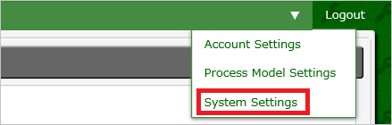
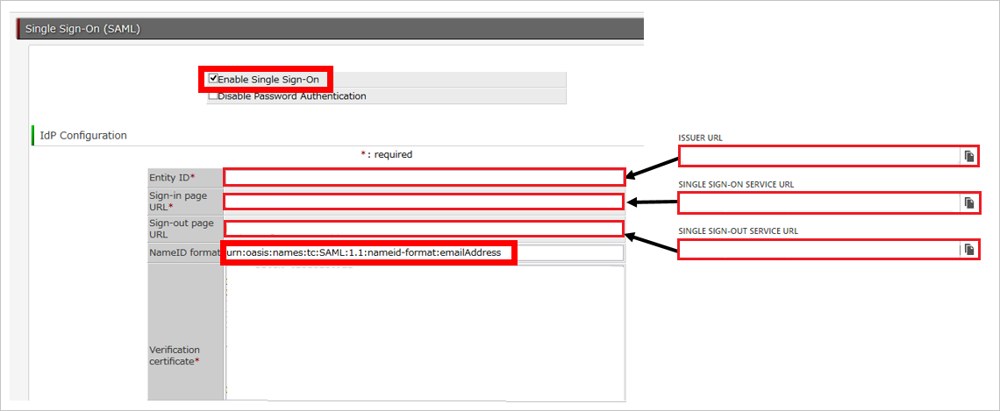
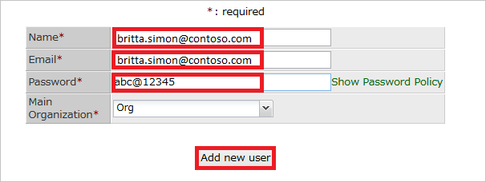

# Tutorial: Microsoft Entra SSO integration with Questetra BPM Suite

In this tutorial, you'll learn how to integrate Questetra BPM Suite with Microsoft Entra ID. When you integrate Questetra BPM Suite with Microsoft Entra ID, you can:

* Control in Microsoft Entra ID who has access to Questetra BPM Suite.
* Enable your users to be automatically signed-in to Questetra BPM Suite with their Microsoft Entra accounts.
* Manage your accounts in one central location.

## Prerequisites

To get started, you need the following items:

* A Microsoft Entra subscription. If you don't have a subscription, you can get a [free account](https://azure.microsoft.com/free/).
* Questetra BPM Suite single sign-on (SSO) enabled subscription.

## Scenario description

In this tutorial, you configure and test Microsoft Entra single sign-on in a test environment.

* Questetra BPM Suite supports **SP** initiated SSO.

## Add Questetra BPM Suite from the gallery

To configure the integration of Questetra BPM Suite into Microsoft Entra ID, you need to add Questetra BPM Suite from the gallery to your list of managed SaaS apps.

1. Sign in to the [Microsoft Entra admin center](https://entra.microsoft.com) as at least a [Cloud Application Administrator](../roles/permissions-reference.md#cloud-application-administrator).
1. Browse to **Identity** > **Applications** > **Enterprise applications** > **New application**.
1. In the **Add from the gallery** section, type **Questetra BPM Suite** in the search box.
1. Select **Questetra BPM Suite** from results panel and then add the app. Wait a few seconds while the app is added to your tenant.

 Alternatively, you can also use the [Enterprise App Configuration Wizard](https://portal.office.com/AdminPortal/home?Q=Docs#/azureadappintegration). In this wizard, you can add an application to your tenant, add users/groups to the app, assign roles, as well as walk through the SSO configuration as well. [Learn more about Microsoft 365 wizards.](/microsoft-365/admin/misc/azure-ad-setup-guides)

## Configure and test Microsoft Entra SSO for Questetra BPM Suite

Configure and test Microsoft Entra SSO with Questetra BPM Suite using a test user called **B.Simon**. For SSO to work, you need to establish a link relationship between a Microsoft Entra user and the related user in Questetra BPM Suite.

To configure and test Microsoft Entra SSO with Questetra BPM Suite, perform the following steps:

1. **[Configure Microsoft Entra SSO](#configure-azure-ad-sso)** - to enable your users to use this feature.
    1. **[Create a Microsoft Entra test user](#create-an-azure-ad-test-user)** - to test Microsoft Entra single sign-on with B.Simon.
    1. **[Assign the Microsoft Entra test user](#assign-the-azure-ad-test-user)** - to enable B.Simon to use Microsoft Entra single sign-on.
1. **[Configure Questetra BPM Suite SSO](#configure-questetra-bpm-suite-sso)** - to configure the single sign-on settings on application side.
    1. **[Create Questetra BPM Suite test user](#create-questetra-bpm-suite-test-user)** - to have a counterpart of B.Simon in Questetra BPM Suite that is linked to the Microsoft Entra representation of user.
1. **[Test SSO](#test-sso)** - to verify whether the configuration works.

## Configure Microsoft Entra SSO

Follow these steps to enable Microsoft Entra SSO.

1. Sign in to the [Microsoft Entra admin center](https://entra.microsoft.com) as at least a [Cloud Application Administrator](../roles/permissions-reference.md#cloud-application-administrator).
1. Browse to **Identity** > **Applications** > **Enterprise applications** > **Questetra BPM Suite** > **Single sign-on**.
1. On the **Select a single sign-on method** page, select **SAML**.
1. On the **Set up single sign-on with SAML** page, click the pencil icon for **Basic SAML Configuration** to edit the settings.

   

1. On the **Basic SAML Configuration** section, perform the following steps:

    a. In the **Identifier (Entity ID)** text box, type a URL using the following pattern:
    `https://<subdomain>.questetra.net/`

	b. In the **Sign on URL** text box, type a URL using the following pattern:
    `https://<subdomain>.questetra.net/saml/SSO/alias/bpm`

	> [!NOTE]
	> These values are not real. Update these values with the actual Identifier and Sign on URL. You can get these values from **SP Information** section on your **Questetra BPM Suite** company site, which is explained later in the tutorial or contact [Questetra BPM Suite Client support team](https://www.questetra.com/contact/). You can also refer to the patterns shown in the **Basic SAML Configuration** section.

1. On the **Set up Single Sign-On with SAML** page, in the **SAML Signing Certificate** section, click **Download** to download the **Certificate (Base64)** from the given options as per your requirement and save it on your computer.

	

1. On the **Set up Questetra BPM Suite** section, copy the appropriate URL(s) as per your requirement.

	

### Create a Microsoft Entra test user 

In this section, you'll create a test user called B.Simon.

1. Sign in to the [Microsoft Entra admin center](https://entra.microsoft.com) as at least a [User Administrator](../roles/permissions-reference.md#user-administrator).
1. Browse to **Identity** > **Users** > **All users**.
1. Select **New user** > **Create new user**, at the top of the screen.
1. In the **User** properties, follow these steps:
   1. In the **Display name** field, enter `B.Simon`.  
   1. In the **User principal name** field, enter the username@companydomain.extension. For example, `B.Simon@contoso.com`.
   1. Select the **Show password** check box, and then write down the value that's displayed in the **Password** box.
   1. Select **Review + create**.
1. Select **Create**.

### Assign the Microsoft Entra test user

In this section, you'll enable B.Simon to use single sign-on by granting access to Questetra BPM Suite.

1. Sign in to the [Microsoft Entra admin center](https://entra.microsoft.com) as at least a [Cloud Application Administrator](../roles/permissions-reference.md#cloud-application-administrator).
1. Browse to **Identity** > **Applications** > **Enterprise applications** > **Questetra BPM Suite**.
1. In the app's overview page, select **Users and groups**.
1. Select **Add user/group**, then select **Users and groups** in the **Add Assignment** dialog.
   1. In the **Users and groups** dialog, select **B.Simon** from the Users list, then click the **Select** button at the bottom of the screen.
   1. If you are expecting a role to be assigned to the users, you can select it from the **Select a role** dropdown. If no role has been set up for this app, you see "Default Access" role selected.
   1. In the **Add Assignment** dialog, click the **Assign** button.

## Configure Questetra BPM Suite SSO

1. In a different web browser window, Sign in to your **Questetra BPM Suite** company site as an administrator.

2. In the menu on the top, click **System Settings**. 
   
    

3. To open the **SingleSignOnSAML** page, click **SSO (SAML)**. 

    

4. On your **Questetra BPM Suite** company site, in the **SP Information** section, perform the following steps:

	a. Copy the **ACS URL**, and then paste it into the **Sign On URL** textbox in the **Basic SAML Configuration** section from Azure portal.
	
	b. Copy the **Entity ID**, and then paste it into the **Identifier** textbox in the **Basic SAML Configuration** section from Azure portal.

5. On your **Questetra BPM Suite** company site, perform the following steps: 
   
    
   
	a. Select **Enable Single Sign-On**.
   
	b. In **Entity ID** textbox, paste the value of **Microsoft Entra Identifier**..
	
	c. In **Sign-in page URL** textbox, paste the value of **Login URL**..
	
	d. In **Sign-out page URL** textbox, paste the value of **Logout URL**..
	
	e. In the **NameID format** textbox, type `urn:oasis:names:tc:SAML:1.1:nameid-format:emailAddress`.

    f. Open your **Base-64** encoded certificate in notepad downloaded from Azure portal, copy the content of it into your clipboard, and then paste it into the **Validation certificate** textbox. 

    g. Click **Save**.

### Create Questetra BPM Suite test user

The objective of this section is to create a user called Britta Simon in Questetra BPM Suite.

**To create a user called Britta Simon in Questetra BPM Suite, perform the following steps:**

1. Sign in to your Questetra BPM Suite company site as an administrator.

2. Go to **System Settings > User List > New User**.
 
3. On the New User dialog, perform the following steps: 
   
	
   
    a. In the **Name** textbox, type **name** of the user britta.simon@contoso.com.
   
    b. In the **Email** textbox, type **email** of the user britta.simon@contoso.com.
   
    c. In the **Password** textbox, type a **password** of the user.
	
	d. Click **Add new user**.

## Test SSO 

In this section, you test your Microsoft Entra single sign-on configuration with following options. 

* Click on **Test this application**, this will redirect to Questetra BPM Suite Sign-on URL where you can initiate the login flow. 

* Go to Questetra BPM Suite Sign-on URL directly and initiate the login flow from there.

* You can use Microsoft My Apps. When you click the Questetra BPM Suite tile in the My Apps, this will redirect to Questetra BPM Suite Sign-on URL. For more information, see [Microsoft Entra My Apps](/azure/active-directory/manage-apps/end-user-experiences#azure-ad-my-apps).

## Next steps

Once you configure Questetra BPM Suite you can enforce session control, which protects exfiltration and infiltration of your organization’s sensitive data in real time. Session control extends from Conditional Access. [Learn how to enforce session control with Microsoft Defender for Cloud Apps](/cloud-app-security/proxy-deployment-aad).
