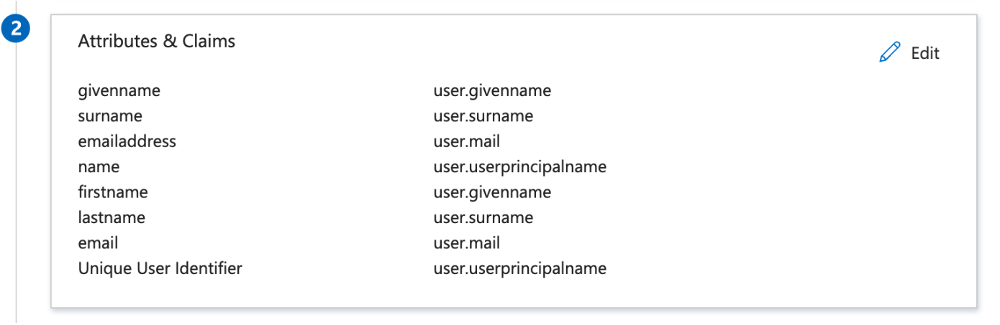

# Microsoft Entra SSO integration with Radiant IOT Portal

In this article, you'll learn how to integrate Radiant IOT Portal with Microsoft Entra ID. Radiant's IOT Portal is used by federal and commercial customers for asset tracking and accountability solutions based on IOT tracking technologies. When you integrate Radiant IOT Portal with Microsoft Entra ID, you can:

* Control in Microsoft Entra ID who has access to Radiant IOT Portal.
* Enable your users to be automatically signed-in to Radiant IOT Portal with their Microsoft Entra accounts.
* Manage your accounts in one central location.

You'll configure and test Microsoft Entra single sign-on for Radiant IOT Portal in a test environment. Radiant IOT Portal supports **SP** initiated single sign-on and **Just In Time** user provisioning.

## Prerequisites

To integrate Microsoft Entra ID with Radiant IOT Portal, you need:

* A Microsoft Entra user account. If you don't already have one, you can [Create an account for free](https://azure.microsoft.com/free/?WT.mc_id=A261C142F).
* One of the following roles: Global Administrator, Cloud Application Administrator, Application Administrator, or owner of the service principal.
* A Microsoft Entra subscription. If you don't have a subscription, you can get a [free account](https://azure.microsoft.com/free/).
* Radiant IOT Portal single sign-on (SSO) enabled subscription.

## Add application and assign a test user

Before you begin the process of configuring single sign-on, you need to add the Radiant IOT Portal application from the Microsoft Entra gallery. You need a test user account to assign to the application and test the single sign-on configuration.

### Add Radiant IOT Portal from the Microsoft Entra gallery

Add Radiant IOT Portal from the Microsoft Entra application gallery to configure single sign-on with Radiant IOT Portal. For more information on how to add application from the gallery, see the [Quickstart: Add application from the gallery](../manage-apps/add-application-portal.md).

### Create and assign Microsoft Entra test user

Follow the guidelines in the [create and assign a user account](../manage-apps/add-application-portal-assign-users.md) article to create a test user account called B.Simon.

Alternatively, you can also use the [Enterprise App Configuration Wizard](https://portal.office.com/AdminPortal/home?Q=Docs#/azureadappintegration). In this wizard, you can add an application to your tenant, add users/groups to the app, and assign roles. The wizard also provides a link to the single sign-on configuration pane. [Learn more about Microsoft 365 wizards.](/microsoft-365/admin/misc/azure-ad-setup-guides). 

## Configure Microsoft Entra SSO

Complete the following steps to enable Microsoft Entra single sign-on.

1. Sign in to the [Microsoft Entra admin center](https://entra.microsoft.com) as at least a [Cloud Application Administrator](../roles/permissions-reference.md#cloud-application-administrator).
1. Browse to **Identity** > **Applications** > **Enterprise applications** > **Radiant IOT Portal** > **Single sign-on**.
1. On the **Select a single sign-on method** page, select **SAML**.
1. On the **Set up single sign-on with SAML** page, select the pencil icon for **Basic SAML Configuration** to edit the settings.

   

1. On the **Basic SAML Configuration** section, perform the following steps:

	a. In the **Identifier** textbox, type a URL using one of the following patterns:

	| **Identifier** |
	|-----------|
	| `https://<SUBDOMAIN>.radiantrfid.com/VATServer/` |
	| `https://<SUBDOMAIN>.radiantrfid.com/VATPortal/` |

	b. In the **Reply URL** textbox, type a URL using one of the following patterns:

	| **Reply URL** |
	|---------------|
	| `https://<SUBDOMAIN>.radiantrfid.com/VATPortal/Saml2AuthenticationModule/acs` |
	| `https://<SUBDOMAIN>.radiantrfid.com/VATServer/Saml2AuthenticationModule/acs` |

	c. In the **Sign on URL** textbox, type a URL using the following pattern:
	`https://<SUBDOMAIN>.radiantrfid.com/VATPortal/?cn=<CustomerName>&id=<ID>`

	> [!Note]
	> These values are not real. Update these values with the actual Identifier, Reply URL and Sign on URL. Contact [Radiant IOT Portal support team](mailto:support@radiantrfid.com) to get these values. You can also refer to the patterns shown in the Basic SAML Configuration section.

1. Radiant IOT Portal application expects the SAML assertions in a specific format, which requires you to add custom attribute mappings to your SAML token attributes configuration. The following screenshot shows the list of default attributes.

	

1. In addition to above, Radiant IOT Portal application expects few more attributes to be passed back in SAML response, which are shown below. These attributes are also pre populated but you can review them as per your requirements.

	| Name |  Source Attribute|
	| ---------------|  --------- |
    | Email | user.mail |
	| User ID | user.userprincipalname |
	| Group | user.groups |
	
1. On the **Set-up single sign-on with SAML** page, in the **SAML Signing Certificate** section, find **Federation Metadata XML** and select **Download** to download the certificate and save it on your computer.

    

1. On the **Set up Radiant IOT Portal** section, copy the appropriate URL(s) based on your requirement.

	

## Configure Radiant IOT Portal SSO

To configure single sign-on on **Radiant IOT Portal** side, you need to send the downloaded **Federation Metadata XML** and appropriate copied URLs from the application configuration to [Radiant IOT Portal support team](mailto:support@radiantrfid.com). They set this setting to have the SAML SSO connection set properly on both sides.

### Create Radiant IOT Portal test user

In this section, a user called B.Simon is created in Radiant IOT Portal. Radiant IOT Portal supports just-in-time user provisioning, which is enabled by default. There's no action item for you in this section. If a user doesn't already exist in Radiant IOT Portal, a new one is commonly created after authentication.

## Test SSO 

In this section, you test your Microsoft Entra single sign-on configuration with following options. 

* Click on **Test this application**, this will redirect to Radiant IOT Portal Sign-on URL where you can initiate the login flow. 

* Go to Radiant IOT Portal Sign-on URL directly and initiate the login flow from there.

* You can use Microsoft My Apps. When you click the Radiant IOT Portal tile in the My Apps, this will redirect to Radiant IOT Portal Sign-on URL. For more information, see [Microsoft Entra My Apps](/azure/active-directory/manage-apps/end-user-experiences#azure-ad-my-apps).

## Additional resources

* [What is single sign-on with Microsoft Entra ID?](../manage-apps/what-is-single-sign-on.md)
* [Plan a single sign-on deployment](../manage-apps/plan-sso-deployment.md).

## Next steps

Once you configure Radiant IOT Portal you can enforce session control, which protects exfiltration and infiltration of your organization’s sensitive data in real time. Session control extends from Conditional Access. [Learn how to enforce session control with Microsoft Cloud App Security](/cloud-app-security/proxy-deployment-aad).
