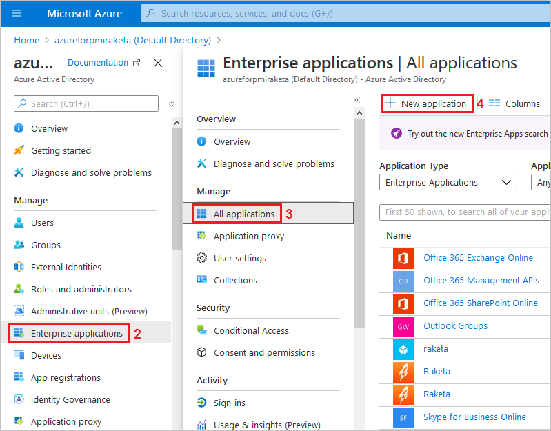
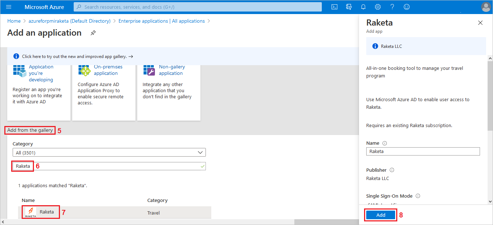
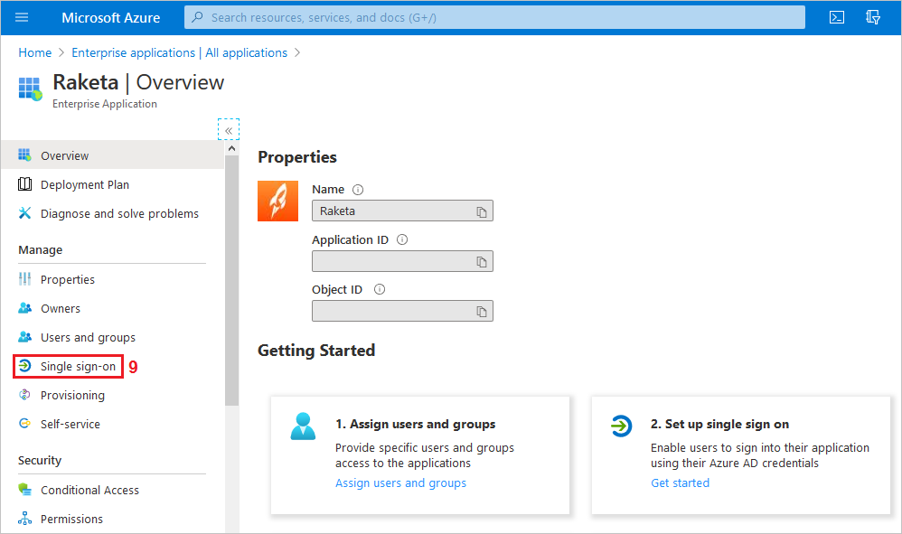
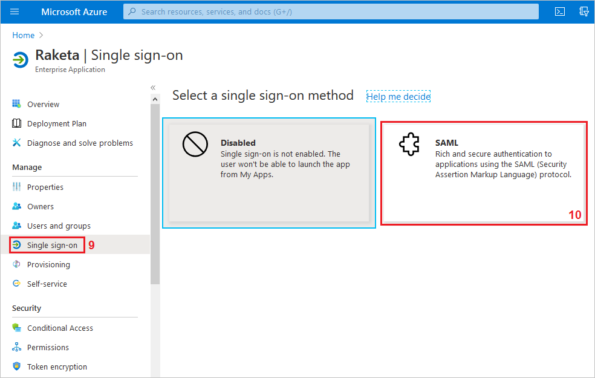
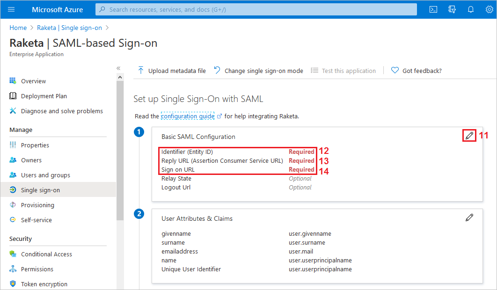
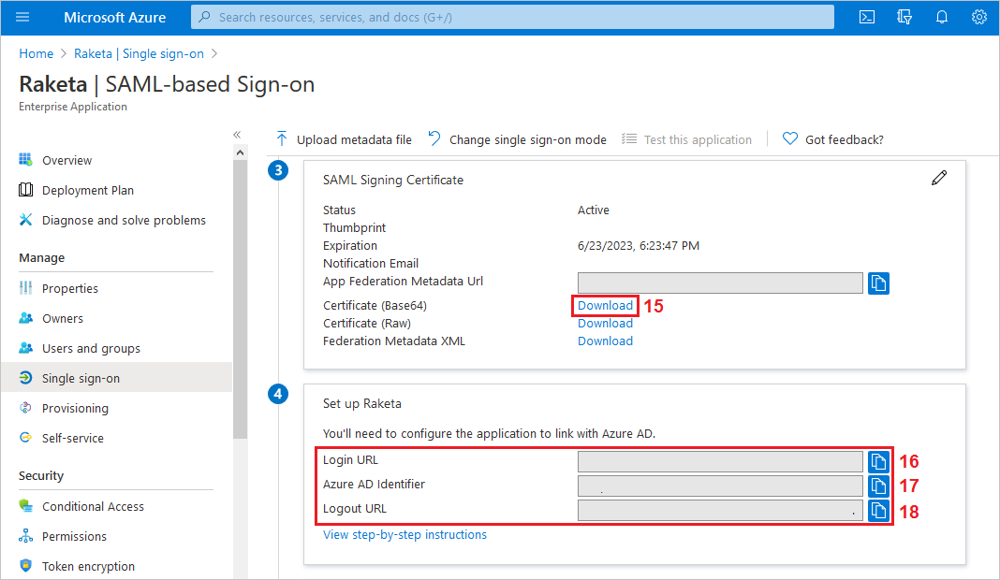
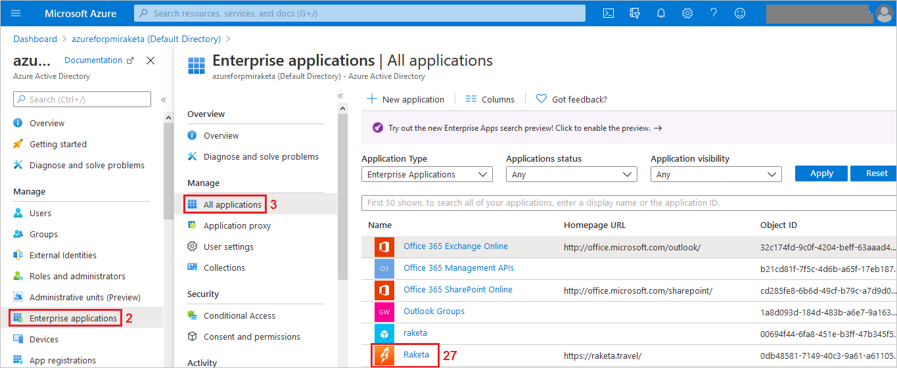
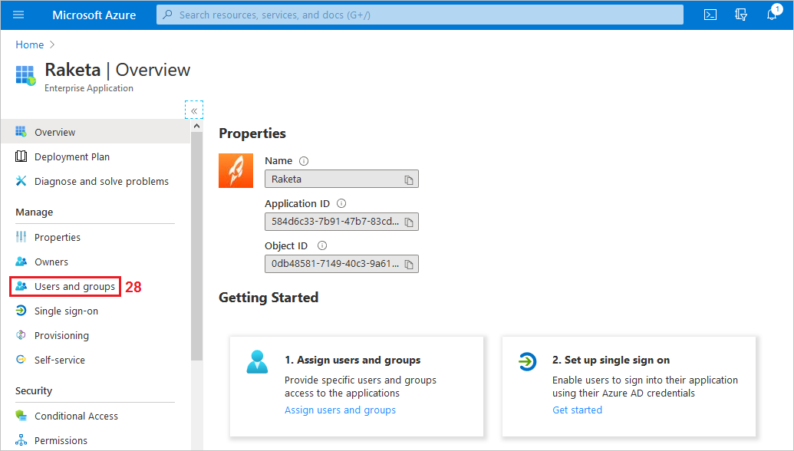
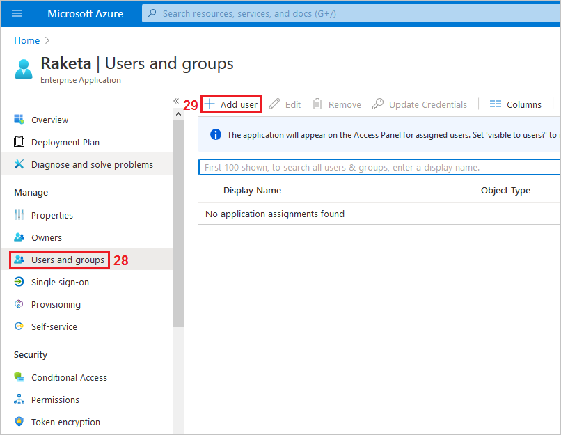
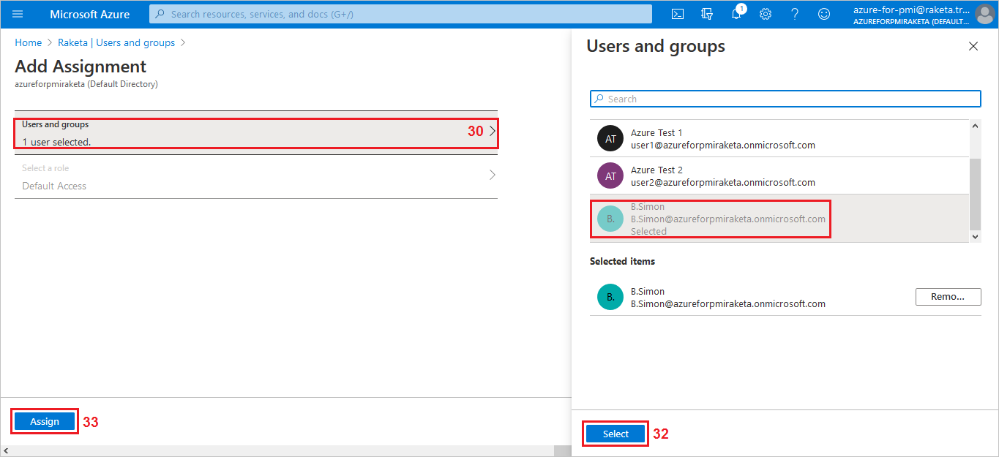

# Tutorial: Microsoft Entra SSO integration with Raketa

In this tutorial, you'll learn how to integrate Raketa with Microsoft Entra ID. When you integrate Raketa with Microsoft Entra ID, you can:

* Control in Microsoft Entra ID who has access to Raketa.
* Enable your users to be automatically signed-in to Raketa with their Microsoft Entra accounts.
* Manage your accounts in one central location.

## Prerequisites

To get started, you need the following items:

* A Microsoft Entra subscription. If you don't have a subscription, you can get a [free account](https://azure.microsoft.com/free/).
* Raketa single sign-on (SSO) enabled subscription.

## Scenario description

In this tutorial, you configure and test Microsoft Entra SSO in a test environment.

* Raketa supports **SP** initiated SSO.

> [!NOTE]
> Identifier of this application is a fixed string value so only one instance can be configured in one tenant.

## Add Raketa from the gallery

To configure the integration of Raketa into Microsoft Entra ID, you need to add Raketa from the gallery to your list of managed SaaS apps.

1. Sign in to the [Microsoft Entra admin center](https://entra.microsoft.com) as at least a [Cloud Application Administrator](../roles/permissions-reference.md#cloud-application-administrator).
1. Browse to **Identity** > **Applications** > **Enterprise applications** > **New application**.

    

1. In the **Add from the gallery** [5] section, type **Raketa** in the search box [6].

1. Select **Raketa** from results panel [7] and then click on **Add** button [8]. 

    

## Configure and test Microsoft Entra SSO for Raketa

Configure and test Microsoft Entra SSO with Raketa using a test user called **B.Simon**. For SSO to work, you need to establish a link relationship between a Microsoft Entra user and the related user in Raketa.

To configure and test Microsoft Entra SSO with Raketa, perform the following steps:

1. **[Configure Microsoft Entra SSO](#configure-azure-ad-sso)** - to enable your users to use this feature.
    1. **[Create a Microsoft Entra test user](#create-an-azure-ad-test-user)** - to test Microsoft Entra single sign-on with B.Simon.
    1. **[Assign the Microsoft Entra test user](#assign-the-azure-ad-test-user)** - to enable B.Simon to use Microsoft Entra single sign-on.
1. **[Configure Raketa SSO](#configure-raketa-sso)** - to configure the single sign-on settings on application side.
    1. **[Create Raketa test user](#create-raketa-test-user)** - to have a counterpart of B.Simon in Raketa that is linked to the Microsoft Entra representation of user.
1. **[Test SSO](#test-sso)** - to verify whether the configuration works.

## Configure Microsoft Entra SSO

Follow these steps to enable Microsoft Entra SSO.

1. Sign in to the [Microsoft Entra admin center](https://entra.microsoft.com) as at least a [Cloud Application Administrator](../roles/permissions-reference.md#cloud-application-administrator).
1. Browse to **Identity** > **Applications** > **Enterprise applications** > **Raketa** application integration page, find the **Manage** section and select **single sign-on** [9].

    

1. On the **Select a single sign-on method** page [9], select **SAML** [10].

    

1. On the **Set up single sign-on with SAML** page, click the pencil icon for **Basic SAML Configuration** [11] to edit the settings.

1. On the **Basic SAML Configuration** section, perform the following steps:

    1. In the **Identifier (Entity ID)** [12] and **Sign on URL** [14] text boxes, type the URL: `https://raketa.travel/`.

    1. In the **Reply URL** text box [13], type a URL using the following pattern: `https://raketa.travel/sso/acs?clientId=<CLIENT_ID>`.  

    

	> [!NOTE]
	> The Reply URL value is not real. Update the value with the actual Reply URL. Contact [Raketa Client support team](mailto:help@raketa.travel) to get the value. You can also refer to the patterns shown in the **Basic SAML Configuration** section.

1. On the **Set up single sign-on with SAML** page, in the **SAML Signing Certificate** section,  find **Certificate (Base64)** and select **Download** [15] to download the certificate and save it on your computer.

1. On the **Set up Raketa** section, copy the appropriate URL(s) based on your requirement.

    1. Login URL [16] – The authorization web-page URL, which is used to redirect the users to the authentication system.

    1. Microsoft Entra Identifier [17] – Microsoft Entra Identifier.

    1. Logout URL [18] – The web-page URL, which is used to redirect the users after logout.

    

### Create a Microsoft Entra test user

In this section, you'll create a test user called B.Simon.

1. Sign in to the [Microsoft Entra admin center](https://entra.microsoft.com) as at least a [User Administrator](../roles/permissions-reference.md#user-administrator).
1. Browse to **Identity** > **Users** > **All users**.
1. Select **New user** > **Create new user**, at the top of the screen.
1. In the **User** properties, follow these steps:
   1. In the **Display name** field, enter `B.Simon`.  
   1. In the **User principal name** field, enter the username@companydomain.extension. For example, `B.Simon@contoso.com`.
   1. Select the **Show password** check box, and then write down the value that's displayed in the **Password** box.
   1. Select **Review + create**.
1. Select **Create**.

### Assign the Microsoft Entra test user

In this section, you'll enable B.Simon to use single sign-on by granting access to Raketa.

1. Sign in to the [Microsoft Entra admin center](https://entra.microsoft.com) as at least a [Cloud Application Administrator](../roles/permissions-reference.md#cloud-application-administrator).
1. Browse to **Identity** > **Applications** > **Enterprise applications** > **Raketa** [27].  

    

1. In the app's overview page, find the **Manage** section and select **Users and groups** [28]. 

    

1. Select **Add user** [29], then select **Users and groups** [30] in the **Add Assignment** dialog.

    

1. In the **Users and groups** dialog, select **B.Simon** [31] from the Users list, then click the **Select** [32] button at the bottom of the screen.

1. If you're expecting any role value in the SAML assertion, in the **Select Role** dialog, select the appropriate role for the user from the list and then click the **Select** button at the bottom of the screen.

1. In the **Add Assignment** dialog, click the **Assign** button [33]. 

    

## Configure Raketa SSO

To configure single sign-on on **Raketa** side, you need to send the downloaded **Certificate (Base64)** and appropriate copied URLs from the application configuration to [Raketa support team](mailto:help@raketa.travel). They set this setting to have the SAML SSO connection set properly on both sides.

### Create Raketa test user

In this section, you create a user called B.Simon in Raketa. Work with [Raketa support team](mailto:help@raketa.travel) to add the users in the Raketa platform. Users must be created and activated before you use single sign-on.

## Test SSO

In this section, you test your Microsoft Entra single sign-on configuration with following options. 

* Click on **Test this application**, this will redirect to Raketa Sign-on URL where you can initiate the login flow. 

* Go to Raketa Sign-on URL directly and initiate the login flow from there.

* You can use Microsoft My Apps. When you click the Raketa tile in the My Apps, this will redirect to Raketa Sign-on URL. For more information, see [Microsoft Entra My Apps](/azure/active-directory/manage-apps/end-user-experiences#azure-ad-my-apps).

## Next steps

Once you configure Raketa you can enforce session control, which protects exfiltration and infiltration of your organization’s sensitive data in real time. Session control extends from Conditional Access. [Learn how to enforce session control with Microsoft Cloud App Security](/cloud-app-security/proxy-deployment-aad).
