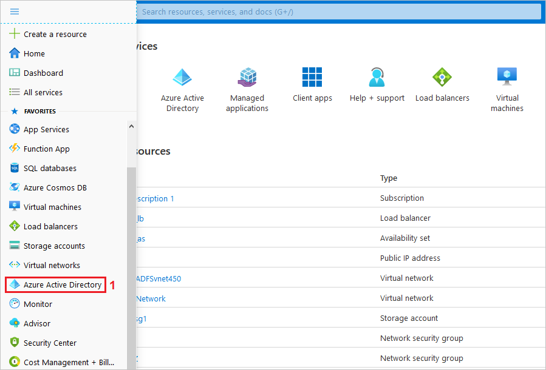
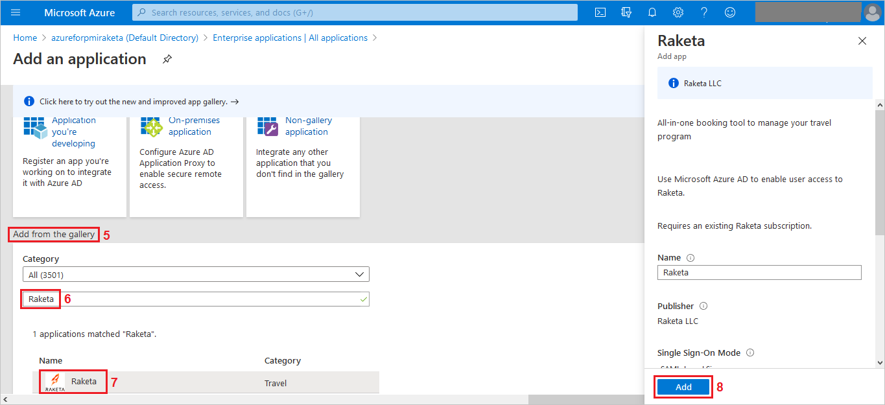
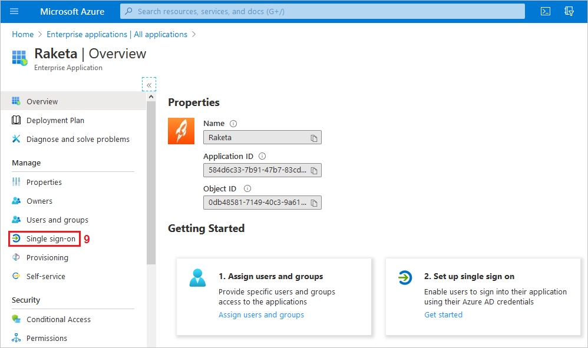
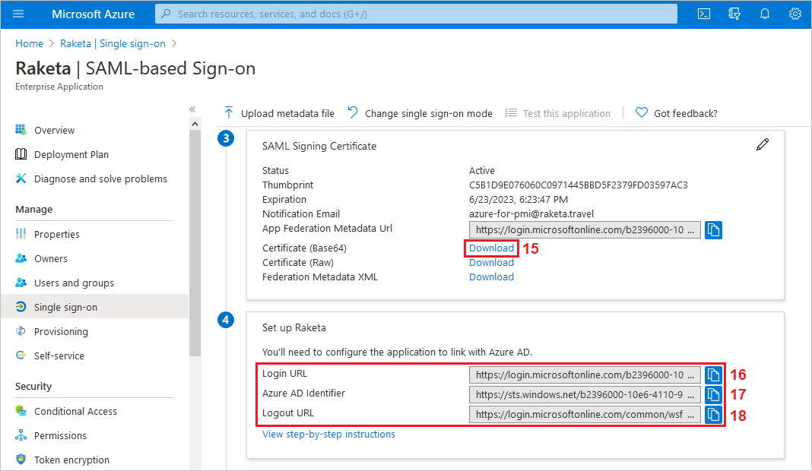
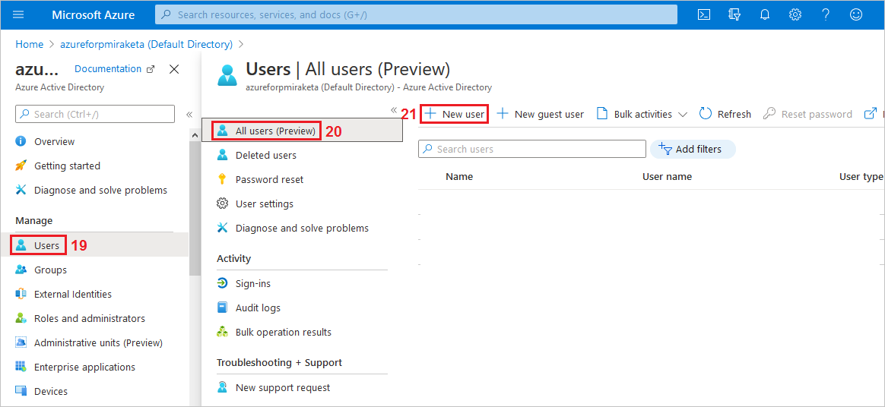
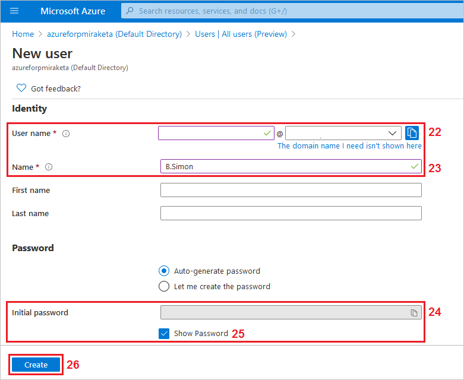

# Tutorial: Azure Active Directory single sign-on (SSO) integration with Raketa

In this tutorial, you'll learn how to integrate Raketa with Azure Active Directory (Azure AD). When you integrate Raketa with Azure AD, you can:

* Control in Azure AD who has access to Raketa.
* Enable your users to be automatically signed-in to Raketa with their Azure AD accounts.
* Manage your accounts in one central location - the Azure portal.

To learn more about SaaS app integration with Azure AD, see [What is application access and single sign-on with Azure Active Directory](https://docs.microsoft.com/azure/active-directory/manage-apps/what-is-single-sign-on).

## Prerequisites

To get started, you need the following items:

* An Azure AD subscription. If you don't have a subscription, you can get a [free account](https://azure.microsoft.com/free/).
* Raketa single sign-on (SSO) enabled subscription.

## Scenario description

In this tutorial, you configure and test Azure AD SSO in a test environment.

* Raketa supports **SP** initiated SSO.
* Once you configure Raketa you can enforce session control, which protects exfiltration and infiltration of your organization’s sensitive data in real time. Session control extends from Conditional Access. [Learn how to enforce session control with Microsoft Cloud App Security](https://docs.microsoft.com/cloud-app-security/proxy-deployment-any-app).

## Adding Raketa from the gallery

To configure the integration of Raketa into Azure AD, you need to add Raketa from the gallery to your list of managed SaaS apps.

1. Sign in to the [Azure portal](https://portal.azure.com) using either a work or school account, or a personal Microsoft account.
1. On the left navigation pane, select the **Azure Active Directory** service [1].

    

1. Navigate to **Enterprise Applications** [2] and then select **All Applications** [3].

1. To add new application, select **New application** [4]. 

    

1. In the **Add from the gallery** [5] section, type **Raketa** in the search box [6].

1. Select **Raketa** from results panel [7] and then click on **Add** button [8]. 

    

## Configure and test Azure AD single sign-on for Raketa

Configure and test Azure AD SSO with Raketa using a test user called **B.Simon**. For SSO to work, you need to establish a link relationship between an Azure AD user and the related user in Raketa.

To configure and test Azure AD SSO with Raketa, complete the following building blocks:

1. **[Configure Azure AD SSO](#configure-azure-ad-sso)** - to enable your users to use this feature.
    1. **[Create an Azure AD test user](#create-an-azure-ad-test-user)** - to test Azure AD single sign-on with B.Simon.
    1. **[Assign the Azure AD test user](#assign-the-azure-ad-test-user)** - to enable B.Simon to use Azure AD single sign-on.
1. **[Configure Raketa SSO](#configure-raketa-sso)** - to configure the single sign-on settings on application side.
    1. **[Create Raketa test user](#create-raketa-test-user)** - to have a counterpart of B.Simon in Raketa that is linked to the Azure AD representation of user.
1. **[Test SSO](#test-sso)** - to verify whether the configuration works.

## Configure Azure AD SSO

Follow these steps to enable Azure AD SSO in the Azure portal.

1. In the [Azure portal](https://portal.azure.com/), on the **Raketa** application integration page, find the **Manage** section and select **single sign-on** [9].

    

1. On the **Select a single sign-on method** page [9], select **SAML** [10].

    

1. On the **Set up single sign-on with SAML** page, click the edit/pen icon for **Basic SAML Configuration** [11] to edit the settings.

1. On the **Basic SAML Configuration** section, enter the values for the following fields:

    1. In the **Identifier (Entity ID)** [12] and **Sign on URL** [14] text boxes, type the URL: `https://raketa.travel/`.

    1. In the **Reply URL** text box [13], type a URL using the following pattern: `https://raketa.travel/sso/acs?clientId=<CLIENT_ID>`.  

    

	> [!NOTE]
	> The Reply URL value is not real. Update the value with the actual Reply URL. Contact [Raketa Client support team](mailto:help@raketa.travel) to get the value. You can also refer to the patterns shown in the **Basic SAML Configuration** section in the Azure portal.

1. On the **Set up single sign-on with SAML** page, in the **SAML Signing Certificate** section,  find **Certificate (Base64)** and select **Download** [15] to download the certificate and save it on your computer.

1. On the **Set up Raketa** section, copy the appropriate URL(s) based on your requirement.

    1. Login URL [16] – The authorization web-page URL, which is used to redirect the users to the authentication system.

    1. Azure AD Identifier [17] – Azure AD Identifier.

    1. Logout URL [18] – The web-page URL, which is used to redirect the users after logout.

    

### Create an Azure AD test user

In this section, you'll create a test user in the Azure portal called B.Simon.

1. From the left pane in the Azure portal, select **Azure Active Directory** [1], select **Users** [19], and then select **All users** [20].

1. Select **New user** [21] at the top of the screen.

    

1. In the **User** properties, follow these steps:

   1. In the **User name** field [22], enter the username@companydomain.extension. For example, `B.Simon@contoso.com`.

   1. In the **Name** field [23], enter `B.Simon`.

   1. Select the **Show password** check box [25], and then write down the value that's displayed in the **Password** box [24].

   1. Click **Create** [26]. 

    

### Assign the Azure AD test user

In this section, you'll enable B.Simon to use Azure single sign-on by granting access to Raketa.

1. In the Azure portal, select **Enterprise Applications** [2], and then select **All applications** [3].

1. In the applications list, select **Raketa** [27].  

    

1. In the app's overview page, find the **Manage** section and select **Users and groups** [28]. 

    

1. Select **Add user** [29], then select **Users and groups** [30] in the **Add Assignment** dialog.

    

1. In the **Users and groups** dialog, select **B.Simon** [31] from the Users list, then click the **Select** [32] button at the bottom of the screen.

1. If you're expecting any role value in the SAML assertion, in the **Select Role** dialog, select the appropriate role for the user from the list and then click the **Select** button at the bottom of the screen.

1. In the **Add Assignment** dialog, click the **Assign** button [33]. 

    

## Configure Raketa SSO

To configure single sign-on on **Raketa** side, you need to send the downloaded **Certificate (Base64)** and appropriate copied URLs from Azure portal to [Raketa support team](mailto:help@raketa.travel). They set this setting to have the SAML SSO connection set properly on both sides.

### Create Raketa test user

In this section, you create a user called B.Simon in Raketa. Work with [Raketa support team](mailto:help@raketa.travel) to add the users in the Raketa platform. Users must be created and activated before you use single sign-on.

## Test SSO

In this section, you test your Azure AD single sign-on configuration using the Access Panel.

When you click the Raketa tile in the Access Panel, you should be automatically signed in to the Raketa for which you set up SSO. For more information about the Access Panel, see [Introduction to the Access Panel](https://docs.microsoft.com/azure/active-directory/active-directory-saas-access-panel-introduction).

## Additional resources

- [ List of Tutorials on How to Integrate SaaS Apps with Azure Active Directory ](https://docs.microsoft.com/azure/active-directory/active-directory-saas-tutorial-list)

- [What is application access and single sign-on with Azure Active Directory? ](https://docs.microsoft.com/azure/active-directory/active-directory-appssoaccess-whatis)

- [What is conditional access in Azure Active Directory?](https://docs.microsoft.com/azure/active-directory/conditional-access/overview)

- [Try Raketa with Azure AD](https://aad.portal.azure.com/)

- [What is session control in Microsoft Cloud App Security?](https://docs.microsoft.com/cloud-app-security/proxy-intro-aad)

- [How to protect Raketa with advanced visibility and controls](https://docs.microsoft.com/cloud-app-security/proxy-intro-aad)