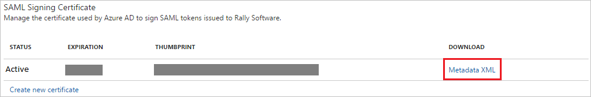
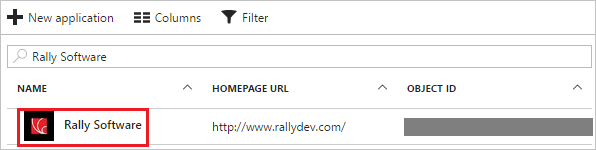

# Tutorial: Azure Active Directory integration with Rally Software

In this tutorial, you learn how to integrate Rally Software with Azure Active Directory (Azure AD).

Integrating Rally Software with Azure AD provides you with the following benefits:

- You can control in Azure AD who has access to Rally Software.
- You can enable your users to automatically get signed-on to Rally Software (Single Sign-On) with their Azure AD accounts.
- You can manage your accounts in one central location - the Azure portal.

If you want to know more details about SaaS app integration with Azure AD, see [what is application access and single sign-on with Azure Active Directory](../manage-apps/what-is-single-sign-on.md).

## Prerequisites

To configure Azure AD integration with Rally Software, you need the following items:

- An Azure AD subscription
- A Rally Software single sign-on enabled subscription

> [!NOTE]
> To test the steps in this tutorial, we do not recommend using a production environment.

To test the steps in this tutorial, you should follow these recommendations:

- Do not use your production environment, unless it is necessary.
- If you don't have an Azure AD trial environment, you can [get a one-month trial](https://azure.microsoft.com/pricing/free-trial/).

## Scenario description
In this tutorial, you test Azure AD single sign-on in a test environment. 
The scenario outlined in this tutorial consists of two main building blocks:

1. Adding Rally Software from the gallery
1. Configuring and testing Azure AD single sign-on

## Adding Rally Software from the gallery
To configure the integration of Rally Software into Azure AD, you need to add Rally Software from the gallery to your list of managed SaaS apps.

**To add Rally Software from the gallery, perform the following steps:**

1. In the **[Azure portal](https://portal.azure.com)**, on the left navigation panel, click **Azure Active Directory** icon. 

	![The Azure Active Directory button][1]

1. Navigate to **Enterprise applications**. Then go to **All applications**.

	![The Enterprise applications blade][2]
	
1. To add new application, click **New application** button on the top of dialog.

	![The New application button][3]

1. In the search box, type **Rally Software**, select **Rally Software** from result panel then click **Add** button to add the application.

	

## Configure and test Azure AD single sign-on

In this section, you configure and test Azure AD single sign-on with Rally Software based on a test user called "Britta Simon".

For single sign-on to work, Azure AD needs to know what the counterpart user in Rally Software is to a user in Azure AD. In other words, a link relationship between an Azure AD user and the related user in Rally Software needs to be established.

In Rally Software, assign the value of the **user name** in Azure AD as the value of the **Username** to establish the link relationship.

To configure and test Azure AD single sign-on with Rally Software, you need to complete the following building blocks:

1. **[Configure Azure AD Single Sign-On](#configure-azure-ad-single-sign-on)** - to enable your users to use this feature.
1. **[Create an Azure AD test user](#create-an-azure-ad-test-user)** - to test Azure AD single sign-on with Britta Simon.
1. **[Create a Rally Software test user](#create-a-rally-software-test-user)** - to have a counterpart of Britta Simon in Rally Software that is linked to the Azure AD representation of user.
1. **[Assign the Azure AD test user](#assign-the-azure-ad-test-user)** - to enable Britta Simon to use Azure AD single sign-on.
1. **[Test single sign-on](#test-single-sign-on)** - to verify whether the configuration works.

### Configure Azure AD single sign-on

In this section, you enable Azure AD single sign-on in the Azure portal and configure single sign-on in your Rally Software application.

**To configure Azure AD single sign-on with Rally Software, perform the following steps:**

1. In the Azure portal, on the **Rally Software** application integration page, click **Single sign-on**.

	![Configure single sign-on link][4]

1. On the **Single sign-on** dialog, select **Mode** as	**SAML-based Sign-on** to enable single sign-on.
 
	

1. On the **Rally Software Domain and URLs** section, perform the following steps:

	

    a. In the **Sign-on URL** textbox, type a URL using the following pattern: `https://<tenant-name>.rally.com`

	b. In the **Identifier** textbox, type a URL using the following pattern: `https://<tenant-name>.rally.com`

	> [!NOTE] 
	> These values are not real. Update these values with the actual Sign-On URL and Identifier. Contact [Rally Software Client support team](https://help.rallydev.com/) to get these values. 
 

1. On the **SAML Signing Certificate** section, click **Metadata XML** and then save the metadata file on your computer.

	 

1. Click **Save** button.

	

1. On the **Rally Software Configuration** section, click **Configure Rally Software** to open **Configure sign-on** window. Copy the **Sign-Out URL, and SAML Entity ID** from the **Quick Reference section.**

	 

1. Log in to your **Rally Software** tenant.

1. In the toolbar on the top, click **Setup**, and then select **Subscription**.
   
    

1. Click the **Action** button. Select **Edit Subscription** at the top right side of the toolbar.

1. On the **Subscription** dialog page, perform the following steps, and then click **Save & Close**:
   
    
   
    a. Select **Rally or SSO authentication** from Authentication dropdown.

    b. In the **Identity provider URL** textbox, paste the value of **SAML Entity ID**, which you have copied from Azure portal. 

    c. In the **SSO Logout** textbox, paste the value of **Sign-Out URL**, which you have copied from Azure portal.

> [!TIP]
> You can now read a concise version of these instructions inside the [Azure portal](https://portal.azure.com), while you are setting up the app!  After adding this app from the **Active Directory > Enterprise Applications** section, simply click the **Single Sign-On** tab and access the embedded documentation through the **Configuration** section at the bottom. You can read more about the embedded documentation feature here: [Azure AD embedded documentation]( https://go.microsoft.com/fwlink/?linkid=845985)
> 

### Create an Azure AD test user

The objective of this section is to create a test user in the Azure portal called Britta Simon.

   ![Create an Azure AD test user][100]

**To create a test user in Azure AD, perform the following steps:**

1. In the Azure portal, in the left pane, click the **Azure Active Directory** button.

    

1. To display the list of users, go to **Users and groups**, and then click **All users**.

    

1. To open the **User** dialog box, click **Add** at the top of the **All Users** dialog box.

    

1. In the **User** dialog box, perform the following steps:

    

    a. In the **Name** box, type **BrittaSimon**.

    b. In the **User name** box, type the email address of user Britta Simon.

    c. Select the **Show Password** check box, and then write down the value that's displayed in the **Password** box.

    d. Click **Create**.
 
### Create a Rally Software test user

For Azure AD users to be able to sign in, they must be provisioned to the Rally Software application using their Azure Active Directory user names.

**To configure user provisioning, perform the following steps:**

1. Log in to your Rally Software tenant.

1. Go to **Setup \> USERS**, and then click **+ Add New**.
   
    

1. Type the name in the New User textbox, and then click **Add with Details**.

1. In the **Create User** section, perform the following steps:
   
    

	a. In the **User Name** textbox, type the name of user like **Brittsimon**.
   
    b. In **E-mail Address** textbox, enter the email of user like **brittasimon@contoso.com**.

	c. In **First Name** text box, enter the first name of user like **Britta**.

	d. In **Last Name** text box, enter the last name of user like **Simon**.

    e. Click **Save & Close**.

   >[!NOTE]
   >You can use any other Rally Software user account creation tools or APIs provided by Rally Software to provision Azure AD user accounts.

### Assign the Azure AD test user

In this section, you enable Britta Simon to use Azure single sign-on by granting access to Rally Software.

![Assign the user role][200] 

**To assign Britta Simon to Rally Software, perform the following steps:**

1. In the Azure portal, open the applications view, and then navigate to the directory view and go to **Enterprise applications** then click **All applications**.

	![Assign User][201] 

1. In the applications list, select **Rally Software**.

	  

1. In the menu on the left, click **Users and groups**.

	![The "Users and groups" link][202]

1. Click **Add** button. Then select **Users and groups** on **Add Assignment** dialog.

	![The Add Assignment pane][203]

1. On **Users and groups** dialog, select **Britta Simon** in the Users list.

1. Click **Select** button on **Users and groups** dialog.

1. Click **Assign** button on **Add Assignment** dialog.
	
### Test single sign-on

The objective of this section is to test your Azure AD single sign-on configuration using the Access Panel.

When you click the Rally Software tile in the Access Panel, you should get automatically signed-on to your Rally Software application.

## Additional resources

* [List of Tutorials on How to Integrate SaaS Apps with Azure Active Directory](tutorial-list.md)
* [What is application access and single sign-on with Azure Active Directory?](../manage-apps/what-is-single-sign-on.md)

<!--Image references-->

[1]: ./media/rally-software-tutorial/tutorial_general_01.png
[2]: ./media/rally-software-tutorial/tutorial_general_02.png
[3]: ./media/rally-software-tutorial/tutorial_general_03.png
[4]: ./media/rally-software-tutorial/tutorial_general_04.png

[100]: ./media/rally-software-tutorial/tutorial_general_100.png

[200]: ./media/rally-software-tutorial/tutorial_general_200.png
[201]: ./media/rally-software-tutorial/tutorial_general_201.png
[202]: ./media/rally-software-tutorial/tutorial_general_202.png
[203]: ./media/rally-software-tutorial/tutorial_general_203.png

