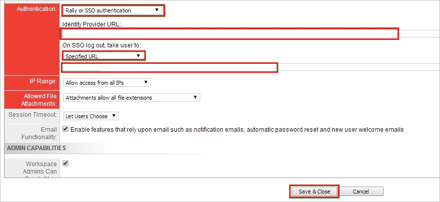
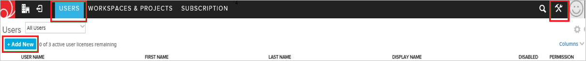
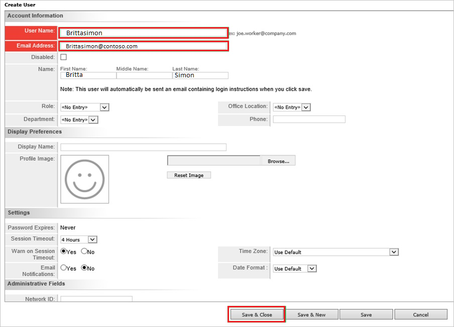

# Tutorial: Azure Active Directory integration with Rally Software

In this tutorial, you'll learn how to integrate Rally Software with Azure Active Directory (Azure AD). When you integrate Rally Software with Azure AD, you can:

* Control in Azure AD who has access to Rally Software.
* Enable your users to be automatically signed-in to Rally Software with their Azure AD accounts.
* Manage your accounts in one central location - the Azure portal.

## Prerequisites

To get started, you need the following items:

* An Azure AD subscription. If you don't have a subscription, you can get a [free account](https://azure.microsoft.com/free/).
* Rally Software single sign-on (SSO) enabled subscription.

## Scenario description

In this tutorial, you configure and test Azure AD single sign-on in a test environment.

* Rally Software supports **SP** initiated SSO.

## Add Rally Software from the gallery

To configure the integration of Rally Software into Azure AD, you need to add Rally Software from the gallery to your list of managed SaaS apps.

1. Sign in to the Azure portal using either a work or school account, or a personal Microsoft account.
1. On the left navigation pane, select the **Azure Active Directory** service.
1. Navigate to **Enterprise Applications** and then select **All Applications**.
1. To add new application, select **New application**.
1. In the **Add from the gallery** section, type **Rally Software** in the search box.
1. Select **Rally Software** from results panel and then add the app. Wait a few seconds while the app is added to your tenant.

 Alternatively, you can also use the [Enterprise App Configuration Wizard](https://portal.office.com/AdminPortal/home?Q=Docs#/azureadappintegration). In this wizard, you can add an application to your tenant, add users/groups to the app, assign roles, as well as walk through the SSO configuration as well. [Learn more about Microsoft 365 wizards.](/microsoft-365/admin/misc/azure-ad-setup-guides)

## Configure and test Azure AD SSO for Rally Software

Configure and test Azure AD SSO with Rally Software using a test user called **B.Simon**. For SSO to work, you need to establish a link relationship between an Azure AD user and the related user in Rally Software.

To configure and test Azure AD SSO with Rally Software, perform the following steps:

1. **[Configure Azure AD SSO](#configure-azure-ad-sso)** - to enable your users to use this feature.
    1. **[Create an Azure AD test user](#create-an-azure-ad-test-user)** - to test Azure AD single sign-on with B.Simon.
    1. **[Assign the Azure AD test user](#assign-the-azure-ad-test-user)** - to enable B.Simon to use Azure AD single sign-on.
1. **[Configure Rally Software SSO](#configure-rally-software-sso)** - to configure the single sign-on settings on application side.
    1. **[Create Rally Software test user](#create-rally-software-test-user)** - to have a counterpart of B.Simon in Rally Software that is linked to the Azure AD representation of user.
1. **[Test SSO](#test-sso)** - to verify whether the configuration works.

## Configure Azure AD SSO

Follow these steps to enable Azure AD SSO in the Azure portal.

1. In the Azure portal, on the **Rally Software** application integration page, find the **Manage** section and select **single sign-on**.
1. On the **Select a single sign-on method** page, select **SAML**.
1. On the **Set up single sign-on with SAML** page, click the pencil icon for **Basic SAML Configuration** to edit the settings.

   

4. On the **Basic SAML Configuration** section, perform the following steps:

    a. In the **Identifier (Entity ID)** text box, type a URL using the following pattern:
    `https://<TENANT_NAME>.rally.com`

    b. In the **Sign on URL** text box, type a URL using the following pattern:
    `https://<TENANT_NAME>.rally.com`

	> [!NOTE]
	> These values are not real. Update these values with the actual Identifier and Sign on URL. Contact [Rally Software Client support team](https://help.rallydev.com/) to get these values. You can also refer to the patterns shown in the **Basic SAML Configuration** section in the Azure portal.

5. On the **Set up Single Sign-On with SAML** page, in the **SAML Signing Certificate** section, click **Download** to download the **Federation Metadata XML** from the given options as per your requirement and save it on your computer.

	

6. On the **Set up Rally Software** section, copy the appropriate URL(s) as per your requirement.

	

### Create an Azure AD test user 

In this section, you'll create a test user in the Azure portal called B.Simon.

1. From the left pane in the Azure portal, select **Azure Active Directory**, select **Users**, and then select **All users**.
1. Select **New user** at the top of the screen.
1. In the **User** properties, follow these steps:
   1. In the **Name** field, enter `B.Simon`.  
   1. In the **User name** field, enter the username@companydomain.extension. For example, `B.Simon@contoso.com`.
   1. Select the **Show password** check box, and then write down the value that's displayed in the **Password** box.
   1. Click **Create**.

### Assign the Azure AD test user

In this section, you'll enable B.Simon to use Azure single sign-on by granting access to Rally Software.

1. In the Azure portal, select **Enterprise Applications**, and then select **All applications**.
1. In the applications list, select **Rally Software**.
1. In the app's overview page, find the **Manage** section and select **Users and groups**.
1. Select **Add user**, then select **Users and groups** in the **Add Assignment** dialog.
1. In the **Users and groups** dialog, select **B.Simon** from the Users list, then click the **Select** button at the bottom of the screen.
1. If you are expecting a role to be assigned to the users, you can select it from the **Select a role** dropdown. If no role has been set up for this app, you see "Default Access" role selected.
1. In the **Add Assignment** dialog, click the **Assign** button.

## Configure Rally Software SSO

1. Sign in to your **Rally Software** tenant.

2. In the toolbar on the top, click **Setup**, and then select **Subscription**.
   
    

3. Click the **Action** button. Select **Edit Subscription** at the top right side of the toolbar.

4. On the **Subscription** dialog page, perform the following steps, and then click **Save & Close**:
   
    
   
    a. Select **Rally or SSO authentication** from Authentication dropdown.

    b. In the **Identity provider URL** textbox, paste the value of **Azure AD Identifier**, which you have copied from Azure portal. 

    c. In the **SSO Logout** textbox, paste the value of **Logout URL**, which you have copied from Azure portal.

### Create Rally Software test user

For Azure AD users to be able to sign in, they must be provisioned to the Rally Software application using their Azure Active Directory user names.

**To configure user provisioning, perform the following steps:**

1. Sign in to your Rally Software tenant.

2. Go to **Setup \> USERS**, and then click **+ Add New**.
   
    

3. Type the name in the New User textbox, and then click **Add with Details**.

4. In the **Create User** section, perform the following steps:
   
    

	a. In the **User Name** textbox, type the name of user like **Brittsimon**.
   
    b. In **E-mail Address** textbox, enter the email of user like brittasimon@contoso.com.

	c. In **First Name** text box, enter the first name of user like **Britta**.

	d. In **Last Name** text box, enter the last name of user like **Simon**.

    e. Click **Save & Close**.

   >[!NOTE]
   >You can use any other Rally Software user account creation tools or APIs provided by Rally Software to provision Azure AD user accounts.

## Test SSO

In this section, you test your Azure AD single sign-on configuration with following options. 

* Click on **Test this application** in Azure portal. This will redirect to Rally Software Sign-on URL where you can initiate the login flow. 

* Go to Rally Software Sign-on URL directly and initiate the login flow from there.

* You can use Microsoft My Apps. When you click the Rally Software tile in the My Apps, this will redirect to Rally Software Sign-on URL. For more information about the My Apps, see [Introduction to the My Apps](https://support.microsoft.com/account-billing/sign-in-and-start-apps-from-the-my-apps-portal-2f3b1bae-0e5a-4a86-a33e-876fbd2a4510).

## Next steps

Once you configure Rally Software you can enforce session control, which protects exfiltration and infiltration of your organization’s sensitive data in real time. Session control extends from Conditional Access. [Learn how to enforce session control with Microsoft Defender for Cloud Apps](/cloud-app-security/proxy-deployment-aad).
