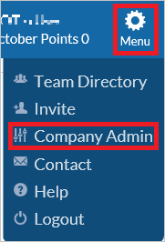
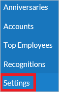
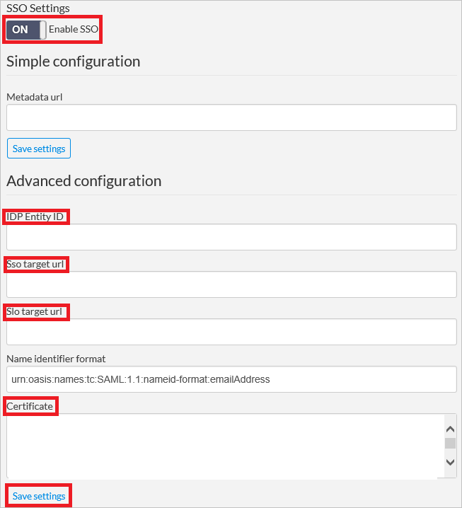
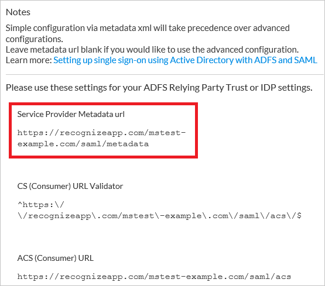
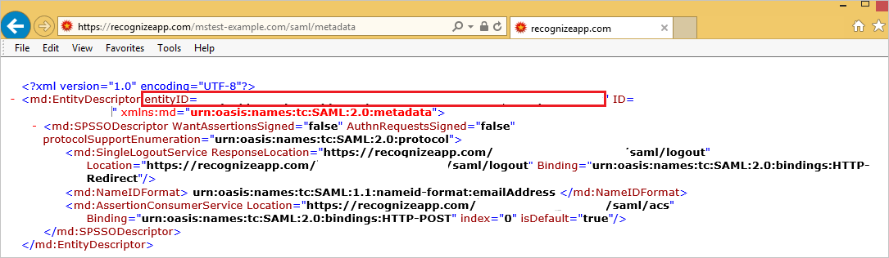
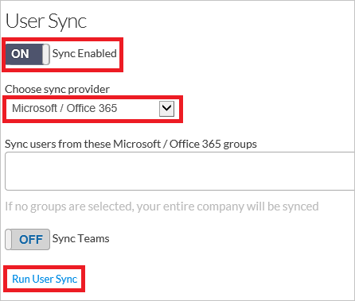

# Tutorial: Azure Active Directory integration with Recognize

In this tutorial, you'll learn how to integrate Recognize with Azure Active Directory (Azure AD). When you integrate Recognize with Azure AD, you can:

* Control in Azure AD who has access to Recognize.
* Enable your users to be automatically signed-in to Recognize with their Azure AD accounts.
* Manage your accounts in one central location - the Azure portal.

## Prerequisites

To get started, you need the following items:

* An Azure AD subscription. If you don't have a subscription, you can get a [free account](https://azure.microsoft.com/free/).
* Recognize single sign-on (SSO) enabled subscription.

## Scenario description

In this tutorial, you configure and test Azure AD single sign-on in a test environment.

* Recognize supports **SP** initiated SSO.

## Add Recognize from the gallery

To configure the integration of Recognize into Azure AD, you need to add Recognize from the gallery to your list of managed SaaS apps.

1. Sign in to the Azure portal using either a work or school account, or a personal Microsoft account.
1. On the left navigation pane, select the **Azure Active Directory** service.
1. Navigate to **Enterprise Applications** and then select **All Applications**.
1. To add new application, select **New application**.
1. In the **Add from the gallery** section, type **Recognize** in the search box.
1. Select **Recognize** from results panel and then add the app. Wait a few seconds while the app is added to your tenant.

## Configure and test Azure AD SSO for Recognize

Configure and test Azure AD SSO with Recognize using a test user called **B.Simon**. For SSO to work, you need to establish a link relationship between an Azure AD user and the related user in Recognize.

To configure and test Azure AD SSO with Recognize, perform the following steps:

1. **[Configure Azure AD SSO](#configure-azure-ad-sso)** - to enable your users to use this feature.
    1. **[Create an Azure AD test user](#create-an-azure-ad-test-user)** - to test Azure AD single sign-on with B.Simon.
    1. **[Assign the Azure AD test user](#assign-the-azure-ad-test-user)** - to enable B.Simon to use Azure AD single sign-on.
1. **[Configure Recognize SSO](#configure-recognize-sso)** - to configure the single sign-on settings on application side.
    1. **[Create Recognize test user](#create-recognize-test-user)** - to have a counterpart of B.Simon in Recognize that is linked to the Azure AD representation of user.
1. **[Test SSO](#test-sso)** - to verify whether the configuration works.

## Configure Azure AD SSO

Follow these steps to enable Azure AD SSO in the Azure portal.

1. In the Azure portal, on the **Recognize** application integration page, find the **Manage** section and select **single sign-on**.
1. On the **Select a single sign-on method** page, select **SAML**.
1. On the **Set up single sign-on with SAML** page, click the pencil icon for **Basic SAML Configuration** to edit the settings.

   

4. On the **Basic SAML Configuration** section, if you have **Service Provider metadata file**, perform the following steps:

	>[!NOTE]
	>You will get the **Service Provider metadata file** from the **Configure Recognize Single Sign-On** section of the tutorial.

	a. Click **Upload metadata file**.

	

	b. Click on **folder logo** to select the metadata file and click **Upload**.

	

	c. After the metadata file is successfully uploaded, the **Identifier** value get auto populated in Basic SAML Configuration section.

	 In the **Sign on URL** text box, type a URL using the following pattern:
    `https://recognizeapp.com/<YOUR_DOMAIN>/saml/sso`

    > [!Note]
	> If the **Identifier** value do not get auto populated, you will get the Identifier value by opening the Service Provider Metadata URL from the SSO Settings section that is explained later in the **Configure Recognize Single Sign-On** section of the tutorial. The Sign-on URL value is not real. Update the value with the actual Sign-on URL. Contact [Recognize Client support team](mailto:support@recognizeapp.com) to get the value. You can also refer to the patterns shown in the **Basic SAML Configuration** section in the Azure portal.

5. On the **Set up Single Sign-On with SAML** page, in the **SAML Signing Certificate** section, click **Download** to download the **Certificate (Base64)** from the given options as per your requirement and save it on your computer.

	

6. On the **Set up Recognize** section, copy the appropriate URL(s) as per your requirement.

	

### Create an Azure AD test user 

In this section, you'll create a test user in the Azure portal called B.Simon.

1. From the left pane in the Azure portal, select **Azure Active Directory**, select **Users**, and then select **All users**.
1. Select **New user** at the top of the screen.
1. In the **User** properties, follow these steps:
   1. In the **Name** field, enter `B.Simon`.  
   1. In the **User name** field, enter the username@companydomain.extension. For example, `B.Simon@contoso.com`.
   1. Select the **Show password** check box, and then write down the value that's displayed in the **Password** box.
   1. Click **Create**.

### Assign the Azure AD test user

In this section, you'll enable B.Simon to use Azure single sign-on by granting access to Recognize.

1. In the Azure portal, select **Enterprise Applications**, and then select **All applications**.
1. In the applications list, select **Recognize**.
1. In the app's overview page, find the **Manage** section and select **Users and groups**.
1. Select **Add user**, then select **Users and groups** in the **Add Assignment** dialog.
1. In the **Users and groups** dialog, select **B.Simon** from the Users list, then click the **Select** button at the bottom of the screen.
1. If you are expecting a role to be assigned to the users, you can select it from the **Select a role** dropdown. If no role has been set up for this app, you see "Default Access" role selected.
1. In the **Add Assignment** dialog, click the **Assign** button.

## Configure Recognize SSO

1. In a different web browser window, sign in to your Recognize tenant as an administrator.

2. On the upper right corner, click **Menu**. Go to **Company Admin**.
   
    

3. On the left navigation pane, click **Settings**.
   
    

4. Perform the following steps on **SSO Settings** section.
   
    
	
	a. As **Enable SSO**, select **ON**.

	b. In the **IDP Entity ID** textbox, paste the value of **Azure AD Identifier** which you have copied from Azure portal.
	
	c. In the **Sso target url** textbox, paste the value of **Login URL** which you have copied from Azure portal.
	
	d. In the **Slo target url** textbox, paste the value of **Logout URL** which you have copied from Azure portal. 
	
	e. Open your downloaded **Certificate (Base64)** file in notepad, copy the content of it into your clipboard, and then paste it to the **Certificate** textbox.
	
	f. Click the **Save settings** button. 

5. Beside the **SSO Settings** section, copy the URL under **Service Provider Metadata url**.
   
    

6. Open the **Metadata URL link** under a blank browser to download the metadata document. Then copy the EntityDescriptor value(entityID) from the file and paste it in **Identifier** textbox in **Basic SAML Configuration** on Azure portal.
    
    

### Create Recognize test user

In order to enable Azure AD users to log into Recognize, they must be provisioned into Recognize. In the case of Recognize, provisioning is a manual task.

This app doesn't support SCIM provisioning but has an alternate user sync that provisions users. 

**To provision a user account, perform the following steps:**

1. Sign into your Recognize company site as an administrator.

2. On the upper right corner, click **Menu**. Go to **Company Admin**.

3. On the left navigation pane, click **Settings**.

4. Perform the following steps on **User Sync** section.
   
	
   
	a. As **Sync Enabled**, select **ON**.
   
	b. As **Choose sync provider**, select **Microsoft / Office 365**.
   
	c. Click **Run User Sync**.

## Test SSO 

In this section, you test your Azure AD single sign-on configuration with following options. 

* Click on **Test this application** in Azure portal. This will redirect to Recognize Sign-on URL where you can initiate the login flow. 

* Go to Recognize Sign-on URL directly and initiate the login flow from there.

* You can use Microsoft My Apps. When you click the Recognize tile in the My Apps, this will redirect to Recognize Sign-on URL. For more information about the My Apps, see [Introduction to the My Apps](../user-help/my-apps-portal-end-user-access.md).

## Next steps

Once you configure Recognize you can enforce session control, which protects exfiltration and infiltration of your organization’s sensitive data in real time. Session control extends from Conditional Access. [Learn how to enforce session control with Microsoft Cloud App Security](/cloud-app-security/proxy-deployment-aad).
