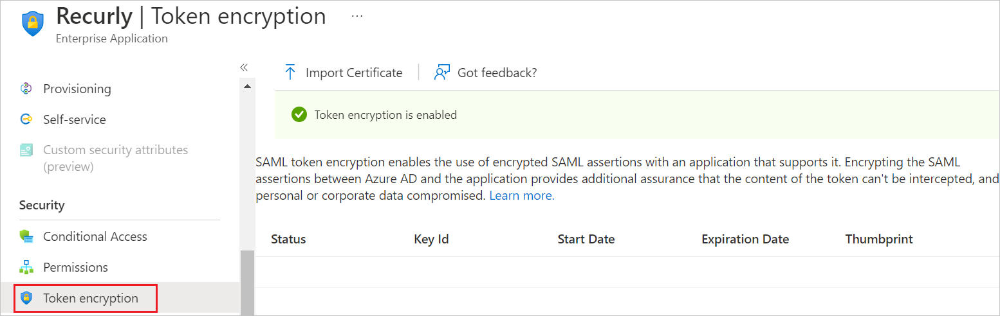
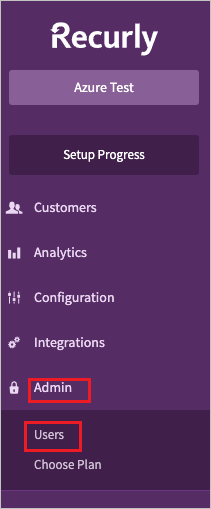
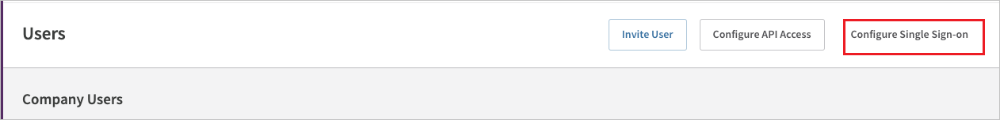
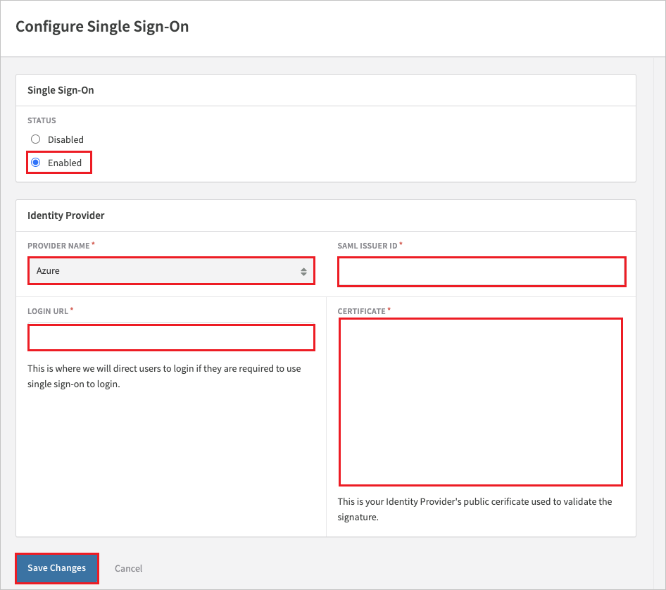
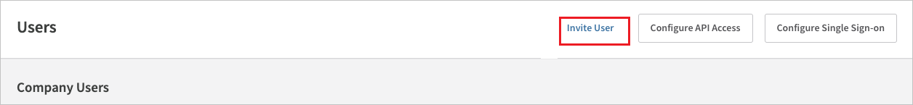
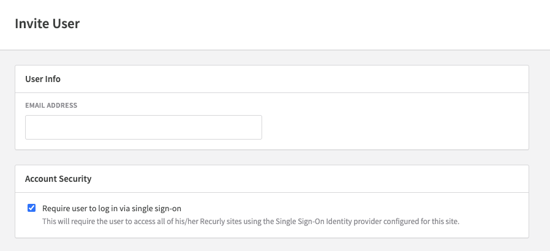

# Tutorial: Azure AD SSO integration with Recurly

In this tutorial, you'll learn how to integrate Recurly with Azure Active Directory (Azure AD). When you integrate Recurly with Azure AD, you can:

* Control in Azure AD who has access to Recurly.
* Enable your users to be automatically signed-in to Recurly with their Azure AD accounts.
* Manage your accounts in one central location - the Azure portal.

## Prerequisites

To get started, you need the following items:

* An Azure AD subscription. If you don't have a subscription, you can get a [free account](https://azure.microsoft.com/free/).
* Recurly single sign-on (SSO) enabled subscription.

## Scenario description

In this tutorial, you configure and test Azure AD SSO in a test environment.

* Recurly supports **SP and IDP** initiated SSO.

> [!NOTE]
> Identifier of this application is a fixed string value so only one instance can be configured in one tenant.

## Add Recurly from the gallery

To configure the integration of Recurly into Azure AD, you need to add Recurly from the gallery to your list of managed SaaS apps.

1. Sign in to the Azure portal using either a work or school account, or a personal Microsoft account.
1. On the left navigation pane, select the **Azure Active Directory** service.
1. Navigate to **Enterprise Applications** and then select **All Applications**.
1. To add new application, select **New application**.
1. In the **Add from the gallery** section, type **Recurly** in the search box.
1. Select **Recurly** from results panel and then add the app. Wait a few seconds while the app is added to your tenant.

 Alternatively, you can also use the [Enterprise App Configuration Wizard](https://portal.office.com/AdminPortal/home?Q=Docs#/azureadappintegration). In this wizard, you can add an application to your tenant, add users/groups to the app, assign roles, as well as walk through the SSO configuration as well. [Learn more about Microsoft 365 wizards.](/microsoft-365/admin/misc/azure-ad-setup-guides)

## Configure and test Azure AD SSO for Recurly

Configure and test Azure AD SSO with Recurly using a test user called **B.Simon**. For SSO to work, you need to establish a link relationship between an Azure AD user and the related user in Recurly.

To configure and test Azure AD SSO with Recurly, perform the following steps:

1. **[Configure Azure AD SSO](#configure-azure-ad-sso)** - to enable your users to use this feature.
    1. **[Create an Azure AD test user](#create-an-azure-ad-test-user)** - to test Azure AD single sign-on with B.Simon.
    1. **[Assign the Azure AD test user](#assign-the-azure-ad-test-user)** - to enable B.Simon to use Azure AD single sign-on.
1. **[Configure Recurly SSO](#configure-recurly-sso)** - to configure the single sign-on settings on application side.
    1. **[Create Recurly test user](#create-recurly-test-user)** - to have a counterpart of B.Simon in Recurly that is linked to the Azure AD representation of user.
1. **[Test SSO](#test-sso)** - to verify whether the configuration works.

## Configure Azure AD SSO

Follow these steps to enable Azure AD SSO in the Azure portal.

1. In the Azure portal, on the **Recurly** application integration page, find the **Manage** section and select **single sign-on**.
2. On the **Select a single sign-on method** page, select **SAML**.
3. On the **Set up single sign-on with SAML** page, click the pencil icon for **Basic SAML Configuration** to edit the settings.

   

4. On the **Basic SAML Configuration** section, the **Identifier** and **Reply URL** values are pre-configured with `https://app.recurly.com` and `https://app.recurly.com/login/sso` respectively. Perform the following step to complete the configuration:

    a. In the **Sign-on URL** text box, type the URL:
   `https://app.recurly.com/login/sso`

5. On the **Set up single sign-on with SAML** page, in the **SAML Signing Certificate** section, click **Edit**, select the `...` next to the thumbprint status, select **PEM certificate download** to download the certificate and save it on your computer.   

	

6. Your Recurly application expects the SAML assertions in a specific format, which requires you to add custom attribute mappings to your SAML token attributes configuration.
The following screenshot shows an example of this. The default value of **Unique User Identifier** is **user.userprincipalname** but Recurly expects this to be mapped with the user's email address. For that you can use **user.mail** attribute from the list or use the appropriate attribute value based on your organization configuration.
    
    

7. Recurly application expects to enable token encryption in order to make SSO work. To activate token encryption, go to the **Azure Active Directory** > **Enterprise applications** and select **Token encryption**.

    

    a. Please contact [Recurly Support](mailto:support@recurly.com) to get a copy of the certificate to import.

   b. After importing the certificate, select the `...` next to the thumbprint status, click `Activate token encryption certificate`.

   c. For more information on configuring token encryption, please refer this [link](../manage-apps/howto-saml-token-encryption.md).

### Create an Azure AD test user

In this section, you'll create a test user in the Azure portal called B.Simon.

1. From the left pane in the Azure portal, select **Azure Active Directory**, select **Users**, and then select **All users**.
1. Select **New user** at the top of the screen.
1. In the **User** properties, follow these steps:
   1. In the **Name** field, enter `B.Simon`.  
   1. In the **User name** field, enter the username@companydomain.extension. For example, `B.Simon@contoso.com`.
   1. Select the **Show password** check box, and then write down the value that's displayed in the **Password** box.
   1. Click **Create**.

### Assign the Azure AD test user

In this section, you'll enable B.Simon to use Azure single sign-on by granting access to Recurly.

1. In the Azure portal, select **Enterprise Applications**, and then select **All applications**.
1. In the applications list, select **Recurly**.
1. In the app's overview page, find the **Manage** section and select **Users and groups**.
1. Select **Add user**, then select **Users and groups** in the **Add Assignment** dialog.
1. In the **Users and groups** dialog, select **B.Simon** from the Users list, then click the **Select** button at the bottom of the screen.
1. If you are expecting a role to be assigned to the users, you can select it from the **Select a role** dropdown. If no role has been set up for this app, you see "Default Access" role selected.
1. In the **Add Assignment** dialog, click the **Assign** button.

## Configure Recurly SSO

Follow these steps to configure single sign-on for your **Recurly** site.

1. Log into your Recurly company site as an administrator.

2. Navigate to **Admin** > **Users**.

   

3.  Click the **Configure Single Sign on** button on the top right.   

    

4. In the **Single Sign-On** section, select the **Enabled** radio button and perform the following steps in the **Identity Provider** section:

    

   a. In **PROVIDER NAME**, select **Azure**.

   b. In the **SAML ISSUER ID** textbox, paste the **Application(Client ID)** value from the Azure portal.

   c. In the **LOGIN URL** textbox, paste the **Login URL** value which you have copied from the Azure portal.

   d. Open the downloaded Certificate (PEM) from the Azure portal into Notepad and paste the content into the **CERTIFICATE** textbox.

   e. Click **Save Changes**.

### Create Recurly test user

In this section, you will invite a new user to join your site and require them to use SSO to test the configuration.

1. Navigate to **Admin** > **Users**, click **Invite User** and type the email address of the Azure test user that was previously created. Your invitation will default to requiring them to use SSO.

   

   

2. The test user will receive an email from Recurly inviting them to join your site.

3. After accepting the invite, the test user will be listed under **Company Users** in your site and will be able to log in using SSO.

## Test SSO 

In this section, you test your Azure AD single sign-on configuration with following options. 

#### SP initiated:

* Click on **Test this application** in Azure portal. This will redirect to Recurly Sign on URL where you can initiate the login flow.  

* Go to Recurly Sign-on URL directly and initiate the login flow from there.

#### IDP initiated:

* Click on **Test this application** in Azure portal and you should be automatically signed in to the Recurly for which you set up the SSO. 

You can also use Microsoft My Apps to test the application in any mode. When you click the Recurly tile in the My Apps, if configured in SP mode you would be redirected to the application sign on page for initiating the login flow and if configured in IDP mode, you should be automatically signed in to the Recurly for which you set up the SSO. For more information about the My Apps, see [Introduction to the My Apps](../user-help/my-apps-portal-end-user-access.md).

## Next steps

Once you configure Recurly you can enforce session control, which protects exfiltration and infiltration of your organization’s sensitive data in real time. Session control extends from Conditional Access. [Learn how to enforce session control with Microsoft Cloud App Security](/cloud-app-security/proxy-deployment-aad).