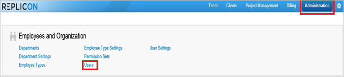
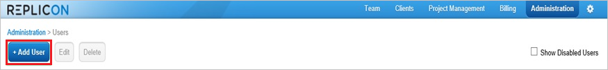
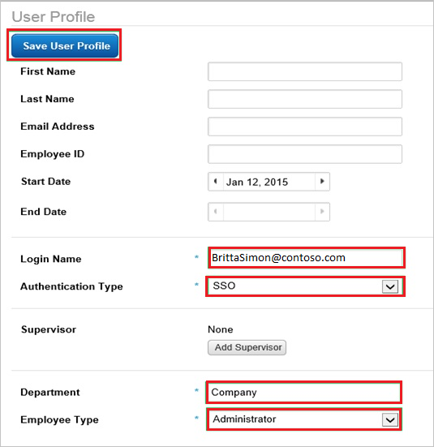

# Tutorial: Integrate Replicon with Azure Active Directory

In this tutorial, you'll learn how to integrate Replicon with Azure Active Directory (Azure AD). When you integrate Replicon with Azure AD, you can:

* Control in Azure AD who has access to Replicon.
* Enable your users to be automatically signed-in to Replicon with their Azure AD accounts.
* Manage your accounts in one central location - the Azure portal.

To learn more about SaaS app integration with Azure AD, see [What is application access and single sign-on with Azure Active Directory](https://docs.microsoft.com/azure/active-directory/active-directory-appssoaccess-whatis).

## Prerequisites

To get started, you need the following items:

* An Azure AD subscription. If you don't have a subscription, you can get one-month free trial [here](https://azure.microsoft.com/pricing/free-trial/).
* Replicon single sign-on (SSO) enabled subscription.

## Scenario description

In this tutorial, you configure and test Azure AD SSO in a test environment. Replicon supports **SP** initiated SSO.

## Adding Replicon from the gallery

To configure the integration of Replicon into Azure AD, you need to add Replicon from the gallery to your list of managed SaaS apps.

1. Sign in to the [Azure portal](https://portal.azure.com) using either a work or school account, or a personal Microsoft account.
1. On the left navigation pane, select the **Azure Active Directory** service.
1. Navigate to **Enterprise Applications** and then select **All Applications**.
1. To add new application, select **New application**.
1. In the **Add from the gallery** section, type **Replicon** in the search box.
1. Select **Replicon** from results panel and then add the app. Wait a few seconds while the app is added to your tenant.

## Configure and test Azure AD single sign-on

Configure and test Azure AD SSO with Replicon using a test user called **B.Simon**. For SSO to work, you need to establish a link relationship between an Azure AD user and the related user in Replicon.

To configure and test Azure AD SSO with Replicon, complete the following building blocks:

1. **[Configure Azure AD SSO](#configure-azure-ad-sso)** - to enable your users to use this feature.
2. **[Configure Replicon SSO](#configure-replicon-sso)** - to configure the Single Sign-On settings on application side.
3. **[Create an Azure AD test user](#create-an-azure-ad-test-user)** - to test Azure AD single sign-on with B.Simon.
4. **[Assign the Azure AD test user](#assign-the-azure-ad-test-user)** - to enable B.Simon to use Azure AD single sign-on.
5. **[Create Replicon test user](#create-replicon-test-user)** - to have a counterpart of B.Simon in Replicon that is linked to the Azure AD representation of user.
6. **[Test SSO](#test-sso)** - to verify whether the configuration works.

### Configure Azure AD SSO

Follow these steps to enable Azure AD SSO in the Azure portal.

1. In the [Azure portal](https://portal.azure.com/), on the **Replicon** application integration page, find the **Manage** section and select **Single sign-on**.
1. On the **Select a Single sign-on method** page, select **SAML**.
1. On the **Set up Single Sign-On with SAML** page, click the edit/pen icon for **Basic SAML Configuration** to edit the settings.

   

1. On the **Basic SAML Configuration** page, enter the values for the following fields:

    1. In the **Sign-on URL** text box, type a URL using the following pattern:
    `https://global.replicon.com/!/saml2/<client name>/sp-sso/post`

    1. In the **Identifier** box, type a URL using the following pattern:
    `https://global.replicon.com/!/saml2/<client name>`

    1. In the **Reply URL** text box, type a URL using the following pattern:
    `https://global.replicon.com/!/saml2/<client name>/sso/post`

	> [!NOTE]
	> These values are not real. Update these values with the actual Sign-On URL, Identifier and Reply URL. Contact [Replicon Client support team](https://www.replicon.com/customerzone/contact-support) to get these values. You can also refer to the patterns shown in the **Basic SAML Configuration** section in the Azure portal.

1. Click the edit/pen icon for **SAML Signing Certificate** to edit the settings.

    

    1. Select **Sign SAML assertion** as the **Signing Option**.

    1. Select **SHA-256** as the **Signing Algorithm**.

1. On the **Set up Single Sign-On with SAML** page, in the **SAML Signing Certificate** section, find **Federation Metadata XML** and select **Download** to download the certificate and save it on your computer.

   

### Configure Replicon SSO

1. In a different web browser window, sign into your Replicon company site as an administrator.

2. To configure SAML 2.0, perform the following steps:

    

	a. To display the **EnableSAML Authentication2** dialog, append the following to your URL, after your company key: `/services/SecurityService1.svc/help/test/EnableSAMLAuthentication2`

	* The following shows the schema of the complete URL:
   `https://na2.replicon.com/\<YourCompanyKey\>/services/SecurityService1.svc/help/test/EnableSAMLAuthentication2`

   b. Click the **+** to expand the **v20Configuration** section.

   c. Click the **+** to expand the **metaDataConfiguration** section.

   d. Select **SHA256** for xmlSignatureAlgorithm

   e. Click **Choose File**, to select your identity provider metadata XML file, and click **Submit**.

### Create an Azure AD test user

In this section, you'll create a test user in the Azure portal called B.Simon.

1. From the left pane in the Azure portal, select **Azure Active Directory**, select **Users**, and then select **All users**.
1. Select **New user** at the top of the screen.
1. In the **User** properties, follow these steps:
   1. In the **Name** field, enter `B.Simon`.  
   1. In the **User name** field, enter the username@companydomain.extension. For example, `BrittaSimon@contoso.com`.
   1. Select the **Show password** check box, and then write down the value that's displayed in the **Password** box.
   1. Click **Create**.

### Assign the Azure AD test user

In this section, you'll enable B.Simon to use Azure single sign-on by granting access to Replicon.

1. In the Azure portal, select **Enterprise Applications**, and then select **All applications**.
1. In the applications list, select **Replicon**.
1. In the app's overview page, find the **Manage** section and select **Users and groups**.

   

1. Select **Add user**, then select **Users and groups** in the **Add Assignment** dialog.

	

1. In the **Users and groups** dialog, select **B.Simon** from the Users list, then click the **Select** button at the bottom of the screen.
1. If you're expecting any role value in the SAML assertion, in the **Select Role** dialog, select the appropriate role for the user from the list and then click the **Select** button at the bottom of the screen.
1. In the **Add Assignment** dialog, click the **Assign** button.

### Create Replicon test user

The objective of this section is to create a user called B.Simon in Replicon.

**If you need to create user manually, perform following steps:**

1. In a web browser window, sign into your Replicon company site as an administrator.

2. Go to **Administration \> Users**.

    

3. Click **+Add User**.

    

4. In the **User Profile** section, perform the following steps:

    

	a. In the **Login Name** textbox, type the Azure AD email address of the Azure AD user you want to provision like `B.Simon@contoso.com`.

    > [!NOTE]
    > Login Name needs to match the user's email address in Azure AD

	b. As **Authentication Type**, select **SSO**.

    c. Set Authentication ID to the same value as Login Name (The Azure AD email address of the user)

	d. In the **Department** textbox, type the user’s department.

	e. As **Employee Type**, select **Administrator**.

	f. Click **Save User Profile**.

> [!NOTE]
> You can use any other Replicon user account creation tools or APIs provided by Replicon to provision Azure AD user accounts.

### Test SSO

When you select the Replicon tile in the Access Panel, you should be automatically signed in to the Replicon for which you set up SSO. For more information about the Access Panel, see [Introduction to the Access Panel](https://docs.microsoft.com/azure/active-directory/active-directory-saas-access-panel-introduction).

## Additional Resources

- [List of Tutorials on How to Integrate SaaS Apps with Azure Active Directory](https://docs.microsoft.com/azure/active-directory/active-directory-saas-tutorial-list)

- [What is application access and single sign-on with Azure Active Directory?](https://docs.microsoft.com/azure/active-directory/active-directory-appssoaccess-whatis)

- [What is Conditional Access in Azure Active Directory?](https://docs.microsoft.com/azure/active-directory/conditional-access/overview)