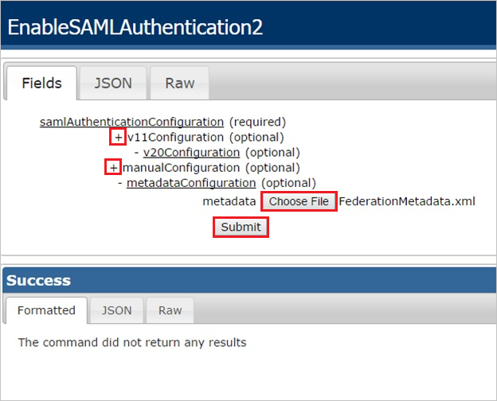

# Tutorial: Integrate Replicon with Azure Active Directory

In this tutorial, you'll learn how to integrate Replicon with Azure Active Directory (Azure AD). When you integrate Replicon with Azure AD, you can:

* Control in Azure AD who has access to Replicon.
* Enable your users to be automatically signed-in to Replicon with their Azure AD accounts.
* Manage your accounts in one central location - the Azure portal.

## Prerequisites

To get started, you need the following items:

* An Azure AD subscription. If you don't have a subscription, you can get a [free account](https://azure.microsoft.com/free/).
* Replicon single sign-on (SSO) enabled subscription.

> [!NOTE]
> This integration is also available to use from Azure AD US Government Cloud environment. You can find this application in the Azure AD US Government Cloud Application Gallery and configure it in the same way as you do from public cloud.

## Scenario description

In this tutorial, you configure and test Azure AD SSO in a test environment. 

* Replicon supports **SP** initiated SSO.

## Add Replicon from the gallery

To configure the integration of Replicon into Azure AD, you need to add Replicon from the gallery to your list of managed SaaS apps.

1. Sign in to the Azure portal using either a work or school account, or a personal Microsoft account.
1. On the left navigation pane, select the **Azure Active Directory** service.
1. Navigate to **Enterprise Applications** and then select **All Applications**.
1. To add new application, select **New application**.
1. In the **Add from the gallery** section, type **Replicon** in the search box.
1. Select **Replicon** from results panel and then add the app. Wait a few seconds while the app is added to your tenant.

 Alternatively, you can also use the [Enterprise App Configuration Wizard](https://portal.office.com/AdminPortal/home?Q=Docs#/azureadappintegration). In this wizard, you can add an application to your tenant, add users/groups to the app, assign roles, as well as walk through the SSO configuration as well. [Learn more about Microsoft 365 wizards.](/microsoft-365/admin/misc/azure-ad-setup-guides)

## Configure and test Azure AD SSO for Replicon

Configure and test Azure AD SSO with Replicon using a test user called **B.Simon**. For SSO to work, you need to establish a link relationship between an Azure AD user and the related user in Replicon.

To configure and test Azure AD SSO with Replicon, perform the following steps:

1. **[Configure Azure AD SSO](#configure-azure-ad-sso)** - to enable your users to use this feature.
    1. **[Create an Azure AD test user](#create-an-azure-ad-test-user)** - to test Azure AD single sign-on with B.Simon.
    1. **[Assign the Azure AD test user](#assign-the-azure-ad-test-user)** - to enable B.Simon to use Azure AD single sign-on.
1. **[Configure Replicon SSO](#configure-replicon-sso)** - to configure the single sign-on settings on application side.
    1. **[Create Replicon test user](#create-replicon-test-user)** - to have a counterpart of B.Simon in Replicon that is linked to the Azure AD representation of user.
1. **[Test SSO](#test-sso)** - to verify whether the configuration works.

## Configure Azure AD SSO

Follow these steps to enable Azure AD SSO in the Azure portal.

1. In the Azure portal, on the **Replicon** application integration page, find the **Manage** section and select **Single sign-on**.
1. On the **Select a Single sign-on method** page, select **SAML**.
1. On the **Set up Single Sign-On with SAML** page, click the pencil icon for **Basic SAML Configuration** to edit the settings.

   

1. On the **Basic SAML Configuration** page, perform the following steps:

    a. In the **Sign-on URL** text box, type a URL using the following pattern:
    `https://global.replicon.com/!/saml2/<client name>/sp-sso/post`

    b. In the **Identifier** box, type a URL using the following pattern:
    `https://global.replicon.com/!/saml2/<client name>`

    c. In the **Reply URL** text box, type a URL using the following pattern:
    `https://global.replicon.com/!/saml2/<client name>/sso/post`

	> [!NOTE]
	> These values are not real. Update these values with the actual Sign-On URL, Identifier and Reply URL. Contact [Replicon Client support team](https://www.replicon.com/customerzone/contact-support) to get these values. You can also refer to the patterns shown in the **Basic SAML Configuration** section in the Azure portal.

1. Click the pencil icon for **SAML Signing Certificate** to edit the settings.

    

    1. Select **Sign SAML assertion** as the **Signing Option**.

    1. Select **SHA-256** as the **Signing Algorithm**.

1. On the **Set up Single Sign-On with SAML** page, in the **SAML Signing Certificate** section, find **Federation Metadata XML** and select **Download** to download the certificate and save it on your computer.

   

### Create an Azure AD test user

In this section, you'll create a test user in the Azure portal called B.Simon.

1. From the left pane in the Azure portal, select **Azure Active Directory**, select **Users**, and then select **All users**.
1. Select **New user** at the top of the screen.
1. In the **User** properties, follow these steps:
   1. In the **Name** field, enter `B.Simon`.  
   1. In the **User name** field, enter the username@companydomain.extension. For example, `BrittaSimon@contoso.com`.
   1. Select the **Show password** check box, and then write down the value that's displayed in the **Password** box.
   1. Click **Create**.

### Assign the Azure AD test user

In this section, you'll enable B.Simon to use Azure single sign-on by granting access to Replicon.

1. In the Azure portal, select **Enterprise Applications**, and then select **All applications**.
1. In the applications list, select **Replicon**.
1. In the app's overview page, find the **Manage** section and select **Users and groups**.
1. Select **Add user**, then select **Users and groups** in the **Add Assignment** dialog.
1. In the **Users and groups** dialog, select **B.Simon** from the Users list, then click the **Select** button at the bottom of the screen.
1. If you are expecting a role to be assigned to the users, you can select it from the **Select a role** dropdown. If no role has been set up for this app, you see "Default Access" role selected.
1. In the **Add Assignment** dialog, click the **Assign** button.

## Configure Replicon SSO

1. In a different web browser window, sign into your Replicon company site as an administrator.

2. To configure SAML 2.0, perform the following steps:

    

	a. To display the **EnableSAML Authentication2** dialog, append the following to your URL, after your company key: `/services/SecurityService1.svc/help/test/EnableSAMLAuthentication2`

	1. The following shows the schema of the complete URL:
   `https://na2.replicon.com/<YourCompanyKey>/services/SecurityService1.svc/help/test/EnableSAMLAuthentication2`

   b. Click the **+** to expand the **v20Configuration** section.

   c. Click the **+** to expand the **metaDataConfiguration** section.

   d. Select **SHA256** for xmlSignatureAlgorithm

   e. Click **Choose File**, to select your identity provider metadata XML file, and click **Submit**.

### Create Replicon test user

The objective of this section is to create a user called B.Simon in Replicon.

**If you need to create user manually, perform following steps:**

1. In a web browser window, sign into your Replicon company site as an administrator.

2. Go to **Administration \> Users**.

    

3. Click **+Add User**.

    

4. In the **User Profile** section, perform the following steps:

    

	a. In the **Login Name** textbox, type the Azure AD email address of the Azure AD user you want to provision like `B.Simon@contoso.com`.

    > [!NOTE]
    > Login Name needs to match the user's email address in Azure AD

	b. As **Authentication Type**, select **SSO**.

    c. Set Authentication ID to the same value as Login Name (The Azure AD email address of the user)

	d. In the **Department** textbox, type the user’s department.

	e. As **Employee Type**, select **Administrator**.

	f. Click **Save User Profile**.

> [!NOTE]
> You can use any other Replicon user account creation tools or APIs provided by Replicon to provision Azure AD user accounts.

## Test SSO

In this section, you test your Azure AD single sign-on configuration with following options. 

* Click on **Test this application** in Azure portal. This will redirect to Replicon Sign-on URL where you can initiate the login flow. 

* Go to Replicon Sign-on URL directly and initiate the login flow from there.

* You can use Microsoft My Apps. When you click the Replicon tile in the My Apps, this will redirect to Replicon Sign-on URL. For more information about the My Apps, see [Introduction to the My Apps](https://support.microsoft.com/account-billing/sign-in-and-start-apps-from-the-my-apps-portal-2f3b1bae-0e5a-4a86-a33e-876fbd2a4510).

## Next steps

Once you configure Replicon you can enforce session control, which protects exfiltration and infiltration of your organization’s sensitive data in real time. Session control extends from Conditional Access. [Learn how to enforce session control with Microsoft Defender for Cloud Apps](/cloud-app-security/proxy-deployment-aad).
