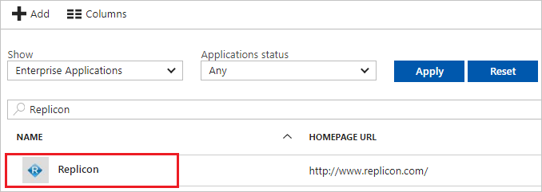

# Tutorial: Azure Active Directory integration with Replicon

In this tutorial, you learn how to integrate Replicon with Azure Active Directory (Azure AD).

Integrating Replicon with Azure AD provides you with the following benefits:

- You can control in Azure AD who has access to Replicon.
- You can enable your users to automatically get signed-on to Replicon (Single Sign-On) with their Azure AD accounts.
- You can manage your accounts in one central location - the Azure portal.

If you want to know more details about SaaS app integration with Azure AD, see [what is application access and single sign-on with Azure Active Directory](../manage-apps/what-is-single-sign-on.md).

## Prerequisites

To configure Azure AD integration with Replicon, you need the following items:

- An Azure AD subscription
- A Replicon single sign-on enabled subscription

> [!NOTE]
> To test the steps in this tutorial, we do not recommend using a production environment.

To test the steps in this tutorial, you should follow these recommendations:

- Do not use your production environment, unless it is necessary.
- If you don't have an Azure AD trial environment, you can [get a one-month trial](https://azure.microsoft.com/pricing/free-trial/).

## Scenario description
In this tutorial, you test Azure AD single sign-on in a test environment. 
The scenario outlined in this tutorial consists of two main building blocks:

1. Adding Replicon from the gallery
2. Configuring and testing Azure AD single sign-on

## Adding Replicon from the gallery
To configure the integration of Replicon into Azure AD, you need to add Replicon from the gallery to your list of managed SaaS apps.

**To add Replicon from the gallery, perform the following steps:**

1. In the **[Azure portal](https://portal.azure.com)**, on the left navigation panel, click **Azure Active Directory** icon.

	![The Azure Active Directory button][1]

2. Navigate to **Enterprise applications**. Then go to **All applications**.

	![The Enterprise applications blade][2]

3. To add new application, click **New application** button on the top of dialog.

	![The New application button][3]

4. In the search box, type **Replicon**, select **Replicon** from result panel then click **Add** button to add the application.

	

## Configure and test Azure AD single sign-on

In this section, you configure and test Azure AD single sign-on with Replicon based on a test user called "Britta Simon".

For single sign-on to work, Azure AD needs to know what the counterpart user in Replicon is to a user in Azure AD. In other words, a link relationship between an Azure AD user and the related user in Replicon needs to be established.

In Replicon, assign the value of the **user name** in Azure AD as the value of the **Username** to establish the link relationship.

To configure and test Azure AD single sign-on with Replicon, you need to complete the following building blocks:

1. **[Configure Azure AD Single Sign-On](#configure-azure-ad-single-sign-on)** - to enable your users to use this feature.
2. **[Create an Azure AD test user](#create-an-azure-ad-test-user)** - to test Azure AD single sign-on with Britta Simon.
3. **[Create a Replicon test user](#create-a-replicon-test-user)** - to have a counterpart of Britta Simon in Replicon that is linked to the Azure AD representation of user.
4. **[Assign the Azure AD test user](#assign-the-azure-ad-test-user)** - to enable Britta Simon to use Azure AD single sign-on.
5. **[Test single sign-on](#test-single-sign-on)** - to verify whether the configuration works.

### Configure Azure AD single sign-on

In this section, you enable Azure AD single sign-on in the Azure portal and configure single sign-on in your Replicon application.

**To configure Azure AD single sign-on with Replicon, perform the following steps:**

1. In the Azure portal, on the **Replicon** application integration page, click **Single sign-on**.

	![Configure single sign-on link][4]

2. On the **Single sign-on** dialog, select **Mode** as **SAML-based Sign-on** to enable single sign-on.

	

3. On the **Replicon Domain and URLs** section, perform the following steps:

	

    a. In the **Sign-on URL** textbox, type a URL using the following pattern: `https://na2.replicon.com/<companyname>/saml2/sp-sso/post`

	b. In the **Identifier** textbox, type a URL using the following pattern: `https://global.replicon.com/<companyname>`

	c. In the **Reply URL** textbox, type a URL using the following pattern: `https://global.replicon.com/!/saml2/<companyname>/sso/post`

	> [!NOTE]
	> These values are not real. Update these values with the actual Sign-On URL, Identifier, and Reply URL. Contact [Replicon Client support team](https://www.replicon.com/customerzone/contact-support) to get these values. 

4. On the **SAML Signing Certificate** section, click **Metadata XML** and then save the metadata file on your computer.

	 

5. Click **Save** button.

	

6. In a different web browser window, log into your Replicon company site as an administrator.

7. To configure SAML 2.0, perform the following steps:

    

	a. To display the **EnableSAML Authentication2** dialog, append the following to your URL, after your company key: `/services/SecurityService1.svc/help/test/EnableSAMLAuthentication2`

	* The following shows the schema of the complete URL:
   `https://na2.replicon.com/\<YourCompanyKey\>/services/SecurityService1.svc/help/test/EnableSAMLAuthentication2`

   b. Click the **+** to expand the **v20Configuration** section.

   c. Click the **+** to expand the **metaDataConfiguration** section.

   d. Click **Choose File**, to select your identity provider metadata XML file, and click **Submit**.

### Create an Azure AD test user

The objective of this section is to create a test user in the Azure portal called Britta Simon.

   ![Create an Azure AD test user][100]

**To create a test user in Azure AD, perform the following steps:**

1. In the Azure portal, in the left pane, click the **Azure Active Directory** button.

    

2. To display the list of users, go to **Users and groups**, and then click **All users**.

    

3. To open the **User** dialog box, click **Add** at the top of the **All Users** dialog box.

    

4. In the **User** dialog box, perform the following steps:

    

    a. In the **Name** box, type **BrittaSimon**.

    b. In the **User name** box, type the email address of user Britta Simon.

    c. Select the **Show Password** check box, and then write down the value that's displayed in the **Password** box.

    d. Click **Create**.

### Create a Replicon test user

The objective of this section is to create a user called Britta Simon in Replicon.

**If you need to create user manually, perform following steps:**

1. In a web browser window, log into your Replicon company site as an administrator.

2. Go to **Administration \> Users**.

    

3. Click **+Add User**.

    

4. In the **User Profile** section, perform the following steps:

    

	a. In the **Login Name** textbox, type the Azure AD email address of the Azure AD user you want to provision like **BrittaSimon@contoso.com**.

	b. As **Authentication Type**, select **SSO**.

	c. In the **Department** textbox, type the user’s department.

	d. As **Employee Type**, select **Administrator**.

	e. Click **Save User Profile**.

>[!NOTE]
>You can use any other Replicon user account creation tools or APIs provided by Replicon to provision Azure AD user accounts.

### Assign the Azure AD test user

In this section, you enable Britta Simon to use Azure single sign-on by granting access to Replicon.

![Assign the user role][200]

**To assign Britta Simon to Replicon, perform the following steps:**

1. In the Azure portal, open the applications view, and then navigate to the directory view and go to **Enterprise applications** then click **All applications**.

	![Assign User][201]

2. In the applications list, select **Replicon**.

	

3. In the menu on the left, click **Users and groups**.

	![The "Users and groups" link][202]

4. Click **Add** button. Then select **Users and groups** on **Add Assignment** dialog.

	![The Add Assignment pane][203]

5. On **Users and groups** dialog, select **Britta Simon** in the Users list.

6. Click **Select** button on **Users and groups** dialog.

7. Click **Assign** button on **Add Assignment** dialog.

### Test single sign-on

In this section, you test your Azure AD single sign-on configuration using the Access Panel.

When you click the Replicon tile in the Access Panel, you should get automatically signed-on to your Replicon application.
For more information about the Access Panel, see [Introduction to the Access Panel](../user-help/active-directory-saas-access-panel-introduction.md).

## Additional resources

* [List of Tutorials on How to Integrate SaaS Apps with Azure Active Directory](tutorial-list.md)
* [What is application access and single sign-on with Azure Active Directory?](../manage-apps/what-is-single-sign-on.md)

<!--Image references-->

[1]: ./media/replicon-tutorial/tutorial_general_01.png
[2]: ./media/replicon-tutorial/tutorial_general_02.png
[3]: ./media/replicon-tutorial/tutorial_general_03.png
[4]: ./media/replicon-tutorial/tutorial_general_04.png

[100]: ./media/replicon-tutorial/tutorial_general_100.png

[200]: ./media/replicon-tutorial/tutorial_general_200.png
[201]: ./media/replicon-tutorial/tutorial_general_201.png
[202]: ./media/replicon-tutorial/tutorial_general_202.png
[203]: ./media/replicon-tutorial/tutorial_general_203.png
