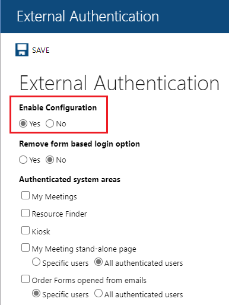
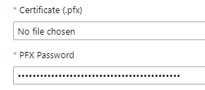
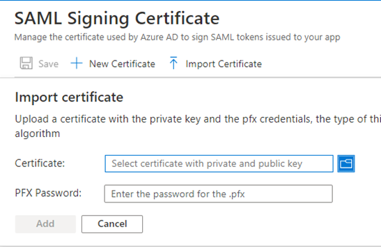

# Tutorial: Azure Active Directory single sign-on (SSO) integration with Resource Central – SAML SSO for Meeting Room Booking System

In this tutorial, you'll learn how to integrate Resource Central – SAML SSO for Meeting Room Booking System with Azure Active Directory (Azure AD). When you integrate Resource Central – SAML SSO for Meeting Room Booking System with Azure AD, you can:

* Control in Azure AD who has access to Resource Central – SAML SSO for Meeting Room Booking System.
* Enable your users to be automatically signed-in to Resource Central – SAML SSO for Meeting Room Booking System with their Azure AD accounts.
* Manage your accounts in one central location - the Azure portal.

## Prerequisites

To get started, you need the following items:

* An Azure AD subscription. If you don't have a subscription, you can get a [free account](https://azure.microsoft.com/free/).
* Resource Central – SAML SSO for Meeting Room Booking System single sign-on (SSO) enabled subscription.

## Scenario description

In this tutorial, you configure and test Azure AD SSO in a test environment.

* Resource Central – SAML SSO for Meeting Room Booking System supports **SP** initiated SSO

* Resource Central – SAML SSO for Meeting Room Booking System supports **Just In Time** user provisioning

## Add Resource Central – SAML SSO for Meeting Room Booking System from the gallery

To configure the integration of Resource Central – SAML SSO for Meeting Room Booking System into Azure AD, you need to add Resource Central – SAML SSO for Meeting Room Booking System from the gallery to your list of managed SaaS apps.

1. Sign in to the Azure portal using either a work or school account, or a personal Microsoft account.
1. On the left navigation pane, select the **Azure Active Directory** service.
1. Navigate to **Enterprise Applications** and then select **All Applications**.
1. To add a new application, select **New application**.
1. In the **Add from the gallery** section, in the search box, enter **Resource Central – SAML SSO for Meeting Room Booking System**.
1. Select **Resource Central – SAML SSO for Meeting Room Booking System** from results panel and then add the app. Wait a few seconds while the app is added to your tenant.

## Configure and test Azure AD SSO for Resource Central – SAML SSO for Meeting Room Booking System

Configure and test Azure AD SSO with Resource Central – SAML SSO for Meeting Room Booking System using a test user called **B.Simon**. For SSO to work, you need to establish a link relationship between an Azure AD user and the related user in Resource Central – SAML SSO for Meeting Room Booking System.

To configure and test Azure AD SSO with Resource Central – SAML SSO for Meeting Room Booking System, perform the following steps:

1. **[Configure Azure AD SSO](#configure-azure-ad-sso)** - to enable your users to use this feature.
    1. **[Create an Azure AD test user](#create-an-azure-ad-test-user)** - to test Azure AD single sign-on with B.Simon.
    1. **[Assign the Azure AD test user](#assign-the-azure-ad-test-user)** - to enable B.Simon to use Azure AD single sign-on.
    1. **[Create Resource Central SAML SSO for Meeting Room Booking System test user](#create-resource-central-saml-sso-for-meeting-room-booking-system-test-user)** - to have a counterpart of B.Simon in Resource Central – SAML SSO for Meeting Room Booking System that is linked to the Azure AD representation of user.
1. **[Configure Resource Central SAML SSO for Meeting Room Booking System SSO](#configure-resource-central-saml-sso-for-meeting-room-booking-system-sso)** - to configure the single sign-on settings on application side.
1. **[Test SSO](#test-sso)** - to verify whether the configuration works.

## Configure Azure AD SSO

Follow these steps to enable Azure AD SSO in the Azure portal.

1. In the Azure portal, on the **Resource Central – SAML SSO for Meeting Room Booking System** application integration page, find the **Manage** section and select **single sign-on**.
1. On the **Select a single sign-on method** page, select **SAML**.
1. On the **Set up single sign-on with SAML** page, click the edit/pen icon for **Basic SAML Configuration** to edit the settings.

   

1. In **Basic SAML Configuration**, enter the values for the following fields:

   1. In the **Sign on URL** text box, type a URL using the following pattern: `https://<DOMAIN_NAME>/ResourceCentral`

   1. In the **Identifier (Entity ID)** text box, type a URL using the following pattern:  `https://<DOMAIN_NAME>/ResourceCentral`

   1. In the **Reply URL** text box, type a URL using the following pattern: `https://<DOMAIN_NAME>/ResourceCentral/ExAuth/Saml2Authentication/Acs`

    > [!NOTE]
    > These values are not literal values. Update these values with the actual Sign-on URL, Identifier, and Reply URL values. Contact [Resource Central – SAML SSO for Meeting Room Booking System Client support team](mailto:st@aod.vn) to get these values.  You can also refer to the patterns shown in the **Basic SAML Configuration** section in the Azure portal.

1. On the **Set up single sign-on with SAML** page, in **SAML Signing Certificate**,  find **Certificate (Base64)** and select **Download** to download the certificate and save it on your computer.

	

1. In **Set up Resource Central – SAML SSO for Meeting Room Booking System**, copy the appropriate URL(s) based on your requirement.

	

### Create an Azure AD test user

In this section, you'll create a test user called B.Simon in the Azure portal.

1. From the left pane in the Azure portal, select **Azure Active Directory**, select **Users**, and then select **All users**.
1. Select **New user** at the top of the screen.
1. In the **User** properties, follow these steps:
   1. In the **Name** field, enter `B.Simon`.  
   1. In the **User name** field, enter the `username@companydomain.extension`. For example, `B.Simon@contoso.com`.
   1. Select the **Show password** check box, and then write down the value that's displayed in the **Password** box.
   1. Click **Create**.

### Assign the Azure AD test user

In this section, you'll enable B.Simon to use Azure single sign-on by granting access to Resource Central – SAML SSO for Meeting Room Booking System.

1. In the Azure portal, select **Enterprise Applications**, and then select **All applications**.
1. In the applications list, select **Resource Central – SAML SSO for Meeting Room Booking System**.
1. In the app's overview page, find the **Manage** section and select **Users and groups**.
1. Select **Add user**, then select **Users and groups** in the **Add Assignment** pane.
1. In the **Users and groups** pane, select **B.Simon** from the **Users** list, then click the **Select** button at the bottom of the screen.
1. If you are expecting a role to be assigned to the users, you can select it in **Select a role**. If no role has been set up for this app, you see **Default Access** role selected.
1. In the **Add Assignment** pane, click the **Assign** button.

### Create Resource Central SAML SSO for Meeting Room Booking System test user

In this section, a user called **B.Simon** is created in **Resource Central – SAML SSO for Meeting Room Booking System**.

1. In Resource Central – SAML SSO for Meeting Room Booking System, select **Security** > **Persons** > **New**.
  
    :::image type="content" source="./media/resource-central/new-person.png" alt-text="Screenshot that shows the Persons pane in Resource Central, with the New button highlighted.":::

1. In **Person Details**, for **Display name**, enter the user **B.Simon**. For **SMTP Address**, enter the user's Azure AD user name. For example,  `B.Simon@contoso.com`.

    :::image type="content" source="./media/resource-central/person.png" alt-text="Screenshot that shows the Person Details pane in Resource Central.":::

## Configure Resource Central SAML SSO for Meeting Room Booking System SSO

In this section, you'll configure single sign-on in **Resource Central System Administrator**.

1. In Resource Central – SAML SSO for Meeting Room Booking System System Administrator, select **External Authentication**.
1.  For **Enable Configuration**, select **Yes**.

    

1. In **Authentication Protocol**, select **SAML2**. 

   :::image type="content" source="./media/resource-central/protocol.png" alt-text="Screenshot that shows SAML2 selected for Authentication Protocol in Resource Central.":::

1. Under **SAML2 Configuration**, enter the values for the following fields:

    1. For **Identifier (Entity ID)**, **Login URL**, **Logout URL**, and **Azure AD Identifier**, enter the relevant URLs:

       :::image type="content" source="./media/resource-central/auth.png" alt-text="Screenshot of the SAML2 Configuration pane in Resource Central.":::

        Copy the URLs from the **Set up Resource Central – SAML SSO for Meeting Room Booking System** pane:

        :::image type="content" source="./media/resource-central/setup.png" alt-text="Screenshot of the Set up Resource Central pane in Resource Central.":::

   1. For **Return URL**, enter `https://<DOMAIN_NAME>/ResourceCentral/ExAuth/Saml2Authentication/CallbackHandler`.
  
1. For **Certificate**, upload your certificate and enter your password.

   
   
1. Select **Save**.

1. Return to the **Azure portal**. In **SAML Signing Certificate**, upload your certificate and enter your password.

   .

1. Select **Add**.

## Test SSO 

In this section, you test your Azure AD single sign-on configuration. To test single sign-on, you have three options:

* In the Azure portal, select **Test this application**. The link redirects to the Resource Central – SAML SSO for Meeting Room Booking System sign-on URL, where you can initiate login.

* Go to the Resource Central – SAML SSO for Meeting Room Booking System sign-on URL directly and initiate login.

   :::image type="content" source="./media/resource-central/test.png" alt-text="Screenshot of the Resource Central single sign-on test webpage.":::

* Use the My Apps portal from Microsoft. In the My Apps portal, select the **Resource Central – SAML SSO for Meeting Room Booking System** tile to redirect to the Resource Central – SAML SSO for Meeting Room Booking System sign-on URL. For more information, see [Sign in and start apps from the My Apps portal](../user-help/my-apps-portal-end-user-access.md).

## Next steps

After you set up Resource Central – SAML SSO for Meeting Room Booking System for single sign-on with Azure AD, you can enforce session control, which protects exfiltration and infiltration of your organization’s sensitive data in real time. Session control extends from Conditional Access. [Learn how to enforce session control with Microsoft Cloud App Security](/cloud-app-security/proxy-deployment-any-app).
