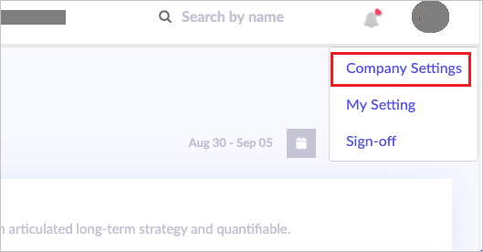
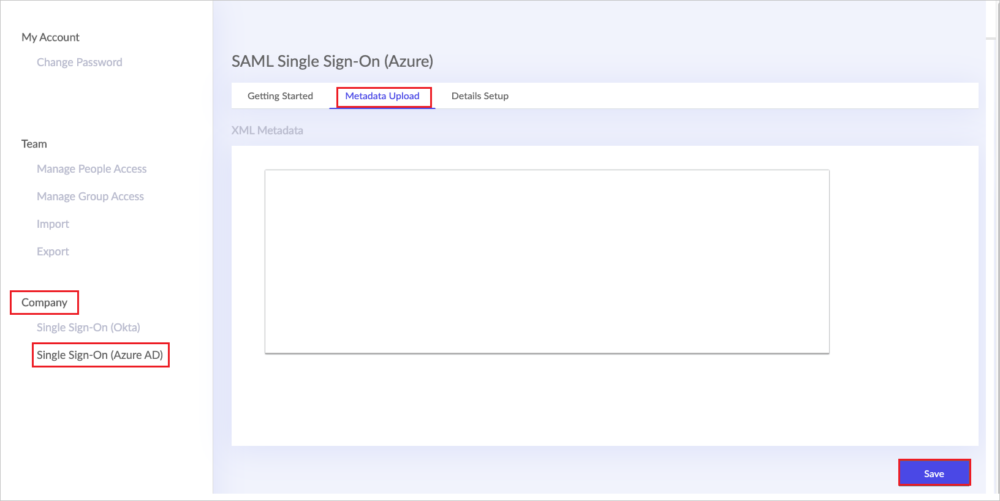

# Tutorial: Azure Active Directory SSO integration with RevSpace

In this tutorial, you learn how to integrate RevSpace with Azure Active Directory (Azure AD). When you integrate RevSpace with Azure AD, you can:

* Control in Azure AD who has access to RevSpace.
* Enable your users to be automatically signed-in to RevSpace with their Azure AD accounts.
* Manage your accounts in one central location - the Azure portal.

## Prerequisites

To get started, you need the following items:

* An Azure AD subscription. If you don't have a subscription, you can get a [free account](https://azure.microsoft.com/free/).
* RevSpace single sign-on (SSO) enabled subscription.

## Scenario description

In this tutorial, you configure and test Azure AD SSO in a test environment.

* RevSpace supports **SP and IDP** initiated SSO.
* RevSpace supports **Just In Time** user provisioning.

## Adding RevSpace from the gallery

To configure the integration of RevSpace into Azure AD, you need to add RevSpace from the gallery to your list of managed SaaS apps.

1. Sign in to the Azure portal using either a work or school account, or a personal Microsoft account.
1. On the left navigation pane, select the **Azure Active Directory** service.
1. Navigate to **Enterprise Applications** and then select **All Applications**.
1. To add new application, select **New application**.
1. In the **Add from the gallery** section, type **RevSpace** in the search box.
1. Select **RevSpace** from results panel and then add the app. Wait a few seconds while the app is added to your tenant.

 Alternatively, you can also use the [Enterprise App Configuration Wizard](https://portal.office.com/AdminPortal/home?Q=Docs#/azureadappintegration). In this wizard, you can add an application to your tenant, add users/groups to the app, assign roles and walk through the SSO configuration as well. [Learn more about Microsoft 365 wizards.](/microsoft-365/admin/misc/azure-ad-setup-guides)

## Configure and test Azure AD SSO for RevSpace

Configure and test Azure AD SSO with RevSpace using a test user called **B.Simon**. For SSO to work, you need to establish a link relationship between an Azure AD user and the related user in RevSpace.

To configure and test Azure AD SSO with RevSpace, perform the following steps:

1. **[Configure Azure AD SSO](#configure-azure-ad-sso)** - to enable your users to use this feature.
   1. **[Create an Azure AD test user](#create-an-azure-ad-test-user)** - to test Azure AD single sign-on with B.Simon.
   1. **[Assign the Azure AD test user](#assign-the-azure-ad-test-user)** - to enable B.Simon to use Azure AD single sign-on.
1. **[Configure RevSpace SSO](#configure-revspace-sso)** - to configure the single sign-on settings on application side.
   1. **[Create RevSpace test user](#create-revspace-test-user)** - to have a counterpart of B.Simon in RevSpace that is linked to the Azure AD representation of user.
1. **[Test SSO](#test-sso)** - to verify whether the configuration works.

## Configure Azure AD SSO

Follow these steps to enable Azure AD SSO in the Azure portal.

1. In the Azure portal, on the **RevSpace** application integration page, find the **Manage** section and select **single sign-on**.
1. On the **Select a single sign-on method** page, select **SAML**.
1. On the **Set up single sign-on with SAML** page, click the pencil icon for **Basic SAML Configuration** to edit the settings.

   

1. On the **Basic SAML Configuration** section, perform the following steps:

   a. In the **Identifier** text box, type a URL using the following pattern:
   `https://<CUSTOMER_SUBDOMAIN>.revspace.io/login/callback`

   b. In the **Reply URL** text box, type a URL using the following pattern:
   `https://<CUSTOMER_SUBDOMAIN>.revspace.io/login/callback`

1. Perform the following step if you wish to configure the application in **SP** initiated mode:

   In the **Sign on URL** text box, type a URL using the following pattern:
   `https://<CUSTOMER_SUBDOMAIN>.revspace.io/login/callback`

   > [!NOTE]
   > These values are not real. Update these values with the actual Identifier, Reply URL and Sign on URL. Contact [RevSpace Client support team](mailto:support@revspace.io) to get these values. You can also refer to the patterns shown in the **Basic SAML Configuration** section in the Azure portal.

1. RevSpace application expects the SAML assertions in a specific format, which requires you to add custom attribute mappings to your SAML token attributes configuration. The following screenshot shows the list of default attributes.

   

1. In addition to above, RevSpace application expects few more attributes to be passed back in SAML response, which are shown below. These attributes are also pre populated but you can review them as per your requirements.

   | Name       | Source Attribute   |
   | ---------- | ------------------ |
   | Firstname  | user.givenname     |
   | Lastname   | user.surname       |
   | jobtitle   | user.jobtitle      |
   | department | user.department    |
   | employeeid | user.employeeid    |
   | postalcode | user.postalcode    |
   | country    | user.country       |
   | role       | user.assignedroles |

   > [!NOTE]
   > RevSpace expects roles for users assigned to the application. Please set up these roles in Azure AD so that users can be assigned the appropriate roles. To understand how to configure roles in Azure AD, see [here](../develop/howto-add-app-roles-in-azure-ad-apps.md#app-roles-ui).

1. On the **Set up single sign-on with SAML** page, in the **SAML Signing Certificate** section, find **Federation Metadata XML** and select **Download** to download the certificate and save it on your computer.

   

1. On the **Set up RevSpace** section, copy the appropriate URL(s) based on your requirement.

   

### Create an Azure AD test user

In this section, you create a test user in the Azure portal called B.Simon.

1. From the left pane in the Azure portal, select **Azure Active Directory**, select **Users**, and then select **All users**.
1. Select **New user** at the top of the screen.
1. In the **User** properties, follow these steps:
   1. In the **Name** field, enter `B.Simon`.
   1. In the **User name** field, enter the username@companydomain.extension. For example, `B.Simon@contoso.com`.
   1. Select the **Show password** check box, and then write down the value that's displayed in the **Password** box.
   1. Click **Create**.

### Assign the Azure AD test user

In this section, you enable B.Simon to use Azure single sign-on by granting access to RevSpace.

1. In the Azure portal, select **Enterprise Applications**, and then select **All applications**.
1. In the applications list, select **RevSpace**.
1. In the app's overview page, find the **Manage** section and select **Users and groups**.
1. Select **Add user**, then select **Users and groups** in the **Add Assignment** dialog.
1. In the **Users and groups** dialog, select **B.Simon** from the Users list, then click the **Select** button at the bottom of the screen.
1. If you have setup the roles as explained in the above, you can select it from the **Select a role** dropdown.
1. In the **Add Assignment** dialog, click the **Assign** button.

## Configure RevSpace SSO

1. In a different web browser window, sign into RevSpace as an administrator.

1. Click on user Profile icon, then select **Company settings**.

   

1. Perform the following steps in **Settings** page.

   

   a. Navigate to **Company > Single Sign-On**, then select the **Metadata Upload** tab.

   b. Paste the **Federation Metadata XML** Value, which you've copied from the Azure portal into **XML Metadata** field.

   c. Then click **Save**.

### Create RevSpace test user

In this section, a user called B.Simon is created in RevSpace. RevSpace supports just-in-time provisioning, which is enabled by default. There's no action item for you in this section. If a user doesn't already exist in RevSpace, a new one is created when you attempt to access RevSpace.

## Test SSO

In this section, you test your Azure AD single sign-on configuration with following options.

#### SP initiated:

* Click on **Test this application** in Azure portal. This will redirect to RevSpace Sign-on URL where you can initiate the login flow.

* Go to RevSpace Sign-on URL directly and initiate the login flow from there.

#### IDP initiated:

* Click on **Test this application** in Azure portal and you should be automatically signed in to the RevSpace for which you set up the SSO

You can also use Microsoft My Apps to test the application in any mode. When you click the RevSpace tile in the My Apps, if configured in SP mode you would be redirected to the application sign-on page for initiating the login flow and if configured in IDP mode, you should be automatically signed in to the RevSpace for which you set up the SSO. For more information about the My Apps, see [Introduction to the My Apps](https://support.microsoft.com/account-billing/sign-in-and-start-apps-from-the-my-apps-portal-2f3b1bae-0e5a-4a86-a33e-876fbd2a4510).

## Next steps

Once you configure RevSpace you can enforce session control, which protects exfiltration and infiltration of your organization’s sensitive data in real time. Session control extends from Conditional Access. [Learn how to enforce session control with Microsoft Defender for Cloud Apps](/cloud-app-security/proxy-deployment-any-app).