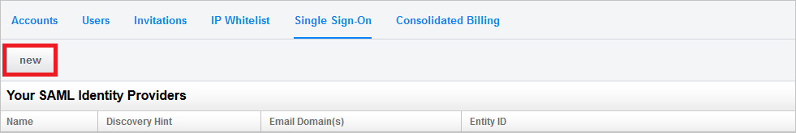
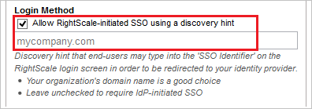
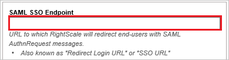
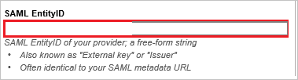

# Tutorial: Azure AD SSO integration with Rightscale

In this tutorial, you'll learn how to integrate Rightscale with Azure Active Directory (Azure AD). When you integrate Rightscale with Azure AD, you can:

* Control in Azure AD who has access to Rightscale.
* Enable your users to be automatically signed-in to Rightscale with their Azure AD accounts.
* Manage your accounts in one central location - the Azure portal.

## Prerequisites

To configure Azure AD integration with Rightscale, you need the following items:

* An Azure AD subscription. If you don't have an Azure AD environment, you can get a [free account](https://azure.microsoft.com/free/).
* Rightscale single sign-on enabled subscription.

## Scenario description

In this tutorial, you configure and test Azure AD single sign-on in a test environment.

* Rightscale supports **SP and IDP** initiated SSO.

## Add Rightscale from the gallery

To configure the integration of Rightscale into Azure AD, you need to add Rightscale from the gallery to your list of managed SaaS apps.

1. Sign in to the Azure portal using either a work or school account, or a personal Microsoft account.
1. On the left navigation pane, select the **Azure Active Directory** service.
1. Navigate to **Enterprise Applications** and then select **All Applications**.
1. To add new application, select **New application**.
1. In the **Add from the gallery** section, type **Rightscale** in the search box.
1. Select **Rightscale** from results panel and then add the app. Wait a few seconds while the app is added to your tenant.

 Alternatively, you can also use the [Enterprise App Configuration Wizard](https://portal.office.com/AdminPortal/home?Q=Docs#/azureadappintegration). In this wizard, you can add an application to your tenant, add users/groups to the app, assign roles, as well as walk through the SSO configuration as well. [Learn more about Microsoft 365 wizards.](/microsoft-365/admin/misc/azure-ad-setup-guides)

## Configure and test Azure AD SSO for Rightscale

Configure and test Azure AD SSO with Rightscale using a test user called **B.Simon**. For SSO to work, you need to establish a link relationship between an Azure AD user and the related user in Rightscale.

To configure and test Azure AD SSO with Rightscale, perform the following steps:

1. **[Configure Azure AD SSO](#configure-azure-ad-sso)** - to enable your users to use this feature.
    1. **[Create an Azure AD test user](#create-an-azure-ad-test-user)** - to test Azure AD single sign-on with B.Simon.
    2. **[Assign the Azure AD test user](#assign-the-azure-ad-test-user)** - to enable B.Simon to use Azure AD single sign-on.
2. **[Configure Rightscale SSO](#configure-rightscale-sso)** - to configure the single sign-on settings on application side.
    1. **[Create Rightscale test user](#create-rightscale-test-user)** - to have a counterpart of B.Simon in Rightscale that is linked to the Azure AD representation of user.
3. **[Test SSO](#test-sso)** - to verify whether the configuration works.

## Configure Azure AD SSO

Follow these steps to enable Azure AD SSO in the Azure portal.

1. In the Azure portal, on the **Rightscale** application integration page, find the **Manage** section and select **single sign-on**.
1. On the **Select a single sign-on method** page, select **SAML**.
1. On the **Set up single sign-on with SAML** page, click the pencil icon for **Basic SAML Configuration** to edit the settings.

   

4. On the **Basic SAML Configuration** section, the user does not have to perform any step as the app is already pre-integrated with Azure.

5. Click **Set additional URLs** and perform the following step if you wish to configure the application in **SP** initiated mode:

    In the **Sign-on URL** text box, type the URL:
    `https://login.rightscale.com/`

6. On the **Set up Single Sign-On with SAML** page, in the **SAML Signing Certificate** section, click **Download** to download the **Certificate (Base64)** from the given options as per your requirement and save it on your computer.

	

7. On the **Set up Rightscale** section, copy the appropriate URL(s) as per your requirement.

	

### Create an Azure AD test user

In this section, you'll create a test user in the Azure portal called B.Simon.

1. From the left pane in the Azure portal, select **Azure Active Directory**, select **Users**, and then select **All users**.
2. Select **New user** at the top of the screen.
3. In the **User** properties, follow these steps:
   1. In the **Name** field, enter `B.Simon`.  
   2. In the **User name** field, enter the username@companydomain.extension. For example, `B.Simon@contoso.com`.
   3. Select the **Show password** check box, and then write down the value that's displayed in the **Password** box.
   4. Click **Create**.

### Assign the Azure AD test user

In this section, you'll enable B.Simon to use Azure single sign-on by granting access to Rightscale.

1. In the Azure portal, select **Enterprise Applications**, and then select **All applications**.
2. In the applications list, select **Rightscale**.
3. In the app's overview page, find the **Manage** section and select **Users and groups**.
4. Select **Add user**, then select **Users and groups** in the **Add Assignment** dialog.
5. In the **Users and groups** dialog, select **B.Simon** from the Users list, then click the **Select** button at the bottom of the screen.
6. If you are expecting a role to be assigned to the users, you can select it from the **Select a role** dropdown. If no role has been set up for this app, you see "Default Access" role selected.
7. In the **Add Assignment** dialog, click the **Assign** button.

## Configure Rightscale SSO

1. To get SSO configured for your application, you need to sign-on to your RightScale tenant as an administrator.

2. In the menu on the top, click the **Settings** tab and select **Single Sign-On**.

    

3. Click the **new** button to add **Your SAML Identity Providers**.

    

4. In the textbox of **Display Name**, input your company name.

    

5. Select **Allow RightScale-initiated SSO using a discovery hint** and input your **domain name** in the below textbox.

    

6. Paste the value of **Login URL** which you have copied from Azure portal into **SAML SSO Endpoint** in RightScale.

    

7. Paste the value of **Azure AD Identifier** which you have copied from Azure portal into **SAML EntityID** in RightScale.

    

8. Click **Browser** button to upload the certificate which you downloaded from Azure portal.

    

9. Click **Save**.

### Create Rightscale test user

In this section, you create a user called Britta Simon in Rightscale. Work with [Rightscale Client support team](mailto:support@rightscale.com) to add the users in the Rightscale platform. Users must be created and activated before you use SSO.

## Test SSO

In this section, you test your Azure AD SSO configuration with following options.

#### SP initiated:

* Click on **Test this application** in Azure portal. This will redirect to Rightscale Sign on URL where you can initiate the login flow.

* Go to Rightscale Sign-on URL directly and initiate the login flow from there.

#### IDP initiated:

* Click on **Test this application** in Azure portal and you should be automatically signed in to the Rightscale for which you set up the SSO

You can also use Microsoft My Apps to test the application in any mode. When you click the Rightscale tile in the My Apps, if configured in SP mode you would be redirected to the application sign on page for initiating the login flow and if configured in IDP mode, you should be automatically signed in to the Rightscale for which you set up the SSO. For more information about the My Apps, see [Introduction to the My Apps](https://support.microsoft.com/account-billing/sign-in-and-start-apps-from-the-my-apps-portal-2f3b1bae-0e5a-4a86-a33e-876fbd2a4510).

## Next steps

Once you configure Rightscale you can enforce session control, which protects exfiltration and infiltration of your organization’s sensitive data in real time. Session control extends from Conditional Access. [Learn how to enforce session control with Microsoft Defender for Cloud Apps](/cloud-app-security/proxy-deployment-aad).