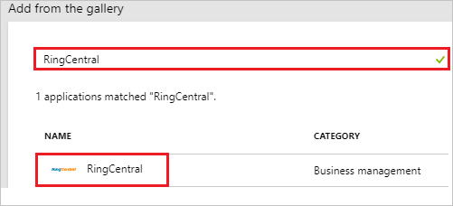
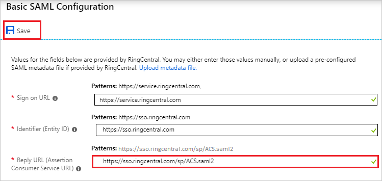
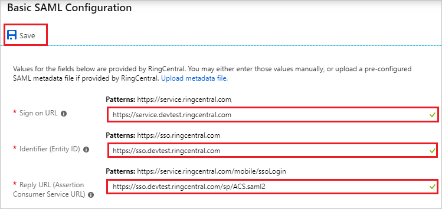
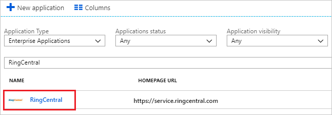

# Tutorial: Azure Active Directory integration with RingCentral

In this tutorial, you learn how to integrate RingCentral with Azure Active Directory (Azure AD).

Integrating RingCentral with Azure AD provides you with the following benefits:

- You can control in Azure AD who has access to RingCentral.
- You can enable your users to automatically get signed-on to RingCentral (Single Sign-On) with their Azure AD accounts.
- You can manage your accounts in one central location - the Azure portal.

If you want to know more details about SaaS app integration with Azure AD, see [what is application access and single sign-on with Azure Active Directory](../manage-apps/what-is-single-sign-on.md).

## Prerequisites

To configure Azure AD integration with RingCentral, you need the following items:

- An Azure AD subscription
- A RingCentral single sign-on enabled subscription

> [!NOTE]
> To test the steps in this tutorial, we do not recommend using a production environment.

To test the steps in this tutorial, you should follow these recommendations:

- Do not use your production environment, unless it is necessary.
- If you don't have an Azure AD trial environment, you can [get a one-month trial](https://azure.microsoft.com/pricing/free-trial/).

## Scenario description
In this tutorial, you test Azure AD single sign-on in a test environment. 
The scenario outlined in this tutorial consists of two main building blocks:

1. Adding RingCentral from the gallery
2. Configuring and testing Azure AD single sign-on

## Adding RingCentral from the gallery
To configure the integration of RingCentral into Azure AD, you need to add RingCentral from the gallery to your list of managed SaaS apps.

**To add RingCentral from the gallery, perform the following steps:**

1. In the **[Azure portal](https://portal.azure.com)**, on the left navigation panel, click **Azure Active Directory** icon. 

	

2. Navigate to **Enterprise applications**. Then go to **All applications**.

	
	
3. To add new application, click **New application** button on the top of dialog.

	

4. In the search box, type **RingCentral**, select **RingCentral** from result panel then click **Add** button to add the application.

	 

## Configure and test Azure AD single sign-on

In this section, you configure and test Azure AD single sign-on with RingCentral based on a test user called "Britta Simon".

For single sign-on to work, Azure AD needs to know what the counterpart user in RingCentral is to a user in Azure AD. In other words, a link relationship between an Azure AD user and the related user in RingCentral needs to be established.

To configure and test Azure AD single sign-on with RingCentral, you need to complete the following building blocks:

1. **[Configure Azure AD Single Sign-On](#configure-azure-ad-single-sign-on)** - to enable your users to use this feature.
2. **[Create an Azure AD test user](#create-an-azure-ad-test-user)** - to test Azure AD single sign-on with Britta Simon.
3. **[Create a RingCentral test user](#create-a-ringcentral-test-user)** - to have a counterpart of Britta Simon in RingCentral that is linked to the Azure AD representation of user.
4. **[Assign the Azure AD test user](#assign-the-azure-ad-test-user)** - to enable Britta Simon to use Azure AD single sign-on.
5. **[Test single sign-on](#test-single-sign-on)** - to verify whether the configuration works.

### Configure Azure AD single sign-on

In this section, you enable Azure AD single sign-on in the Azure portal and configure single sign-on in your RingCentral application.

**To configure Azure AD single sign-on with RingCentral, perform the following steps:**

1. In the [Azure portal](https://portal.azure.com/), on the **RingCentral** application integration page, select **Single sign-on**.

    

2. Click **Change single sign-on mode** on top of the screen to select the **SAML** mode.

	  

3. On the **Select a Single sign-on method** dialog, select **SAML** mode to enable single sign-on.

    

4. On the **Set up Single Sign-On with SAML** page, click **Edit** button to open **Basic SAML Configuration** dialog.

	

5. On the **Basic SAML Configuration** section, if you have **Service Provider metadata file**, perform the following steps:

	a. Click **Upload metadata file**.

    

	b. Click on **folder logo** to select the metadata file and click **Upload**.

	_saml.png)

	c. Once the metadata file is successfully uploaded, the **Identifier** and **Reply URL** values get auto populated in **Basic SAML Configuration** section textbox as shown below:

	

	d. In the **Sign on URL** textbox, type a URL:
	| |
	|--|
	| `https://service.ringcentral.com` |
	| `https://service.ringcentral.com.au` |
	| `https://service.ringcentral.co.uk` |
	| `https://service.ringcentral.eu` |

	> [!NOTE]
	> You get the **Service Provider metadata file** on the RingCentral SSO Configuration page which is explained later in the tutorial.

6. If you dont have **Service Provider metadata file**, perform the following steps:

	a. In the **Sign on URL** textbox, type a URL:
	| |
	|--|
	| `https://service.ringcentral.com` |
	| `https://service.ringcentral.com.au` |
	| `https://service.ringcentral.co.uk` |
	| `https://service.ringcentral.eu` |

	b. In the **Identifier** textbox, type a URL:
	| |
	|--|
	|  `https://sso.ringcentral.com` |
	| `https://ssoeuro.ringcentral.com` |

	c. In the **Reply URL** textbox, type a URL:
	| |
	|--|
	| `https://sso.ringcentral.com/sp/ACS.saml2` |
	| `https://ssoeuro.ringcentral.com/sp/ACS.saml2` |

	

7. On the **Set up Single Sign-On with SAML** page, in the **SAML Signing Certificate** section, click **Download** to download the certificate from the given options as per your requirement and save it on your computer.

	
	
8. In a different web browser window, login to RingCentral as a Security Administrator.

9. On the top, click on **Tools**.

	

10. Navigate to **Single Sign-on**.

	

11. On the **Single Sign-on** page, under **SSO Configuration** section, from **Step 1** click **Edit** and perform the following steps:

	

12. On the **Set up Single Sign-on** page, perform the following steps:

	

	a. Click **Browse** to upload the metadata file which you have downloaded from Azure portal.

	b. After uploading metadata the values get auto-populated in **SSO General Information** section.

	c. Under **Attribute Mapping** section, select **Map Email Attribute to** as `http://schemas.xmlsoap.org/ws/2005/05/identity/claims/emailaddress`

	d. Click **Save**.

	e. From **Step 2** click **Download** to download the **Service Provider metadata file** and upload it in **Basic SAML Configuration** section to auto polulate the **Identifier** and **Reply URL** values in Azure portal.

	 

	f. On the same page, navigate to **Enable SSO** section and perform the following steps:

	

	a. Select **Enable SSO Service**.
	
	b. Select **Allow users to log in with SSO or RingCentral credential**.

	c. Click **Save**.

### Create an Azure AD test user

The objective of this section is to create a test user in the Azure portal called Britta Simon.

1. In the Azure portal, in the left pane, select **Azure Active Directory**, select **Users**, and then select **All users**.

    

2. Select **New user** at the top of the screen.

    

3. In the User properties, perform the following steps.

    

    a. In the **Name** field enter **BrittaSimon**.
  
    b. In the **User name** field type **brittasimon@yourcompanydomain.extension**  
    For example, BrittaSimon@contoso.com

    c. Select **Properties**, select the **Show password** check box, and then write down the value that's displayed in the Password box.

    d. Select **Create**.
 
### Create a RingCentral test user

In this section, you create a user called Britta Simon in RingCentral. Work with [RingCentral Client support team](https://success.ringcentral.com/RCContactSupp) to add the users in the RingCentral platform. Users must be created and activated before you use single sign-on.

### Assign the Azure AD test user

In this section, you enable Britta Simon to use Azure single sign-on by granting access to RingCentral.

1. In the Azure portal, select **Enterprise Applications**, select **All applications**.

	

2. In the applications list, select **RingCentral**.

	

3. In the menu on the left, select **Users and groups**.

    

4. Select the **Add** button, then select **Users and groups** in the **Add Assignment** dialog.

    

4. In the **Users and groups** dialog select **Britta Simon** in the Users list, then click the **Select** button at the bottom of the screen.

5. In the **Add Assignment** dialog select the **Assign** button.
	
### Test single sign-on

In this section, you test your Azure AD single sign-on configuration using the Access Panel.

When you click the RingCentral tile in the Access Panel, you should get automatically signed-on to your RingCentral application.
For more information about the Access Panel, see [Introduction to the Access Panel](../active-directory-saas-access-panel-introduction.md). 

## Additional resources

* [List of Tutorials on How to Integrate SaaS Apps with Azure Active Directory](tutorial-list.md)
* [What is application access and single sign-on with Azure Active Directory?](../manage-apps/what-is-single-sign-on.md)

<!--Image references-->

[1]: ./media/ringcentral-tutorial/tutorial_general_01.png
[2]: ./media/ringcentral-tutorial/tutorial_general_02.png
[3]: ./media/ringcentral-tutorial/tutorial_general_03.png
[4]: ./media/ringcentral-tutorial/tutorial_general_04.png

[100]: ./media/ringcentral-tutorial/tutorial_general_100.png

[200]: ./media/ringcentral-tutorial/tutorial_general_200.png
[201]: ./media/ringcentral-tutorial/tutorial_general_201.png
[202]: ./media/ringcentral-tutorial/tutorial_general_202.png
[203]: ./media/ringcentral-tutorial/tutorial_general_203.png

