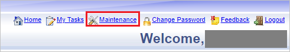
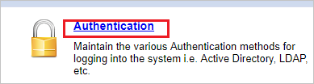
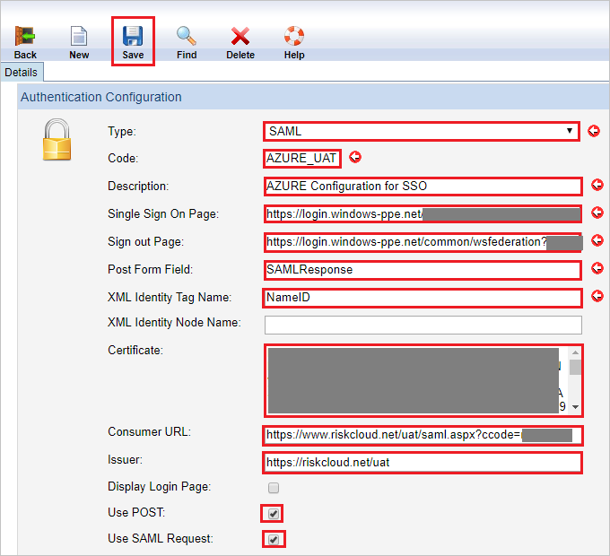
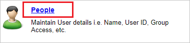
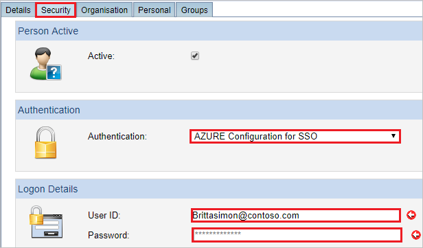

# Tutorial: Azure Active Directory integration with Riskware

In this tutorial, you learn how to integrate Riskware with Azure Active Directory (Azure AD).
Integrating Riskware with Azure AD provides you with the following benefits:

* You can control in Azure AD who has access to Riskware.
* You can enable your users to be automatically signed-in to Riskware (Single Sign-On) with their Azure AD accounts.
* You can manage your accounts in one central location - the Azure portal.

If you want to know more details about SaaS app integration with Azure AD, see [What is application access and single sign-on with Azure Active Directory](https://docs.microsoft.com/azure/active-directory/active-directory-appssoaccess-whatis).
If you don't have an Azure subscription, [create a free account](https://azure.microsoft.com/free/) before you begin.

## Prerequisites

To configure Azure AD integration with Riskware, you need the following items:

* An Azure AD subscription. If you don't have an Azure AD environment, you can get a [free account](https://azure.microsoft.com/free/)
* Riskware single sign-on enabled subscription

## Scenario description

In this tutorial, you configure and test Azure AD single sign-on in a test environment.

* Riskware supports **SP** initiated SSO

## Adding Riskware from the gallery

To configure the integration of Riskware into Azure AD, you need to add Riskware from the gallery to your list of managed SaaS apps.

**To add Riskware from the gallery, perform the following steps:**

1. In the **[Azure portal](https://portal.azure.com)**, on the left navigation panel, click **Azure Active Directory** icon.

	

2. Navigate to **Enterprise Applications** and then select the **All Applications** option.

	

3. To add new application, click **New application** button on the top of dialog.

	

4. In the search box, type **Riskware**, select **Riskware** from result panel then click **Add** button to add the application.

	

## Configure and test Azure AD single sign-on

In this section, you configure and test Azure AD single sign-on with Riskware based on a test user called **Britta Simon**.
For single sign-on to work, a link relationship between an Azure AD user and the related user in Riskware needs to be established.

To configure and test Azure AD single sign-on with Riskware, you need to complete the following building blocks:

1. **[Configure Azure AD Single Sign-On](#configure-azure-ad-single-sign-on)** - to enable your users to use this feature.
2. **[Configure Riskware Single Sign-On](#configure-riskware-single-sign-on)** - to configure the Single Sign-On settings on application side.
3. **[Create an Azure AD test user](#create-an-azure-ad-test-user)** - to test Azure AD single sign-on with Britta Simon.
4. **[Assign the Azure AD test user](#assign-the-azure-ad-test-user)** - to enable Britta Simon to use Azure AD single sign-on.
5. **[Create Riskware test user](#create-riskware-test-user)** - to have a counterpart of Britta Simon in Riskware that is linked to the Azure AD representation of user.
6. **[Test single sign-on](#test-single-sign-on)** - to verify whether the configuration works.

### Configure Azure AD single sign-on

In this section, you enable Azure AD single sign-on in the Azure portal.

To configure Azure AD single sign-on with Riskware, perform the following steps:

1. In the [Azure portal](https://portal.azure.com/), on the **Riskware** application integration page, select **Single sign-on**.

    

2. On the **Select a Single sign-on method** dialog, select **SAML/WS-Fed** mode to enable single sign-on.

    

3. On the **Set up Single Sign-On with SAML** page, click **Edit** icon to open **Basic SAML Configuration** dialog.

	

4. On the **Basic SAML Configuration** section, perform the following steps:

    

	a. In the **Sign on URL** text box, type a URL using the following pattern:
	
	| Environment| URL Pattern|
	|--|--|
	| UAT|  `https://riskcloud.net/uat?ccode=<COMPANYCODE>` |
	| PROD| `https://riskcloud.net/prod?ccode=<COMPANYCODE>` |
	| DEMO| `https://riskcloud.net/demo?ccode=<COMPANYCODE>` |
	|||

    b. In the **Identifier (Entity ID)** text box, type the URL:
	
	| Environment| URL Pattern|
	|--|--|
	| UAT| `https://riskcloud.net/uat` |
	| PROD| `https://riskcloud.net/prod` |
	| DEMO| `https://riskcloud.net/demo` |
	|||

	> [!NOTE]
	> The Sign on URL value is not real. Update the value with the actual Sign-On URL. Contact [Riskware Client support team](mailto:support@pansoftware.com.au) to get the value. You can also refer to the patterns shown in the **Basic SAML Configuration** section in the Azure portal.

5. On the **Set up Single Sign-On with SAML** page, in the **SAML Signing Certificate** section, click **Download** to download the **Federation Metadata XML** from the given options as per your requirement and save it on your computer.

	

6. On the **Set up Riskware** section, copy the appropriate URL(s) as per your requirement.

	

	a. Login URL

	b. Azure AD Identifier

	c. Logout URL

### Configure Riskware Single Sign-On

1. In a different web browser window, sign in to your Riskware company site as an administrator.

1. On the top right, click **Maintenance** to open the maintenance page.

	

1. In the maintenance page, click **Authentication**.

	

1. In **Authentication Configuration** page, perform the following steps:

	

	a. Select **Type** as **SAML** for authentication.

	b. In the **Code** textbox, type your code like AZURE_UAT.

	c. In the **Description** textbox, type your description like AZURE Configuration for SSO.

	d. In **Single Sign On Page** textbox, paste the **Login URL** value, which you have copied from Azure portal.

	e. In **Sign out Page** textbox, paste the **Logout URL** value, which you have copied from Azure portal.

	f. In the **Post Form Field** textbox, type the field name present in Post Response that contains SAML like SAMLResponse

	g. In the **XML Identity Tag Name** textbox, type attribute, which contains the unique identifier in the SAML response like NameID.

	h. Open the downloaded **Metadata Xml** from Azure portal in notepad, copy the certificate from the Metadata file and paste it into the **Certificate** textbox

	i. In **Consumer URL** textbox, paste the value of **Reply URL**, which you get from the support team.

	j. In **Issuer** textbox, paste the value of **Identifier**, which you get from the support team.

	> [!Note]
	> Contact [Riskware Client support team](mailto:support@pansoftware.com.au) to get these values

	k. Select **Use POST** checkbox.

	l. Select **Use SAML Request** checkbox.

	m. Click **Save**.

### Create an Azure AD test user

The objective of this section is to create a test user in the Azure portal called Britta Simon.

1. In the Azure portal, in the left pane, select **Azure Active Directory**, select **Users**, and then select **All users**.

    

2. Select **New user** at the top of the screen.

    

3. In the User properties, perform the following steps.

    

    a. In the **Name** field enter **BrittaSimon**.
  
    b. In the **User name** field type `brittasimon@yourcompanydomain.extension`  
    For example, BrittaSimon@contoso.com

    c. Select **Show password** check box, and then write down the value that's displayed in the Password box.

    d. Click **Create**.

### Assign the Azure AD test user

In this section, you enable Britta Simon to use Azure single sign-on by granting access to Riskware.

1. In the Azure portal, select **Enterprise Applications**, select **All applications**, then select **Riskware**.

	

2. In the applications list, select **Riskware**.

	

3. In the menu on the left, select **Users and groups**.

    

4. Click the **Add user** button, then select **Users and groups** in the **Add Assignment** dialog.

    

5. In the **Users and groups** dialog select **Britta Simon** in the Users list, then click the **Select** button at the bottom of the screen.

6. If you are expecting any role value in the SAML assertion then in the **Select Role** dialog select the appropriate role for the user from the list, then click the **Select** button at the bottom of the screen.

7. In the **Add Assignment** dialog click the **Assign** button.

### Create Riskware test user

To enable Azure AD users to sign in to Riskware, they must be provisioned into Riskware. In Riskware, provisioning is a manual task.

**To provision a user account, perform the following steps:**

1. Sign in to Riskware as a Security Administrator.

1. On the top right, click **Maintenance** to open the maintenance page. 

	

1. In the maintenance page, click **People**.

	

1. Select **Details** tab and perform the following steps:

	

	a. Select **Person Type** like Employee.

	b. In **First Name** textbox, enter the first name of user like **Britta**.

	c. In **Surname** textbox, enter the last name of user like **Simon**.

1. On the **Security** tab, perform the following steps:

	

	a. Under **Authentication** section, select the **Authentication** mode, which you have setup like AZURE Configuration for SSO.

	b. Under **Logon Details** section, in the **User ID** textbox, enter the email of user like `brittasimon@contoso.com`.

	c. In the **Password** textbox, enter password of the user.

1. On the **Organization** tab, perform the following steps:

	

	a. Select the option as **Level1** organization.

	b. Under **Person's Primary Workplace** section, in the **Location** textbox, type your location.

	c. Under **Employee** section, select **Employee Status** like Casual.

	d. Click **Save**.

### Test single sign-on

In this section, you test your Azure AD single sign-on configuration using the Access Panel.

When you click the Riskware tile in the Access Panel, you should be automatically signed in to the Riskware for which you set up SSO. For more information about the Access Panel, see [Introduction to the Access Panel](https://docs.microsoft.com/azure/active-directory/active-directory-saas-access-panel-introduction).

## Additional Resources

- [List of Tutorials on How to Integrate SaaS Apps with Azure Active Directory](https://docs.microsoft.com/azure/active-directory/active-directory-saas-tutorial-list)

- [What is application access and single sign-on with Azure Active Directory?](https://docs.microsoft.com/azure/active-directory/active-directory-appssoaccess-whatis)

- [What is Conditional Access in Azure Active Directory?](https://docs.microsoft.com/azure/active-directory/conditional-access/overview)
