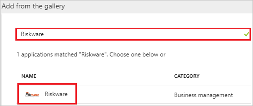
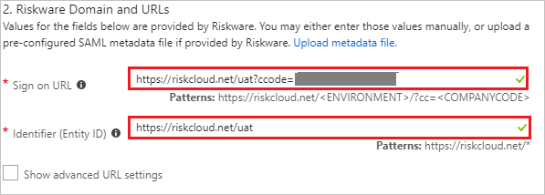
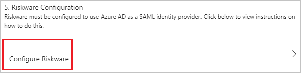
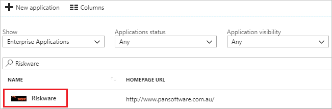

---
title: 'Tutorial: Azure Active Directory integration with Riskware | Microsoft Docs'
description: Learn how to configure single sign-on between Azure Active Directory and Riskware.
services: active-directory
documentationCenter: na
author: jeevansd
manager: femila
ms.reviewer: joflore

ms.assetid: 81866167-b163-4695-8978-fd29a25dac7a
ms.service: active-directory
ms.component: saas-app-tutorial
ms.workload: identity
ms.tgt_pltfrm: na
ms.devlang: na
ms.topic: article
ms.date: 06/27/2018
ms.author: jeedes

---
# Tutorial: Azure Active Directory integration with Riskware

In this tutorial, you learn how to integrate Riskware with Azure Active Directory (Azure AD).

Integrating Riskware with Azure AD provides you with the following benefits:

- You can control in Azure AD who has access to Riskware.
- You can enable your users to automatically get signed-on to Riskware (Single Sign-On) with their Azure AD accounts.
- You can manage your accounts in one central location - the Azure portal.

If you want to know more details about SaaS app integration with Azure AD, see [what is application access and single sign-on with Azure Active Directory](../manage-apps/what-is-single-sign-on.md).

## Prerequisites

To configure Azure AD integration with Riskware, you need the following items:

- An Azure AD subscription
- A Riskware single sign-on enabled subscription

> [!NOTE]
> To test the steps in this tutorial, we do not recommend using a production environment.

To test the steps in this tutorial, you should follow these recommendations:

- Do not use your production environment, unless it is necessary.
- If you don't have an Azure AD trial environment, you can [get a one-month trial](https://azure.microsoft.com/pricing/free-trial/).

## Scenario description
In this tutorial, you test Azure AD single sign-on in a test environment. 
The scenario outlined in this tutorial consists of two main building blocks:

1. Adding Riskware from the gallery
1. Configuring and testing Azure AD single sign-on

## Adding Riskware from the gallery
To configure the integration of Riskware into Azure AD, you need to add Riskware from the gallery to your list of managed SaaS apps.

**To add Riskware from the gallery, perform the following steps:**

1. In the **[Azure portal](https://portal.azure.com)**, on the left navigation panel, click **Azure Active Directory** icon. 

	![The Azure Active Directory button][1]

1. Navigate to **Enterprise applications**. Then go to **All applications**.

	![The Enterprise applications blade][2]

1. To add new application, click **New application** button on the top of dialog.

	![The New application button][3]

1. In the search box, type **Riskware**, select **Riskware** from result panel then click **Add** button to add the application.

	

## Configure and test Azure AD single sign-on

In this section, you configure and test Azure AD single sign-on with Riskware based on a test user called "Britta Simon".

For single sign-on to work, Azure AD needs to know what the counterpart user in Riskware is to a user in Azure AD. In other words, a link relationship between an Azure AD user and the related user in Riskware needs to be established.

To configure and test Azure AD single sign-on with Riskware, you need to complete the following building blocks:

1. **[Configure Azure AD Single Sign-On](#configure-azure-ad-single-sign-on)** - to enable your users to use this feature.
1. **[Create an Azure AD test user](#create-an-azure-ad-test-user)** - to test Azure AD single sign-on with Britta Simon.
1. **[Create a Riskware test user](#create-a-riskware-test-user)** - to have a counterpart of Britta Simon in Riskware that is linked to the Azure AD representation of user.
1. **[Assign the Azure AD test user](#assign-the-azure-ad-test-user)** - to enable Britta Simon to use Azure AD single sign-on.
1. **[Test single sign-on](#test-single-sign-on)** - to verify whether the configuration works.

### Configure Azure AD single sign-on

In this section, you enable Azure AD single sign-on in the Azure portal and configure single sign-on in your Riskware application.

**To configure Azure AD single sign-on with Riskware, perform the following steps:**

1. In the Azure portal, on the **Riskware** application integration page, click **Single sign-on**.

	![Configure single sign-on link][4]

1. On the **Single sign-on** dialog, select **Mode** as	**SAML-based Sign-on** to enable single sign-on.

	

1. On the **Riskware Domain and URLs** section, perform the following steps:

	

	a. In the **Sign on URL** textbox, type a URL using the following pattern:
	| Environment| URL Pattern|
	|--|--|
	| UAT|  `https://riskcloud.net/uat?ccode=<COMPANYCODE>` |
	| PROD| `https://riskcloud.net/prod?ccode=<COMPANYCODE>` |
	| DEMO| `https://riskcloud.net/demo?ccode=<COMPANYCODE>` |
	|||

    b. In the **Identifier (Entity ID)** textbox, type a URL:
	| Environment| URL Pattern|
	|--|--|
	| UAT| `https://riskcloud.net/uat` |
	| PROD| `https://riskcloud.net/prod` |
	| DEMO| `https://riskcloud.net/demo` |
	|||

	> [!NOTE]
	> The Sign on URL value is not real. Update the value with the actual Sign-On URL. Contact [Riskware Client support team](mailto:support@pansoftware.com.au) to get the value.

1. On the **SAML Signing Certificate** section, click **Metadata XML** and then save the metadata file on your computer.

	 

1. Click **Save** button.

	

1. On the **Riskware Configuration** section, click **Configure Riskware** to open **Configure sign-on** window. Copy the **Sign-Out URL and SAML Single Sign-On Service URL** from the **Quick Reference section.**

	

1. In a different web browser window, sign in to your Riskware company site as an administrator.

1. On the top right, click **Maintenance** to open the maintenance page.

	

1. In the maintenance page, click **Authentication**.

	

1. In **Authentication Configuration** page, perform the following steps:

	

	a. Select **Type** as **SAML** for authentication.

	b. In the **Code** textbox, type your code like AZURE_UAT.

	c. In the **Description** textbox, type your description like AZURE Configuration for SSO.

	d. In **Single Sign On Page** textbox, paste the **SAML Single Sign-On Service URL** value, which you have copied from Azure portal.

	e. In **Sign out Page** textbox, paste the **Sign-Out URL** value, which you have copied from Azure portal.

	f. In the **Post Form Field** textbox, type the field name present in Post Response that contains SAML like SAMLResponse

	g. In the **XML Identity Tag Name** textbox, type attribute, which contains the unique identifier in the SAML response like NameID.

	h. Open the downloaded **Metadata Xml** from Azure portal in notepad, copy the certificate from the Metadata file and paste it into the **Certificate** textbox

	i. In **Consumer URL** textbox, paste the value of **Reply URL**, which you get from the support team.

	j. In **Issuer** textbox, paste the value of **Identifier**, which you get from the support team.

	> [!Note]
	> Contact [Riskware Client support team](mailto:support@pansoftware.com.au) to get these values

	k. Select **Use POST** checkbox.

	l. Select **Use SAML Request** checkbox.

	m. Click **Save**.

### Create an Azure AD test user

The objective of this section is to create a test user in the Azure portal called Britta Simon.

   ![Create an Azure AD test user][100]

**To create a test user in Azure AD, perform the following steps:**

1. In the Azure portal, in the left pane, click the **Azure Active Directory** button.

    

1. To display the list of users, go to **Users and groups**, and then click **All users**.

    

1. To open the **User** dialog box, click **Add** at the top of the **All Users** dialog box.

    

1. In the **User** dialog box, perform the following steps:

    

    a. In the **Name** box, type **BrittaSimon**.

    b. In the **User name** box, type the email address of user Britta Simon.

    c. Select the **Show Password** check box, and then write down the value that's displayed in the **Password** box.

    d. Click **Create**.

### Create a Riskware test user

To enable Azure AD users to sign in to Riskware, they must be provisioned into Riskware. In Riskware, provisioning is a manual task.

**To provision a user account, perform the following steps:**

1. Sign in to Riskware as a Security Administrator.

1. On the top right, click **Maintenance** to open the maintenance page. 

	

1. In the maintenance page, click **People**.

	

1. Select **Details** tab and perform the following steps:

	

	a. Select **Person Type** like Employee.

	b. In **First Name** textbox, enter the first name of user like **Britta**.

	c. In **Surname** textbox, enter the last name of user like **Simon**.

1. On the **Security** tab, perform the following steps:

	

	a. Under **Authentication** section, select the **Authentication** mode, which you have setup like AZURE Configuration for SSO.

	b. Under **Logon Details** section, in the **User ID** textbox, enter the email of user like **brittasimon@contoso.com**.

	c. In the **Password** textbox, enter password of the user.

1. On the **Organization** tab, perform the following steps:

	

	a. Select the option as **Level1** organization.

	b. Under **Person's Primary Workplace** section, in the **Location** textbox, type your location.

	c. Under **Employee** section, select **Employee Status** like Casual.

1. Click **Save**.

### Assign the Azure AD test user

In this section, you enable Britta Simon to use Azure single sign-on by granting access to Riskware.

![Assign the user role][200]

**To assign Britta Simon to Riskware, perform the following steps:**

1. In the Azure portal, open the applications view, and then navigate to the directory view and go to **Enterprise applications** then click **All applications**.

	![Assign User][201] 

1. In the applications list, select **Riskware**.

	  

1. In the menu on the left, click **Users and groups**.

	![The "Users and groups" link][202]

1. Click **Add** button. Then select **Users and groups** on **Add Assignment** dialog.

	![The Add Assignment pane][203]

1. On **Users and groups** dialog, select **Britta Simon** in the Users list.

1. Click **Select** button on **Users and groups** dialog.

1. Click **Assign** button on **Add Assignment** dialog.
	
### Test single sign-on

In this section, you test your Azure AD single sign-on configuration using the Access Panel.

When you click the Riskware tile in the Access Panel, you should get automatically signed-on to your Riskware application.
For more information about the Access Panel, see [Introduction to the Access Panel](../user-help/active-directory-saas-access-panel-introduction.md). 

## Additional resources

* [List of Tutorials on How to Integrate SaaS Apps with Azure Active Directory](tutorial-list.md)
* [What is application access and single sign-on with Azure Active Directory?](../manage-apps/what-is-single-sign-on.md)

<!--Image references-->

[1]: ./media/riskware-tutorial/tutorial_general_01.png
[2]: ./media/riskware-tutorial/tutorial_general_02.png
[3]: ./media/riskware-tutorial/tutorial_general_03.png
[4]: ./media/riskware-tutorial/tutorial_general_04.png

[100]: ./media/riskware-tutorial/tutorial_general_100.png

[200]: ./media/riskware-tutorial/tutorial_general_200.png
[201]: ./media/riskware-tutorial/tutorial_general_201.png
[202]: ./media/riskware-tutorial/tutorial_general_202.png
[203]: ./media/riskware-tutorial/tutorial_general_203.png

