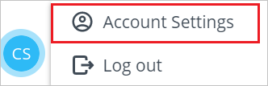
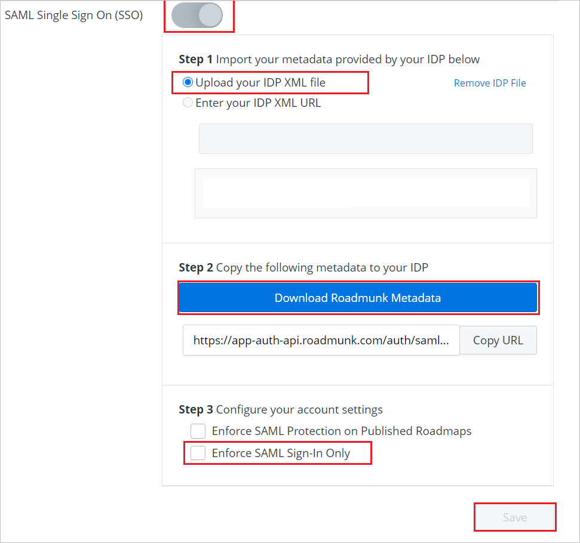
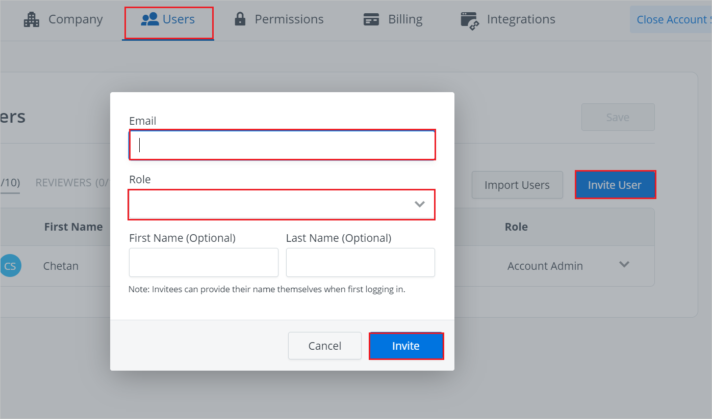

# Tutorial: Azure Active Directory single sign-on (SSO) integration with Roadmunk

In this tutorial, you'll learn how to integrate Roadmunk with Azure Active Directory (Azure AD). When you integrate Roadmunk with Azure AD, you can:

* Control in Azure AD who has access to Roadmunk.
* Enable your users to be automatically signed in to Roadmunk by using their Azure AD accounts.
* Manage your accounts in one central location, the Azure portal.

## Prerequisites

To get started, you need the following items:

* An Azure AD subscription. If you don't have a subscription, you can get a [free account](https://azure.microsoft.com/free/).
* A Roadmunk subscription that's enabled for single sign-on (SSO).

## Scenario description

In this tutorial, you configure and test Azure AD SSO in a test environment.

Roadmunk supports SSO that's started by the *service provider* (SP) and by the *identity provider* (IDP).

## Add Roadmunk from the gallery

To integrate Roadmunk into Azure AD, from the gallery, add Roadmunk to your list of managed SaaS apps:

1. Sign in to the Azure portal by using a work or school account or a personal Microsoft account.
1. In the left pane, select **Azure Active Directory**.
1. Go to **Enterprise Applications**, and then select **All Applications**.
1. To add a new application, select **New application**.
1. In the **Add from the gallery** section, in the search box, type **Roadmunk**.
1. Select **Roadmunk** from the results, and then add the app. Wait a few seconds while the app is added to your tenant.

 Alternatively, you can also use the [Enterprise App Configuration Wizard](https://portal.office.com/AdminPortal/home?Q=Docs#/azureadappintegration). In this wizard, you can add an application to your tenant, add users/groups to the app, assign roles, as well as walk through the SSO configuration as well. [Learn more about Microsoft 365 wizards.](/microsoft-365/admin/misc/azure-ad-setup-guides)

## Configure and test Azure AD SSO for Roadmunk

Configure and test Azure AD SSO with Roadmunk by using a test user called *B.Simon*. To make SSO work, you need to establish a link relationship between an Azure AD user and the related user in Roadmunk.

Here's an overview of how to configure and test Azure AD SSO with Roadmunk:

1. [Configure Azure AD SSO](#configure-azure-ad-sso) so that your users can use this feature.
    1. [Create an Azure AD test user](#create-an-azure-ad-test-user) to test Azure AD SSO by using B.Simon.
    1. [Assign the Azure AD test user](#assign-the-azure-ad-test-user) to enable B.Simon to use Azure AD SSO.
1. [Configure Roadmunk SSO](#configure-roadmunk-sso) to configure the SSO settings on the application side.
    1. [Create a Roadmunk test user](#create-roadmunk-test-user) so that you can link the counterpart of B.Simon in Roadmunk to the Azure AD representation of the user.
1. [Test SSO](#test-sso) to make sure the configuration works.

## Configure Azure AD SSO

Follow these steps to enable Azure AD SSO in the Azure portal:

1. In the Azure portal, on the **Roadmunk** application integration page, find the **Manage** section, and then select **single sign-on**.
1. On the **Select a single sign-on method** page, select **SAML**.
1. On the **Set up single sign-on with SAML** page, select the pen icon for **Basic SAML Configuration** to edit the settings.

   

1. In the **Basic SAML Configuration** section, if you have an SP metadata file and you want to configure in IDP-initiated mode, follow these steps:

	a. Select **Upload metadata file**.

    

	b. Select the folder icon to choose the metadata file that you downloaded in step 4 of the "Configure Roadmunk SSO" procedure. Then select **Upload**.

	

	After the metadata file is uploaded, in the **Basic SAML Configuration** section, the **Identifier** and **Reply URL** values are automatically populated.

	

	> [!Note]
	> If the **Identifier** and **Reply URL** values aren't automatically populated, then fill in the values manually.

1. If you want to configure the application in SP-initiated mode, select **Set additional URLs**. In the **Sign-on URL** field, type `https://login.roadmunk.com`

	

1. On the **Set up single sign-on with SAML** page, in the **SAML Signing Certificate** section,  find **Federation Metadata XML**. Then select **Download** to download the certificate and save it on your computer.

	

1. In the **Set up Roadmunk** section, copy the URL or URLs that you need.

	

### Create an Azure AD test user

In this section, you'll create a test user in the Azure portal. You'll name the user *B.Simon*.

1. From the left pane in the Azure portal, select **Azure Active Directory** > **Users** > **All users**.
1. At the top of the window, select **New user**.
1. In the **User** properties, follow these steps:
   1. In the **Name** field, enter `B.Simon`.  
   1. In the **User name** field, enter the username@companydomain.extension. For example, enter `B.Simon@contoso.com`.
   1. Select the **Show password** check box, and then write down the value that's displayed in the **Password** box.
   1. Select **Create**.

### Assign the Azure AD test user

In this section, you'll enable B.Simon to use Azure SSO by granting access to Roadmunk.

1. In the Azure portal, select **Enterprise Applications** > **All applications**.
1. In the applications list, select **Roadmunk**.
1. On the app's overview page, find the **Manage** section, and then select **Users and groups**.
1. Select **Add user**. Then in the **Add Assignment** dialog box, select **Users and groups**.
1. In the **Users and groups** dialog box, in the **Users** list, select **B.Simon**. Then at the bottom of the dialog box, choose **Select**.
1. If you expect a role to be assigned to the users, choose it from the **Select a role** drop-down menu. If no role has been set up for this app, the **Default Access** role is selected.
1. In the **Add Assignment** dialog box, select **Assign**.

## Configure Roadmunk SSO

1. Sign in to the Roadmunk website as an administrator.

1. At the bottom of the page, select the user icon, and then select **Account Settings**.

	

1. Go to **Company** > **Authentication Settings**.

1. On the **Authentication Settings** page, follow these steps:

	

	a. Turn on **SAML Single Sign On (SSO)**.

	b. In the **Step 1** section, either upload the metadata XML file or provide the URL for the metadata.

	c. In the **Step 2** section, download the Roadmunk Metadata file, and then save it on your computer.

	d. If you want to sign in by using SSO, in the **Step 3** section, select **Enforce SAML Sign-In Only**.

	e. Select **Save**.

### Create Roadmunk test user

1. Sign in to the Roadmunk website as an administrator.

1. Select the user icon at the bottom of the page, and then select **Account Settings**.

	

1. Open the **Users** tab, and then select **Invite User**.

	

1. In the form that appears, fill in the required information, and then select **Invite**.

## Test SSO 

In this section, you test your Azure AD SSO configuration by using the access panel.

In the My Apps portal, when you select the **Roadmunk** tile, you should be automatically signed in to the Roadmunk account for which you set up SSO. For more information, see [Sign in and start apps from the My Apps portal](https://support.microsoft.com/account-billing/sign-in-and-start-apps-from-the-my-apps-portal-2f3b1bae-0e5a-4a86-a33e-876fbd2a4510).

## Next steps

After you configure Roadmunk, you can enforce session control. Session control protects the exfiltration and infiltration of your organization's sensitive data in real time. Session control extends from Conditional Access. 

Learn how to [enforce session control by using Microsoft Defender for Cloud Apps](/cloud-app-security/proxy-deployment-any-app).
