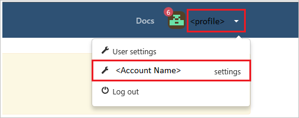
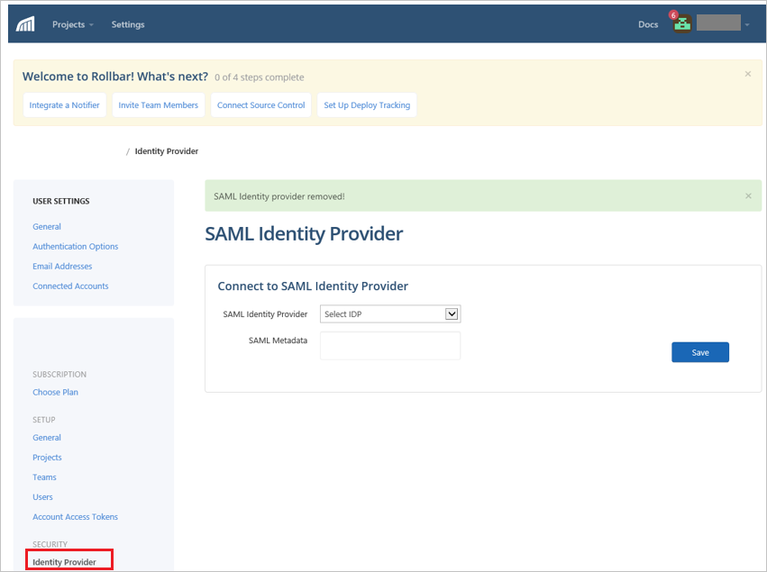
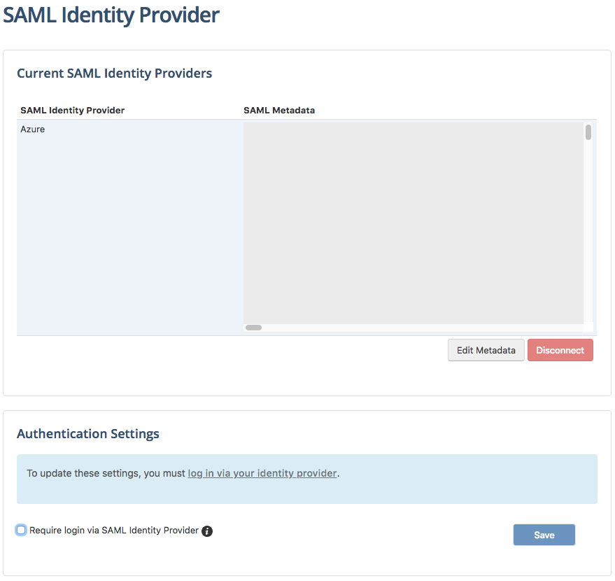
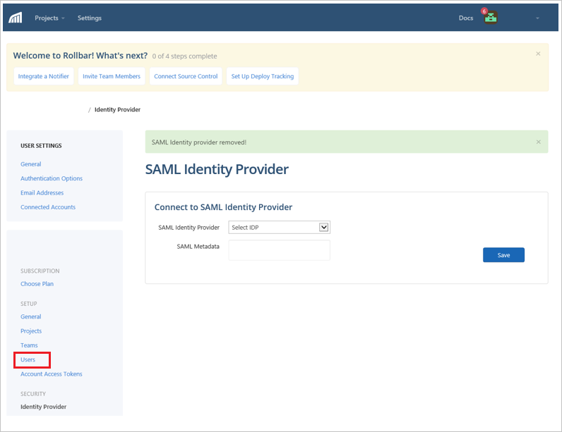

# Tutorial: Microsoft Entra integration with Rollbar

In this tutorial, you'll learn how to integrate Rollbar with Microsoft Entra ID. When you integrate Rollbar with Microsoft Entra ID, you can:

* Control in Microsoft Entra ID who has access to Rollbar.
* Enable your users to be automatically signed-in to Rollbar with their Microsoft Entra accounts.
* Manage your accounts in one central location.

## Prerequisites

To configure Microsoft Entra integration with Rollbar, you need the following items:

* A Microsoft Entra subscription. If you don't have a Microsoft Entra environment, you can get a [free account](https://azure.microsoft.com/free/).
* Rollbar single sign-on enabled subscription.

## Scenario description

In this tutorial, you configure and test Microsoft Entra single sign-on in a test environment.

* Rollbar supports **SP and IDP** initiated SSO.
* Rollbar supports [Automated user provisioning](rollbar-provisioning-tutorial.md).

> [!NOTE]
> Identifier of this application is a fixed string value so only one instance can be configured in one tenant.

## Add Rollbar from the gallery

To configure the integration of Rollbar into Microsoft Entra ID, you need to add Rollbar from the gallery to your list of managed SaaS apps.

1. Sign in to the [Microsoft Entra admin center](https://entra.microsoft.com) as at least a [Cloud Application Administrator](../roles/permissions-reference.md#cloud-application-administrator).
1. Browse to **Identity** > **Applications** > **Enterprise applications** > **New application**.
1. In the **Add from the gallery** section, type **Rollbar** in the search box.
1. Select **Rollbar** from results panel and then add the app. Wait a few seconds while the app is added to your tenant.

 Alternatively, you can also use the [Enterprise App Configuration Wizard](https://portal.office.com/AdminPortal/home?Q=Docs#/azureadappintegration). In this wizard, you can add an application to your tenant, add users/groups to the app, assign roles, as well as walk through the SSO configuration as well. [Learn more about Microsoft 365 wizards.](/microsoft-365/admin/misc/azure-ad-setup-guides)

## Configure and test Microsoft Entra SSO for Rollbar

Configure and test Microsoft Entra SSO with Rollbar using a test user called **B.Simon**. For SSO to work, you need to establish a link relationship between a Microsoft Entra user and the related user in Rollbar.

To configure and test Microsoft Entra SSO with Rollbar, perform the following steps:

1. **[Configure Microsoft Entra SSO](#configure-azure-ad-sso)** - to enable your users to use this feature.
    1. **[Create a Microsoft Entra test user](#create-an-azure-ad-test-user)** - to test Microsoft Entra single sign-on with B.Simon.
    1. **[Assign the Microsoft Entra test user](#assign-the-azure-ad-test-user)** - to enable B.Simon to use Microsoft Entra single sign-on.
1. **[Configure Rollbar SSO](#configure-rollbar-sso)** - to configure the single sign-on settings on application side.
    1. **[Create Rollbar test user](#create-rollbar-test-user)** - to have a counterpart of B.Simon in Rollbar that is linked to the Microsoft Entra representation of user.
1. **[Test SSO](#test-sso)** - to verify whether the configuration works.

## Configure Microsoft Entra SSO

Follow these steps to enable Microsoft Entra SSO.

1. Sign in to the [Microsoft Entra admin center](https://entra.microsoft.com) as at least a [Cloud Application Administrator](../roles/permissions-reference.md#cloud-application-administrator).
1. Browse to **Identity** > **Applications** > **Enterprise applications** > **Rollbar** > **Single sign-on**.
1. On the **Select a single sign-on method** page, select **SAML**.
1. On the **Set up single sign-on with SAML** page, click the pencil icon for **Basic SAML Configuration** to edit the settings.

   

1. On the **Basic SAML Configuration** section, if you wish to configure the application in **IDP** initiated mode, perform the following steps:

    a. In the **Identifier** text box, type the URL: `https://saml.rollbar.com`

    b. In the **Reply URL** text box, type a URL using the following pattern:
    `https://rollbar.com/<ACCOUNT_NAME>/saml/sso/azure/`

5. Click **Set additional URLs** and perform the following step if you wish to configure the application in **SP** initiated mode:

    In the **Sign-on URL** text box, type a URL using the following pattern:
    `https://rollbar.com/<ACCOUNT_NAME>/saml/login/azure/`

	> [!NOTE]
	> These values are not real. Update these values with the actual Reply URL and Sign-On URL. Contact [Rollbar Client support team](mailto:support@rollbar.com) to get these values. You can also refer to the patterns shown in the **Basic SAML Configuration** section.

6. On the **Set up Single Sign-On with SAML** page, in the **SAML Signing Certificate** section, click **Download** to download the **Federation Metadata XML** from the given options as per your requirement and save it on your computer.

	

7. On the **Set up Rollbar** section, copy the appropriate URL(s) as per your requirement.

	

### Create a Microsoft Entra test user

In this section, you'll create a test user called B.Simon.

1. Sign in to the [Microsoft Entra admin center](https://entra.microsoft.com) as at least a [User Administrator](../roles/permissions-reference.md#user-administrator).
1. Browse to **Identity** > **Users** > **All users**.
1. Select **New user** > **Create new user**, at the top of the screen.
1. In the **User** properties, follow these steps:
   1. In the **Display name** field, enter `B.Simon`.  
   1. In the **User principal name** field, enter the username@companydomain.extension. For example, `B.Simon@contoso.com`.
   1. Select the **Show password** check box, and then write down the value that's displayed in the **Password** box.
   1. Select **Review + create**.
1. Select **Create**.

### Assign the Microsoft Entra test user

In this section, you'll enable B.Simon to use single sign-on by granting access to Rollbar.

1. Sign in to the [Microsoft Entra admin center](https://entra.microsoft.com) as at least a [Cloud Application Administrator](../roles/permissions-reference.md#cloud-application-administrator).
1. Browse to **Identity** > **Applications** > **Enterprise applications** > **Rollbar**.
1. In the app's overview page, select **Users and groups**.
1. Select **Add user/group**, then select **Users and groups** in the **Add Assignment** dialog.
   1. In the **Users and groups** dialog, select **B.Simon** from the Users list, then click the **Select** button at the bottom of the screen.
   1. If you are expecting a role to be assigned to the users, you can select it from the **Select a role** dropdown. If no role has been set up for this app, you see "Default Access" role selected.
   1. In the **Add Assignment** dialog, click the **Assign** button.

## Configure Rollbar SSO

1. In a different web browser window, sign in to your Rollbar company site as an administrator.

1. Click on the **Profile Settings** on the right top corner and then click **Account Name settings**.

	

1. Click **Identity Provider** under SECURITY.

	

1. In the **SAML Identity Provider** section, perform the following steps:

	

	a. Select **AZURE** from the **SAML Identity Provider** dropdown.

	b. Open your metadata file in notepad, copy the content of it into your clipboard, and then paste it to the **SAML Metadata** textbox.

	c. Click **Save**.

1. After clicking the save button, the screen will be like this:

	

	> [!NOTE]
	> In order to complete the following step, you must first add yourself as a user to the Rollbar app in Azure.
	
    a. If you want to require all users to authenticate via Azure, then click **log in via your identity provider** to re-authenticate via Azure.  

	b.  Once you're returned to the screen, select the **Require login via SAML Identity Provider** checkbox.

	b. Click **Save**.

### Create Rollbar test user

To enable Microsoft Entra users to sign in to Rollbar, they must be provisioned into Rollbar. In the case of Rollbar, provisioning is a manual task.

**To provision a user account, perform the following steps:**

1. Sign in to your Rollbar company site as an administrator.

1. Click on the **Profile Settings** on the right top corner and then click **Account Name settings**.

	

1. Click **Users**.

	

1. Click **Invite Team Members**.

	

1. In the textbox, enter the name of user like **brittasimon\@contoso.com** and the click **Add/Invite**.

	

1. User receives an invitation and after accepting it they are created in the system.

> [!NOTE]
> Rollbar also supports automatic user provisioning, you can find more details [here](./rollbar-provisioning-tutorial.md) on how to configure automatic user provisioning.

## Test SSO

In this section, you test your Microsoft Entra single sign-on configuration with following options. 

#### SP initiated:

* Click on **Test this application**, this will redirect to Rollbar Sign on URL where you can initiate the login flow.  

* Go to Rollbar Sign-on URL directly and initiate the login flow from there.

#### IDP initiated:

* Click on **Test this application**, and you should be automatically signed in to the Rollbar for which you set up the SSO. 

You can also use Microsoft My Apps to test the application in any mode. When you click the Rollbar tile in the My Apps, if configured in SP mode you would be redirected to the application sign on page for initiating the login flow and if configured in IDP mode, you should be automatically signed in to the Rollbar for which you set up the SSO. For more information about the My Apps, see [Introduction to the My Apps](https://support.microsoft.com/account-billing/sign-in-and-start-apps-from-the-my-apps-portal-2f3b1bae-0e5a-4a86-a33e-876fbd2a4510).

## Next steps

Once you configure Rollbar you can enforce session control, which protects exfiltration and infiltration of your organization’s sensitive data in real time. Session control extends from Conditional Access. [Learn how to enforce session control with Microsoft Defender for Cloud Apps](/cloud-app-security/proxy-deployment-aad).
