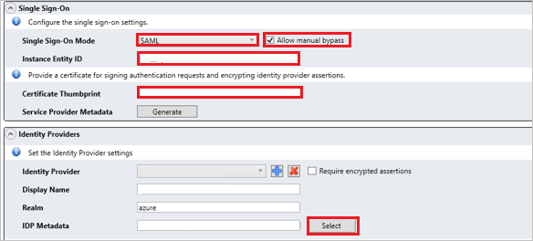

# Tutorial: Microsoft Entra SSO integration with RSA Archer Suite

In this tutorial, you'll learn how to integrate RSA Archer Suite with Microsoft Entra ID. When you integrate RSA Archer Suite with Microsoft Entra ID, you can:

* Control in Microsoft Entra ID who has access to RSA Archer Suite.
* Enable your users to be automatically signed-in to RSA Archer Suite with their Microsoft Entra accounts.
* Manage your accounts in one central location.

## Prerequisites

To get started, you need the following items:

* A Microsoft Entra subscription. If you don't have a subscription, you can get a [free account](https://azure.microsoft.com/free/).
* RSA Archer Suite single sign-on (SSO) enabled subscription.

## Scenario description

In this tutorial, you configure and test Microsoft Entra SSO in a test environment.

* RSA Archer Suite supports **SP** initiated SSO.
* RSA Archer Suite supports **Just In Time** user provisioning.

> [!NOTE]
> Identifier of this application is a fixed string value so only one instance can be configured in one tenant.

## Add RSA Archer Suite from the gallery

To configure the integration of RSA Archer Suite into Microsoft Entra ID, you need to add RSA Archer Suite from the gallery to your list of managed SaaS apps.

1. Sign in to the [Microsoft Entra admin center](https://entra.microsoft.com) as at least a [Cloud Application Administrator](../roles/permissions-reference.md#cloud-application-administrator).
1. Browse to **Identity** > **Applications** > **Enterprise applications** > **New application**.
1. In the **Add from the gallery** section, type **RSA Archer Suite** in the search box.
1. Select **RSA Archer Suite** from results panel and then add the app. Wait a few seconds while the app is added to your tenant.

 Alternatively, you can also use the [Enterprise App Configuration Wizard](https://portal.office.com/AdminPortal/home?Q=Docs#/azureadappintegration). In this wizard, you can add an application to your tenant, add users/groups to the app, assign roles, as well as walk through the SSO configuration as well. [Learn more about Microsoft 365 wizards.](/microsoft-365/admin/misc/azure-ad-setup-guides)

## Configure and test Microsoft Entra SSO for RSA Archer Suite

Configure and test Microsoft Entra SSO with RSA Archer Suite using a test user called **B.Simon**. For SSO to work, you need to establish a link relationship between a Microsoft Entra user and the related user in RSA Archer Suite.

To configure and test Microsoft Entra SSO with RSA Archer Suite, perform following steps:

1. **[Configure Microsoft Entra SSO](#configure-azure-ad-sso)** - to enable your users to use this feature.
    1. **[Create a Microsoft Entra test user](#create-an-azure-ad-test-user)** - to test Microsoft Entra single sign-on with B.Simon.
    1. **[Assign the Microsoft Entra test user](#assign-the-azure-ad-test-user)** - to enable B.Simon to use Microsoft Entra single sign-on.
1. **[Configure RSA Archer Suite SSO](#configure-rsa-archer-suite-sso)** - to configure the single sign-on settings on application side.
    1. **[Create RSA Archer Suite test user](#create-rsa-archer-suite-test-user)** - to have a counterpart of B.Simon in RSA Archer Suite that is linked to the Microsoft Entra representation of user.
1. **[Test SSO](#test-sso)** - to verify whether the configuration works.

## Configure Microsoft Entra SSO

Follow these steps to enable Microsoft Entra SSO.

1. Sign in to the [Microsoft Entra admin center](https://entra.microsoft.com) as at least a [Cloud Application Administrator](../roles/permissions-reference.md#cloud-application-administrator).
1. Browse to **Identity** > **Applications** > **Enterprise applications** > **RSA Archer Suite** > **Single sign-on**.
1. On the **Select a single sign-on method** page, select **SAML**.
1. On the **Set up single sign-on with SAML** page, click the pencil icon for **Basic SAML Configuration** to edit the settings.

   

1. On the **Basic SAML Configuration** section, perform the following steps:

	a. In the **Identifier (Entity ID)** text box, type the value:
    `RSAArcherSuite_TENANT_STRING`

	b. In the **Sign on URL** text box, type a URL using the following pattern:
    `https://<BASE_URL>/default.aspx?IDP=<REALM_NAME>`

	> [!NOTE]
	> The Sign on URL value is not real. Update the value with the actual Sign on URL. Contact [RSA Archer Suite Client support team](mailto:archersupport@rsa.com) to get the value. You can also refer to the patterns shown in the **Basic SAML Configuration** section.

1. RSA Archer Suite application expects the SAML assertions in a specific format, which requires you to add custom attribute mappings to your SAML token attributes configuration. The following screenshot shows the list of default attributes.

	

1. In addition to above, RSA Archer Suite application expects few more attributes to be passed back in SAML response which are shown below. These attributes are also pre populated but you can review them as per your requirements.
	
	| Name |  Source Attribute|
	| -------------- | --------- |
	| FirstName | user.givenname |
	| LastName | user.surname |
	| PhoneNumber | user.telephonenumber |
	| City | user.city |
	| Zipcode | user.postalcode |
	| State | user.state |
	| Street | user.streetaddress |

1. On the **Set up single sign-on with SAML** page, in the **SAML Signing Certificate** section,  find **Federation Metadata XML** and select **Download** to download the certificate and save it on your computer.

	

1. On the **Set up RSA Archer Suite** section, copy the appropriate URL(s) based on your requirement.

	

### Create a Microsoft Entra test user

In this section, you'll create a test user called B.Simon.

1. Sign in to the [Microsoft Entra admin center](https://entra.microsoft.com) as at least a [User Administrator](../roles/permissions-reference.md#user-administrator).
1. Browse to **Identity** > **Users** > **All users**.
1. Select **New user** > **Create new user**, at the top of the screen.
1. In the **User** properties, follow these steps:
   1. In the **Display name** field, enter `B.Simon`.  
   1. In the **User principal name** field, enter the username@companydomain.extension. For example, `B.Simon@contoso.com`.
   1. Select the **Show password** check box, and then write down the value that's displayed in the **Password** box.
   1. Select **Review + create**.
1. Select **Create**.

### Assign the Microsoft Entra test user

In this section, you'll enable B.Simon to use single sign-on by granting access to RSA Archer Suite.

1. Sign in to the [Microsoft Entra admin center](https://entra.microsoft.com) as at least a [Cloud Application Administrator](../roles/permissions-reference.md#cloud-application-administrator).
1. Browse to **Identity** > **Applications** > **Enterprise applications** > **RSA Archer Suite**.
1. In the app's overview page, find the **Manage** section and select **Users and groups**.
1. Select **Add user**, then select **Users and groups** in the **Add Assignment** dialog.
1. In the **Users and groups** dialog, select **B.Simon** from the Users list, then click the **Select** button at the bottom of the screen.
1. If you are expecting a role to be assigned to the users, you can select it from the **Select a role** dropdown. If no role has been setup for this app, you see "Default Access" role selected.
1. In the **Add Assignment** dialog, click the **Assign** button.

## Configure RSA Archer Suite SSO

1. Sign into the RSA Archer Suite website in a different browser as an administrator.

1. Perform the following steps in the following page.

	

	a. Go to the **Single Sign-On** tab and select **SAML** as a **Single Sign-On Mode** from the dropdown.

	b. Select **Allow manual bypass** checkbox.

	c. Give a valid name in the **Instance Entity ID** textbox.

	d. Paste the **Thumbprint Value** into the **Certificate Thumbprint** textbox.

	e. Click on **Select** button and upload the downloaded **Federation Metadata XML** file from Azure portal.

	f. **Save** the Single Sign-On Settings. 

### Create RSA Archer Suite test user

In this section, a user called B.Simon is created in RSA Archer Suite. RSA Archer Suite supports just-in-time user provisioning, which is enabled by default. There is no action item for you in this section. If a user doesn't already exist in RSA Archer Suite, a new one is created after authentication.

## Test SSO 

In this section, you test your Microsoft Entra single sign-on configuration with following options. 

* Click on **Test this application**, this will redirect to RSA Archer Suite Sign-on URL where you can initiate the login flow. 

* Go to RSA Archer Suite Sign-on URL directly and initiate the login flow from there.

* You can use Microsoft My Apps. When you click the RSA Archer Suite tile in the My Apps, this will redirect to RSA Archer Suite Sign-on URL. For more information, see [Microsoft Entra My Apps](/azure/active-directory/manage-apps/end-user-experiences#azure-ad-my-apps).

## Next steps

Once you configure RSA Archer Suite you can enforce session control, which protects exfiltration and infiltration of your organization’s sensitive data in real time. Session control extends from Conditional Access. [Learn how to enforce session control with Microsoft Defender for Cloud Apps](/cloud-app-security/proxy-deployment-aad).
