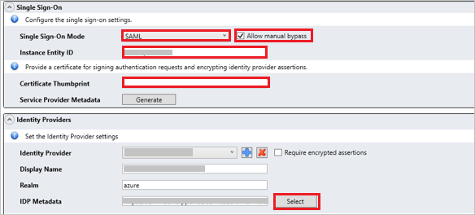

# Tutorial: Azure Active Directory single sign-on (SSO) integration with RSA Archer Suite

In this tutorial, you'll learn how to integrate RSA Archer Suite with Azure Active Directory (Azure AD). When you integrate RSA Archer Suite with Azure AD, you can:

* Control in Azure AD who has access to RSA Archer Suite.
* Enable your users to be automatically signed-in to RSA Archer Suite with their Azure AD accounts.
* Manage your accounts in one central location - the Azure portal.

## Prerequisites

To get started, you need the following items:

* An Azure AD subscription. If you don't have a subscription, you can get a [free account](https://azure.microsoft.com/free/).
* RSA Archer Suite single sign-on (SSO) enabled subscription.

## Scenario description

In this tutorial, you configure and test Azure AD SSO in a test environment.

* RSA Archer Suite supports **SP** initiated SSO
* RSA Archer Suite supports **Just In Time** user provisioning

> [!NOTE]
> Identifier of this application is a fixed string value so only one instance can be configured in one tenant.

## Adding RSA Archer Suite from the gallery

To configure the integration of RSA Archer Suite into Azure AD, you need to add RSA Archer Suite from the gallery to your list of managed SaaS apps.

1. Sign in to the Azure portal using either a work or school account, or a personal Microsoft account.
1. On the left navigation pane, select the **Azure Active Directory** service.
1. Navigate to **Enterprise Applications** and then select **All Applications**.
1. To add new application, select **New application**.
1. In the **Add from the gallery** section, type **RSA Archer Suite** in the search box.
1. Select **RSA Archer Suite** from results panel and then add the app. Wait a few seconds while the app is added to your tenant.

## Configure and test Azure AD SSO for RSA Archer Suite

Configure and test Azure AD SSO with RSA Archer Suite using a test user called **B.Simon**. For SSO to work, you need to establish a link relationship between an Azure AD user and the related user in RSA Archer Suite.

To configure and test Azure AD SSO with RSA Archer Suite, perform following steps:

1. **[Configure Azure AD SSO](#configure-azure-ad-sso)** - to enable your users to use this feature.
    1. **[Create an Azure AD test user](#create-an-azure-ad-test-user)** - to test Azure AD single sign-on with B.Simon.
    1. **[Assign the Azure AD test user](#assign-the-azure-ad-test-user)** - to enable B.Simon to use Azure AD single sign-on.
1. **[Configure RSA Archer Suite SSO](#configure-rsa-archer-suite-sso)** - to configure the single sign-on settings on application side.
    1. **[Create RSA Archer Suite test user](#create-rsa-archer-suite-test-user)** - to have a counterpart of B.Simon in RSA Archer Suite that is linked to the Azure AD representation of user.
1. **[Test SSO](#test-sso)** - to verify whether the configuration works.

## Configure Azure AD SSO

Follow these steps to enable Azure AD SSO in the Azure portal.

1. In the Azure portal, on the **RSA Archer Suite** application integration page, find the **Manage** section and select **single sign-on**.
1. On the **Select a single sign-on method** page, select **SAML**.
1. On the **Set up single sign-on with SAML** page, click the edit/pen icon for **Basic SAML Configuration** to edit the settings.

   

1. On the **Basic SAML Configuration** section, enter the values for the following fields:

	a. In the **Sign on URL** text box, type a URL using the following pattern:
    `https://<BASE_URL>/default.aspx?IDP=<REALM_NAME>`

    b. In the **Identifier (Entity ID)** text box, type the value:
    `RSAArcherSuite_TENANT_STRING`

	> [!NOTE]
	> The Sign on URL value is not real. Update the value with the actual Sign on URL. Contact [RSA Archer Suite Client support team](mailto:archersupport@rsa.com) to get the value. You can also refer to the patterns shown in the **Basic SAML Configuration** section in the Azure portal.

1. RSA Archer Suite application expects the SAML assertions in a specific format, which requires you to add custom attribute mappings to your SAML token attributes configuration. The following screenshot shows the list of default attributes.

	

1. In addition to above, RSA Archer Suite application expects few more attributes to be passed back in SAML response which are shown below. These attributes are also pre populated but you can review them as per your requirements.
	
	| Name |  Source Attribute|
	| -------------- | --------- |
	| FirstName | user.givenname |
	| LastName | user.surname |
	| PhoneNumber | user.telephonenumber |
	| City | user.city |
	| Zipcode | user.postalcode |
	| State | user.state |
	| Street | user.streetaddress |

1. On the **Set up single sign-on with SAML** page, in the **SAML Signing Certificate** section,  find **Federation Metadata XML** and select **Download** to download the certificate and save it on your computer.

	

1. On the **Set up RSA Archer Suite** section, copy the appropriate URL(s) based on your requirement.

	

### Create an Azure AD test user

In this section, you'll create a test user in the Azure portal called B.Simon.

1. From the left pane in the Azure portal, select **Azure Active Directory**, select **Users**, and then select **All users**.
1. Select **New user** at the top of the screen.
1. In the **User** properties, follow these steps:
   1. In the **Name** field, enter `B.Simon`.  
   1. In the **User name** field, enter the username@companydomain.extension. For example, `B.Simon@contoso.com`.
   1. Select the **Show password** check box, and then write down the value that's displayed in the **Password** box.
   1. Click **Create**.

### Assign the Azure AD test user

In this section, you'll enable B.Simon to use Azure single sign-on by granting access to RSA Archer Suite.

1. In the Azure portal, select **Enterprise Applications**, and then select **All applications**.
1. In the applications list, select **RSA Archer Suite**.
1. In the app's overview page, find the **Manage** section and select **Users and groups**.
1. Select **Add user**, then select **Users and groups** in the **Add Assignment** dialog.
1. In the **Users and groups** dialog, select **B.Simon** from the Users list, then click the **Select** button at the bottom of the screen.
1. If you are expecting a role to be assigned to the users, you can select it from the **Select a role** dropdown. If no role has been setup for this app, you see "Default Access" role selected.
1. In the **Add Assignment** dialog, click the **Assign** button.

## Configure RSA Archer Suite SSO

1. Sign into the RSA Archer Suite website in a different browser as an administrator.

1. Perform the following steps in the following page.

	

	a. Go to the **Single Sign-On** tab and select **SAML** as a **Single Sign-On Mode** from the dropdown.

	b. Select **Allow manual bypass** checkbox.

	c. Give a valid name in the **Instance Entity ID** textbox.

	d. Paste the **Thumbprint Value** into the **Certificate Thumbprint** textbox.

	e. Click on **Select** button and upload the downloaded **Federation Metadata XML** file from Azure portal.

	f. **Save** the Single Sign-On Settings. 

### Create RSA Archer Suite test user

In this section, a user called B.Simon is created in RSA Archer Suite. RSA Archer Suite supports just-in-time user provisioning, which is enabled by default. There is no action item for you in this section. If a user doesn't already exist in RSA Archer Suite, a new one is created after authentication.

## Test SSO 

In this section, you test your Azure AD single sign-on configuration with following options. 

1. Click on **Test this application** in Azure portal. This will redirect to RSA Archer Suite Sign-on URL where you can initiate the login flow. 

2. Go to RSA Archer Suite Sign-on URL directly and initiate the login flow from there.

3. You can use Microsoft Access Panel. When you click the RSA Archer Suite tile in the Access Panel, you should be automatically signed in to the RSA Archer Suite for which you set up the SSO. For more information about the Access Panel, see [Introduction to the Access Panel](../user-help/my-apps-portal-end-user-access.md).

## Next Steps

 Once you configure RSA Archer Suite you can enforce session control, which protects exfiltration and infiltration of your organization’s sensitive data in real time. Session control extends from Conditional Access. [Learn how to enforce session control with Microsoft Cloud App Security](/cloud-app-security/proxy-deployment-any-app).