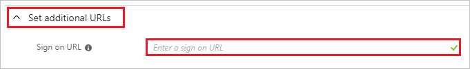

# Tutorial: Azure Active Directory integration with RStudio Connect

In this tutorial, you learn how to integrate RStudio Connect with Azure Active Directory (Azure AD).
Integrating RStudio Connect with Azure AD provides you with the following benefits:

* You can control in Azure AD who has access to RStudio Connect.
* You can enable your users to be automatically signed-in to RStudio Connect (Single Sign-On) with their Azure AD accounts.
* You can manage your accounts in one central location - the Azure portal.

If you want to know more details about SaaS app integration with Azure AD, see [What is application access and single sign-on with Azure Active Directory](https://docs.microsoft.com/azure/active-directory/active-directory-appssoaccess-whatis).
If you don't have an Azure subscription, [create a free account](https://azure.microsoft.com/free/) before you begin.

## Prerequisites

To configure Azure AD integration with RStudio Connect, you need the following items:

* An Azure AD subscription. If you don't have an Azure AD environment, you can get a [free account](https://azure.microsoft.com/free/)
* RStudio Connect. There is a [45 day free evaluation.](https://www.rstudio.com/products/connect/)

## Scenario description

In this tutorial, you configure and test Azure AD single sign-on in a test environment.

* RStudio Connect supports **SP and IDP** initiated SSO

* RStudio Connect supports **Just In Time** user provisioning

## Adding RStudio Connect from the gallery

To configure the integration of RStudio Connect into Azure AD, you need to add RStudio Connect from the gallery to your list of managed SaaS apps.

**To add RStudio Connect from the gallery, perform the following steps:**

1. In the **[Azure portal](https://portal.azure.com)**, on the left navigation panel, click **Azure Active Directory** icon.

	

2. Navigate to **Enterprise Applications** and then select the **All Applications** option.

	

3. To add new application, click **New application** button on the top of dialog.

	

4. In the search box, type **RStudio Connect**, select **RStudio Connect** from result panel then click **Add** button to add the application.

	

## Configure and test Azure AD single sign-on

In this section, you configure and test Azure AD single sign-on with RStudio Connect based on a test user called **Britta Simon**.
For single sign-on to work, a link relationship between an Azure AD user and the related user in RStudio Connect needs to be established.

To configure and test Azure AD single sign-on with RStudio Connect, you need to complete the following building blocks:

1. **[Configure Azure AD Single Sign-On](#configure-azure-ad-single-sign-on)** - to enable your users to use this feature.
2. **[Configure RStudio Connect Single Sign-On](#configure-rstudio-connect-single-sign-on)** - to configure the Single Sign-On settings on application side.
3. **[Create an Azure AD test user](#create-an-azure-ad-test-user)** - to test Azure AD single sign-on with Britta Simon.
4. **[Assign the Azure AD test user](#assign-the-azure-ad-test-user)** - to enable Britta Simon to use Azure AD single sign-on.
5. **[Create RStudio Connect test user](#create-rstudio-connect-test-user)** - to have a counterpart of Britta Simon in RStudio Connect that is linked to the Azure AD representation of user.
6. **[Test single sign-on](#test-single-sign-on)** - to verify whether the configuration works.

### Configure Azure AD single sign-on

In this section, you enable Azure AD single sign-on in the Azure portal.

To configure Azure AD single sign-on with RStudio Connect, perform the following steps:

1. In the [Azure portal](https://portal.azure.com/), on the **RStudio Connect** application integration page, select **Single sign-on**.

    

2. On the **Select a Single sign-on method** dialog, select **SAML/WS-Fed** mode to enable single sign-on.

    

3. On the **Set up Single Sign-On with SAML** page, click **Edit** icon to open **Basic SAML Configuration** dialog.

	

4. On the **Basic SAML Configuration** section, if you wish to configure the application in **IDP** initiated mode, perform the following steps, replacing `<example.com>` with your RStudio Connect Server Address and port:

    

    a. In the **Identifier** text box, type a URL using the following pattern:
    `https://<example.com>/__login__/saml`

    b. In the **Reply URL** text box, type a URL using the following pattern:
    `https://<example.com>/__login__/saml/acs`

5. Click **Set additional URLs** and perform the following step if you wish to configure the application in **SP** initiated mode:

    

    In the **Sign-on URL** text box, type a URL using the following pattern:
    `https://<example.com>/`

	> [!NOTE]
	> These values are not real. Update these values with the actual Identifier, Reply URL and Sign-on URL. They are determined from the RStudio Connect Server Address (`https://example.com` in the examples above). Contact the [RStudio Connect support team](mailto:support@rstudio.com) if you have trouble. You can also refer to the patterns shown in the **Basic SAML Configuration** section in the Azure portal.

6. Your RStudio Connect application expects the SAML assertions in a specific format, which requires you to add custom attribute mappings to your SAML token attributes configuration. The following screenshot shows the list of default attributes, where as **nameidentifier** is mapped with **user.userprincipalname**. RStudio Connect application expects **nameidentifier** to be mapped with **user.mail**, so you need to edit the attribute mapping by clicking on **Edit** icon and change the attribute mapping.

	

7. On the **Set up Single Sign-On with SAML** page, In the **SAML Signing Certificate** section, click copy button to copy **App Federation Metadata Url** and save it on your computer.

	

### Configure RStudio Connect Single Sign-On

To configure single sign-on on for **RStudio Connect**, you need to use the **App Federation Metadata Url** and **Server Address** used above. This is done in the RStudio Connect configuration file at `/etc/rstudio-connect.rstudio-connect.gcfg`.

This is an example configuration file:

```
[Server]
SenderEmail =

; Important! The user-facing URL of your RStudio Connect server.
Address = 

[Http]
Listen = :3939

[Authentication]
Provider = saml

[SAML]
Logging = true

; Important! The URL where your IdP hosts the SAML metadata or the path to a local copy of it placed in the RStudio Connect server.
IdPMetaData = 

IdPAttributeProfile = azure
SSOInitiated = IdPAndSP
```

Store your **Server Address** in the `Server.Address` value, and the **App Federation Metadata Url** in the `SAML.IdPMetaData` value.

If you have trouble with configuration, you can read the [RStudio Connect Admin Guide](https://docs.rstudio.com/connect/admin/authentication.html#authentication-saml) or email the [RStudio support team](mailto:support@rstudio.com) for help.

### Create an Azure AD test user 

The objective of this section is to create a test user in the Azure portal called Britta Simon.

1. In the Azure portal, in the left pane, select **Azure Active Directory**, select **Users**, and then select **All users**.

    

2. Select **New user** at the top of the screen.

    

3. In the User properties, perform the following steps.

    

    a. In the **Name** field enter **BrittaSimon**.
  
    b. In the **User name** field type `brittasimon@yourcompanydomain.extension`. For example, BrittaSimon@contoso.com

    c. Select **Show password** check box, and then write down the value that's displayed in the Password box.

    d. Click **Create**.

### Assign the Azure AD test user

In this section, you enable Britta Simon to use Azure single sign-on by granting access to RStudio Connect.

1. In the Azure portal, select **Enterprise Applications**, select **All applications**, then select **RStudio Connect**.

	

2. In the applications list, select **RStudio Connect**.

	

3. In the menu on the left, select **Users and groups**.

    

4. Click the **Add user** button, then select **Users and groups** in the **Add Assignment** dialog.

    

5. In the **Users and groups** dialog select **Britta Simon** in the Users list, then click the **Select** button at the bottom of the screen.

6. If you are expecting any role value in the SAML assertion then in the **Select Role** dialog select the appropriate role for the user from the list, then click the **Select** button at the bottom of the screen.

7. In the **Add Assignment** dialog click the **Assign** button.

### Create RStudio Connect test user

In this section, a user called Britta Simon is created in RStudio Connect. RStudio Connect supports just-in-time provisioning, which is enabled by default. There is no action item for you in this section. If a user doesn't already exist in RStudio Connect, a new one is created when you attempt to access RStudio Connect.

### Test single sign-on 

In this section, you test your Azure AD single sign-on configuration using the Access Panel.

When you click the RStudio Connect tile in the Access Panel, you should be automatically signed in to the RStudio Connect for which you set up SSO. For more information about the Access Panel, see [Introduction to the Access Panel](https://docs.microsoft.com/azure/active-directory/active-directory-saas-access-panel-introduction).

## Additional Resources

- [List of Tutorials on How to Integrate SaaS Apps with Azure Active Directory](https://docs.microsoft.com/azure/active-directory/active-directory-saas-tutorial-list)

- [What is application access and single sign-on with Azure Active Directory?](https://docs.microsoft.com/azure/active-directory/active-directory-appssoaccess-whatis)

- [What is Conditional Access in Azure Active Directory?](https://docs.microsoft.com/azure/active-directory/conditional-access/overview)

