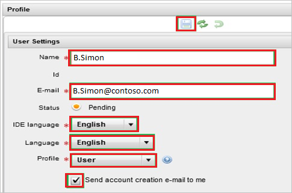

# Tutorial: Azure AD SSO integration with RunMyProcess

In this tutorial, you'll learn how to integrate RunMyProcess with Azure Active Directory (Azure AD). When you integrate RunMyProcess with Azure AD, you can:

* Control in Azure AD who has access to RunMyProcess.
* Enable your users to be automatically signed-in to RunMyProcess with their Azure AD accounts.
* Manage your accounts in one central location - the Azure portal.

## Prerequisites

To get started, you need the following items:

* An Azure AD subscription. If you don't have a subscription, you can get a [free account](https://azure.microsoft.com/free/).
* RunMyProcess single sign-on (SSO) enabled subscription.

## Scenario description

In this tutorial, you configure and test Azure AD SSO in a test environment.

* RunMyProcess supports **SP** initiated SSO.

> [!NOTE]
> Identifier of this application is a fixed string value so only one instance can be configured in one tenant.

## Add RunMyProcess from the gallery

To configure the integration of RunMyProcess into Azure AD, you need to add RunMyProcess from the gallery to your list of managed SaaS apps.

1. Sign in to the Azure portal using either a work or school account, or a personal Microsoft account.
1. On the left navigation pane, select the **Azure Active Directory** service.
1. Navigate to **Enterprise Applications** and then select **All Applications**.
1. To add new application, select **New application**.
1. In the **Add from the gallery** section, type **RunMyProcess** in the search box.
1. Select **RunMyProcess** from results panel and then add the app. Wait a few seconds while the app is added to your tenant.

 Alternatively, you can also use the [Enterprise App Configuration Wizard](https://portal.office.com/AdminPortal/home?Q=Docs#/azureadappintegration). In this wizard, you can add an application to your tenant, add users/groups to the app, assign roles, as well as walk through the SSO configuration as well. [Learn more about Microsoft 365 wizards.](/microsoft-365/admin/misc/azure-ad-setup-guides)

## Configure and test Azure AD SSO for RunMyProcess

Configure and test Azure AD SSO with RunMyProcess using a test user called **B.Simon**. For SSO to work, you need to establish a link relationship between an Azure AD user and the related user in RunMyProcess.

To configure and test Azure AD SSO with RunMyProcess, perform the following steps:

1. **[Configure Azure AD SSO](#configure-azure-ad-sso)** - to enable your users to use this feature.
    1. **[Create an Azure AD test user](#create-an-azure-ad-test-user)** - to test Azure AD single sign-on with B.Simon.
    1. **[Assign the Azure AD test user](#assign-the-azure-ad-test-user)** - to enable B.Simon to use Azure AD single sign-on.
1. **[Configure RunMyProcess SSO](#configure-runmyprocess-sso)** - to configure the single sign-on settings on application side.
    1. **[Create RunMyProcess test user](#create-runmyprocess-test-user)** - to have a counterpart of B.Simon in RunMyProcess that is linked to the Azure AD representation of user.
1. **[Test SSO](#test-sso)** - to verify whether the configuration works.

## Configure Azure AD SSO

Follow these steps to enable Azure AD SSO in the Azure portal.

1. In the Azure portal, on the **RunMyProcess** application integration page, find the **Manage** section and select **Single sign-on**.
1. On the **Select a Single sign-on method** page, select **SAML**.
1. On the **Set up Single Sign-On with SAML** page, click the pencil icon for **Basic SAML Configuration** to edit the settings.

   

1. On the **Basic SAML Configuration** section, perform the following step:

    In the **Sign-on URL** text box, type a URL using the following pattern:
    `https://live.runmyprocess.com/live/<tenant id>`

	> [!NOTE]
	> The value is not real. Update the value with the actual Sign-On URL. Contact [RunMyProcess Client support team](mailto:support@runmyprocess.com) to get the value. You can also refer to the patterns shown in the **Basic SAML Configuration** section in the Azure portal.

1. On the **Set up Single Sign-On with SAML** page, in the **SAML Signing Certificate** section,  find **Certificate (Base64)** and select **Download** to download the certificate and save it on your computer.

	

1. On the **Set up RunMyProcess** section, copy the appropriate URL(s) based on your requirement.

	

### Create an Azure AD test user

In this section, you'll create a test user in the Azure portal called B.Simon.

1. From the left pane in the Azure portal, select **Azure Active Directory**, select **Users**, and then select **All users**.
1. Select **New user** at the top of the screen.
1. In the **User** properties, follow these steps:
   1. In the **Name** field, enter `B.Simon`.  
   1. In the **User name** field, enter the username@companydomain.extension. For example, `B.Simon@contoso.com`.
   1. Select the **Show password** check box, and then write down the value that's displayed in the **Password** box.
   1. Click **Create**.

### Assign the Azure AD test user

In this section, you'll enable B.Simon to use Azure single sign-on by granting access to RunMyProcess.

1. In the Azure portal, select **Enterprise Applications**, and then select **All applications**.
1. In the applications list, select **RunMyProcess**.
1. In the app's overview page, find the **Manage** section and select **Users and groups**.
1. Select **Add user**, then select **Users and groups** in the **Add Assignment** dialog.
1. In the **Users and groups** dialog, select **B.Simon** from the Users list, then click the **Select** button at the bottom of the screen.
1. If you're expecting any role value in the SAML assertion, in the **Select Role** dialog, select the appropriate role for the user from the list and then click the **Select** button at the bottom of the screen.
1. In the **Add Assignment** dialog, click the **Assign** button.

## Configure RunMyProcess SSO

1. In a different web browser window, sign-on to your RunMyProcess tenant as an administrator.

1. In left navigation panel, click **Account** and select **Configuration**.

    

1. Go to **Authentication method** section and perform below steps:

    

    a. As **Method**, select **SSO with Samlv2**.

    b. In the **SSO redirect** textbox, paste the value of **Login URL**, which you have copied from Azure portal.

    c. In the **Logout redirect** textbox, paste the value of **Logout URL**, which you have copied from Azure portal.

    d. In the **Name ID Format** textbox, type the value of **Name Identifier Format** as **urn:oasis:names:tc:SAML:1.1:nameid-format:emailAddress**.

    e. Open the downloaded certificate file from Azure portal in notepad, copy the content of certificate file and then paste it into the **Certificate** textbox.

    f. Click **Save** icon.

### Create RunMyProcess test user

In order to enable Azure AD users to sign in to RunMyProcess, they must be provisioned into RunMyProcess. In the case of RunMyProcess, provisioning is a manual task.

**To provision a user account, perform the following steps:**

1. Sign in to your RunMyProcess company site as an administrator.

1. Click **Account** and select **Users** in left navigation panel, then click **New User**.

    

1. In the **User Settings** section, perform the following steps:

    
  
    a. Type the **Name** and **E-mail** of a valid Azure AD account you want to provision into the related textboxes.

    b. Select an **IDE language**, **Language**, and **Profile**.

    c. Select **Send account creation e-mail to me**.

    d. Click **Save**.

    > [!NOTE]
    > You can use any other RunMyProcess user account creation tools or APIs provided by RunMyProcess to provision Azure Active Directory user accounts.

## Test SSO 

In this section, you test your Azure AD single sign-on configuration with following options. 

* Click on **Test this application** in Azure portal. This will redirect to RunMyProcess Sign-on URL where you can initiate the login flow. 

* Go to RunMyProcess Sign-on URL directly and initiate the login flow from there.

* You can use Microsoft My Apps. When you click the RunMyProcess tile in the My Apps, this will redirect to RunMyProcess Sign-on URL. For more information about the My Apps, see [Introduction to the My Apps](../user-help/my-apps-portal-end-user-access.md).

## Next steps

Once you configure RunMyProcess you can enforce session control, which protects exfiltration and infiltration of your organization’s sensitive data in real time. Session control extends from Conditional Access. [Learn how to enforce session control with Microsoft Defender for Cloud Apps](/cloud-app-security/proxy-deployment-aad).
